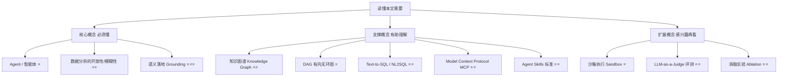
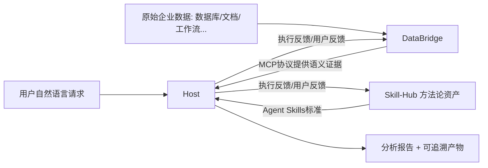

## AI论文解读 | QwenPaw-Data: Bridging Facts, Methodology, and Execution for Autonomous Enterprise Data Analytics

### 作者
digoal

### 日期
2026-07-20

### 标签
AI , Agent , 智能体 , 通用智能体 , 编程智能体 , 数据分析智能体 

----

## 背景
https://arxiv.org/abs/2607.11019  
  
通用智能体和编程智能体的核心边界在哪里？是否真的有必要为数据分析单独造一套系统？如果需要，具体要解决什么难题？  
  
> **原文信息**：Tianjing Zeng, Yuntao Hong 等（阿里巴巴集团）| 2026 | arXiv:2607.11019（Technical Report）
> **解读日期**：2026-07-20

---

## 📍 论文定位

**一句话**：这篇报告提出了 QwenPaw-Data —— 一个专门为"企业数据分析"场景设计的智能体系统，它把"该信任什么事实、该用什么分析方法、该怎么可控地跑完整个分析流程"这三件事拆成三个独立子系统（DataBridge、Skill-Hub、Host），并让它们在使用中不断自我进化。

**🎓 学术价值**：论文系统性地论证了"数据分析智能体"应当独立于通用智能体和编程智能体，单独成为一个技术赛道，并给出了一套可复现的三层解耦架构（语义证据层 / 方法论层 / 执行层），填补了企业级数据智能体在"语义落地 + 方法论沉淀 + 长程可控执行"三者协同设计上的空白。

**🏭 工业价值**：该系统已在阿里内部真实服务 BI（商业智能）分析师，能把自然语言问题自动转成从取数、异常检测、下钻归因到生成报告的完整分析流程，并且在公开数据智能体基准（KramaBench、DAComp）上超过了当前最好方法，说明这套设计具备通用可迁移性，可以作为企业搭建自己数据分析智能体的参考架构。

**💡 直觉类比**：可以把 QwenPaw-Data 想象成一个"数据分析师团队"，而不是一个单打独斗的全能助手——DataBridge 像资深的数据仓库/数据治理专员，负责告诉你"这个业务名词对应哪张表、哪个字段、口径是什么"；Skill-Hub 像经验丰富的 BI 方法论专家，负责告诉你"这类问题该按什么步骤分析、什么时候该下钻、什么时候该做归因"；Host 则像项目执行经理，负责把前两者的知识落地成一步步可跟踪、可暂停、可恢复的实际执行动作，还负责调度不同的"专家型下属"（取数员、分析员、报告员、审核员）分工干活。

---

## 🗺️ 知识地图

读懂这篇论文，需要先在脑子里搭好下面这张知识树：

### 核心概念讲解

**Agent / 智能体**
- 是什么：能自主感知任务、规划步骤、调用工具、执行并根据反馈调整行为的 AI 系统。
- 为什么重要：本文整套设计都是"给 LLM 配一套外部系统（harness），让它能可靠地完成数据分析"，理解 Agent 是理解一切的起点。
- 现实类比：就像给一个聪明但没有专业背景的实习生，配上"公司知识库权限 + 工作手册 + 带教流程"，才能让他真正干好活。

**数据分析的开放性/模糊性**
- 是什么：与写代码不同，数据分析任务往往没有唯一、可编译验证的"标准答案"，业务概念（比如"有效用户"）本身就存在多种合理解释。
- 为什么重要：这是本文立论的核心前提——正因为数据分析缺乏像单元测试那样的确定性反馈，才需要专门的语义落地和方法论沉淀机制来替代"验证环"。
- 现实类比：写代码像做数学题，有标准答案可以核对；数据分析更像写一份商业报告，同一份数据，不同的分析角度会得出不同但"都说得通"的结论，需要专家经验来判断哪个角度更贴合业务本意。

**语义落地 Grounding**
- 是什么：把自然语言里模糊的业务概念（如"有效用户""GAAP 值"）准确映射到具体的数据表、字段和取数口径上的过程。
- 为什么重要：论文认为绝大多数数据分析错误都源于这一步没做对——概念对应错了实体，后面算得再精确也没用。
- 现实类比：好比翻译合同条款时，"合理期限"这四个字必须对照到具体的法律条款和判例，而不是凭字面感觉去翻译，否则整份合同的执行都会出问题。

---

## 🔬 论文精读（5W1H 框架）

### Why — 为什么要做这个研究？

论文提出三个层层递进的问题：通用智能体和编程智能体的核心边界在哪里？是否真的有必要为数据分析单独造一套系统？如果需要，具体要解决什么难题？

**通用智能体 vs 编程智能体 vs 数据智能体的本质差异**：

| 维度 | 通用智能体 | 编程智能体 | 数据智能体 |
|---|---|---|---|
| 场景 | 网页/操作系统控制、工具调用 | 代码生成、调试 | 商业分析 |
| 环境 | 动态、部分可观察 | 工具可支撑、大体可验证 | 开放空间、模糊 |
| 反馈 | 多模态、稀疏、延迟 | 明确、二元、即时（编译器/单测） | 模糊、主观、依赖人工 |
| 解空间 | 多种可行轨迹 | 多种可行实现 | 受事实约束、答案趋于唯一 |
| 搜索成本 | 高（动作空间巨大） | 低（可验证，容易收敛） | 高（约束严格） |
| 验证方式 | 弱闭环 | 强闭环（编译/测试） | 无确定性证明 |

关键洞察是： **编程任务有编译器、单元测试这类"硬闭环"反馈，允许多种正确实现同时存在；而数据分析既没有硬闭环验证，又往往只有一个业务上"正确"的答案**，这使得数据分析的搜索成本和复杂度反而比写代码更高。论文据此论证：直接套用通用智能体或编程智能体的框架来做数据分析，是注定行不通的，必须专门设计。

论文进一步用一个例子拆解痛点："分析产品 X 有效用户的平均 GAAP 值"这句话，暗藏了概念-实体二义性（"有效用户"对应哪张表？）、定义随时间过时（口径会变）、检索失败（即使定义存在也难以准确定位）三重语义陷阱；而即便概念对上了，"怎么下钻、怎么归因"这类分析方法论本身也无法单靠模型参数内化，需要专门沉淀；此外，真实分析任务是一条很长的链路（取数→异常检测→下钻→归因→出报告），需要长程、可追溯的执行环境。而现有通用/编程智能体在这三点（语义落地、方法论、长程执行）上都只能做到"部分覆盖"或完全不覆盖。

### What — 提出了什么方法/系统？

QwenPaw-Data 把上述三个难题一一对应地拆解到三个解耦子系统上：

三大子系统的分工：

- **DataBridge（回答"用什么事实"）** ：把分散在数仓、文档、历史任务中的信息，沉淀成带治理信息（可信度、时效性）的语义证据，通过元数据图、知识图、轨迹图三张图对外提供。
- **Skill-Hub（回答"怎么分析"）** ：把专家分析方法固化成可复用、分层的"技能资产"（路由/规划/工作流/原子技能），本身不执行，只提供规范给 Host 解释执行。
- **Host（回答"怎么跑"）** ：把 DataBridge 的证据和 Skill-Hub 的方法具体落地成可执行的 DAG（有向无环图），调度多个专职子智能体（取数、分析、报告、反思）在沙箱里跑，并做好产物登记与失败恢复。

论文特别强调：DataBridge 和 Skill-Hub**故意不合并**，因为前者是"易变的、领域相关的业务事实"，后者是"稳定的、跨领域通用的分析方法"——合在一起会导致方法被绑死在单一领域，无法迁移，也无法在业务口径变化时独立更新。

### How — 具体怎么实现的？

**DataBridge 的五阶段生命周期**：Build（把结构化元数据、半结构化文档知识、历史任务行为信号归一化为候选证据）→ Store（实例化为元数据图 MG、知识图 KG、轨迹图 TG三张带治理元信息的图）→ Retrieve（把用户请求中的实体锚定到图节点，展开子图并跨图融合，只返回"最小充分证据"）→ Learn（把在线用户反馈和离线历史轨迹挖掘出的模式转为候选更新，比如新指标定义、新业务规则、可复用经验）→ Govern（人工+自动化双重把关，剔除过时/冲突证据，比如字段改名后自动重定向、新业务事件补充进知识图）。

这五步的设计直觉是： **先把证据的产生和使用分开**——先收集归一化，再落库治理，再按需检索，再从用量中学习，再持续把关质量——这样才能保证"进入执行环节的证据永远是可信、最新、可追溯的"。

**Skill-Hub 的四层技能体系**：L0 路由（判断请求属于哪类任务，比如元数据查询/BI分析/统计建模）→ L1 规划（把任务拆解成可检视的分析计划）→ L2 工作流（把多个原子技能串成端到端流水线，比如指标分析、留存分析）→ L3 原子技能（最小可复用操作单元，比如异常检测、下钻、归因、留存率计算）。此外还有横切的运行时技能（约定交互和使用规范）和元技能（教模型怎么用 Skill-Hub 本身）。

每个技能包含三部分资产： **技能说明书（SKILL.md，定义流程、依赖证据、产物）、references 参考资料/模版（按需加载，避免一次性塞爆上下文）、scripts 脚本（把常见计算封装成可直接调用的函数，节省 token 且保证计算稳定）** 。这种"渐进式披露"设计的直觉是：不要一开始就把所有细节塞给模型，而是让 Host 在真正需要某个步骤的细节时才加载对应参考资料。

由于数据分析缺乏编译器式的硬验证，Skill-Hub 引入了**自动生成任务特定检查清单**的软验证机制：反思子智能体（Reflector）在执行中按检查清单核对证据是否检索、假设是否说明、产物是否生成、维度是否匹配意图、报告是否有据可查。

**Host 的五阶段运行时生命周期**：Materialize（把技能说明书结合检索到的证据展开成可执行 DAG）→ Dispatch（把就绪的动作分派给合适的子智能体或工具，独立分支并行跑）→ Execute（在隔离沙箱里跑 SQL/Python，所有产物写入产物登记表并链接回 DAG 节点）→ Reflect（反思子智能体按检查清单核验方法一致性）→ Recover（失败/中断/用户改计划时，从检查点回滚或续跑，不推倒重来）。

$$\text{每个产物} \; \xrightarrow{\text{链接}} \; \text{DAG节点} + \text{工具调用} + \text{支撑证据}$$

这个公式的白话解释：报告里的任何一个结论都必须能顺藤摸瓜地追溯回是哪次 SQL 查询、哪个工具调用、依据哪条业务定义得出的——这正是"可审计"的技术实现方式。

### So What — 结果怎么样？

论文在阿里内部真实 BI 业务场景中部署验证，围绕两类任务评测：

**客观查询（29 条，有标准答案）** ：QwenPaw-Data 准确率约 **96.5%** 。

**开放式分析查询（37 条，长程任务，耗时15分钟到1小时）** ：用户满意度打分（百分制）：

| 系统配置 | 满意度 |
|---|---|
| 领先通用智能体（同一底层LLM，无DataBridge/Skill-Hub） | 34.1 |
| QwenPaw-Data（完整系统） | 78.3 |

差距超过一倍，且两个系统用的是**同一个底层大模型**，说明这一提升完全来自"外壳"（harness）设计本身，而非模型能力差异。此外 DataBridge 精确供给上下文使 token 消耗平均降低约 **42%** 。

**消融实验（四个维度打分，满分100）** ：

| 配置 | 分析广度 | 分析深度 | 报告质量 | 产物完整性 |
|---|---|---|---|---|
| 仅通用智能体 | 27.35 | 25.21 | 35.64 | 36.94 |
| + Skill-Hub | 66.32 | 48.46 | 47.03 | 85.90 |
| + DataBridge | 36.59 | 29.39 | 37.84 | 32.43 |
| QwenPaw-Data（两者都加） | **79.63** | **62.60** | **58.09** | **86.04** |

关键发现： **单独加 Skill-Hub 能显著提升广度和产物完整性，但深度和报告质量仍受限（因为不知道该往哪个方向下钻）；单独加 DataBridge 只带来温和提升（因为有了证据却没有方法论去用好它）；只有两者叠加，四项指标才全面登顶，且提升幅度明显超过"两者单独提升之和"** —— 这说明语义证据和方法论是相互增强、而非简单叠加的关系。

**公开基准复现性**：

| 方法 | KramaBench | DAComp |
|---|---|---|
| 人类专家 | 76.75 | – |
| 当前 SOTA | 55.83 | 50.84 |
| QwenPaw-Data | 68.32 | 62.38 |

在两个公开数据智能体基准上都超过了当前最优方法，KramaBench 上更是大幅缩小了与人类专家的差距，说明这套架构的能力具有跨数据集的泛化性，而不仅仅是在自家私有业务上"调优"出来的效果。

### Now What — 对我们意味着什么？

**学术界**：论文提出的"语义-方法-执行"三分解耦范式，为数据智能体研究提供了一个清晰的组件化设计空间，后续研究可以分别在语义落地、技能沉淀、长程执行三个方向上独立推进，而不必每次都从头设计整个系统。

**工业界**：任何希望搭建企业级智能数据分析助手的团队，都可以参考这套架构——尤其是"业务事实和分析方法要分开治理""长程任务要用DAG+产物登记+检查点恢复来管理""通过 MCP 和 Agent Skills 这类开放协议对接，而非自造私有接口"这几条设计原则，具备较强的可迁移性。

---

## 📖 术语词典

### DataBridge
- **是什么**：QwenPaw-Data 中负责语义证据管理的子系统，把企业数据、业务知识、历史任务经验转化为可治理的证据。
- **为什么重要**：它是解决"业务概念该映射到哪个数据实体"这一核心痛点的组件，直接决定分析结果是否准确可信。
- **现实类比**：就像企业里熟悉全部业务口径和数据血缘的资深数据治理专员，任何人问一个业务名词，他都能准确告诉你对应哪张表、哪个字段、当前是否已过期。

### Skill-Hub
- **是什么**：QwenPaw-Data 中负责方法论资产管理的子系统，把专家分析方法固化为分层、可复用、可验证的技能包。
- **为什么重要**：弥补了数据分析缺乏"标准正确答案"的缺陷——通过标准化的分析流程替代确定性验证。
- **现实类比**：就像公司里的 BI 方法论手册和培训教材，规定了"遇到指标异常该按什么顺序排查"，让新人也能按老专家的套路做分析。

### Host（Runtime）
- **是什么**：QwenPaw-Data 唯一的执行主体，把语义证据和方法论资产落地为具体的、可控的运行时动作。
- **为什么重要**：让长程、多步骤的分析任务变得可检视、可暂停、可恢复，而不是一个不透明的黑箱对话。
- **现实类比**：就像项目执行经理，拿到需求文档（方法）和资料（证据）后，具体安排谁去查数、谁去分析、谁去写报告，并且全程留痕、出问题能追溯到具体环节。

### 元数据图 Metadata Graph（MG）
- **是什么**：以数据库、表、列、指标、维度为节点的图，记录结构和血缘关系。
- **为什么重要**：告诉系统"某个指标物理上存在哪张表哪个字段"，是数据检索的地基。
- **现实类比**：相当于数据仓库的"户口本"，记录每个数据字段的身份信息和家族关系。

### 知识图谱 Knowledge Graph（KG）
- **是什么**：以业务实体、指标定义、规则、事件为节点的图，记录非结构化的业务知识。
- **为什么重要**：承载"有效用户"这类模糊业务概念的确切口径定义，是语义落地的关键。
- **现实类比**：相当于公司的业务术语词典 + 规章制度汇编，专门解释"这个词在我们公司到底指什么"。

### 轨迹图 Trace Graph（TG）
- **是什么**：以任务、计划、工具调用、产物、反馈为节点的图，记录历史执行经验。
- **为什么重要**：让系统能复用过去成功的分析路径，避免每次都从零摸索。
- **现实类比**：相当于团队的"工作日志+复盘记录"，下次遇到类似任务可以直接翻出以前的操作套路。

### Agent Skills 标准
- **是什么**：一套开放的智能体技能封装规范，规定技能说明书、参考资料、脚本三件套的组织方式。
- **为什么重要**：让 Skill-Hub 和 Host 在无需定制集成代码的情况下自然对接，提升系统的可移植性。
- **现实类比**：类似统一的"岗位操作手册"格式模板，任何新员工（新的执行系统）拿到这份手册都能照着流程执行。

### Model Context Protocol（MCP）
- **是什么**：Anthropic 提出的开放协议，用于智能体与外部数据/工具服务之间的标准化通信。
- **为什么重要**：Host 通过 MCP 把 DataBridge 当作一个标准服务器来调用，避免了私有对接接口的维护成本。
- **现实类比**：类似统一的"电源插座标准"，只要符合这个标准，任何电器都能直接插上用，不用为每个品牌单独定制插头。

### DAG（有向无环图）执行
- **是什么**：把一个分析任务表示为节点（动作）和边（依赖关系）构成的图结构。
- **为什么重要**：让复杂的多步骤分析变得可并行调度、可检视、可从任意节点恢复。
- **现实类比**：类似项目管理里的甘特图/流程图，谁先做谁后做、哪些任务可以同时进行，一目了然。

### 反思子智能体 Reflector
- **是什么**：Host 中负责按自动生成的检查清单核验分析过程和结论一致性的专职子智能体。
- **为什么重要**：在缺乏编译器式验证的数据分析场景中，充当"软验证环"，提升结果可信度。
- **现实类比**：类似审稿人或质检员，不负责生产，但负责核对"该做的步骤都做了吗，结论有证据支撑吗"。

---

## ⚖️ 批判性评估

### 1. 假设前提的合理性

论文的核心假设是"数据分析必须依赖唯一确定的业务口径才能得出正确结论"，并以此论证需要重语义治理的架构。但现实中不同业务方对同一指标（如"有效用户"）的定义分歧本身就可能长期并存、无法收敛到单一"正确"答案，这种情况下 DataBridge 提供的"确定口径"究竟是由谁来裁定、如何避免把某一方的偏好固化为系统默认值，论文没有详细讨论治理决策权归属的问题。此外，论文假设长程分析任务可以被完整表示为 DAG，但一些高度探索性、结论会推翻之前假设的分析任务（比如发现异常后推翻原有指标口径重新定义），是否总能干净地映射为无环图结构，也值得进一步推敲。

### 2. 实验设计的可质疑之处

论文将 QwenPaw-Data 与"一个来自当前最强梯队的通用智能体"做对比，但没有具体披露该通用智能体的名称、版本和具体配置细节，也没有说明是否给通用智能体配备了同等的数据访问权限和工具集（比如是否也能访问同一批数仓表和文档）。如果通用智能体本身缺乏基本的数据访问能力，这个对比的公平性会打折扣——虽然论文声称"用固定请求参数、同一底层LLM"来保证保守估计，但外部工具/权限配置是否对等仍是一个未披露的变量。另外，开放式查询的满意度评分由"使用过结果的业务用户"打分，属于主观评价，缺乏多评审者一致性（inter-rater reliability）的说明；消融实验中的四维度评分则依赖 LLM-as-a-judge，其评判标准是否会系统性偏向某种回答风格（比如偏爱产物多、报告长的答案）也未做讨论。

### 3. 方法的适用边界

论文承认该系统高度依赖 DataBridge 对企业已有元数据、文档、历史任务的沉淀质量——对于数据治理基础薄弱、缺乏结构化元数据和历史沉淀的企业（冷启动场景），DataBridge 的语义落地能力可能大打折扣，这也是论文在 Future Work 中提到"跨领域技能可迁移性、冷启动"问题的原因。此外，系统的三阶段（Build/Store/Retrieve 等）治理流程涉及大量人工审核环节（Govern 阶段依赖人工介入），在数据变更极其频繁、组织规模庞大的场景下，人工治理是否会成为吞吐量瓶颈，论文未给出定量分析。

### 4. 未来改进方向

论文自身提出了三个方向：其一，持续强化"语义-方法-执行"飞轮，比如让 DataBridge 具备更丰富的语义挖掘和自动图谱优化能力，让 Skill-Hub 支持跨领域技能迁移（避免冷启动从零建方法论），让 Host 提升执行效率和跨运行时互操作性；其二，让长程执行过程支持更强的"边跑边纠"人机协同和自我置信度评估，把验证从"事后人工审查"变为"运行时能力"；其三，从单一分析框架升级为面向企业决策的"数据大脑"，需要更强的多租户隔离、细粒度权限控制和企业级治理能力。从读者视角看，还可以补充探讨的方向包括：如何量化和缓解 DataBridge 治理阶段中人工裁定业务口径可能引入的主观偏差，以及在多个业务方对同一指标存在合理分歧时，系统该如何呈现"多个并存的合理答案"而非强制收敛到单一口径。

---

## 📚 参考资料

- 原文：arXiv:2607.11019v2 [cs.AI]，Alibaba Group，2026年7月
- 主要对照基准：
  - KramaBench：Lai et al., "A benchmark for AI systems on data-to-insight pipelines over data lakes", arXiv:2506.06541
  - DAComp：Lei et al., "Benchmarking data agents across the full data intelligence lifecycle", arXiv:2512.04324
- 相关开放协议：
  - Model Context Protocol（Anthropic, 2024）
  - Agent Skills 标准（agentskills.io, 2026）
- 相关系统对比：Databricks Genie Agents、Microsoft Fabric Data Agent、Amazon QuickSight、IBM Cognos Analytics、Alibaba Quick BI Intelligent Q、Google BigQuery Conversational Analytics、Volcengine Intelligent Analytics Agent、Oracle Analytics AI Agents
  
  
#### [PostgreSQL 解决方案集合](../201706/20170601_02.md "40cff096e9ed7122c512b35d8561d9c8")
  
  
#### [德哥 / digoal's Github - 公益是一辈子的事.](https://github.com/digoal/blog/blob/master/README.md "22709685feb7cab07d30f30387f0a9ae")
  
  
#### [About 德哥](https://github.com/digoal/blog/blob/master/me/readme.md "a37735981e7704886ffd590565582dd0")
  
  

  
