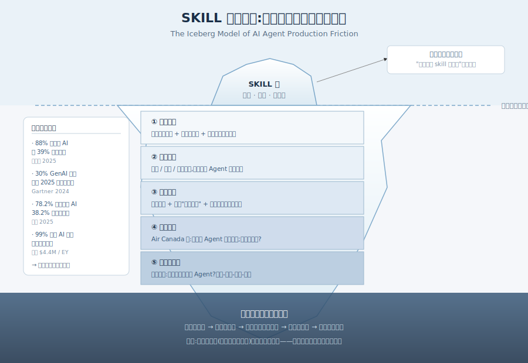
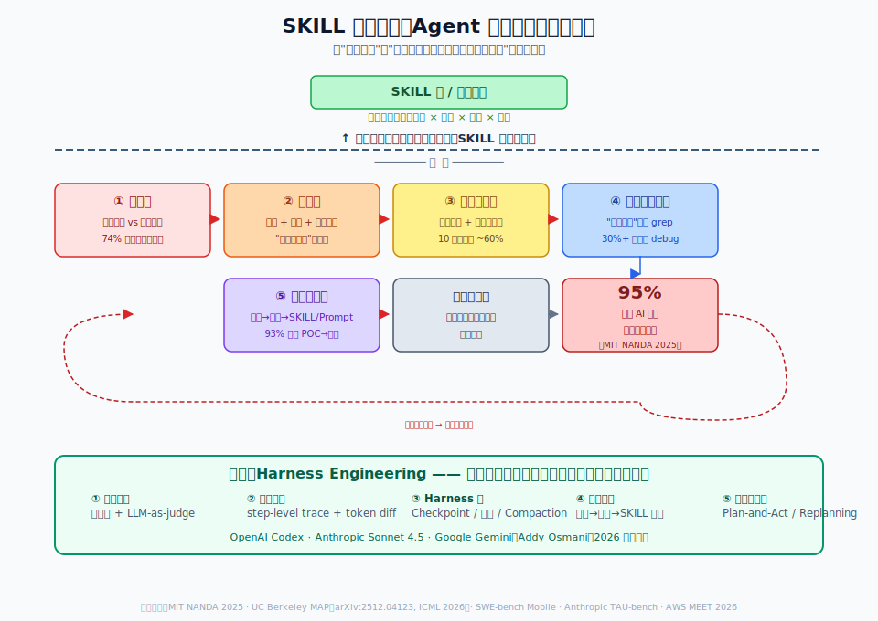
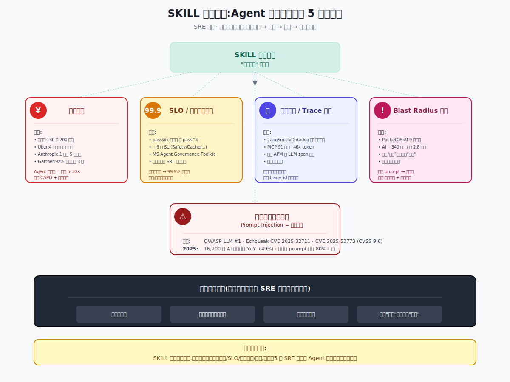
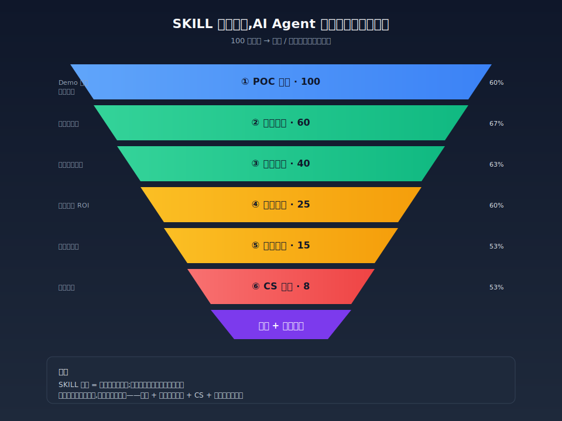
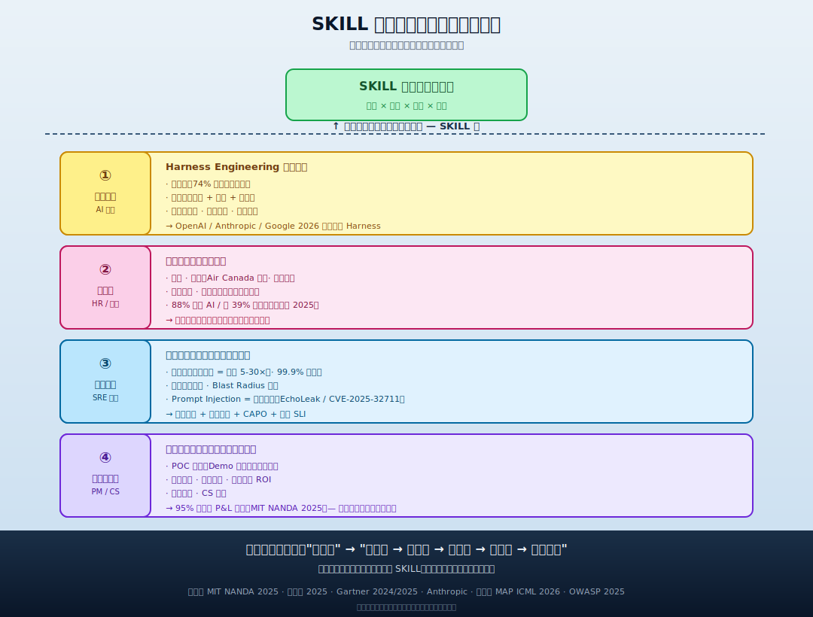

## 德说-第527期, SKILL 很重要, 但别神化, 真正的挑战还在后面
  
### 作者  
digoal  
  
### 日期  
2026-07-23  
  
### 标签  
AI , Agent , SKILL , harness 
  
----  
  
## 背景 

技术圈的乐观叙事是这样的: 把各个领域、角色、场景、模块的 SKILL 一个一个填满,Agent 就能在生产里流畅跑起来。可一旦把这套乐观叙事摆到真实的工程团队面前、放到真实的客户流程里、压到真实的事故复盘会上,它就碎成了渣。

我更愿意这么说 —— SKILL 填满是"上个阶段的结束",不是"下个阶段的开始"。能力封装填得再满,生产落地那天等着你的,是四层全新的硬骨头:工程化、组织、可靠性、商业化。每一层都不属于"再加几个 skill 就能搞定"。

下面这件事值得一说:同样一句"AI 项目失败",MIT NANDA 2025 报告里的 95% 是"没有产生可衡量 P&L 回报",AWS 演讲里的 93% 是"卡在 POC 到生产",Gartner 的 92% 是"成本超支 3 倍"。口径不同,数字打架是错觉;真问题藏在口径里 —— 我们连"失败"都还没共识。这就是为什么下面这篇文章,我尽量少引用精确数字多讲结构和逻辑,数字本身不是重点。

---

## 一、能力完备 ≠ 生产就绪

先承认一个事实:今天顶尖模型在一些公开基准上已经可以拿到相当可观的分数 —— Anthropic Claude 3.5 Sonnet 在 SWE-bench Verified 上大约 49%,在 TAU-bench 零售域 69.2%、航空域 46%;真要把这些模型塞进工业级 iOS 代码仓库做端到端修复,Cursor、Codex、Claude Code 这些顶尖产品的最佳成绩也只能落在 12% 这一档。一句话:演示高分,落地难看。

这件事不是个例,是结构性问题。当 SKILL 库还在补时,大家都默认"做不出来 = 模型/能力还不够",这种归因便宜 —— 责任在技术团队。等到 SKILL 一个一个填完,模型写代码、调 API、做摘要、跑工具调用都没问题 —— 可一连到生产流量,Agent 就开始出各种没有"具体哪一行代码可以 blame"的故障。

这是一个典型的冰山替换效应:水面之上被填平的"能力短板"一旦消失,水面之下长期被掩盖的"工程摩擦"会集体浮上来。它们包括五件事 —— 评估难、调试难、长程一致性、可观测性、数据闭环。前者是"知道怎么做",后者是"做得稳、查得到、改得动、回得来"。前者堆人能堆出来,后者堆人没用,必须靠工程体系和工程纪律。

这一观点有一个明确边界:在"封闭任务 + 单一目标 + 无外部副作用"的场景里(比如一次性抽取、纯离线批量、内部只读摘要),上述五件摩擦会显著弱化,但仍然存在。本文讨论的是更普遍的"多步、跨工具、有副作用、面向真实用户或真实流程"的生产 Agent。

怎么证明这个判断?看一组可观察的指标:团队上线后人工兜底率能否持续高于 10%、能否在 Agent 出错后 30 分钟内定位根因、能否把 90 天的失败案例 100% 走完"采集 → 归因 → 改 SKILL/Prompt → 灰度验证 → 回流"闭环。如果三件事都是 no,几乎可以判定这一节说的判断对了;反过来,如果三件事都能稳定做到,要么是这个团队已经有了一套相当成熟的 Harness,要么是 Agent 处于"无外部副作用的窄域" —— 那就属于本文不讨论的边界。

---

## 二、技术之外那一层:Harness 工程是下一个战场

先讲一个基础共识: **OpenAI Codex、Anthropic Claude Sonnet 4.5、Google Gemini 系列在 2026 年集体押注 Harness Engineering** —— 这不是哪家 AI 实验室心血来潮,是整个行业都意识到,模型之外那一层系统正在成为 Agent 能不能在生产里跑几个小时不崩的关键。

什么是 Harness?简单说:它是 Agent 周围那一圈工程设施,负责管 state(状态)、管工具执行顺序、管计划与重规划、管上下文组装与压缩、管 checkpoint 与回滚、管日志与 trace。一个类比:模型是发动机,Harness 是底盘+变速箱+ABS —— 发动机再强,没有这一层,上生产就熄火。

### 2.1 评估难:基准封闭 vs 真实开放

传统 ML 评测用的是固定测试集,而 Agent 在生产里一年可能遇到 10⁵ 量级的对话变体。如果继续用"测试集 95%"作为上线门槛,大概率会得到"看起来都好、实际到处漏"的局面。加州大学伯克利分校的一项调研覆盖了 26 个领域、86 位从业者、20 个企业级部署 —— 结论是 **74% 的生产 Agent 主要依赖人工评估**,至今没构建出可信的自动化评估管线(MAP 论文,ICML 2026 Oral)。

前置条件是"Agent 输出开放式、必须用可比对指标度量"这件事天然别扭。证明方式是:团队能否用与生产流量对齐的回放集 + LLM-as-judge,把异常召回率做到 90% 以上;做不到就说明还卡在这一关。

### 2.2 调试难:多步 + 工具 + 外部状态的"黑盒三连"

传统软件栈通过日志、调用栈、堆栈追踪可以精确回放"哪一行第几秒出错"。Agent 的执行轨迹是 token 流 + 多工具副作用 + 异步外部状态,没有任何"具体哪一行代码"可以指责。一个数学事实是:每步 95% 成功率的 Agent,跑 10 步后的裸链路累积成功率会跌到约 60%(0.95¹⁰ ≈ 0.598) —— 这不是哪个厂商的实验结论,是概率乘法的硬数学。但也不是世界末日,**如果每步都做 schema 校验 + 失败检测 + 重试 + 关键节点兜底,十步后的有效成功率可以重新升回 90% 以上**。这才是 Harness 工程的存在意义。

证明方式是:Agent 出错后 30 分钟内能不能定位到"prompt 改了一个词/工具 500/模型限流"的具体原因;能定位就过关,否则就还卡。

### 2.3 长程一致性:误差雪球 + 上下文溃烂

Agent 每一步的小误差会沿链路乘起来,跑 20 步就只剩 36% —— 这是数学事实,但不是生产事实,因为现实系统会做 Plan-and-Act 分层、Checkpoint、Context Compaction。NVIDIA 在 2026 年 2 月发过一份研究(NVIDIA SideQuest,arXiv:2602.22603)指出:长程 Agent 的 KV cache 内存增长迅猛,经 SideQuest 优化后峰值 token 用量能减少 65% —— 侧面印证当前 Agent 在长程任务中的上下文管理是低效的。

边界:只在"步骤≥10、跨会话记忆、有外部写"的任务里显著成立;5 步以内、无外部写的封闭场景不成立。

### 2.4 可观测性缺口:思考过程不是日志

传统可观测性建立在"确定性代码 + 显式接口"上,Agent 的思考是 LLM 的隐空间激活,没有可直接 grep 的 trace 锚点。业界已经涌现 LangSmith、Langfuse、Helicone、Arize Phoenix 等专门工具,这条产品线 2024–2026 年快速膨胀本身就是"Agent 可观测性是真痛点"的市场化证据。

不过也不能太绝对 —— 可观测性并非从零重建,OpenTelemetry 已经为 GenAI/Agent 定义了专门的 spans、events、metrics、exceptions 和 MCP 语义约定(Opentelemetry GenAI semantic conventions)。换一种说法: **传统三大支柱没失效,只是需要吸收 Agent 的新字段和新链路**。那些喊"传统 APM 整体失灵"的说法过头了,说"需要补充语义质量、cost、安全副作用指标"更准确。

### 2.5 数据闭环难:失败案例反哺 SKILL/Prompt

要让 Agent 持续变好,需要"采集失败 → 归因 → 更新 SKILL/Prompt → 灰度验证 → 回流"的闭环。这个闭环跨产品/工程/数据/合规多个部门,且手工标注量大。如果 90% 的失败案例从未被人工 review,三个月后回头看 Agent 的效果指标大概率一动不动。MIT NANDA 2025 报告的一个核心结论是:直接采购 AI 工具的成功率大约是自建的 3 倍 —— 侧面说明**自己造 Agent 闭环比买现成的难得多**。

上面这张图把五件事和"水面之上被填平的能力"摆在一起,核心信息是: **SKILL 填满不是终局,而是开始** —— 接下来真正决定成败的是 Harness、可观测性、评估管线、数据闭环、长程一致性这套组合拳。这五件不互锁、单点修补收益有限。

---

## 三、组织那一关:信任、责任、岗位、流程、决策权

麦肯锡 2025 年 AI 现状报告披露了一组耐人寻味的数据:88% 的组织已在用 AI,但只有 39% 实现了"真金白银"的业务价值。两组数字并排出现的意思是 —— AI 能不能干早就不是问题,敢不敢让它干、出了事归谁、干了之后岗位怎么办,才是。

冰山换了一层。换个角度,这件事比工程更难 —— 工程问题可以重写代码,人的问题得重写流程、重写岗位、重写考核、重写责任。

### 3.1 信任建立:不是"再加几个 skill"能解决

员工和客户对 AI 的信任建立机制,与 AI 能力水平不是线性正相关,而是与"可解释、可追责、可纠错"三件事强相关。SKILL 完备前,大家把不信任归因于"它还不够聪明",责任在技术团队;SKILL 完备后,AI 质量逼近人类水平,信任问题反而升级。智联招聘 2025 报告显示,78.2% 职场人每周用 AI,但 38.2% 会"经常验证其准确性和可靠性" —— 这意味着越愿意用就越担心被替代,越担心就越多验证,越多验证就越拖慢 Agent 部署节奏,一个负反馈循环。

客户侧更直接:一次错赔、一次误诊、一次误关账户,信任瞬间坍塌,且这种风险随 Agent 自主度提升而指数级上升。

不过也得有个边界: **"信任最稀缺"是中大型、高风险、客户直面场景的强主张** —— 在低风险内部辅助、员工自愿采用、结果易复核的小团队里,真正稀缺的可能是数据权限、培训时间、明确 ROI,而未必是信任。

### 3.2 责任归属:Agent 犯错后谁来背锅?

法律责任的归属和组织内部责任的归属是两个问题。法律侧正在快速形成共识: **Air Canada 案(Moffatt v. Air Canada,2024)** 已经确立了"聊天机器人是公司代表,责任归公司"的原则 —— 不管哪个 ChatBot 出错,这笔账算到企业头上。

但组织内部的责任归属才是无主之地:Agent 自主决策出错,事故报告由业务部门、技术部门还是产品负责人写?Agent 与人类判断冲突,人类听从 Agent 出了事、不听也出事,如何归因?一个 Agent 同时调财务、销售、法务的数据,事故算哪个 SKILL 的?

Gartner 提的 AI TRiSM 框架和 AI 治理平台试图回应这些,但落到 KPI 和岗位职责上是另一回事。EY 的 AI 风险调研给过一个常被引用的均值:部署 AI 的企业平均每年因 AI 事故产生约 440 万美元财务损失;这数字是"行业普遍现象"的标注,不是某一家孤例 —— 一家企业的金额永远会被报道成更具戏剧性的数字,真正能拿走用做论证的是"行业普遍已经吃过 AI 事故的亏"。

边界:在受监管行业(金融、医疗、法律、保险)和涉及个人重大利益(招聘、信贷、理赔)的场景里高度成立;在内部辅助、决策可复核推翻的场景里弱化。

### 3.3 岗位重构:不是"AI 替代人",是"岗位重写"

AI Agent 的真实影响不是"减员",而是岗位定义的重写 —— 执行岗位被压缩(70-80% 工作被 Agent 接管,剩下的 20-30% 反而要求更高),中层管理被挤压(部分协调功能被 Agent 接管,但责任和权限还在人手中,出现"权责错位"),新增岗位出现(Agent 训练师、提示词架构师、Agent 流程审计师、AI 伦理审查员、AI 事故复盘官 —— 这些岗位在 2024 年之前几乎不存在)。

边界:在中大型组织、岗位说明书明确、KPI 体系成熟的场景里高度成立;在小团队或创业公司(岗位本就模糊、重构成本低)里弱化。

### 3.4 流程再造:为"人"设计的流程会集体失语

现有流程的每一个节点 —— 签字、复核、交接、汇报 —— 都是为"人是唯一执行者"设计的。Agent 会在毫秒级完成多个本属于不同人的环节,这会让现有流程出现三类症状:环节失语(Agent 不需要请示汇报,流程里那些"对齐信息"用的会议、邮件、签字瞬间多余)、签字失效(Agent 的决策速度远超人类复核,所谓"主管复核"沦为橡皮图章)、交接错位(Agent 跨部门调用数据时没有"部门墙"概念,但人类有)。

边界:在流程标准化程度高的行业(制造业、金融、客服中心)高度成立;在高度依赖个体经验的领域(高端咨询、艺术品鉴定、危机公关)反而可能破坏专业判断。

### 3.5 决策权让渡:这是治理问题,不是技术问题

把"判断"外包给一个没有价值观、没有利益绑定、可能误判的系统 —— 这要求组织明确"哪些决策可以错"。SKILL 填满后,Agent 能做出和人类同等质量的决策,但有两个问题人类决策者不得不回答: **错得起吗**(Agent 决策错误的成本由谁承担)、**追得回吗**(出错后能否在 24 小时内找到根因)。Gartner 把 AI 治理平台列为与 AI Agent 同等重要的 2025 年战略技术趋势,这不是技术配套,是治理先行。

边界:在决策可量化、可回滚、有清晰 SLA 的场景里(交易执行、内容推荐、客服分级)成立;涉及生命、重大资产、声誉的不可逆决策、或法律明确禁止的领域,不成立。

这五件事不是并列的清单,而是相互放大 —— 流程再造不到位,责任归属就无依据;岗位不重构,流程再造就推不动;决策权不让渡,前面三件事都白做;而信任不建立,任何让渡都会被质疑。 **任何一件失守,会反过来恶化其他四件**。这就要求有一类角色(幕僚长、COO 或 AI 责任官)同时盯着这五件事。

顺带提一句:横向协调者并不是唯一解 —— 成熟组织可以走联邦治理模式,中央平台团队负责身份、权限、审计和公共 Harness,业务线 owner 嵌入对场景、风险和结果负责。一个虚拟角色同时盯五件事适合早期跨部门阻力大、CEO 能授权的转型;规模化后更可能切换到"中央治理 + 业务嵌入"的联邦模式。

---

## 四、上生产就熄火:可靠性账本

工程侧把 SKILL 库填满,但可靠性账本一旦碰上真实生产流量,就开始出现各种"账目不符"。这里有一个对原命题的降调: **传统 SRE 工具箱没有整体失灵,但请求级可用率不够用了** —— Agent 需要在同一套 SRE 框架中补充任务结果、语义质量、成本、安全副作用和可恢复性。OpenTelemetry 已经为 GenAI/Agent 定义了 spans、events、metrics 和 MCP 语义约定,OWASP 把 prompt injection、过度授权、敏感信息泄露和资源耗尽列为重点风险,主要缓解手段还是最小权限、输入输出验证、人工审批、预算和限流这些传统 SRE 看家本领。把"整体失灵"换成"需要补充扩展",会更经得住推敲。

下面挑四个最值得展开的讲。

### 4.1 成本失控:不是 Bug,是架构

Agent 通过多步推理、工具调用完成任务,每一步都触发一次 LLM 调用、一次工具调用、一次上下文累积,账单按 token 计费。Gartner 的研究给过一个经常被引用的数字: **Agent 单任务的 Token 消耗量是标准生成式 AI 交互的 5 到 30 倍**。这是结构性的,不是 bug。

大厂亲身示范"忘了设上限"的后果,几起有公开报道:Meta 6000 名员工 30 天消耗 73.7 万亿 Token,CTO Bosworth 在内部备忘录里承认"任何人不应该为了用 AI 而用 AI";Uber 5000 名工程师 4 个月烧完全年 AI 预算,人均月 Token 消耗 500-2000 美元;某 Anthropic 企业客户 1 个月刷爆 5 亿美元 Claude 账单,原因是开通账号时忘了设消费上限。换成媒体口径之前我得说一句:这类事故的精确金额常被戏剧化报道,真正可参考的是"大厂设硬上限是常识、没设就等着出事"这件事。

还有一份 Anthropic 内部研究揭露了另一个隐形账单:一个配备 5 台 MCP 服务器和 34 个工具的典型部署,平均每回合 prompt 约 45000 个 Token,其中约 50% 只是工具 schema 的开销 —— **一半的钱花在"告诉 AI 有哪些工具可用"** 。这件事一般人意识不到。

工程对策: **三层限流(用户日预算 + 项目月预算 + 单 run token 上限 + 异常调用熔断)+ 路由网关(简单任务路由到便宜模型)+ CAPO 单位经济学**(把"每 token 成本"换成"每个被接受的业务结果的成本")。

### 4.2 错误预算失效:99.9% 在 Agent 上没有意义

传统 SLO 假设系统是确定性的,同样的请求、同样的代码路径,大概率得到同样的结果;Agent 的输出是采样 + 温度 + 上下文 + 模型版本四个变量的函数,"99.9% 成功"这个数在概念层就很难定义。

更有名的反差是 SWE-bench Verified(封闭测试集)上 Claude 3.5 Sonnet 拿到 49%,而更接近真实工业级 iOS 代码库的 SWE-bench Mobile(若是基准真实存在)上,主流 Coding Agent 最佳配置也只有 12% 量级 —— 同样是基准分数,跟生产可靠性的距离可以差出几个量级。

SRE 圈子正在重新设计 Agent SLI/SLO。一个常用版本是六维:任务成功率(滚动 1 小时 ≥ 92%)、P95 端到端延迟(≤ 12s)、Cost/Task(≤ baseline × 1.15)、工具错误率(< 3%)、Safety 违规(= 0 高严重度事故,低严重度按明确分母和误差预算管理)、上下文耗尽率(< 1%)、Cache 命中率(≥ 70%)。但这套六维不能直接当万能表 —— Safety 违规=0 必须限定严重级别与分母,否则一条低严重度误报就会冻结整个发布;Cache 命中率低不一定损害用户结果,可能只是成本上升,放在 SLO 队列里会制造告警噪音。

### 4.3 可观测性:决策空间连续且高维,无法重放

一次 Agent 请求可能展开成 N 个 LLM span × M 个 Tool span 的 DAG;LLM 内部决策(prompt → thought → tool_call → observation)不透明。三个 Provider、五个工具、五种模型随时可能切换。 **决策空间是连续且高维的,无法重放** —— 同样输入,这次成功上次失败,可能是温度、模型版本、上下文窗口差异共同作用。

工程对策比较确定: **trace_id 强制贯穿 HTTP → Orchestrator → LLM span → Tool span,每个 LLM span 必带 prompt_hash、model_version、temperature、tool_schema_version、cost_usd**。LangSmith、Datadog LLM Observability、Langfuse 是当前主流方案,但 Thoughtworks Technology Radar 2025-11 把 LangSmith 和 Datadog 都标为"试验" —— 意味着已经过验证的产品形态仍未出现,试错成本仍在。

### 4.4 Prompt Injection 即代码执行

OWASP 在 2025 年把 Prompt Injection 列为 LLM 第一大安全风险。EchoLeak(CVE-2025-32711)是 Microsoft 365 Copilot 的零点击 prompt injection 漏洞,攻击者只需发送一封精心构造的邮件,无需用户交互,即可远程、未授权地从企业租户提取敏感数据。GitHub Copilot 也出过 CVE-2025-53773,CVSS 9.6,通过代码注释里的 prompt injection 触发"YOLO mode"实现远程代码执行,影响 10 万+ 开发者机器。LLM 是天然的命令注入漏洞,且每次调用都是新的漏洞,因为输入不可枚举。

工程对策:把不可信内容与系统指令物理隔离(用 `<user_content>` 标签显式标注)、最小权限(Agent API token 严格 scope)、输出过滤(模型输出 → Guardrail Model 审核 → 实际操作)、持续对抗测试(把 prompt injection 当作常规 SAST/DAST)。

这里有一个老生常谈的合并诉求 —— 成本、SLO、可观测性、安全、变更发布这五条传统 SRE 主线,**在 Agent 上没有任何一条整体失灵,但每一条都需要扩展和重新定义** —— 这件事单看哪条都不致命,五条同时没补才是真正要命。

---

## 五、商业工程:从 Demo 到续约的层层折损

商业落地的游戏规则跟工程不一样。麦肯锡的 88%/39%、MIT NANDA 的 95% 没产生可衡量 P&L 回报、Gartner 2024 预测 30% GenAI 项目将在 2025 年底前被放弃、Gartner 2025 把 Agentic AI 的放弃率上调到 2027 年底前 40% 以上 —— 四组数据不冲突,合在一起说的是同一件事:商业落地比技术落地难一个量级。

六层漏斗常被作为分析框架使用(下图),但这一节我会对原命题做降调: **100→30→15→8→4 这种具体百分比,只是示意性压力情景,不是行业基准,更不是已被审计的结论**;真正可做的,是按企业自己历史数据分别测"POC→生产""生产→付费""付费→续约"三段转化,而不是混成一个数字。

### 5.1 POC 陷阱:Demo 天使,生产恶魔

Demo 用的是脱敏、规整、有限边界的数据集;客户的环境是 10 年积累的脏数据 + 边缘 case + 跨系统口径冲突。Demo 的"用户"是配合测试的友好用户;生产里的"用户"是会吵架、会断网、会发错字的真实业务方。客户给 6 周的 POC 期,厂商挑最容易出效果的功能做 Demo,然后演示效果远超真实场景,商务谈判签约,上线 3 个月后真实数据回流,准确率从 Demo 的 92% 跌到 60% 出头,业务方不再信任。MIT NANDA 的 95% 没产生可衡量回报,有不少是这一关卡住的。

这里有一个 Klarna 的常见误读需要澄清 —— Klarna 2024 年高调宣布 AI 客服"替代 700 名人工坐席",2025 年承认 CSAT 下滑、客诉上升,**于是被简化叙述成"AI 客服全面失败、招回纯人工"** 。更准确的描述是 CEO 后来公开讲的: **AI 接管了重复性工作,人工则负责 VIP 体验,两件事同时成立**。这件事能拿来用的洞见是"纯自动化承诺需要回调为分层服务",不是"AI 客服在 Klarna 整体失败"。

### 5.2 系统集成:Agent 是流程里的螺丝钉,不是新系统

客户不是要"一个新工具",而是要"在我现有的 Salesforce/SAP/ServiceNow/自研工单系统里,多一个能聊天的节点";改造现有系统让 Agent 能调取数据 + 写回结果 + 触发下游,经常比 Agent 本身开发成本高 3–5 倍。单点集成容易,多系统级联困难 —— CRM 里改个状态要同步触发 ERP 改库存 + 财务开票 + 物流排期,Agent 变成了分布式事务协调器,鲁棒性要求陡增。Salesforce Agentforce 把"原生 CRM 集成"作为最强卖点,反过来证明集成能力本身就是 Agent 产品力的核心,而不是"附加项"。

这一关卡不卡,后面都没意义。

### 5.3 定价模式两难:客户算不清账,厂商收不到钱

Per-seat(按席位)适合人类员工但不适合 Agent —— 一个 Agent 可以顶 100 个人,按席位收等于自废武功;Per-call/Per-token 客户最熟悉,但客户反手就问"为什么这个月比上个月多花了 3 倍",解释成本高;Per-task(按完成的任务数)"什么算一个 task"双方定义不清,对账成本高;Outcome-based/Value-based(按业务结果分成)理论上最先进,但需要双方共享结果数据,客户不愿意,厂商也不愿意承担效果风险;Hybrid(底价 + 用量 + 结果浮动)实际谈判中的常态,但销售周期长,合同复杂。

边界:在流程简单、结果可清晰定义(外呼邀约、会议纪要、文档初稿)的场景里 outcome 定价可行;在流程复杂、结果受多因素影响(销售成单、客服满意度、研发效率)的场景里 outcome 定价几乎不可执行。

### 5.4 长尾场景:SKILL 填满了主流,长尾才是 ROI 杀手

主流场景的 SKILL 用 80/20 原则覆盖 80% 的请求量,但还有 20% 落在"非主流但真实存在"的边缘 case 上。这 20% 的长尾恰恰是 ROI 的吞噬者 —— 人工兜底成本高、Agent 兜不准、还要为它单独建新 SKILL。MIT NANDA 报告与各厂商披露的"production vs demo"准确率落差(15-30 个百分点),主要来自长尾,而不是模型能力本身。

边界:在封闭域(单一 FAQ 库、单一 API 集合)场景里,长尾可枚举;在开放域/多模态/跨系统场景里,长尾无法被预先填满。

### 5.5 价值度量:业务方不信"AI 帮我节省了 X 小时"

Agent 厂商习惯说"帮你省了 X 小时、Y 个人",但业务方会问"省下的时间做了什么?没有 Agent 我也未必会雇那个人。这部分价值是真实增量,还是只是效率虚高?"价值归因难 —— 同期 CRM 改版了、SOP 重构了、人也换了,Agent 的贡献怎么单独拎出来?CFO 看的是"剔除所有一次性收益后,同比净利润变化",不是"对话量增加了";业务方承认 AI 有效等于承认自己团队冗余,这和职业安全感冲突。

边界:在公司治理成熟、有 OKR + 数据中台的企业里,度量可执行;在管理粗放、决策靠老板感觉的企业里,度量经常被"老板拍板"代替,Agent 价值既不可证伪也不可证明。

### 5.6 CS(客户成功)缺位:卖出去 ≠ 用起来

Agent 产品比传统 SaaS 更需要 CS:上线初期用户不知道该问什么、不知道边界在哪里、对错误极度敏感。传统 SaaS 的 CS 套路(培训 + 答疑 + 续约)在 Agent 场景里失效 —— Agent 的失败模式是"看起来工作但其实偏了",不是"报错"。没有持续的客户成功,客户的使用率会在上线 60 天内断崖式下跌,续约率跌到 50% 以下,即便产品功能没问题。

不过也得给"有 CS 续约就能到 75-85%"这种精确数字打个问号 —— 这种差距可能方向正确,但没说清客单价、行业、客户规模和选择偏差(高价值、健康客户本来就更可能被配置专属 CS),没有匹配样本或准实验,不能把相关性写成因果。但定性方向仍成立:Agent 比 SaaS 更需要 CS。

边界:在内部使用 / 强管控场景(企业内 IM 助手)里,缺 CS 也能跑起来;在多业务线 / 多角色 / 多场景的横向 Agent 平台里,没 CS 必死。

---

## 六、怎么破

写到这里,如果只让记住三件事,我希望是下面这三件:

**第一,瓶颈从能力层迁移到四层:工程化层、组织层、可靠性层、商业工程层** —— SKILL 把能力封装这块最短的板补上了,其他四块板同时被暴露出来。一块板刷漆,其他板照样漏水。

**第二,Harness Engineering 是新战场,不是模型之争** —— OpenAI/Anthropic/Google 三家大厂集体押注 Harness 这件事本身就说明问题。模型之外的工程系统(State 管理、Checkpoint、回滚、上下文组装、可观测性、数据闭环)是决定 Agent 能在生产里跑几个小时不崩的关键。这块不能用"再加几个 skill"打发,得靠工程体系和工程纪律。

**第三,信任 + 责任 + 流程再造 + 决策权让渡缺一不可** —— 这件事比工程难,因为不能靠重写代码解决;它要求组织重写岗位说明书、重写 KPI、设立"数字岗位"和"AI 责任官"。这件事的边界 —— 多摩擦相互放大不是抽象表述,是真实代价:任何一件失守都会反向恶化其他四件。

几个具体动作建议,挑最实用的:

- **上线前先补评估** —— 哪怕只是 100 条人工标注的回放集 + 一段 LLM-as-judge 代码,也比"测试集 95%" 强 100 倍。回放集是后续所有优化的原料。
- **把 trace 视为一等公民** —— 从第一行 Agent 代码开始就接 LangSmith/Langfuse,不要等到"出问题再补"。没有 trace,后续归因全靠猜。
- **接受"半自动"是常态** —— Anthropic 自己在生产中也接受"10 步后人工接管",别追求"完全无人值守"。这是行业经验值,不是让步。
- **数据飞轮是真正的护城河** —— 当所有竞争对手都有类似 SKILL + 类似的开源模型 + 类似的脚手架时,唯一能拉开差距的是谁的数据闭环跑得更快。这也是普华永道 2026 AI 效能报告里 20% 领先企业吃掉 74% 价值的根因。
- **商业工程比"再加 SKILL"更难** —— 签约即配 CS,POC 阶段就用客户脏数据 + 客户真实工单做双盲测试,集成实施费作为合同独立条目不让销售压低。这三件事比模型版本升级更有杠杆。
- **老板亲自站台、亲自担责** —— 上面这些事单独哪件都不属于"工程团队交付完就算结束",任何一件都要求 CEO 亲自拍板、亲自担责。这是为什么建议设 AI 责任官的根本原因 —— 不是为了多一个汇报层级,是为了在事故发生之前把追责流程跑通。

可以预料的反对意见也有三条,值得提前摊开:第一,"这些事我们早就在做了,所以不成立" —— 请自我检查 trace 完整度、人工兜底率和数据闭环完整度,比口说更可信;第二,"你这是 AI 八股,啥都说了等于啥都没说" —— 这条确实成立一部分,所以上面这些结论都给了边界和证伪手段,真要反驳请用数据;第三,"SKILL 都没填满,谈这些有什么用" —— 这恰恰是本文存在的理由:能力题还在做时,组织题、可靠性题、商业工程题已经要交卷了,等到 SKILL 全部交付那天再补,就太晚了。

最后一句:AI 发展日新月异,可能睡一觉这些问题就不在了;如果还在,那就再睡一觉。但凡还在 —— 上面这套重组,值得现在就开始。

---

## 几点边界,值得说在前面

凡事要辩证的看。这篇文章里几乎每个数据,都带条件,我尽量在文中标注;但有几条整体性的边界值得在末尾再说一次:

第一, **"失败"这个词本身没共识**。MIT NANDA 95% 是没有可衡量 P&L 回报,Gartner 92% 是成本超支,Gartner 66% 是项目干脆被放弃 —— 三家都叫"失败",但意思不同。读者引用任一数字时,先确认它在说哪种失败,别拿一个口径去批评另一个口径。

第二, **那类戏剧化的精确金额别太当真**。13 小时 200 万、1 个月 5 亿美元这类数字在媒体上反复出现,但精确度有限。能拿去用的结论是"大厂设硬上限是常识、没设就等着出事",不是"AI 平均每月烧多少美元"这种不存在的统计。

第三, **SRE 没有整体失灵,只是需要补章节**。文中 4.1-4.4 提到的事不是"传统 SRE 工具箱崩了",而是"传统 SRE 工具箱需要补充任务结果、语义质量、成本、安全副作用这些维度" —— 这是更经得起推敲的说法,前面如果哪句话让你以为我把传统 SRE 一笔勾销,以这句为准。

第四, **六层漏斗的百分比是示意,不是行业基准**。具体数字 100→60→40→25→15→8 用来给读者建立"逐级衰减"的心智模型,但作为决策依据就过头了;真正可做的,是按企业自己历史数据分别测"POC→生产""生产→付费""付费→续约"三段转化。

第五, **Klarna 不是 AI 失败案例,被简化叙述了**。它更准确的描述是"AI 接管重复性工作、人工负责 VIP 体验" —— 分层共存,而不是"全面失败招回纯人工"。如果有人引用 Klarna 证明"AI 客服不行",那是引用者没读完整篇公开声明。

最后那张全景图(下),把四层瓶颈和"水面之上被填平的能力"摆在一起,核心信息是: **当 SKILL 库从显性短板变成隐性长尾,生产 Agent 的失败模式会从"做不了"转译成"做不稳、做不查、做不回、卖不动、用不起来"** —— 而解决这五件事的难度,远高于堆砌 SKILL。

  
  
#### [PostgreSQL 解决方案集合](../201706/20170601_02.md "40cff096e9ed7122c512b35d8561d9c8")
  
  
#### [德哥 / digoal's Github - 公益是一辈子的事.](https://github.com/digoal/blog/blob/master/README.md "22709685feb7cab07d30f30387f0a9ae")
  
  
#### [About 德哥](https://github.com/digoal/blog/blob/master/me/readme.md "a37735981e7704886ffd590565582dd0")
  
  

  
