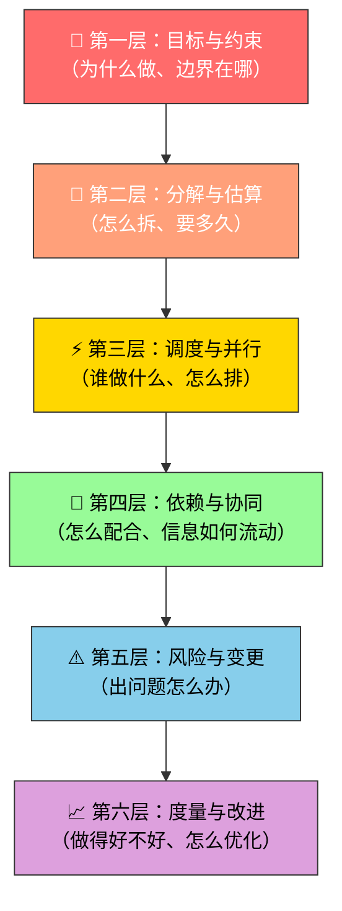
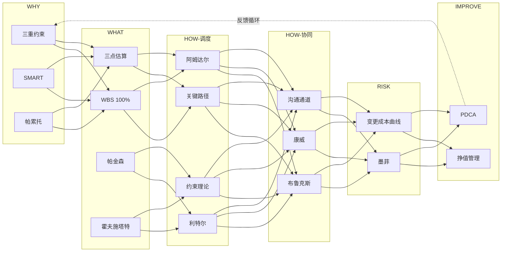

## PMP 思维筑基课: 项目管理（PMP）底层公理与定律体系 —— 面向 Agent 编排与协作
  
### 作者  
digoal  
  
### 日期  
2026-07-24  
  
### 标签  
思维筑基 , PMP , 多 Agent 编排与协作
  
----  
  
## 背景 

> 一份体系化的知识地图：从目标定义到持续改进，覆盖 Agent 编排协作全生命周期所需的 18 条核心公理/定律，零断层、零遗漏。

---

## 🗺️ 为什么要学底层公理？

管理 Agent 编排协作，本质上就是管理**多个自治实体的目标对齐、任务分解、资源调度、风险控制和协同交付**。这和项目管理面临的核心挑战完全一致。

公理和定律是"压缩后的经验"——掌握它们，你就能在复杂场景中快速做出正确判断，而不是每次都从零摸索。

---

## 📐 体系架构：6 层 18 条

我按照项目管理的**生命周期**和 Agent 编排的**实际需求**，将所有必学公理/定律组织为 **6 个层次**。每个层次解决一类核心问题，层次之间层层递进、环环相扣。

---

## 📋 完整清单（18 条）

### 第一层：🎯 目标与约束——为什么做、边界在哪

| # | 公理/定律 | 一句话核心 | Agent 编排映射 |
|---|---|---|---|
| 1 | **三重约束（铁三角）** | 范围、时间、成本互相制约，不可能三者同时最优 | Agent 任务的质量、速度、Token 消耗之间的权衡 |
| 2 | **SMART 原则** | 目标必须明确、可衡量、可达成、相关、有时限 | Prompt/Goal 必须精确定义，模糊指令→模糊产出 |
| 3 | **帕累托法则（80/20）** | 80% 的价值来自 20% 的工作 | 优先编排高价值 Agent 任务，避免平均用力 |

### 第二层：🔪 分解与估算——怎么拆、要多久

| # | 公理/定律 | 一句话核心 | Agent 编排映射 |
|---|---|---|---|
| 4 | **WBS 分解原则（100% 规则）** | 子任务之和必须等于父任务的 100%，不遗漏不重叠 | Agent 任务分解必须 MECE，否则出现盲区或重复 |
| 5 | **Planning Poker / 三点估算** | 估算需考虑乐观、最可能、悲观三种情况 | Agent 执行时间和 Token 预算的估算区间 |
| 6 | **帕金森定律** | 工作会膨胀到填满所有可用时间 | 不给 Agent 设截止/Token 上限，它会无限展开 |
| 7 | **霍夫施塔特定律** | 事情总比预期更久，即使你已经考虑了这一点 | Agent 任务超时是常态，要预留缓冲 |

### 第三层：⚡ 调度与并行——谁做什么、怎么排

| # | 公理/定律 | 一句话核心 | Agent 编排映射 |
|---|---|---|---|
| 8 | **关键路径法（CPM）** | 最长路径决定项目总工期，优化非关键路径无法缩短总时间 | 找到 Agent DAG 中的关键路径，优先优化瓶颈 |
| 9 | **阿姆达尔定律** | 系统加速比受不可并行部分限制 | Agent 并行编排的提速上限由串行依赖决定 |
| 10 | **利特尔定律** | 在制品 = 吞吐率 × 周期时间 | 控制并发 Agent 数量 = 控制系统负载 |
| 11 | **约束理论（TOC/瓶颈理论）** | 系统产出由最薄弱环节决定 | 整个 Agent Pipeline 的速度由最慢 Agent 决定 |

### 第四层：🔗 依赖与协同——怎么配合、信息如何流动

| # | 公理/定律 | 一句话核心 | Agent 编排映射 |
|---|---|---|---|
| 12 | **布鲁克斯法则** | 向已延迟的项目增加人手只会更延迟 | 向失败的 Agent 链追加更多 Agent 不一定有效 |
| 13 | **康威定律** | 系统架构反映组织沟通结构 | Agent 协作拓扑决定了产出的系统架构 |
| 14 | **沟通通道公式** | n 个人有 n(n-1)/2 条通道，沟通成本爆炸增长 | Agent 间消息传递复杂度随数量平方增长 |

### 第五层：⚠️ 风险与变更——出问题怎么办

| # | 公理/定律 | 一句话核心 | Agent 编排映射 |
|---|---|---|---|
| 15 | **墨菲定律** | 可能出错的事一定会出错 | Agent 一定会产生幻觉/错误，必须内置校验 |
| 16 | **变更成本曲线（Boehm）** | 越晚发现错误，修复成本呈指数增长 | 越早在 Agent Pipeline 中验证，返工成本越低 |

### 第六层：📈 度量与改进——做得好不好、怎么优化

| # | 公理/定律 | 一句话核心 | Agent 编排映射 |
|---|---|---|---|
| 17 | **挣值管理（EVM）** | 用 PV/EV/AC 三条线度量进度和成本偏差 | 量化 Agent 任务的计划 vs 实际执行效率 |
| 18 | **PDCA 循环（戴明环）** | Plan→Do→Check→Act 持续改进 | Agent 编排策略必须迭代优化，不是一次性设计 |

---

## 🔗 层次之间的逻辑关系

---

## 🎯 学习路线建议

1. **先读总纲**（本文），建立全局视角
2. **按层次顺序**逐条学习，每条都有独立的深度讲解文章
3. **每学完一层**，回顾该层与上下层的关系
4. **结合实战**：对照你的 Agent 编排场景，为每条公理找到具体映射

---

## 📂 详细讲解文章索引

以下每条公理/定律都有独立的深度讲解文章（按学习顺序排列）：

| # | 文章 |  
|---|---| 
| 1 |  [三重约束（铁三角）](pmp_doc/triple_constraint.md) |  
| 2 |  [SMART 原则](pmp_doc/smart_principle.md) | 
| 3 |  [帕累托法则](pmp_doc/pareto_principle.md) |  
| 4 |  [WBS 100% 规则](pmp_doc/wbs_100_percent_rule.md) |  
| 5 |  [三点估算](pmp_doc/three_point_estimation.md) |  
| 6 |  [帕金森定律](pmp_doc/parkinsons_law.md) |  
| 7 |  [霍夫施塔特定律](pmp_doc/hofstadters_law.md) |  
| 8 |  [关键路径法](pmp_doc/critical_path_method.md) |  
| 9 |  [阿姆达尔定律](pmp_doc/amdahls_law.md) |  
| 10 |  [利特尔定律](pmp_doc/littles_law.md) |  
| 11 |  [约束理论](pmp_doc/theory_of_constraints.md) |  
| 12 |  [布鲁克斯法则](pmp_doc/brooks_law.md) |  
| 13 |  [康威定律](pmp_doc/conways_law.md) |  
| 14 |  [沟通通道公式](pmp_doc/communication_channels.md) |  
| 15 |  [墨菲定律](pmp_doc/murphys_law.md) |  
| 16 |  [变更成本曲线](pmp_doc/boehms_cost_curve.md) | 
| 17 |  [挣值管理](pmp_doc/earned_value_management.md) |  
| 18 |  [PDCA 循环](pmp_doc/pdca_cycle.md) |  

---

> 💡 **提示**：建议先通读本总纲，建立全局认知后，再按顺序深入每篇文章。学完 18 条，你就拥有了管理 Agent 编排协作的完整理论武器库。
  
  
#### [PostgreSQL 解决方案集合](../201706/20170601_02.md "40cff096e9ed7122c512b35d8561d9c8")
  
  
#### [德哥 / digoal's Github - 公益是一辈子的事.](https://github.com/digoal/blog/blob/master/README.md "22709685feb7cab07d30f30387f0a9ae")
  
  
#### [About 德哥](https://github.com/digoal/blog/blob/master/me/readme.md "a37735981e7704886ffd590565582dd0")
  
  

  
