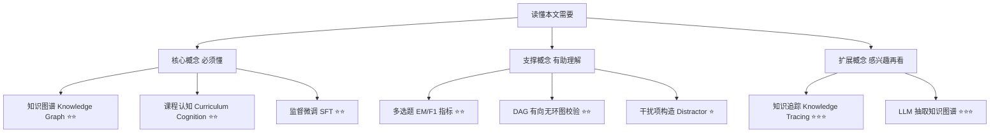
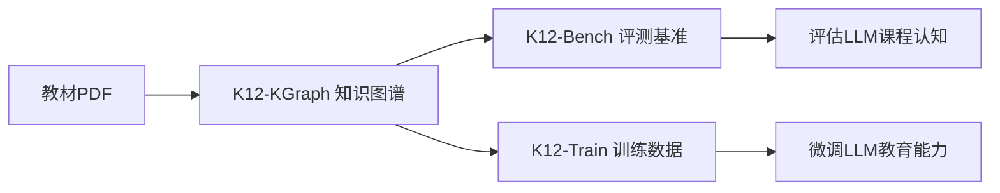

## AI论文解读 | 北京大学 K12-KGraph 论文解读 : 知识组织决定了 AI 后学习/推理性能? 
  
### 作者  
digoal  
  
### 日期  
2026-07-24  
  
### 标签  
AI , LLM , 预训练 , 后学习 , RAG , 推理 , K12-KGraph , 图 , 知识组织  
  
----  
  
## 背景 

> **原文信息**：Hao Liang 等（北京大学 / 高等算法研究院 / OriginHub Technology / 中关村学院）| 2026年5月 | arXiv:2605.09635（投稿 NeurIPS 2026 Evaluations and Datasets Track）
> **解读日期**：2026年7月24日

---

## 📍 论文定位

**一句话**：这篇论文从人教版中小学教材里抠出一张"知识图谱"（K12-KGraph），然后用这张图同时造出一套考"课程结构理解力"的考题（K12-Bench）和一批教"课程结构理解力"的训练数据（K12-Train），结果发现顶尖大模型在这类题上表现平平，但用这批数据做微调却能以极小的样本量大幅超越主流通用指令数据集。

**🎓 学术价值**：现有的 K–12 相关评测（C-Eval、CMMLU、GaokaoBench、EduEval）几乎都在考"这道题答案是什么"，本质是事实回忆。这篇论文首次系统性地定义并评测了"课程认知"（curriculum cognition） —— 即模型是否理解知识点之间的前置依赖、分类归属、实验-概念对应关系、以及知识点在教材里的位置顺序。这填补了教育类 LLM 评测中"结构性理解"这一维度的空白。

**🏭 工业价值**：可直接用于智能辅导系统的能力测评（判断一个模型是否真的"像老师一样"理解课程脉络），也提供了一套低成本、高效率的领域微调方案 —— 只用 2300 条精心构造的数据，就能让开源模型在教育类下游任务上大幅超过用同等规模的通用对话数据（如 OpenHermes、UltraChat）微调的效果。

**💡 直觉类比**：好比考一个数学老师，光会做题不算合格 —— 她还得知道"学一元二次方程之前得先会因式分解"、"这个实验对应课本第几章哪个知识点"。现有的 AI 评测只考"会不会做题"，这篇论文造了一套新题型，专门考"是不是懂这门课的来龙去脉"，同时还证明了：把这套"脉络知识"直接喂给模型学习，比喂海量泛泛而谈的对话数据管用得多。

---

## 🗺️ 知识地图

### 核心概念三件套

**知识图谱（Knowledge Graph）**
- **是什么**：把"概念""技能""实验""习题"等实体当节点，把它们之间"属于""是前置""相关联""验证"等关系当边，组成的一张结构化关系网。
- **为什么重要**：本文的一切 —— 评测题和训练数据 —— 都是从这张图"长"出来的，图的质量直接决定了下游产出的质量。
- **现实类比**：就像一张地铁线路图，每个站是一个知识点，线路和换乘关系就是"先学什么、后学什么"。

**课程认知（Curriculum Cognition）**
- **是什么**：不是"知道某个知识点是什么"，而是"知道这个知识点在整个课程体系里的位置、前置条件、关联知识和验证方式"。
- **为什么重要**：这是本文提出的核心新概念，也是现有评测体系完全没有覆盖的盲区。
- **现实类比**：知道"光合作用"的定义是记忆力，知道"学光合作用之前得先懂细胞结构""这个实验能验证光合作用产生氧气"才是真正教得懂的老师该有的理解。

**监督微调（SFT, Supervised Fine-Tuning）**
- **是什么**：用一批"问题-答案"样本对一个已经预训练好的大模型做针对性再训练，让它更擅长特定任务或领域。
- **为什么重要**：本文的第二个核心贡献（K12-Train）就是靠这种方式验证"用知识图谱生成的数据做微调"效果远超"用通用对话数据做微调"。
- **现实类比**：就像一个已经大学毕业的人，再去上一个"教师资格培训班"，专门补齐"怎么讲课、怎么排课"这块欠缺的能力。

---

## 🔬 论文精读（5W1H框架）

### Why — 为什么要做这个研究？

现有教育类大模型评测，几乎都在用"能不能答对题"这一单一标准。

| 维度 | 之前的评测（C-Eval / CMMLU / GaokaoBench / EduEval） | 本文的 K12-Bench |
|---|---|---|
| 考察内容 | 事实性问答、考题作答 | 前置依赖、分类归属、实验-概念关联、教材定位 |
| 数据来源 | 试题、题库 | 知识图谱的子图（结构化查询生成） |
| 反映的能力 | 事实回忆 | "课程认知" —— 结构性理解 |
| 与教学实践的贴合度 | 只覆盖老师工作的一小部分（判卷） | 覆盖老师备课时真正要想的"学习顺序、知识关联" |

作者的动机很直白：一个合格老师不仅要知道"一元一次方程"是什么，还要知道它需要先学算术运算作为前提、它和"不等式"同属于"代数式"这个大类、它第一次出现在教材第几章。这些"隐性的课程结构知识"，现有基准完全没测，现有训练数据也没有专门教。

### What — 提出了什么方法/系统？

本文围绕**一张图，两个产出**展开：

- **K12-KGraph**：从人教版数学、物理、化学、生物教材（小学到高中）抽取出的知识图谱，7 种节点类型（概念、技能、实验、习题、小节、章节、书本），9 种关系类型（分类归属 is_a、前置依赖 prerequisites_for、关联 relates_to、验证 verifies、考察概念/技能 tests_concept/tests_skill、位置 appears_in、顺序 leads_to、从属 is_part_of）。
- **K12-Bench**：从这张图派生的 23,640 道多选题，分成 5 大任务族（Ground 知识定位、Prereq 前置推理、Neighbor 邻居推荐、Evidence 实验证据链、Locate 跨章节定位），专门考"课程认知"而非纯记忆。
- **K12-Train**：从同一张图派生的约 2,300 条监督微调样本，用于"教会"模型这种课程结构理解。

### How — 具体怎么实现的？

**图谱构建流程（5个自动化阶段）** ：

1. **OCR 解析**：用 MinerU 工具把教材 PDF 转成保留标题层级、公式、正文的结构化 Markdown。
2. **目录切分**：解析教材目录，生成小节索引，把 Markdown 按小节拆分。
3. **LLM 抽取**：对每个小节，用 GPT-5.2 按照预设 schema 抽取节点和边，输出结构化 JSON，且每条边都要附带教材原文作为"证据引用"。
4. **分层合并**：先在同一本书内做节点去重合并，再在同一学科的不同年级教材之间做实体对齐（比如"速度"这个概念在八年级和九年级物理书里都出现，要合并成同一个节点）。
5. **结构校验**：对"分类归属"和"前置依赖"这两类关系做深度优先环检测，确保它们构成有效的有向无环图（DAG），发现环就人工修正。

**质量控制**：抽取提示词明确要求"只提取真正重要、教材中清晰呈现的知识"、避免幻觉；每条边尽量附教材原文证据；所有三元组由学科专家人工核验；跨书别名用轻量归一化匹配加专家复核来合并。

**K12-Bench 出题逻辑**：每道题的正确答案是图上真实存在的邻居节点，干扰项则是"结构上相近但不是答案"的节点（比如 2 跳邻居、共享同一个上位分类的兄弟节点）。干扰项要先过一道字符相似度去重，再过一道 GPT-5.2 教学合理性过滤（剔除"其实也能算对"的模糊选项），确保干扰项"看着像但确实错"。

**K12-Train 数据合成三条路径**：
- *节点内容型*：针对概念/技能/实验/习题节点本身的定义、公式、步骤，让 Qwen3-235B 生成问答对，教"是什么"。
- *边关系型*：针对每种关系类型设计固定问法（比如"为什么 A 必须先于 B 学习"对应前置关系），教"为什么这样连接"。
- *确定性模板型*：习题考察概念/技能这类事实无歧义的关系，直接用模板填充，不经过 LLM，保证零幻觉。

### So What — 结果怎么样？

**K12-Bench 评测结果（10 个开源/闭源模型）** ：

| 指标 | 表现 |
|---|---|
| 最强闭源模型（Gemini-3-Flash）总体精确匹配率 | 仅 57.1% |
| 最强开源模型（Gemma-4-31B-IT）总体精确匹配率 | 仅 46.4% |
| 最弱开源模型（LLaMA-3-8B-Instruct） | 7.2%，基本等同于随机猜（6.7%） |
| 最难的任务族 | Prereq（前置推理）、Neighbor（邻居推荐），即使最强模型 EM 也低于 35% |
| 相对较易的任务族 | Ground（知识定位）、Evidence（实验证据链），F1 可达 72-75%+ |

这说明：模型在"这道题考的是哪个知识点"这类和教材/题解语料高度重合的任务上表现尚可，但在需要真正理解"有向结构关系"（谁是谁的前提、谁和谁是邻居）的任务上普遍很差。

**K12-Train 微调效果（2,300 条样本严格对齐预算，对比 8 个主流指令数据集）** ：

| 评测集 | Qwen3-4B-Base 上的提升 | Llama3.1-8B-Base 上的提升 |
|---|---|---|
| GaokaoBench 总分 | 比最强基线 DataFlow 高 +24.1 | 比最强基线 WizardLM 高 +32.4 |
| GaokaoBench（相对官方 Instruct 版） | +114.6 | +221.0 |
| EduEval 平均分 | 最优（66.76，超过 WizardLM 的 66.70） | 最优（40.90，超过 OpenHermes 的 40.05） |

更值得注意的是**跨学科迁移**：K12-Train 只用数理化生四科的知识图谱合成，却在语文、文科数学等完全没有直接监督的科目上也拿到了最高分 —— 说明模型学到的不是具体学科内容，而是一种"结构化理解与作答方式"，这正好印证了作者"训练的是课程认知本身"的核心主张。

### Now What — 对我们意味着什么？

**学术界**：这篇论文打开了一个新方向 —— 评测和训练"教育 AI"不应止步于"能否答题"，还要看"是否理解课程结构"。这个"知识图谱 → 评测 + 训练数据"一鱼两吃的范式，也可以迁移到其他垂直领域（法律、医疗）的能力评测中。

**工业界**：对于做智能辅导/自适应学习产品的团队，这提供了一条低成本路径 —— 不需要海量通用对话数据，用几千条"知识图谱指导合成"的高质量数据就能显著提升模型的教育场景表现，这对算力和数据成本有限的团队尤其友好。

---

## 📖 术语词典

### 课程认知（Curriculum Cognition）
- **是什么**：对知识如何组织的结构性理解，包括前置依赖链、概念分类体系、实验-概念关联、教学顺序。
- **为什么重要**：本文提出的核心新维度，是现有评测体系的空白点。
- **现实类比**：就像老教师脑子里那张"这门课该怎么教、先讲什么后讲什么"的隐形地图。

### 知识图谱 Schema（七节点九边）
- **是什么**：本文定义的图结构规范 —— Book/Chapter/Section/Concept/Skill/Experiment/Exercise 七类节点，is_a/prerequisites_for/relates_to/verifies/tests_concept/tests_skill/appears_in/leads_to/is_part_of 九类边。
- **为什么重要**：是整个数据集构建的骨架，决定了后续能生成哪些类型的题目和训练数据。
- **现实类比**：像一份"教材目录+知识点关系"的标准化数据库表结构设计。

### DAG 校验（有向无环图验证）
- **是什么**：对"分类归属"和"前置依赖"这两类关系跑深度优先环检测，确保不存在"A 是 B 的前提，B 又是 A 的前提"这种逻辑矛盾。
- **为什么重要**：保证图谱的逻辑一致性，否则后续生成的题目会自相矛盾。
- **现实类比**：像检查一份课程表有没有"先修课互相绕圈"的排课错误。

### 多选题 EM/F1 评测协议
- **是什么**：每道题给 4 个选项（A-D），正确答案可能是 1-3 个，模型需要输出完整正确的选项集合；EM 是"全对才算对"，F1 是每道题算精确率/召回率再取调和平均，最后对所有题取平均。
- **为什么重要**：这种"实例级宏平均 F1"（instance-level macro F1）比常见的语料级微平均更公平，不会让答案多的题目权重过高。
- **现实类比**：像老师批多选题时"选全对才给满分，选对一部分给部分分"的评分方式。

### 干扰项（Distractor）构造
- **是什么**：多选题里的错误选项，本文用"图结构邻近但非答案"的节点分层采样生成，再经相似度排序和 LLM 教学合理性过滤。
- **为什么重要**：直接决定了题目的难度和公平性 —— 干扰项太离谱题目没有区分度，太模糊又可能误伤正确答案。
- **现实类比**：像出选择题时，错误选项要"看着眼熟但确实是错的"，不能一眼看穿也不能模棱两可。

### K12-Bench 五大任务族
- **是什么**：Ground（知识定位，习题↔概念/技能）、Prereq（前置推理）、Neighbor（邻居推荐，同类/关联概念）、Evidence（实验证据链）、Locate（跨章节定位，含首次出现位置和章节前置顺序）。
- **为什么重要**：五个任务族合起来才能全面覆盖"课程认知"的不同侧面，缺一不可。
- **现实类比**：像给老师做的五项教学能力测试 —— 认知定位、逻辑排序、知识联想、实验教学、教材熟悉度。

### KG-Guided SFT Synthesis（知识图谱指导的微调数据合成）
- **是什么**：不是让 LLM 随意生成问答对，而是把图谱里的节点属性和边语义"翻译"成结构化的问答样本，包括节点内容型、边关系型、确定性模板型三条路径。
- **为什么重要**：这是本文验证"结构化数据比泛化对话数据更高效"这一核心发现的关键方法。
- **现实类比**：像把教材的知识点大纲，直接改编成一套"配套练习题册"，而不是随便找一堆无关的阅读理解题来凑数。

---

## ⚖️ 批判性评估

### 1. 假设前提的合理性

- 本文假设"人教版教材内容"能代表整个 K-12 课程的知识结构，但实际教学中，不同地区、不同版本教材（如北师大版、苏教版）的知识组织顺序可能有差异，图谱的"权威性"仅限于这一套教材体系，未必能泛化到其他教材版本或其他国家的课程体系。
- 论文假设"图谱中的前置/分类关系"就等同于"教学中真实合理的学习顺序"，但教材编排本身也可能存在教学法上的争议（比如某些内容的先后顺序在教育学界并非完全共识），图谱把教材编排直接当作"标准答案"，隐含了"教材即真理"的假设。

### 2. 实验设计的可质疑之处

- 评测采用"零样本、纯答案格式"（模型只看题干和选项，不给任何图谱上下文），这测的是模型的**参数化**课程知识，但没有测试"如果给模型检索增强（RAG）访问权限，它能不能利用图谱信息答对"这一更贴近实际部署场景的设定，评测结论的"实用性外推"有一定局限。
- SFT 对比实验中，K12-Train 只有约 2,300 条样本，而对比的 8 个基线数据集都是从各自动辄数万到数十万条的语料里"降采样"到同等规模，这种降采样是否代表了这些数据集的真实质量上限，值得商榷 —— 比如 UltraChat 原始规模远大于 2,300，降采样后的子集是否具有代表性，论文没有详细讨论采样策略的影响。
- 评测集 GaokaoBench 和 EduEval 本身也存在"英语数学"这类子任务打分异常低（如 Qwen3-4B-Instruct 在"英语数学"上只有 19.2 分），这类异常值是否被合理纳入 Overall 平均分的计算，可能对总分产生较大扰动，论文没有专门讨论离群值处理。

### 3. 方法的适用边界

- 图谱构建高度依赖 LLM（GPT-5.2）自动抽取，尽管有人工核验（12 名学科专家，Fleiss' κ=0.84），但"高度一致"不等于"完全正确"，抽取阶段的系统性偏差（比如某类知识点被系统性遗漏或错误归类）可能会传导到下游的评测题和训练数据里而难以察觉。
- 该方法目前仅覆盖数学、物理、化学、生物四门理科科目，语文、英语、历史等文科科目并未纳入图谱构建，跨学科迁移效果虽然亮眼，但这更可能是"结构化推理风格"的迁移，而非文科知识本身得到了图谱支持，方法在文科场景下的直接适用性尚未验证。
- 图谱和评测数据都基于中文人教版教材，对英文或其他语言的 K-12 教育场景，方法论可以复用，但需要重新构建整套图谱和数据，不能直接迁移。

### 4. 未来改进方向

- 作者在结论中提到，希望这套"课程感知"范式能推广到中国 K-12 之外的更广泛教育场景，但没有具体展开跨语言、跨教材体系的适配方案。
- 可以考虑的改进方向：（1）引入检索增强设定，测试模型在"有图谱可查"情况下的表现，更贴近真实教育产品的部署场景；（2）扩展到更多学科（尤其是文科）和更多教材版本，检验图谱构建方法论的泛化能力；（3）针对 Prereq 和 Neighbor 这两个最难的任务族，专门设计针对性的训练数据或推理策略，看是否能进一步缩小差距；（4）探索图谱质量本身的自动化校验手段，减少对人工核验的依赖成本。

---

## 📚 参考资料

- 原文链接：https://arxiv.org/abs/2605.09635
- HTML 全文：https://arxiv.org/html/2605.09635v1
- 项目主页：https://haolpku.github.io/K12-KGraph-page/
- 数据集：https://huggingface.co/datasets/lhpku20010120/K12-KGraph
- 源码：https://github.com/haolpku/K12-Dataset
- 相关基准：C-Eval、CMMLU、GaokaoBench、EduEval（论文中作为对比基线引用）
  
  
#### [PostgreSQL 解决方案集合](../201706/20170601_02.md "40cff096e9ed7122c512b35d8561d9c8")
  
  
#### [德哥 / digoal's Github - 公益是一辈子的事.](https://github.com/digoal/blog/blob/master/README.md "22709685feb7cab07d30f30387f0a9ae")
  
  
#### [About 德哥](https://github.com/digoal/blog/blob/master/me/readme.md "a37735981e7704886ffd590565582dd0")
  
  

  
