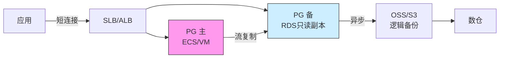
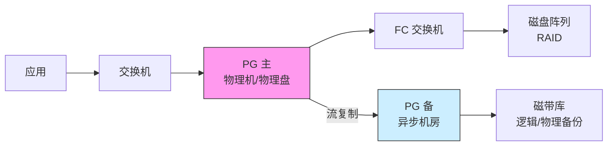
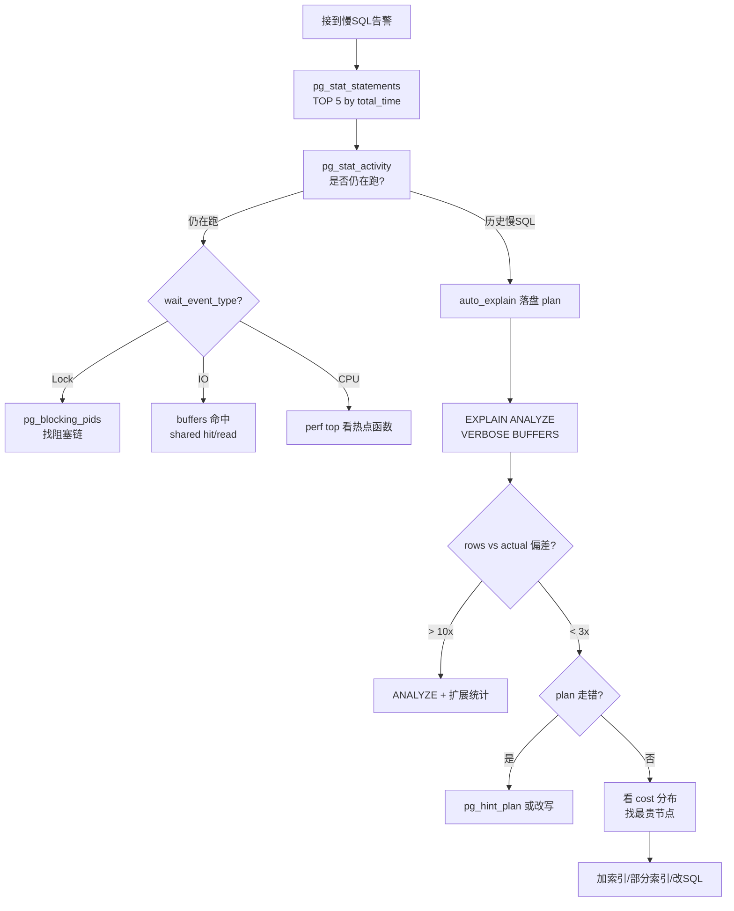

# 一、PostgreSQL 优化

> 本章约 50 分钟。分两段:事前优化(把坑提前堵住) + 事后优化(出问题怎么定位)。
> 风格:工程师之间交流,每个结论都交代前置条件、适用边界、证伪/证明手段。
> 出处粒度:`PG 17 官方文档 / postgresql.conf 注释 / 德哥 20260708_05.md / 德哥 20181203_01.md / PostgreSQL 官方 wiki`。

---

## 0. 优化之前的两件必做功课

在动手改任何参数、SQL、索引之前,先把这两件事搞清楚——后续所有判断都建立在这两件事之上。

### 0.1 了解 workload:OLTP / OLAP / 混合负载

工作负载决定了优化方向。盲调参的最大成本不是浪费时间,而是把 OLTP 的连接池调成 OLAP 的批量模式,或者反过来。

| 维度 | OLTP | OLAP | 混合负载(HTAP) |
|---|---|---|---|
| 典型业务 | 订单/账户/库存/支付 | 报表/数据科学/离线数仓 | 同一实例上跑实时交易 + BI 报表 |
| 单条 SQL 形态 | 短小、高并发、点查/小范围 | 大范围 scan/聚合/排序 | 两者并存 |
| 单事务行数 | 1~几十行 | 百万~亿级 | 混合 |
| 延迟敏感度 | < 100ms 严苛 | 30s~5min 可接受 | 分层 SLA |
| 主要资源瓶颈 | CPU、连接数、行锁 | IO(顺序)、`work_mem`、并行度 | 互相打架 |
| 连接池需求 | 强制(pgbouncer) | 通常直连 | 区分连接池通道 |
| 关键参数 | `random_page_cost=1.1`、`shared_buffers` 大、连接少而精 | `work_mem` 大、`max_parallel_workers_per_gather` 大、关闭连接池 | 资源组隔离 / 分库分实例 |
| 监控侧重 | `pg_stat_activity` 的 active 数、wait_event 锁 | 临时文件、并行 worker、`pg_stat_progress_vacuum` | 两套指标都看 |
| 典型翻车 | 长事务锁全表、OFFSET 分页 | 全表扫到天荒地老、`work_mem` 不够 | 报表查询拖慢 OLTP |

**第一性原理**:OLTP 的核心矛盾是"并发争抢",OLAP 的核心矛盾是"单查询推不动"。优化时如果不分清,把所有 SQL 当作 OLTP 调(连 OLAP 大查询都限制 `work_mem`),你会得到一份平庸的报告;反过来把所有 SQL 当作 OLAP 调(给 OLTP 也开并行),你会得到一个 P99 抖动到无法接受的库。

**前置条件**:业务方能告诉你"日均 QPS、TPS、典型查询返回时间分布"。 **证伪**:如果你调参后发现 P99 改善了但平均 RT 变差、或反过来,大概率是 workload 没分清,把两类 SQL 用了同一份参数模板。

**三种 workload 的关键参数差异**:

```ini
# OLTP(并发高、单事务小)
max_connections = 200
shared_buffers = 16GB
work_mem = 16MB
random_page_cost = 1.1          # SSD/云盘
max_parallel_workers_per_gather = 0  # 不开并行,避免抖动
effective_cache_size = 48GB

# OLAP(并行扫描、批量)
max_connections = 50            # 少连接,业务直连
shared_buffers = 24GB
work_mem = 256MB
max_parallel_workers_per_gather = 12
max_parallel_workers = 16
random_page_cost = 1.1
effective_cache_size = 80GB
jit = on                        # PG 11+ OLAP 强烈建议开启

# 混合(HTAP)—— 实战往往分库或上资源组
max_connections = 500
shared_buffers = 24GB
work_mem = 32MB
max_parallel_workers_per_gather = 4   # 折中
```

**PG 版本注意事项**:`jit` 在 PG 11 引入;`max_parallel_workers_per_gather` 在 PG 9.6 引入,PG 10 增强(支持 gather merge);`enable_partitionwise_aggregate` 在 PG 11 引入(出处:PG 17 官方文档)。

---

### 0.2 了解环境:架构 + 版本

#### 常见架构盘点

**云上架构**:



- **存储**:EBS / 云盘(NVMe-backed 或 SSD-backed)
- **OS**:CentOS / Anolis OS / Ubuntu LTS,内核通常较新
- **数据库**:自建 PG 或 RDS(部分参数被云厂预设,用户不可改)
- **网络**:VPC 内网,主备通常同 AZ,跨 AZ 走专线
- **应用**:同 VPC 多可用区,通过内网域名连接
- **特点**:硬件被云厂抽象掉一部分,出问题先看 IO 抖动和网络丢包;PG 主备切换是云厂托管的

**本地架构(自建机房)**:



- **存储**:本地 NVMe SSD 或集中式存储(FC SAN)
- **OS**:RHEL / CentOS / Rocky Linux,内核版本差异大
- **数据库**:完全自主,所有参数可调
- **网络**:同机房万兆,跨机房专线/裸纤
- **应用**:通过 VIP 或 DNS 切换
- **特点**:对硬件可见可控;但运维复杂,出问题容易定位到硬件

**两种架构下的运维差异**:

| 关注点 | 云 | 本地 |
|---|---|---|
| OS 层调优 | 云镜像已调过,但透明 | 全部要自己来 |
| IO 调度 | `mq-deadline` / `none`(云盘) | `none`(NVMe)/ `deadline`(SSD RAID) |
| 网络 MTU | 1454(VPC 内 GRE) | 9000(Jumbo Frame,内网) |
| 监控 | 云监控 + 自带 PG 视图 | 全部自建(Zabbix/Prom) |
| 高可用 | 云厂 RDS 一键切换 | VIP + keepalived + 自写脚本 |
| 备份 | OSS + 快照 | 磁带 + 异地 |

#### 必清的版本/硬件信息清单

调参前,先把这张清单问清楚:

```bash
# OS
cat /etc/os-release
uname -r
uptime

# 硬件
lscpu | grep -E 'Model name|Core|Thread'
free -h
lsblk -d -o name,rota,size,model          # rota=1 是机械盘
cat /proc/meminfo | head -5

# 文件系统
df -ThT /pgdata
xfs_info /dev/sdb1 | head                 # XFS 才有此命令

# PG
psql -c "SELECT version();"
psql -c "SHOW server_version;"
psql -c "SHOW data_checksums;"
psql -c "SELECT name,setting,unit FROM pg_settings WHERE category LIKE '%Resource%' OR name LIKE '%work_mem%';"
```

**前置条件**:你能拿到这台机器或等价的硬件清单;云上至少能拿到 IOPS 上限、带宽上限。 **证伪手段**:如果你发现性能抖动但 `iostat` 显示 IO 没用满,大概率是云盘 IOPS 限流或带宽打满——这是云环境的"看不见的瓶颈",本地不会遇到。

---

## 一、事前优化

> 事前优化 = 上线前把能踩的坑提前堵住,成本是事后优化的 1/10。

### 1.1 环境优化

#### 1.1.1 SSD 页面对齐(必须做,不做直接损失 30% 性能)

SSD 的物理扇区大小通常是 4K(高级 NVMe 是 4K 或 8K),但历史上操作系统 / 文件系统 / 数据库的默认块大小是 512 字节(模拟扇区)。**不对齐 = 一次逻辑写被拆成两次物理写**。


**正确做法**(Linux):

```bash
# 1. 确认 SSD 的物理扇区大小
lsblk -t /dev/sdb   # 或 cat /sys/block/sdb/queue/physical_block_size
# 通常输出 512(逻辑)/ 4096(物理)

# 2. 分区时用 4K 对齐(现代 parted 自动对齐)
parted -a optimal /dev/sdb mklabel gpt
parted -a optimal /dev/sdb mkpart primary xfs 0% 100%
# parted 默认 alignment 是 1MB,远超 4K,自动对齐

# 3. 文件系统创建时强制 4K 块 + 对齐
mkfs.xfs -f -L /pgdata -d agcount=64 -l size=128m,lazy-count=1 /dev/sdb1
# mkfs.ext4 默认 4K 块,自动对齐

# 4. PG 端 cluster 初始化时,块大小默认 8K,无需额外设置
# 但可以用 blockdev 强制 IO 对齐:
blockdev --setra 4096 /dev/sdb   # readahead
blockdev --setra 0    /dev/sdb   # NVMe 建议关预读(自己会做)
```

**PG 版本说明**:PG 8.4 起 BLCKSZ 默认 8K,适合 SSD 的 4K 物理页(8K 是 4K 的整数倍)。如果用 SSD 物理页是 8K(NVMe 高级型号),同样兼容。

**前置条件**:SSD 真实型号的物理扇区大小已知(=`physical_block_size`)。 **证伪手段**:`fio` 测试顺序写与随机写的性能差异,不对齐时随机写会差 30%~50%。

```bash
# 验证对齐效果
fio --name=randwrite --ioengine=libaio --direct=1 --bs=4k \
    --size=1G --rw=randwrite --filename=/dev/sdb --runtime=30
# 观察 IOPS:对齐后应显著高于未对齐
```

**边界**:
- 机械盘(HDD)对齐意义不大,但也无害。
- ZFS / Btrfs 这类 Copy-on-Write 文件系统,无传统对齐概念,会自动处理。
- LVM / 软件 RAID 上同样需要对齐,从底层往上对齐即可。

---

#### 1.1.2 IO 子系统调度策略

```bash
# 查看当前调度器
cat /sys/block/sdb/queue/scheduler
# 输出示例: [none] mq-deadline kyber bfq
# [] 表示当前生效

# NVMe SSD 推荐
echo none > /sys/block/nvme0n1/queue/scheduler

# SATA SSD 推荐
echo mq-deadline > /sys/block/sdb/queue/scheduler
# 或 none(内核 >= 5.0 推荐)

# 机械盘
echo bfq > /sys/block/sda/queue/scheduler
# 或 deadline(吞吐量优先)

# 队列深度(NVMe 调大,SATA SSD 调小)
echo 1024 > /sys/block/nvme0n1/queue/nr_requests
echo 128  > /sys/block/sdb/queue/nr_requests
```

**第一性原理**:SSD 没有机械磁头寻道,`cfq` / `deadline` 这类为"寻道优化"的调度器反而增加了不必要的调度开销。`none` 让 IO 直接下到设备队列,由 SSD 自带的 FTL(Flash Translation Layer)处理。

**PG 版本说明**:此为 Linux 内核层调优,与 PG 版本无关。但需内核 >= 5.0 才支持 `none` 对 NVMe 的更优调度路径。

**前置条件**:`sysfs` 可写(容器内可能受限);机械盘不要用 `none`。 **证伪手段**:`iostat -x 1` 看 `aqu-sz`(平均队列长度)。调度器配错时 SSD 的 `aqu-sz` 会显著偏高(`> 5`),且 IOPS 远低于设备标称值。

---

#### 1.1.3 Linux OS 内核参数与 ulimit

```ini
# /etc/sysctl.conf
# --- 内存 ---
vm.swappiness = 1               # PG 几乎不希望 swap,默认 60 太高
vm.dirty_ratio = 10             # 脏页达到 10% 内存开始回写
vm.dirty_background_ratio = 5   # 后台回写阈值
vm.dirty_expire_centisecs = 500 # 脏页 5s 内必须回写
vm.overcommit_memory = 2        # 严格分配,避免 OOM
# (设为 2 时,overcommit_ratio 决定可分配上限,默认 50)

# --- 文件系统 ---
fs.aio-max-nr = 1048576         # 异步 IO 上限
fs.file-max = 1000000           # 系统级 fd 上限
fs.nr_open = 1000000            # 单进程 fd 上限

# --- 网络 ---
net.core.somaxconn = 65535      # listen 队列上限,影响 max_connections
net.core.rmem_max = 16777216
net.core.wmem_max = 16777216
net.ipv4.tcp_rmem = 4096 87380 16777216
net.ipv4.tcp_wmem = 4096 65536 16777216
net.ipv4.tcp_max_syn_backlog = 65535
net.ipv4.tcp_tw_reuse = 1       # TIME_WAIT 复用,客户端多连接时有用
net.ipv4.tcp_keepalive_time = 600
net.ipv4.tcp_keepalive_intvl = 30
net.ipv4.tcp_keepalive_probes = 3

# --- 透明大页(THP, 与 PG 的 hugepage 不冲突但要协调)---
# THP 是给普通进程的,PG 用 huge_pages = try,两者不冲突
# 但 THP 在数据库场景争议大,某些场景会卡顿,生产建议关闭
echo never > /sys/kernel/mm/transparent_hugepage/enabled
echo never > /sys/kernel/mm/transparent_hugepage/defrag
```

```bash
# /etc/security/limits.conf
# PG 用户硬限制
postgres  soft  nofile  655360
postgres  hard  nofile  655360
postgres  soft  nproc   65536
postgres  hard  nproc   65536
postgres  soft  memlock unlimited
postgres  hard  memlock unlimited   # hugepage 必需
postgres  soft  stack   unlimited
postgres  hard  stack   unlimited

# 验证
su - postgres -c "ulimit -n"
```

**PG 版本说明**:PG 11+ 在 `postgresql.conf` 里调 `max_files_per_process` 配合上面的 nofile;PG 13+ 新增 `huge_pages = try` 选项(默认 try,出处:postgresql.conf 注释)。

**前置条件**:有 root 权限改 `/etc/sysctl.conf` 和 `/etc/security/limits.conf`;云上需要云厂支持。 **证伪手段**:重启后 `sysctl vm.swappiness` 应该返回 1;PG 用户登录 `ulimit -n` 应该看到 655360。

---

#### 1.1.4 Huge Page(大页)

**原理**:x86 默认页大小 4K,大页通常是 2MB(NUMA 下也可能 1GB)。PG 的 `shared_buffers` 是连续大块内存,使用大页可显著减少 TLB miss,提升性能 5%~15%(出处:德哥 [《PostgreSQL Huge Page 使用建议》](https://github.com/digoal/blog/blob/master/201803/20180325_02.md))。

```bash
# 1. 计算所需大页数
# shared_buffers = 16GB, 假设 Hugepage size = 2MB
# 16GB / 2MB = 8192 页
echo $((16 * 1024 / 2))   # 8192

# 2. 配置大页数(临时)
sysctl -w vm.nr_hugepages=8192

# 3. 永久配置
echo "vm.nr_hugepages=8192" >> /etc/sysctl.conf
sysctl -p

# 4. 检查是否足够(检查 Free 列是否 >= 8192)
cat /proc/meminfo | grep -i huge
# HugePages_Total:    8192
# HugePages_Free:     8192
# HugePages_Rsvd:        0
# HugePages_Surplus:      0
# Hugepagesize:       2048 kB

# 5. PG 配置
# postgresql.conf
huge_pages = try    # on/off/try, 默认 try(找不到大页就回退到 4K 页)
```

**PG 版本说明**:PG 9.4 起支持 huge page;PG 13 起 `huge_pages = try` 为默认值(出处:postgresql.conf 注释)。

**前置条件**:
- 内核启用 CONFIG_HUGETLB_PAGE
- 启动 PG 用户的 `memlock` ulimit 设为 unlimited
- `shared_buffers` 越大,使用大页收益越明显(德哥建议超过 32GB 时强烈启用)

**证伪手段**:PG 启动日志 `grep -i huge /var/log/postgresql/*` 应能看到 " HugeTLB registered";或运行时 `cat /proc/$(pidof postgres)/smaps | grep -i huge | head -3` 看到 anon hugepages。

**边界**:
- VM 内的"嵌套大页"性能提升有限,但无害。
- NUMA 机器上建议绑核 + 大页同时使用。
- `huge_pages = off` 时 PG 用 4K 普通页,适合内存 < 8GB 的小实例。

---

#### 1.1.5 块设备条带化(RAID / LVM)

**目的**:把顺序 IO 打散到多块物理盘,提高聚合 IOPS 与带宽。

```bash
# --- 软件 RAID 10(数据库首选)---
# 4 块 SSD 做 RAID 10
mdadm --create /dev/md0 --level=10 --raid-devices=4 /dev/sd[b-e]
# 注意 chunk size:对 SSD,建议 64K~256K
mkfs.xfs -f -d su=64k,sw=2 -l su=64k /dev/md0

# --- 查看 chunk 大小 ---
mdadm -D /dev/md0 | grep -i 'chunk'

# --- 硬件 RAID ---
# 由存储厂商提供,通常默认 64K~256K,数据库场景合适
# 问存储工程师要 chunk size / stripe size
```

**条带大小与 PG 块大小的关系**:

| PG `BLCKSZ` | 推荐 RAID chunk | 推荐文件系统块 |
|---|---|---|
| 8K(默认) | 64K(8 倍) | 4K |
| 16K | 128K | 4K |
| 32K | 256K | 4K |

**PG 版本说明**:BLCKSZ 在编译期确定(`./configure --with-blocksize=16`);PG 11+ 默认 8K。

**前置条件**:至少 2 块 SSD 做 RAID 1 或 RAID 10;条带大小对齐 PG 块大小的整数倍。 **证伪手段**:`fio` 测试 8K 随机写,IOPS 应接近 N × 单盘 IOPS(R10 损失一半)。

**边界**:
- RAID 5/6 不推荐用于数据库(写惩罚大,rebuild 慢)。
- NVMe 单盘 IOPS 已达 50 万+,小库无需 RAID 0,但仍建议 RAID 1 防单盘故障。
- 云盘(EBS / 云盘)云厂内部已做 RAID,无需再做。

---

#### 1.1.6 文件系统选择与对齐

**推荐顺序**:

| 文件系统 | 推荐度 | 备注 |
|---|---|---|
| **XFS** | ★★★★★ | RHEL/CentOS 默认,大文件/高并发优秀,PG 官方推荐 |
| **ext4** | ★★★★ | 通用稳定,但默认日志模式性能不如 XFS |
| **ZFS** | ★★★ | Copy-on-Write,需关闭 PG 的 `full_page_writes` |
| **Btrfs** | ★★ | 实验性,生产慎用 |

```bash
# XFS 推荐挂载选项(/etc/fstab)
UUID=xxx  /pgdata  xfs  defaults,noatime,nodiratime,allocsize=16m,logbufs=8,logbsize=256k  0 0
# noatime: 不更新访问时间,减少元数据 IO
# allocsize=16m: 大块预分配,匹配 PG 的预写策略

# ext4 推荐
UUID=xxx  /pgdata  ext4  defaults,noatime,data=writeback,barrier=1,nobh  0 0
# data=writeback: 牺牲一点点一致性换性能
```

**PG 版本说明**:PG 对文件系统无特殊依赖,所有主流 FS 都支持。

**前置条件**:XFS 项目大小限制 8EB,ext4 限制 1EB,都远超 PG 单库容量需求。 **证伪手段**:`mount | grep /pgdata` 看挂载选项是否生效;`xfs_info /dev/sdb1` 看 XFS 内部块大小。

**boundary(边界)**:
- ZFS 需要专门调 `recordsize=16K` 匹配 PG 块,且 `full_page_writes = off`(ZFS 原子写保证一致性,出处:20181203_01.md 注释)。
- 容器场景(`/var/lib/docker` overlay2)下不建议 PG 直接跑在 overlay 文件系统上。

---

### 1.2 数据库参数优化

> 以下公式均出自德哥 20181203_01.md《PostgreSQL 11 postgresql.conf 参数模板 - 珍藏级》,公式含义已用工程师语言重述。

**一个总原则**:大多数参数不要"凭感觉"设,要按公式算。PG 出厂默认参数是 1990 年代的内存/磁盘场景,直接套到 SSD + 256GB 内存的机器上必出问题。

#### 1.2.1 连接类

```ini
# --- 监听 ---
listen_addresses = '0.0.0.0'        # 多网卡监听
port = 1921                          # 改默认 5432 减扫描攻击

# --- 最大连接 ---
# max_connections 公式:物理内存(GB) × 1000 × (1/4) / 5
# 假设 64GB 内存 → 64 × 1000 × 0.25 / 5 = 3200
max_connections = 2000               # 保守值,生产建议配 pgbouncer 后端
superuser_reserved_connections = 10  # 预留 10 个给 superuser 应急

# --- TCP 心跳(应对中间网络设备超时)---
tcp_keepalives_idle = 60
tcp_keepalives_interval = 10
tcp_keepalives_count = 10
```

**PG 版本说明**:`password_encryption = scram-sha-256` 是 PG 10 引入,取代 md5(更安全但与 md5 不兼容);`max_connections` 上限理论值 262143,实际受 `max_locks_per_transaction × max_connections` 等限制(出处:PG 17 官方文档 Server Configuration)。

**前置条件**:了解 PG 主机的物理内存。 **证伪手段**:应用连接报错"FATAL: too many clients" → 检查 `max_connections` 与当前 `pg_stat_activity.numbackends`。

---

#### 1.2.2 内存类

```ini
# --- shared_buffers ---
# 公式:使用 hugepage 时 = 物理内存 × 1/4
#       否则 = min(32GB, 物理内存 × 1/4)
shared_buffers = 16GB                # 64GB 内存的 1/4
huge_pages = try                     # 见 1.1.4

# --- work_mem(每算子,不是每查询)---
# 公式:max(min(物理内存/4096, 64MB), 4MB)
# 64GB / 4096 = 16MB, 64GB/4096=16MB < 64MB, 取 16MB
work_mem = 16MB
# 注意:一条 query 中多个 sort/hash 节点可各占一份 work_mem,实际可能 ×N

# --- maintenance_work_mem(VACUUM/CREATE INDEX 等)---
# 公式:min(8GB, 物理内存 × 1/8 / max_parallel_maintenance_workers)
# 64GB × 1/8 / 6 ≈ 1.3GB, 取 1GB
maintenance_work_mem = 1GB

# --- autovacuum_work_mem(每个 worker 的 dead tuple ctid 缓存)---
# 公式:min(8GB, 物理内存 × 1/8 / autovacuum_max_workers)
# 64GB × 1/8 / 8 = 1GB
autovacuum_work_mem = 1GB            # PG 13+ 引入,旧版本用 maintenance_work_mem

# --- 临时缓冲区(per session)---
#temp_buffers = 8MB                 # 默认即可,大表临时查询可调大

# --- effective_cache_size(给规划器的提示,非实际分配)---
# 公式:物理内存 × 0.75
# 64GB × 0.75 = 48GB
effective_cache_size = 48GB
```

**PG 版本说明**:`autovacuum_work_mem` 是 PG 13 引入,PG 13 之前用 `maintenance_work_mem` 兼用(出处:PG 17 官方文档 / postgresql.conf 注释)。

**第一性原理**:`shared_buffers` 是 PG 的"内部缓存",Linux Page Cache 是"系统缓存"。两者是叠加关系,不是替代。`shared_buffers` 设太大(> RAM 1/2)反而会引发 `LWLock:buffer_mapping` 争用——这是 PG 16 才显著优化的老问题。

**前置条件**:知道机器物理内存;hugepage 已配(见 1.1.4)。 **证伪手段**:`pg_stat_database.blks_hit / (blks_hit + blks_read)` 看命中率,正常应在 95%+(OLTP),大表冷启瞬间除外(详见 20260708_05.md §3.1)。

---

#### 1.2.3 WAL 与检查点类

```ini
# --- WAL 级别 ---
wal_level = replica                  # 物理流复制必须
# logical: 逻辑复制/订阅(影响性能 ~5%)

# --- 同步提交 ---
# OLTP 高并发写 + 磁盘 IO 瓶颈 → off,配合 commit_delay 实现分组提交
synchronous_commit = off             # on / off / remote_write / remote_apply
# 注意:off 最多丢失 ~3 × wal_writer_delay 时间的数据

# --- WAL 写入 ---
wal_buffers = 16MB                   # 公式:min(16MB, shared_buffers/32)
wal_writer_delay = 10ms              # 配合 synchronous_commit=off
wal_writer_flush_after = 1MB
wal_compression = on                 # PG 9.5+,减少 FPW 写盘量
full_page_writes = on                # 不要关,除非 ZFS

# --- 分组提交 ---
commit_delay = 10                    # 微秒,0~100000
commit_siblings = 5                  # 至少 5 个并发提交才走分组

# --- 检查点 ---
checkpoint_timeout = 30min           # 30s~1d,频繁 checkpoint 会写大量 FPW
# max_wal_size 公式:min(shared_buffers × 2, 用户存储空间 / 10)
max_wal_size = 32GB
# min_wal_size 公式:min(shared_buffers / 2, 用户存储空间 / 10)
min_wal_size = 8GB
checkpoint_completion_target = 0.2   # SSD 设小(快速结束),HDD 设 0.5~0.9
checkpoint_flush_after = 256kB       # 一次刷盘的字节数
log_checkpoints = on                 # 必须开,出问题排查靠它
```

**PG 版本说明**:`wal_compression` 在 PG 9.5 引入(`pg_lzcompress` 算法),PG 15 改用 LZ4(性能更好);`full_page_writes` 在 PG 8.0 起为默认;`max_wal_size` 在 PG 8.5 引入(出处:PG 17 官方文档)。

**前置条件**:磁盘为 SSD;PG 已用 `initdb -k`(启用 checksum)。 **证伪手段**:`SELECT * FROM pg_stat_bgwriter;` 看 `checkpoints_req` 与 `checkpoints_timed` 的比值。`checkpoints_req` 远大于 `checkpoints_timed` = 雪崩式 checkpoint,要加大 `max_wal_size`。

**synchronous_commit 边界**:
- `on`(默认):完全 ACID,每次 commit 都 fsync,丢 0 字节。
- `off`:最多丢 `wal_writer_delay × wal_writer_flush_after` 的数据(通常几毫秒 ~ 几十毫秒)。
- `remote_write`:同步到备机的 OS 缓存,不刷盘(可用性高,RPO 损失备机缓存)。
- `remote_apply`:同步到备机 apply,RPO = 0。
- **多副本场景**:`synchronous_standby_names = 'ANY 1 (s1, s2)'` 配合 `remote_apply`(PG 10+ 支持 ANY 语法)。

---

#### 1.2.4 复制类

```ini
# --- 主库端 ---
max_wal_senders = 64                 # 同时允许多少个流复制客户端
max_replication_slots = 64          # 与 max_wal_senders 一致
# synchronous_standby_names = 'ANY 1 (s1, s2, s3)'   # 多副本强同步

# --- 备库端 ---
hot_standby = on                     # 允许备库读
hot_standby_feedback = off           # 重要:关掉,否则主库无法回收 WAL
# 开了 feedback:备机长查询 → 主库保留 xmin 之前的 WAL → 主库膨胀
max_standby_archive_delay = 120s    # 备库长查询最多被打断 120s
max_standby_streaming_delay = 120s  # 同上,流式 replay
wal_receiver_status_interval = 1s   # 心跳频率
```

**PG 版本说明**:`synchronous_standby_names` 的 `ANY n` 语法在 PG 10 引入;`write_lag/flush_lag/replay_lag` 三段式在 PG 10 引入(出处:PG 17 官方文档 [Monitoring](https://www.postgresql.org/docs/17/monitoring-stats.html))。

**前置条件**:有备机部署规划;决定 RPO(0 / 几秒 / 几十秒)。 **证伪手段**:`SELECT * FROM pg_stat_replication;` 看 `write_lag`、`flush_lag`、`replay_lag` 三者是否都在阈值内;若全 NULL,大概率 replication slot 异常或网络断。

**hot_standby_feedback 边界**:
- 开着:备机读不会被打断,但主库 WAL 不能及时回收。
- 关着:备机长查询会被 cancel(按 `max_standby_*_delay`),主库 WAL 正常回收。
- **生产建议**:关闭 `hot_standby_feedback`,在备库侧用 `statement_timeout` 控长查询(出处:德哥 [《PostgreSQL 物理"备库"的哪些操作或配置,可能影响"主库"的性能》](https://github.com/digoal/blog/blob/master/201704/20170410_03.md))。

---

#### 1.2.5 日志与监控类

```ini
# --- 日志格式 ---
log_destination = 'csvlog'           # PG 8.3+,ELK 友好
logging_collector = on
log_directory = 'log'
log_filename = 'postgresql-%H.log'   # 每小时切换
log_rotation_age = 1h
log_rotation_size = 1GB              # 单文件超过 1G 强制切
log_truncate_on_rotation = on

# --- 慢 SQL ---
log_min_duration_statement = 5s      # > 5s 的 SQL 落到日志
log_lock_waits = on                  # 锁等待 > deadlock_timeout 时记录

# --- 错误 ---
log_error_verbosity = verbose        # 包含 SQLSTATE + 源码位置
log_statement = 'ddl'                # 'none'/'ddl'/'mod'/'all'

# --- 临时文件(大查询标记)---
log_temp_files = 256MB               # 使用 > 256MB 临时文件的 SQL 记录

# --- 统计开关(详见 20260708_05.md §2.2)---
track_activities = on
track_counts = on
track_io_timing = on                 # PG 8.2+,IO 耗时统计
track_functions = 'pl'               # 'none'/'pl'/'all'
compute_query_id = on                # PG 13+,query_id 关联桥梁
shared_preload_libraries = 'pg_stat_statements,auto_explain'

# --- pg_stat_statements ---
pg_stat_statements.max = 5000        # 跟踪 SQL 数
pg_stat_statements.track = top       # 'top'/'all'/'none'
pg_stat_statements.track_utility = off  # 不跟踪简单 utility 命令

# --- auto_explain ---
auto_explain.log_min_duration = '3s'
auto_explain.log_analyze = on
auto_explain.log_buffers = on
auto_explain.log_format = 'json'     # PG 10+,JSON 便于 ELK 解析
auto_explain.sample_rate = 1         # 大流量库降到 0.01~0.1
```

**PG 版本说明**:`compute_query_id` 是 PG 13 引入(默认 on);`track_io_timing` 是 PG 8.2 引入;`auto_explain.log_format = json` 是 PG 10 引入(出处:postgresql.conf 注释)。

**前置条件**:`shared_preload_libraries` 修改需重启实例。 **证伪手段**:`SELECT pg_reload_conf();` 后查 `pg_stat_activity` 应能看到 DDL 日志;运行慢 SQL 触发 `auto_explain` 落盘。

---

#### 1.2.6 Autovacuum 类

```ini
autovacuum = on                     # 默认 on,但生产常被误关!
log_autovacuum_min_duration = 0     # 记录所有 autovacuum

# autovacuum_max_workers 公式:max(min(8, CPU核数/2), 5)
autovacuum_max_workers = 8          # 64GB 机器、16 核,取 8

# 默认 scale_factor 太大(0.2),大表等到 20% 才触发
autovacuum_vacuum_scale_factor = 0.02   # 2% 触发 vacuum
autovacuum_analyze_scale_factor = 0.01  # 1% 触发 analyze

autovacuum_vacuum_cost_delay = 0    # SSD 场景关掉,防止 vacuum 太慢
autovacuum_vacuum_cost_limit = 10000

# anti-wraparound 防护
autovacuum_freeze_max_age = 1200000000  # 默认 2 亿,生产建议调大到 12 亿
# 但调大后要自己承担 xid 回卷风险监控
```

**PG 版本说明**:`autovacuum_work_mem` 是 PG 13 引入;`vacuum_cleanup_index_scale_factor` 是 PG 11 引入,用于降低 vacuum 后期 index scan 概率(出处:PG 17 官方文档)。

**前置条件**:SSD 磁盘;长事务已治理(详见 1.4.5 与 2.4)。 **证伪手段**:`SELECT n_live_tup, n_dead_tup, n_mod_since_analyze, last_autovacuum, last_autoanalyze FROM pg_stat_user_tables ORDER BY n_dead_tup DESC LIMIT 10;` 看 dead tuple 比例与触发频率。

**autovacuum 边界**:见 2.5 膨胀处理,事前能把 `autovacuum_vacuum_scale_factor` 调到 0.02 比事后处理膨胀便宜 10 倍。

---

### 1.3 连接池配置优化

> 没有连接池的 PG,就是没有蓄水池的水电站——峰值来时直接干涸。

#### 1.3.1 生命周期管理


#### 1.3.2 三种 Pool Mode 对比

| 模式 | 后端连接释放时机 | 兼容性 | 性能 |
|---|---|---|---|
| **session** | 客户端断开连接时 | 100% 兼容 | 最低 |
| **transaction** | 事务 COMMIT/ROLLBACK 后 | 不能用 session-level SET/temp table/prepared statement | 高 |
| **statement** | 每条 SQL 执行完 | 不能跨语句事务 | 最高 |

**生产推荐**:绝大多数场景用 **transaction 模式**,这是性能与兼容性的最佳平衡点。

#### 1.3.3 pgbouncer 配置示例

```ini
# /etc/pgbouncer/pgbouncer.ini
[databases]
mydb = host=127.0.0.1 port=1921 dbname=mydb
* = host=/var/run/postgresql

[pgbouncer]
listen_addr = 0.0.0.0
listen_port = 6432
auth_type = scram-sha-256          # 与 PG 端一致
auth_file = /etc/pgbouncer/userlist.txt

# --- 关键:前后端配比 ---
# pool_size:每个 (user, db) 对的最大后端连接数
# max_client_conn:前端最大连接数(应用总并发)
# reserve_pool:突发预留
# 经验公式:pool_size = CPU核数 × 2 ~ 4
pool_size = 40                     # 16 核机器,后端 40 个连接
max_client_conn = 4000              # 前端 4000 应用连接
reserve_pool_size = 5
reserve_pool_timeout = 3

# --- 生命周期 ---
server_idle_timeout = 600          # 空闲后端连接 10 分钟回收
client_idle_timeout = 0            # 前端不超时
query_timeout = 0                  # 不设全局超时,业务层控
client_login_timeout = 60
server_connect_timeout = 15
server_lifetime = 3600             # 后端连接 1 小时强制重连,防内存泄漏
server_lifetime_reset = 0          # 1 小时只算一次,非每事务重置

# --- 模式 ---
pool_mode = transaction
ignore_startup_parameters = extra_float_digits, application_name, search_path
# transaction 模式下,session-level SET 在事务之间失效
# 把可忽略的 startup parameter 列出来,提升兼容性
```

**PG 版本说明**:`ignore_startup_parameters` 是 pgbouncer 1.8+ 引入;`server_lifetime_reset` 是 pgbouncer 1.21+ 引入。

**前置条件**:
- 前端应用是 web/微服务/批处理,且**能复用连接**(即不是每次请求都重连)。
- 业务**不在事务里做长时间操作**(长事务会把后端连接占死,导致连接池打满)。
- 不能用 `LISTEN/NOTIFY`(事务模式会切断)。

**证伪手段**:`pgbouncer -h 127.0.0.1 -p 6432 -R pgbouncer` 登录管理端口:

```sql
-- pgbouncer 管理控制台
SHOW POOLS;
-- 看到 cl_waiting > 0 持续 = 前端在等连接,需加 pool_size
-- 看到 cl_waiting 飙到上限 = 后端连接不够,前端被堵

SHOW STATS;
-- xact_count / query_count / bytes_received 增长速率
-- server_lifetime 接近上限时观察连接数是否平稳

SHOW SERVERS;
-- 看每个连接的 age、user、database、addr
```

**前后端配比经验**:
- OLTP 高并发 web 应用:前端 2000~4000,后端 30~50(典型比 50:1~100:1)
- 中等并发:前端 500,后端 50(10:1)
- 长事务 / 复杂事务:前端 100,后端 50(2:1)——后端比例要高
- 关键:**前端的"应用总并发"才是真实负载**,后端只承接"瞬时在跑的事务"

---

### 1.4 业务优化

#### 1.4.1 表设计 / 数据类型 / 索引

**字段类型选择原则**(业界共识,出处:德哥多份讲义):

| 业务场景 | 推荐类型 | 不推荐 | 原因 |
|---|---|---|---|
| 主键 | `bigint` / `uuid v7` | `int`(易耗尽)/ `uuid v4`(索引分裂) | bigint 8 字节够用;uuid v7 时间有序,索引插入不分裂 |
| 金额 | `numeric(20,2)` | `float8` | float 有精度问题,财务报表不能容忍 |
| 时间 | `timestamptz` | `timestamp` | timestamptz 带时区,跨时区业务安全 |
| 状态/枚举 | `smallint` + CHECK,或 PG 原生 `enum` | `varchar` | smallint 2 字节,比 varchar 快 10x |
| JSON | `jsonb` | `json` / `text` | jsonb 支持索引(gin),json 是文本 |
| 短文本(姓名/标题) | `varchar(N)` | `text` | varchar 限制长度,避免业务意外写超长 |
| 布尔 | `boolean` | `smallint` 模拟 | boolean 1 字节,语义清晰 |
| 标签/数组 | `text[]` + GIN | 多对多关联表 | 简单场景下 text[] 性能足够 |

**主键设计的代价**:
- 自增 bigint:插入性能最佳,但暴露业务量,易被爬。
- UUID v4(随机):完全不可猜,但插入导致索引 page 随机写,BTree 频繁分裂。
- **UUID v7(PG 17 新支持)**:时间有序,既有 v4 的不可猜性,又避免索引分裂——PG 17 引入了 `uuidv7()` 函数(出处:PG 17 官方文档)。

**索引设计四原则**:

1. **选择合适的索引类型**

| 索引类型 | 适用场景 |
|---|---|
| B-Tree | 等值 + 范围 + 排序(默认,80% 场景) |
| Hash | 仅等值查询(PG 11+ WAL logged,生产可用) |
| GIN | 数组、jsonb、全文检索(`tsvector`) |
| GiST | 几何、范围类型、全文检索 |
| BRIN | 线性存储数据(时序、append-only 表) |
| Bloom(PG 10+) | 多列任意组合查询 |
| partial index | 高频查询条件稳定(如 `WHERE status='active'`) |

2. **复合索引列顺序:高选择性 + 常用等值列在前**

```sql
-- 业务高频: WHERE tenant_id = ? AND status = 'active' ORDER BY created_at DESC
CREATE INDEX idx_orders_tenant_status_created ON orders(tenant_id, status, created_at DESC);
-- tenant_id 高基数,status 低基数但稳定,放前面
-- created_at DESC 让排序直接用索引顺序,免排序
```

3. **覆盖索引减少回表**

```sql
-- INCLUDE(PG 11+):把常用 select 列塞进索引,做 Index Only Scan
CREATE INDEX idx_orders_cover ON orders(tenant_id, status) INCLUDE (id, total, created_at);
```

4. **不要建"以防万一"的索引**

```sql
-- 找出未使用的索引(详见 2.4 节)
SELECT schemaname||'.'||relname tbl, indexrelname idx,
       pg_size_pretty(pg_relation_size(indexrelid)) size, idx_scan
FROM pg_stat_user_indexes WHERE idx_scan = 0
ORDER BY pg_relation_size(indexrelid) DESC;
```

**PG 版本说明**:`INCLUDE` 非主键列在 PG 11 引入;`uuidv7()` 函数在 PG 17 引入;Hash 索引 WAL logged 在 PG 11 引入(出处:PG 17 官方文档)。

---

#### 1.4.2 SQL 书写方式

**核心原则**(出自德哥讲义,1.pdf P.121-188):

1. **禁止 `SELECT *`**——选 N 列 vs 选 1 列,后者走窄索引就够,前者可能回表。
2. **避免 `OFFSET` 大分页**——`LIMIT 20 OFFSET 1000000` 要扫 100 万 + 20 行(详见 20260708_05.md §5.1)。
3. **`= ANY(ARRAY)` vs `IN`**:参数化用 ANY,子查询用 IN / EXISTS(详见 20260708_05.md §1.3)。
4. **模糊查询**:前缀走 BTree,后缀用 `reverse(col)` 表达式索引,包含用 `pg_trgm` GIN。
5. **大批量写用 COPY 替代 INSERT VALUES**——单条 INSERT 是 10x~100x 慢(详见 20260708_05.md §5.9)。
6. **count(distinct) 别直接用**——超过 1 亿行无法秒回,改用部分索引、Index Only Scan 或 HLL 估算。
7. **慎用 `IN (subquery)` 改写为 JOIN**——某些版本下 Planner 不会自动优化,需要显式 JOIN。
8. **避免在 WHERE 中对字段做函数**:`WHERE date(create_time) = '2026-07-09'` 走不了索引,改 `WHERE create_time >= '2026-07-09' AND create_time < '2026-07-10' + interval '1 day'`。

**EXPLAIN 阅读心法**(详见 20260708_05.md §1.1):

```sql
EXPLAIN (ANALYZE, VERBOSE, BUFFERS, TIMING, COSTS, SETTINGS, FORMAT TEXT)
SELECT * FROM orders WHERE tenant_id = 42 AND status = 'active' ORDER BY id DESC LIMIT 20;
```

- 5 个常见坑:cost ≠ 实际、rows 估算偏差、ANALYZE 真的执行、Hash Batches > 1、Bitmap Rows Removed 大。
- 第一性原理:**cost 是估算、actual 才是真相**。

---

#### 1.4.3 事务长短

**事务短的边界**:

| 业务操作 | 推荐事务时长 | 风险 |
|---|---|---|
| 单条 INSERT/UPDATE | < 10ms | 无 |
| 批量写入(1000 行) | < 100ms | 注意 WAL 增长 |
| 报表聚合查询 | < 5min | 注意临时文件 |
| 长事务(> 5min) | 严禁 | 阻 vacuum、阻 2PC 提交、阻 WAL 回收 |

**长事务危害链**(德哥反复强调):

```
长事务
  ↓ 持锁
其他事务等待
  ↓
autovacuum 无法回收 dead tuple(等长事务的 xmin 走)
  ↓
表/索引膨胀
  ↓
慢查询
  ↓
雪崩
```

**预防参数**:

```ini
# postgresql.conf 或业务层 SET LOCAL
statement_timeout = '30s'                   # 单语句超时,OLTP 推荐
lock_timeout = '5s'                        # 等锁超时,防雪崩
idle_in_transaction_session_timeout = '10min'  # 空闲事务超时
deadlock_timeout = '1s'                    # 死锁检测
```

**DDL 必须加 `lock_timeout`**:

```sql
-- 防雪崩:大表 ADD COLUMN 卡所有 DML
BEGIN;
SET LOCAL lock_timeout = '100ms';
ALTER TABLE huge_table ADD COLUMN new_col int;
COMMIT;
```

**前置条件**:业务方能评估"正常事务时长"和"异常事务时长"。 **证伪手段**:`pg_stat_activity` 里 `state = 'idle in transaction' AND now() - state_change > interval '5min'` 应为空。

---

#### 1.4.4 异步 / 同步 / 批量 / 分组提交

**4 种提交策略对比**:

| 策略 | 配置 | RPO | TPS | 适用 |
|---|---|---|---|---|
| 同步提交 | `synchronous_commit = on` | 0 | 基线 | 强一致场景(金融) |
| 异步提交 | `synchronous_commit = off` | ~3 × wal_writer_delay | +20%~50% | 可容忍几毫秒丢失 |
| 分组提交 | `commit_delay + commit_siblings` | 0 | +30%~80%(并发高时) | 高并发短事务 |
| 批量提交 | 业务代码:1000 行 1 个事务 | 0 | +10x~100x | ETL、批量导入 |

**异步提交实战**:

```sql
-- 业务代码里(Go/Python/Java 均可)
SET LOCAL synchronous_commit = off;  -- 仅当前事务生效
INSERT INTO orders (...) VALUES (...);
-- COMMIT; -- 写完成后,事务提交不 fsync,后台 wal_writer 异步刷
```

**分组提交实战**:

```ini
# postgresql.conf
synchronous_commit = on
commit_delay = 10              # 微秒,等 10μs 看有没有"兄弟"
commit_siblings = 5            # 至少 5 个并发提交才走分组
```

**第一性原理**:`commit_delay` 是让后台 commit 进程"等一会",看有没有其他事务也准备提交——如果有,合并 fsync(一次盘 IO 替 5 次)。`commit_siblings` 防止低并发时延迟。

**PG 版本说明**:`synchronous_commit` 选项中的 `remote_write` 在 PG 10 引入;`remote_apply` 在 PG 9.6 引入(出处:postgresql.conf 注释)。

**前置条件**:业务能容忍 RPO;批量提交不会阻塞其他事务。 **证伪手段**:`pg_stat_database.xact_commit` 增长速率(commit 数),与 `pg_stat_wal.wal_bytes` 增长速率(写盘字节数),异步提交时两者的比例应该显著提升。

---

#### 1.4.5 OFFSET 优化 / 分区表 / 超时设置

**OFFSET 优化(基于 keyset 的条件分页)**:

```sql
-- 反模式:深翻页慢
SELECT * FROM orders ORDER BY id LIMIT 20 OFFSET 1000000;
-- Planner 必须先排好前 1000020 行再扔掉 100 万

-- 正解:把 OFFSET 换成"上次最后一条的 id"
SELECT * FROM orders WHERE id > $last_seen_id ORDER BY id LIMIT 20;
-- 走索引,稳定 < 5ms

-- 多列排序 + 防同值
SELECT * FROM orders
WHERE tenant_id = $1 AND status = 'active'
  AND (created_at, id) > ($last_seen_time, $last_seen_id)
ORDER BY created_at, id LIMIT 20;
-- 索引 (tenant_id, status, created_at, id)
```

**分区表选型**:

| 场景 | 推荐方案 | 原因 |
|---|---|---|
| 业务已按时间分库分表 | 业务分区(应用层路由) | 解耦彻底 |
| 单库按月/按区域分 | PG 内置分区(`PARTITION BY RANGE/HASH/LIST`) | PG 10+ 成熟 |
| 时序数据、按设备分 | 内置分区 + BRIN | 写入顺序、查询带分区键 |
| 全球部署 | 内置分区 + FDW(跨节点) | PG 12+ FDW 性能显著提升 |

**PG 内置分区关键参数**:

```ini
# postgresql.conf
enable_partitionwise_join = on       # PG 11+,跨分区 JOIN
enable_partitionwise_aggregate = on # PG 11+,跨分区聚合
# 大表分区多(> 100)时,partition pruning 一定要开
enable_partition_pruning = on       # PG 11+ 默认 on
constraint_exclusion = partition    # 老版本必要
```

**超时设置(防雪崩三大件)**:

```ini
# postgresql.conf(全局)
statement_timeout = '30s'                  # 兜底超时
lock_timeout = '5s'                       # 等锁超时
idle_in_transaction_session_timeout = '10min'  # 防连接泄漏

# 业务层(细粒度)
-- 用户登录后,根据业务 SLA 设定
SET LOCAL statement_timeout = '5s';   -- API 类
SET LOCAL statement_timeout = '5min'; -- 报表类
```

**前置条件**:
- OFFSET 优化:必须有稳定的排序键。
- 分区表:分区键必须出现在所有查询的 WHERE 中(否则不会 prune)。
- 超时设置:业务方明确给出"SLA 是多少秒"。

**证伪手段**:
- OFFSET 优化:翻第 1000 页时 RT 仍 < 5ms。
- 分区表:`EXPLAIN (ANALYZE)` 看是否有 `Partition Pruning` 提示。
- 超时设置:`pg_stat_activity` 里 `state = 'active' AND now() - query_start > '30s'` 应为 0。

---

## 二、事后优化

> 事后优化 = 已经出问题,怎么快速止血 + 定位根因。本节每条都给出"第一步看什么"。

### 2.1 擒贼先擒王:TOP SQL / EXPLAIN / 索引 / 改写 / 统计信息

> 这一段浓缩了 20260708_05.md §1.1-1.4 + §2.4 + §3 的精华。

#### 2.1.1 工作流(分层漏斗)



**核心原则**(出处:PG 官方 wiki [Performance Optimization](https://wiki.postgresql.org/wiki/Performance_Optimization)):
- **擒贼先擒王**:优化 `total_time` 占比最大的 SQL,而不是优化你看不顺眼的那条。
- **观测先行**:必开 `log_lock_waits`、`track_io_timing`、`log_min_duration_statement`、`auto_explain.log_min_duration` 四个参数。
- **不要相信 cost,要看 actual**。

---

#### 2.1.2 三步走:定位 → 诊断 → 治理

**第一步:抓样本**

```sql
-- 擒贼先擒王
SELECT substring(query, 1, 80) AS sql,
       calls, round(total_exec_time::numeric, 2) AS total_ms,
       round(mean_exec_time::numeric, 2) AS mean_ms,
       rows, shared_blks_hit + shared_blks_read AS total_blks
FROM pg_stat_statements
ORDER BY total_exec_time DESC LIMIT 10;
```

**第二步:看 EXPLAIN**

```sql
EXPLAIN (ANALYZE, VERBOSE, BUFFERS, TIMING, SETTINGS, FORMAT TEXT)
SELECT ... -- 把上一步抓到的 SQL 原文贴进来
```

七步读法(详见 20260708_05.md §4.3):
1. **抓样本**:`pg_stat_statements` 排序
2. **看类型**:Seq Scan / NestLoop / Hash Join / Sort
3. **看估算**:`rows=` 与 actual 偏差
4. **看 buffer**:`shared hit` 比例
5. **看 actual time**:`actual.end × loops` = 真耗时
6. **看 SETTINGS**:实际生效的优化器参数
7. **看 filter / recheck**:`Removed by Filter` 多 = 索引选错列

**第三步:治理**

按"投入产出比"排序的治理手段:

| 手段 | 成本 | 收益 | 适用 |
|---|---|---|---|
| `ANALYZE` 表 | 低 | 中(统计信息准了) | rows 偏差大 |
| 加索引 | 低 | 高 | 缺失/选错索引 |
| 部分索引 | 低 | 极高 | 过滤条件稳定(1% 数据) |
| 改写 SQL(用 ANY/LATERAL/CTE) | 中 | 高 | SQL 形态不佳 |
| pg_hint_plan | 中 | 中 | 规划器失准且无法改写 |
| 扩展统计 | 低 | 中 | 多列相关 |
| 调 `random_page_cost` | 低 | 中 | SSD 上错走 Seq Scan |
| 调 `work_mem` | 低 | 中 | Hash Batches > 1 |
| 业务层改造(异步/分批/缓存) | 高 | 极高 | SQL 层无法解决 |

---

#### 2.1.3 高级:规划器失准、HINT、统计信息

**5 大 Planner 失准场景**:

| 场景 | 表现 | 对策 |
|---|---|---|
| 数据倾斜 | rows 估算偏高 | `CREATE STATISTICS` |
| bulk load 后没 ANALYZE | 全 Seq Scan | `ANALYZE` 或 `COPY ... WITH (FREEZE)` |
| 长时间小批量写入 | 统计陈旧 | 调 `autovacuum_analyze_scale_factor`(0.1 → 0.02) |
| 关联列无统计 | rows 估算为乘积 | `CREATE STATISTICS ON a, b FROM t` |
| 数据分布漂移 | 老统计失效 | 周期性 ANALYZE 或事件驱动 |

**random_page_cost 校准**(关键 SSD 参数,详见 20260708_05.md §1.4):

```ini
# SSD/云盘场景
random_page_cost = 1.1    # 默认 4.0 是机械盘时代定的
# NVMe 更激进可设 1.0
```

**pg_hint_plan 实战**(出处:[pg_hint_plan GitHub](https://github.com/ossc-db/pg_hint_plan)):

```sql
/*+ HashJoin(a b) NestLoop(b c) Leading((a b c)) IndexScan(a) */
SELECT ... -- Hint 写在 /*+ 开头,且前面不能有任何字符
```

**适用边界**:
- 应用层 SQL 模板固定(同一条 SQL 多次跑)。
- 已经验证规划器"判断错了"(rows 偏差 < 3x 但 plan 仍错)。
- **不要滥用**:Hint 是兜底,不是默认选项。

**证伪**:`pg_hint_plan.debug_print = on` 看日志确认 Hint 被识别。

---

### 2.2 高级锁等待优化

**第一性原理**(详见 20260708_05.md §5.4):

雪崩三件套:
1. **lock**:大事务持锁,小事务都等。
2. **大锁被已有长事务的小锁堵塞**:DDL(ACCESS EXCLUSIVE)被 SELECT 阻。
3. **高并发小锁等大锁**:秒杀场景,几百个事务抢同一行的 `SELECT FOR UPDATE`。

#### 2.2.1 谁锁了谁

```sql
-- PG 9.6+ 引入了 pg_blocking_pids,救命函数
SELECT
    activity.pid,
    activity.usename,
    activity.application_name,
    activity.wait_event_type || ':' || activity.wait_event AS wait,
    activity.query AS blocked_query,
    pg_blocking_pids(activity.pid) AS blocking_pids,
    now() - activity.query_start AS wait_duration
FROM pg_stat_activity activity
WHERE activity.wait_event IS NOT NULL
  AND activity.wait_event_type = 'Lock'
ORDER BY wait_duration DESC;
```

#### 2.2.2 锁链可视化(典型场景)


#### 2.2.3 锁等待治理方案

| 场景 | 治理方案 |
|---|---|
| 热点行(同一行高频更新) | `pg_try_advisory_xact_lock(id)` + 重试 |
| 批量任务(扫表批量改) | `SKIP LOCKED`(PG 9.5+)拆小批 |
| DDL 加列 | 加 `lock_timeout = '100ms'` 兜底 |
| 应用事务顺序不一致 | 统一资源访问顺序(应用层规范) |
| 应用 BUG(长事务不提交) | 加 `idle_in_transaction_session_timeout = '10min'` |

**AD Lock 秒杀优化**(详见 20260708_05.md §1.4):

```sql
UPDATE orders SET stock = stock - 1
WHERE id = $1 AND pg_try_advisory_xact_lock($1)
RETURNING stock;
-- 拿到锁才更新,拿不到直接返回 stock=-1 表示被抢走
```

**PG 版本说明**:`pg_try_advisory_xact_lock` 在 PG 8.2 引入;`SKIP LOCKED` 在 PG 9.5 引入;`lock_timeout` 在 PG 7.0 引入;`idle_in_transaction_session_timeout` 在 PG 9.6 引入(出处:PG 17 官方文档)。

**前置条件**:业务能容忍"秒杀失败"的语义(不是所有场景都能 AD Lock)。 **证伪手段**:`pg_stat_activity` 里 `wait_event_type = 'Lock' AND now() - query_start > '5s'` 应大幅减少。

---

### 2.3 等待事件分析

**第一性原理**:`wait_event` 告诉你"这一刻 backend 为什么不在跑"。判断瓶颈,看分布。

#### 2.3.1 等待事件分类


#### 2.3.2 主流 wait_event 治理

| wait_event 主导 | 第一动作 | 第二动作 |
|---|---|---|
| `IO:DataFileRead` | `iostat -x 1`,看 `r_await > 10ms` | 热点数据 `pg_prewarm` 或换 SSD |
| `IO:WALWrite` | `iostat -x` 看 `w_await` | 主备延迟?同步复制降级异步 |
| `IO:ControlFileSync` | checkpoint 风暴? | `checkpoint_completion_target` 提到 0.9 |
| `LWLock:buffer_mapping` | `shared_buffers` 是否 > RAM 25% | 调小 / 升级 PG 16+(优化了) |
| `LWLock:lock_manager` | 单实例连接数是否 > 500 | pgbouncer / 升级 PG 16+(锁池优化) |
| `Lock:transactionid` | 看 `pg_blocking_pids` | 应用层事务顺序不一致,要治理 |
| `Lock:tuple` | 看具体 SQL | 用 `SKIP LOCKED` 改写 |
| `Client:ClientRead` | 网络慢?应用 GC 停? | 抓包 / 看应用 jstack |

**PG 版本说明**:`IO` 类型细分(`DataFileRead` / `WALWrite` / `ControlFileSync` 等)在 PG 14+ 引入,定位比 PG 13 更精准(出处:PG 17 官方文档 [Table 27.4](https://www.postgresql.org/docs/17/monitoring-stats.html))。

**前置条件**:能登录 DB 主机或 RDS 跳板机。 **证伪手段**:

```sql
-- 一句话看等待事件分布
SELECT wait_event_type, wait_event, count(*)
FROM pg_stat_activity
WHERE wait_event IS NOT NULL
GROUP BY 1, 2
ORDER BY count(*) DESC LIMIT 10;
-- 若 `wait_event IS NULL` 且 state = 'active' → 在 CPU 上跑,看 perf
```

---

### 2.4 隐患问题:慢 SQL / 长事务 / 2PC / 全库逻辑备份 / 慢 Slot / hot_standby_feedback

#### 2.4.1 慢 SQL

**已有 `auto_explain` + `pg_stat_statements` 监控**(见 1.2.5)。补充:

```sql
-- 实时慢 SQL(还在跑)
SELECT pid, now() - query_start AS duration, state,
       wait_event_type, wait_event, query
FROM pg_stat_activity
WHERE state = 'active'
  AND now() - query_start > interval '5s'
ORDER BY query_start;

-- 历史慢 SQL(从 pg_stat_statements 找)
SELECT substring(query, 1, 60) AS sql,
       calls,
       round(mean_exec_time::numeric, 2) AS mean_ms,
       round(max_exec_time::numeric, 2) AS max_ms
FROM pg_stat_statements
WHERE mean_exec_time > 1000   -- > 1s
ORDER BY total_exec_time DESC LIMIT 20;
```

#### 2.4.2 长事务

```sql
-- 1. 长事务(active)
SELECT pid, usename, now() - xact_start AS xact_age, query
FROM pg_stat_activity
WHERE state IN ('active', 'idle in transaction')
  AND now() - xact_start > interval '30min';

-- 2. 空闲事务(idle in transaction)— 真正的"杀手"
SELECT pid, usename, now() - state_change AS idle_age, query
FROM pg_stat_activity
WHERE state IN ('idle in transaction', 'idle in transaction (aborted)')
  AND now() - state_change > interval '10min';

-- 3. 止血
SELECT pg_terminate_backend(pid) FROM pg_stat_activity
WHERE state IN ('idle in transaction', 'idle in transaction (aborted)')
  AND now() - state_change > interval '1h';
-- pg_cancel_backend(pid) 只杀当前 query,更安全
```

**前置条件**:`idle_in_transaction_session_timeout` 必须配(详见 1.4.3)。 **证伪手段**:1h 内 `pg_stat_activity` 上述查询结果为空。

#### 2.4.3 2PC(两阶段提交)

```sql
-- 长 2PC
SELECT gid, prepared, owner, database, now() - prepared AS age
FROM pg_prepared_xacts
WHERE now() - prepared > interval '1h';

-- 止血(只能 commit 或 rollback_xact)
-- 但要先看是不是真的该回滚
SELECT * FROM pg_prepared_xacts;

-- 确认后提交或回滚
COMMIT PREPARED 'xxx_gid';
ROLLBACK PREPARED 'xxx_gid';
```

**PG 版本说明**:`pg_prepared_xacts` 在 PG 8.0 引入;`max_prepared_transactions` 必须 > 0 才能使用 2PC。

**预防参数**:

```ini
max_prepared_transactions = 2000    # 公式:= max_connections
```

**2PC 的坑**:2PC 状态会阻 vacuum(等 xmin 走)、WAL 回收(等 prepared xact 结束)、replication slot 推进。一旦漏掉,主库 WAL 堆积、磁盘爆。

#### 2.4.4 全库全量逻辑备份

**问题场景**:`pg_dump` 整个库时,长事务 `idle in transaction` 状态会让 autovacuum 不能回收 `pg_dump` 开始时刻的 dead tuple——产生大量临时膨胀。

**预防方案**:

```bash
# 1. 用 pg_dump --no-acl --no-owner 减负
pg_dump -Fc -j 4 --no-acl --no-owner mydb > mydb.dump  # -j 并行(目录格式才支持)
# 2. 改用物理备份(pg_basebackup)
pg_basebackup -D /backup -Ft -z -P -U replication
# 3. PITR + WAL 归档(更推荐)
# restore_command + recovery_target_time
```

**前置条件**:能用物理备份就用物理备份,`pg_dump` 仅用于"逻辑导入测试库"。

#### 2.4.5 慢 / 异常 Slot

```sql
-- 监控 replication slot
SELECT slot_name, plugin, slot_type, database, active,
       active_pid, restart_lsn, confirmed_flush_lsn
FROM pg_replication_slots;

-- 危险:slot 卡住,xmin 不前进
SELECT slot_name, database, xmin, catalog_xmin, restart_lsn
FROM pg_replication_slots
WHERE NOT active OR xmin IS NOT NULL;
```

**Slot 卡住的危害**:主库 WAL 不能回收(`wal_keep_size`/`max_wal_size` 都无效),撑爆磁盘。

**治理**:

```sql
-- 1. 备机重连:重启 walreceiver 或修复下游
-- 2. 实在不行,drop slot(丢失下游数据,需重新初始化备机)
SELECT pg_drop_replication_slot('slot_name');
-- 3. 用 pg_replication_origin_advance 强行推进(危险操作,慎用)
```

#### 2.4.6 hot_standby_feedback 引起的反馈链

**问题**:开着 `hot_standby_feedback = on`,备机长查询 → 主库保留 xmin 之前的 WAL → 主库膨胀、备机 replay 延迟反向放大。

**解决方案**(德哥反复强调):

```ini
# 主备库都关掉
hot_standby_feedback = off

# 备库用应用层超时控长查询
SET LOCAL statement_timeout = '10s';   -- 备机侧

# 备库适当放宽被打断延迟
max_standby_streaming_delay = 120s    -- 备机允许被打断 2 分钟
```

**证伪手段**:`SELECT * FROM pg_stat_replication;` 看 `replay_lag` 是否恢复到合理范围(秒级以内)。

---

### 2.5 膨胀处理

#### 2.5.1 膨胀机制

**第一性原理**:MVCC 让 UPDATE 产生新版本、DELETE 产生 dead tuple——这些 dead tuple 必须等 VACUUM 才能回收。**HEAP 的水位可以降,但索引的水位几乎只能 REINDEX**(详见 20260708_05.md §4.7)。


#### 2.5.2 vacuum 跟不上的 7 条原因(详见 20260708_05.md §5.2)

1. `autovacuum = off`
2. `autovacuum_vacuum_scale_factor = 0.2` 太大,大表等到 20% 才触发
3. `autovacuum_naptime` 太大
4. `autovacuum_vacuum_cost_delay` 太大
5. `autovacuum_max_workers` 太少(默认 3)
6. `maintenance_work_mem` 太小,装不下所有 dead ctid
7. **长事务 / 长 2PC / 慢 slot / `hot_standby_feedback`** 挡 vacuum

#### 2.5.3 膨胀治理步骤

```sql
-- 1. 找出膨胀表
SELECT schemaname||'.'||relname tbl,
       pg_size_pretty(pg_relation_size(oid)) tbl_size,
       n_live_tup, n_dead_tup,
       round(100.0 * n_dead_tup / NULLIF(n_live_tup, 0), 2) AS dead_pct
FROM pg_stat_user_tables
WHERE n_dead_tup > 10000
ORDER BY n_dead_tup DESC LIMIT 20;

-- 2. 估算膨胀率(用 pgstattuple)
CREATE EXTENSION pgstattuple;
SELECT *, pg_size_pretty(pg_relation_size(oid))
FROM pgstattuple('public.orders');
-- dead_tuple_percent > 30% → 值得 REINDEX / VACUUM FULL

-- 3. 表膨胀治理(不锁表)
VACUUM (VERBOSE, ANALYZE) public.orders;
-- 或激进:
VACUUM (VERBOSE, FULL, ANALYZE) public.orders;  -- ACCESS EXCLUSIVE 锁表

-- 4. 索引膨胀治理
REINDEX INDEX CONCURRENTLY idx_orders_tenant_status;   -- PG 12+
-- 索引不大、不影响业务的直接:
REINDEX INDEX idx_orders_tenant_status;
```

**PG 版本说明**:`REINDEX CONCURRENTLY` 在 PG 12 引入(出处:PG 17 官方文档);`VACUUM FULL` 会锁表,生产用 `pg_repack` 或 `pg_squeeze` 在线处理。

**前置条件**:
- 有足够磁盘空间(VACUUM FULL 会临时翻倍)。
- `autovacuum` 参数已调优(详见 1.2.6)。
- 长事务 / 2PC / Slot 等阻 vacuum 的因素已先治理。

**证伪手段**:`pgstattuple` 看 `dead_tuple_percent` 长期 < 10%;`pg_stat_user_tables.n_dead_tup` 与 `n_live_tup` 比例稳定。

---

### 2.6 事务冻结隐患处理

#### 2.6.1 回卷机制

32-bit 事务 ID 最多 2^32 ≈ 43 亿,PG 设计为循环使用。当某表 `relfrozenxid` 距回卷点 < `autovacuum_freeze_max_age`(默认 2 亿)时,autovacuum 强制 freeze。

xid 回卷后,过去的事务变成"未来"的事务,数据突然消失——**著名的"PG 库变只读"事故**。数据库进入保护模式:拒绝写入,只允许 VACUUM。

#### 2.6.2 监控

```sql
-- 一句话查所有库的 freeze 状态(贴墙上的"保命查询")
SELECT datname, age(datfrozenxid) AS xid_age,
       round(100.0 * age(datfrozenxid) / 200000000, 2) AS pct_of_emergency
FROM pg_database
ORDER BY 2 DESC;
-- 任一 xid_age > 200,000,000 → 已进入 anti-wraparound 模式
-- 任一 xid_age > 1,500,000,000 → 紧急!
```

#### 2.6.3 治理

```sql
-- 1. 找出"最老事务"的表(可能没 vacuum 过)
SELECT c.relname,
       age(c.relfrozenxid) AS xid_age,
       pg_size_pretty(pg_relation_size(c.oid)) AS size
FROM pg_class c
JOIN pg_namespace n ON c.relnamespace = n.oid
WHERE c.relkind IN ('r', 't')  -- 普通表 + TOAST 表
ORDER BY 2 DESC LIMIT 20;

-- 2. 主动 freeze(小表立即,大表分批)
VACUUM FREEZE VERBOSE public.orders;
-- 或激进:
VACUUM (FREEZE, VERBOSE, ANALYZE) public.orders;
```

```ini
# postgresql.conf 优化(生产推荐)
autovacuum_freeze_max_age = 1200000000  # 默认 2 亿,生产调大到 12 亿,减少 freeze 频率
# 但调大后要自己负责监控,设监控阈值 11 亿报警

vacuum_freeze_min_age = 50000000        # 默认 5000 万,正常不必动
vacuum_freeze_table_age = 200000000     # 默认 2 亿,正常不必动
```


**PG 版本说明**:`autovacuum_freeze_max_age` 在 PG 8.4 引入;`vacuum_cleanup_index_scale_factor` 在 PG 11 引入,降低 vacuum 后期 index scan 概率(出处:PG 17 官方文档)。

**前置条件**:freeze 是 PG 内置安全机制,只要 autovacuum 正常工作,事故几乎不会发生。事故通常是因为 `autovacuum = off` 或 长事务阻 vacuum。 **证伪手段**:`age(datfrozenxid)` 长期 < 11 亿(留 1 亿缓冲)。

**凡事要辩证的看**:`autovacuum_freeze_max_age` 调到 12 亿确实能减少 freeze 频率,但也意味着"留 12 亿做缓冲"。一旦 autovacuum 出问题,从发现问题到炸库只有 12 亿事务可挥霍——按每秒 1 万事务算,只有 33 小时。生产推荐调大到 12 亿 + 强监控。

---

## 三、本章速记卡(贴工位)

```
【事前优化 4 件套】
  1. SSD 4K 对齐 + hugepage + none 调度器
  2. shared_buffers = RAM×1/4,work_mem 按公式,random_page_cost=1.1
  3. pgbouncer transaction 模式,前后端比 50:1
  4. 必开 track_io_timing、auto_explain、pg_stat_statements

【事后优化 4 件套】
  1. 擒贼擒王:pg_stat_statements 排序 TOP 5
  2. 锁等待:pg_blocking_pids(PG 9.6+)+ DDL 加 lock_timeout
  3. 等待事件:wait_event_type 分布,IO/LWLock/Lock 各自治理
  4. 隐患治理:长事务/2PC/slot/hot_standby_feedback 必清

【保命查询】
  SELECT age(datfrozenxid) FROM pg_database ORDER BY 2 DESC;
  -- 任一 > 2 亿立即处理,> 1.5 亿报警
  SELECT pid, pg_blocking_pids(pid), query FROM pg_stat_activity
   WHERE wait_event_type = 'Lock';
  -- 谁在堵谁
  SELECT * FROM pg_prepared_xacts WHERE now() - prepared > interval '1h';
  -- 长 2PC

【必杀参数】
  statement_timeout=30s
  lock_timeout=5s
  idle_in_transaction_session_timeout=10min
  autovacuum_max_workers=8
  autovacuum_vacuum_scale_factor=0.02
  random_page_cost=1.1(SSD)
  wal_compression=on
  hot_standby_feedback=off
```

---

## 四、本章参考来源

- **必读 1**:`/Users/digoal/new/tmp1/20260708_05.md` — 德哥风格最新教学材料,SQL 优化 + 监控 + 故障诊断全集。
- **必读 2**:`/Users/digoal/new/tmp1/20181203_01.md` — PostgreSQL 11 postgresql.conf 参数模板,1265 行注释版。
- **PG 官方**:
  - [PG 17 — Using EXPLAIN](https://www.postgresql.org/docs/17/using-explain.html)
  - [PG 17 — Server Configuration](https://www.postgresql.org/docs/17/runtime-config.html)
  - [PG 17 — Monitoring Statistics](https://www.postgresql.org/docs/17/monitoring-stats.html)
  - [PG 17 — auto_explain](https://www.postgresql.org/docs/17/auto-explain.html)
  - [PG 17 — Transaction Isolation](https://www.postgresql.org/docs/17/transaction-iso.html)
- **PG 官方 wiki**:
  - [Performance Optimization](https://wiki.postgresql.org/wiki/Performance_Optimization)
  - [Tuning Your PostgreSQL Server](https://wiki.postgresql.org/wiki/Tuning_Your_PostgreSQL_Server)
- **社区**:
  - [pg_hint_plan — GitHub](https://github.com/ossc-db/pg_hint_plan)
  - 德哥 [PostgreSQL Huge Page 使用建议](https://github.com/digoal/blog/blob/master/201803/20180325_02.md)
  - 德哥 [PostgreSQL 物理"备库"的哪些操作或配置,可能影响"主库"](https://github.com/digoal/blog/blob/master/201704/20170410_03.md)
  - 德哥 [PostgreSQL 一主多从(多副本,强同步)简明手册](https://github.com/digoal/blog/blob/master/201803/20180326_01.md)
  - 德哥 [PostgreSQL Freeze 风暴预测续 - 珍藏级 SQL](https://github.com/digoal/blog/blob/master/201804/20180411_01.md)
  - 德哥 [PostgreSQL 11 内核优化 - 降低 vacuum cleanup 阶段 index scan 概率](https://github.com/digoal/blog/blob/master/201902/20190201_03.md)
  - 德哥 [PostgreSQL 垃圾回收参数优化](https://github.com/digoal/blog/blob/master/201902/20190226_01.md)