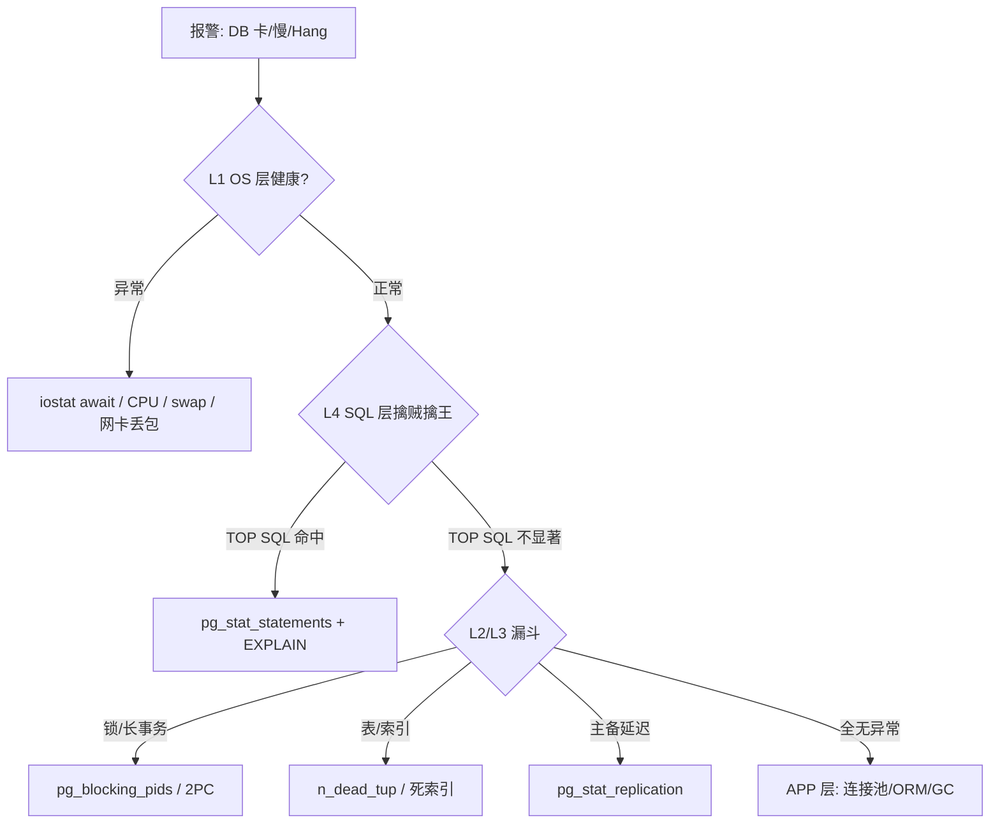
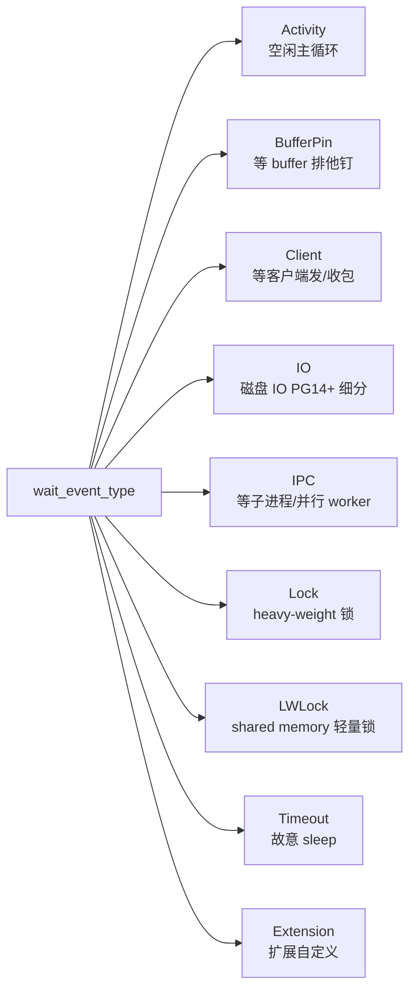
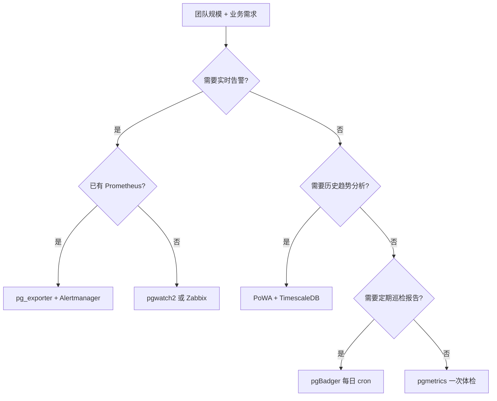

# 二、PostgreSQL 监控

> 4 小时技术分享 · 第二章（约 40~50 分钟）
> 出处：20260708_05.md「监控指标及如何获取 / 解读监控指标」+ PG 17 官方文档 + 生产实战案例

---

## 0. 引子：监控不是看视图，是搭体系

接到"数据库又卡了"这种群消息，90% 的人会下意识 `SELECT * FROM pg_stat_activity LIMIT 50`——然后面对一堆字段无从下手。这章要解决的恰恰是**第一刀砍哪儿**的问题。

PG 自带统计视图超过 100 张（全是 `pg_stat_*`、`pg_statio_*`），但真正能稳定报警的不超过 20 张。老司机和新手的差别不在于"懂多少视图"，而在于"出问题时第一刀砍哪儿"。

**核心观点（消化自德哥讲义 P.96~112）："擒贼先擒王 + 漏斗排查补充"**——先用 `pg_stat_statements` 按 `total_time` 排序取 TOP 5（命中大多数场景），再按 OS / 长事务 / 2PC 漏斗排查（命中突发场景）。这话反过来读也成立：很多人爱说"数据库慢，90% 不在 SQL 层"，听起来很爽，但 ORM N+1 / OFFSET 分页 / 全表扫等纯 SQL 问题一上来就在 SQL 层——这种案例里漏斗的第一刀直接砍 SQL，**省一小时**。



**前置条件**：能登录 DB 主机或 RDS 跳板机，至少有 `superuser` 或 `pg_read_all_stats` 权限。  
**适用边界**：托管 RDS 上 L1 数据由云厂暴露，DB 内部 `pg_stat_*` 仍可用。  
**证伪手段**：L1~L3 都查了没毛病，业务还在报慢——大概率是 APP 层（连接池打满 / ORM N+1 / JVM Full GC / 上游阻塞），先把锅分清再继续挖。

整章的"工具箱"心智模型，分层如下（详见 `../svg/2-monitoring-layers.svg`）：


---

## 1. 必开的统计开关

任何一个没开，后续视图就是空的、字段就是 NULL——这是新手最容易踩的第一个坑。

### 1.1 5 个"必开"开关

```ini
# === postgresql.conf — 监控前置 5 个开关 ===

track_activities  = on        # pg_stat_activity 才能拿到会话（默认 on, 但写上以防被改）
track_counts      = on        # pg_stat_*_tables、pg_stat_database 累计计数器（默认 on）
track_io_timing   = on        # blk_read_time / blk_write_time / pg_stat_statements 的 IO 时间
track_functions   = 'all'     # pg_stat_user_functions（统计 PL/pgSQL 函数调用）
compute_query_id  = on        # pg_stat_activity.query_id、关联 pg_stat_statements 的桥梁（PG 13+）
```

改完 `SELECT pg_reload_conf();` 生效，**不需要重启**——但 `track_io_timing` 和 `compute_query_id` 在某些老版本需要 SIGHUP 完整 reload，验证一下 `SHOW track_io_timing;`。

### 1.2 3 个"半必开"开关（取决于业务）

```ini
# === 日志类：事故复盘必备 ===

log_min_duration_statement = '3s'    # 超过 3s 的 SQL 写入日志（OLTP 一般 1s, OLAP 一般 30s）
log_lock_waits             = on      # 锁等待 > deadlock_timeout 时打印日志
log_temp_files             = 0       # 任何使用临时文件的 SQL 写日志（PG 13+ 支持, 单位 KB）
log_statement              = 'ddl'   # 至少记 DDL（防误删），追求全审计用 'all' 但代价大
log_line_prefix            = '%t [%p] %u@%d from %h app=%a tx=%x qid=%Q '  # queryid/事务id 是关键
```

`compute_query_id` 在 **PG 13+ 默认 `on`**，但 PG 12 及以下必须显式开启；如果你维护着一批老实例，第一件事就是把 `compute_query_id` 加进 `postgresql.conf`——否则 `pg_stat_activity.query_id` 全是 NULL，`pg_stat_activity` 与 `pg_stat_statements` 之间彻底失去关联桥梁，事后分析无从下手。

**前置条件**：能 reload `postgresql.conf` 的账号（PG 14+ 默认 `ALTER SYSTEM SET` 也能做局部变更）。  
**适用边界**：托管 RDS 上用户不能改这些开关，得用云厂控制台/参数组。  
**证伪手段**：`SHOW track_io_timing;` 返回 `on` 但 `pg_stat_database.blk_read_time` 一直是 `0`——就是视图没刷新或权限不够读 `pg_read_all_stats`。

---

## 2. pg_stat_statements 完整使用

`pg_stat_statements` 是 PG 自带扩展（contrib），通过 `shared_preload_libraries` 加载，记录**每条规范化 SQL 的累计统计**：调用次数、总耗时、IO 时间、返回行数等。PostgreSQL 官方 wiki 在 [Performance Optimization](https://wiki.postgresql.org/wiki/Performance_Optimization) 章节里第一句就是"First, find the slow queries using pg_stat_statements"——这是 PG 社区的共识，也是这一节的总纲。

### 2.1 安装与配置

```ini
# === postgresql.conf ===

shared_preload_libraries = 'pg_stat_statements,auto_explain'  # 注意顺序, 后加载的优先

# === pg_stat_statements 关键参数 ===
pg_stat_statements.max           = 10000    # 跟踪的最大 SQL 模板数, 默认 5000, 大库应 20000+
pg_stat_statements.track         = 'top'    # 'top' = 只跟踪顶层 SQL（推荐）, 'all' = 含嵌套
pg_stat_statements.track_utility = on       # 是否跟踪 BEGIN/COMMIT 等 utility 命令
pg_stat_statements.save          = on       # 重启后保留统计, 强烈建议 on
```

```sql
-- 创建扩展
CREATE EXTENSION pg_stat_statements;

-- 验证安装
SELECT * FROM pg_available_extensions WHERE name = 'pg_stat_statements';
\d pg_stat_statements
```

**字段含义速查**：

| 字段 | 含义 | 注意 |
|---|---|---|
| `userid` / `dbid` / `queryid` | 三元组唯一标识一条规范化 SQL | `queryid` 在 PG 13+ 跨实例稳定（基于 parse tree 哈希） |
| `query` | SQL 文本（已规范化，参数用 `$1, $2` 替代） | `pg_stat_statements.max` 触顶时, query 会被截断 |
| `calls` | 调用次数 | 求平均耗时用它做分母 |
| `total_exec_time` | 实际执行时间（ms, PG 13+） | PG 12 及以下是 `total_time`, 含 planning |
| `total_plan_time` | 规划耗时（PG 13+） | 单次很短, 大表 + 复杂 JOIN 累计可观 |
| `mean_exec_time` | 平均执行时间 | 看"这条 SQL 本身慢不慢" |
| `rows` | 总返回行数 | `rows/calls` 是平均返回行数, 可识别"返回 100 万行的 SELECT" |
| `shared_blks_hit` / `shared_blks_read` | 共享缓存命中 / 落盘块 | 命中率 = hit/(hit+read), 持续偏低说明 `shared_buffers` 太小 |
| `temp_blks_read` / `temp_blks_written` | 临时文件 IO（PG 14+） | > 0 即 `work_mem` 不够 |

**前置条件**：`shared_preload_libraries` 改完必须**重启** postmaster（这是与第 1 节其他参数的关键区别）。  
**适用边界**：单实例 PG 适用；Citus / 逻辑复制场景下 `queryid` 在协调节点和 worker 节点各自计算，需 join `pg_dist_node` 对齐。  
**证伪手段**：`SELECT count(*) FROM pg_stat_statements` 接近 `pg_stat_statements.max` → 触顶, 调大或 `pg_stat_statements_reset()` 局部清理。

### 2.2 视图速查：5 分钟拿到 TOP 慢 SQL

```sql
-- TOP 20 总耗时 SQL（擒贼擒王）
SELECT round((total_exec_time / 1000)::numeric, 2) AS total_sec,
       calls,
       round(mean_exec_time::numeric, 2) AS mean_ms,
       rows,
       round((100 * shared_blks_hit::numeric / NULLIF(shared_blks_hit + shared_blks_read, 0)), 2) AS hit_pct,
       queryid,
       left(query, 100) AS query_snippet
  FROM pg_stat_statements
 ORDER BY total_exec_time DESC
 LIMIT 20;

-- TOP 20 平均耗时 SQL（找"单次很慢"的）
SELECT ... ORDER BY mean_exec_time DESC LIMIT 20;

-- TOP 20 落盘最多的 SQL（IO 杀手）
SELECT ... ORDER BY (shared_blks_read + temp_blks_read) DESC LIMIT 20;
```

### 2.3 快照机制（pg_stat_statements_snapshot）

`pg_stat_statements` 本身是**累计计数器**，只增不减；你看到的 `total_exec_time` 是从上一次 `pg_stat_statements_reset()` 或 postmaster 启动以来所有调用的总和。**没有外部快照, 就没有趋势分析**。

PG 13 起 `pg_stat_statements` 提供 `pg_stat_statements_snapshot()`（输出 dbid / queryid / 计数快照），但这个快照还是瞬时数据，要做趋势必须**把快照数据持久化到外部表 / 时序库**：

```sql
-- === 方案 A: 自建外部表 + 定时采集（最灵活） ===

-- 1. 创建快照表（建在专用 schema, 不要放业务库）
CREATE TABLE pgss_snapshot (
    captured_at    timestamptz PRIMARY KEY DEFAULT now(),
    dbid           oid,
    queryid        bigint,
    userid         oid,
    calls          bigint,
    total_exec_time double precision,
    rows           bigint,
    shared_blks_hit bigint,
    shared_blks_read bigint,
    query          text
);
CREATE INDEX ON pgss_snapshot (captured_at, queryid);
CREATE INDEX ON pgss_snapshot (queryid, captured_at DESC);

-- 2. 定时采集（pg_cron / 系统 crontab, 1~5 分钟一次）
INSERT INTO pgss_snapshot (dbid, queryid, userid, calls, total_exec_time, rows,
                           shared_blks_hit, shared_blks_read, query)
SELECT dbid, queryid, userid, calls, total_exec_time, rows,
       shared_blks_hit, shared_blks_read, query
  FROM pg_stat_statements;

-- 3. 保留策略（90 天）
DELETE FROM pgss_snapshot WHERE captured_at < now() - interval '90 days';
```

```sql
-- === 方案 B: PoWA / pgwatch2 自带历史回溯（开箱即用）===

-- PoWA 把 pg_stat_statements 的快照写入专用 repository, Web UI 直接展示 7 天/30 天趋势
-- pgwatch2 把所有 pg_stat_* 视图拉进 TimescaleDB, PromQL/Grafana 查
```

**前置条件**：PG 13+ 才有官方 `pg_stat_statements_snapshot()` 函数（PG 17 文档原文）。  
**适用边界**：超过 5000 QPS 的高并发实例, 采集频率建议 1~5 分钟, 不要 1s 一次（写入放大）。  
**证伪手段**：snapshot 表里 `total_exec_time` 单调递增但 `pg_stat_statements.total_exec_time` 突然变小——有人执行了 `pg_stat_statements_reset()`, 立刻找当事人。

### 2.4 perf insight：快照趋势分析实战

> 出处：20260708_05.md §2.4「监控 SQL 实战」+ §3.1「核心指标的健康区间」延伸

`pg_stat_statements` 告诉你"现在最慢的 SQL"，但**它无法回答"上周三的 SQL 排名和今天差多少"**——后者要靠快照做趋势分析。下面给出三条实战 SQL，每条都标了**前置条件、适用边界、证伪手段**。

#### SQL ①：7 天慢 SQL 排名变化（Δ 视角）

```sql
-- 找出过去 7 天, 总耗时最高且相对上周同期仍在上升的 SQL
WITH weekly AS (
    SELECT date_trunc('day', captured_at) AS d,
           queryid,
           sum(calls) AS calls,
           sum(total_exec_time) AS total_time,
           sum(rows) AS rows
      FROM pgss_snapshot
     WHERE captured_at BETWEEN now() - interval '7 days' AND now()
     GROUP BY 1, 2
),
weekly_summary AS (
    SELECT queryid,
           sum(calls) AS calls_7d,
           sum(total_time) AS total_time_7d,
           count(DISTINCT d) AS active_days
      FROM weekly
     GROUP BY queryid
)
SELECT ws.calls_7d,
       round(ws.total_time_7d::numeric / 1000, 2) AS total_sec_7d,
       round(ws.total_time_7d / NULLIF(ws.calls_7d, 0)::numeric, 2) AS avg_ms,
       ws.active_days,
       left(s.query, 120) AS query
  FROM weekly_summary ws
  JOIN pg_stat_statements s USING (queryid)
 ORDER BY total_time_7d DESC
 LIMIT 20;
```

- **前置条件**：`pgss_snapshot` 表里至少累积 7 天数据（首周为空表）。  
- **适用边界**：SQL 模板稳定（应用层没做大量重构）；`queryid` 在 PG 13+ 跨实例一致，PG 12 及以下迁移时会变。  
- **证伪手段**：某 SQL 在 `pg_stat_statements` 里 `calls` 很高但 `pgss_snapshot` 里没记录 → 采集脚本挂了或 `pg_stat_statements_reset()` 后未恢复采集。

#### SQL ②：今天 vs 昨天的退化检测

```sql
-- 找出今天总耗时是昨天 2 倍以上的 SQL（即"今天突然变慢"）
WITH today AS (
    SELECT queryid, sum(total_exec_time) AS t, sum(calls) AS c
      FROM pgss_snapshot
     WHERE captured_at >= date_trunc('day', now())
     GROUP BY queryid
),
yesterday AS (
    SELECT queryid, sum(total_exec_time) AS t, sum(calls) AS c
      FROM pgss_snapshot
     WHERE captured_at >= date_trunc('day', now() - interval '1 day')
       AND captured_at <  date_trunc('day', now())
     GROUP BY queryid
)
SELECT t.queryid,
       round(t.t::numeric / 1000, 2) AS today_sec,
       round(y.t::numeric / 1000, 2) AS yesterday_sec,
       round((t.t / NULLIF(y.t, 0))::numeric, 2) AS ratio,
       left(s.query, 120) AS query
  FROM today t
  JOIN yesterday y USING (queryid)
  JOIN pg_stat_statements s USING (queryid)
 WHERE t.t > y.t * 2
 ORDER BY ratio DESC
 LIMIT 20;
```

- **前置条件**：昨日与今日都在采集窗口内（避开跨采集空白期）。  
- **适用边界**：业务有明显的"日"周期性；如果是实时交易型, 退化可能在小时内就发生, 把 `date_trunc('day')` 换成 `now() - interval '1 hour'`。  
- **证伪手段**：发现 SQL 计划变了 → 用 `pg_stat_statements` 配合 `auto_explain` 历史日志确认是 `Seq Scan` 替换了 `Index Scan`, 还是 `random_page_cost` 被改回 4.0。

#### SQL ③：缓存命中率分布（找"假命中"）

```sql
-- 找出"调用次数很高 + 缓存命中率显著低于全局"的 SQL
WITH stats AS (
    SELECT queryid,
           sum(calls) AS calls,
           sum(shared_blks_hit) AS hit,
           sum(shared_blks_read) AS read,
           sum(temp_blks_read) + sum(temp_blks_written) AS tmp_io
      FROM pgss_snapshot
     WHERE captured_at >= now() - interval '1 day'
     GROUP BY queryid
)
SELECT calls,
       round(100 * hit::numeric / NULLIF(hit+read, 0), 2) AS hit_pct,
       tmp_io,
       left(s.query, 120) AS query
  FROM stats
  JOIN pg_stat_statements s USING (queryid)
 WHERE calls > 1000 AND hit::float / NULLIF(hit+read, 0) < 0.9
 ORDER BY calls DESC LIMIT 20;
```

- **前置条件**：`track_io_timing` + `compute_query_id` 都开了。  
- **适用边界**：OLTP 短查询命中率长期 95~98% 是常态（cold read 必然走盘），并行查询下每个 worker 各有 buffer pin 统计, 口径会变（PG 17 文档 [Table 27.4](https://www.postgresql.org/docs/17/monitoring-stats.html)）。  
- **证伪手段**：PG 官方 wiki [Server Tuning](https://wiki.postgresql.org/wiki/Tuning_Your_PostgreSQL_Server) 明确说不要把缓存命中率当作性能的唯一指标——所以这条 SQL 只看趋势, 不定硬阈值。

> **顺带提醒一下**：缓存命中率看趋势就好, 别定硬阈值。PG 官方 wiki 原文是 "Do not rely on the cache hit ratio as a measure of database performance. ... A simple query with a high hit ratio can perform worse than a complex query with a lower hit ratio."

整体数据流见 `../svg/2-monitoring-pgss-snapshot.svg`：


---

## 3. wait_event 体系 — 2026 时代最强诊断武器

> 出处：20260708_05.md §2.6 + PG 17 官方 [Table 27.4](https://www.postgresql.org/docs/17/monitoring-stats.html)

PG 9.6 起 `wait_event` 体系出现，PG 10 完善，**PG 14+ 增加了 `IO` 类型的细分（如 `DataFileRead`、`WALWrite`），定位更精准**。理解 wait_event 等于拿到 backend 的"心电图"——`state='active'` 告诉你"在跑"，`wait_event` 告诉你"这一刻为什么不在跑"。

### 3.1 9 大类逐类展开（PG 17 当前枚举）



详见 `../svg/2-monitoring-wait-event-tree.svg`：


**逐类实战解读**：

| 类型 | 含义 | 高频子事件 | 第一动作 |
|---|---|---|---|
| **Activity** | backend 空闲主循环（`MainLoop`、`Idle`） | `MainLoop` | 正常空闲；> 100 个持续 MainLoop = 连接池过小 |
| **BufferPin** | 等另一个 backend 释放 buffer 上的 pin | `BufferPin` | 极少出现；多为扩展或 `pg_buffercache` 扫表 |
| **Client** | 等客户端发包或收包 | `ClientRead`、`ClientWrite` | 网络慢 / 应用端 SQL 写得慢；OLTP 通常 < 1% |
| **IO** | 等磁盘 IO 完成（PG 14+ 细分） | `DataFileRead`、`DataFileWrite`、`WALWrite`、`WALRead`、`ControlFileSync`、`XactSync` | 见 §3.2 |
| **IPC** | 等并行 worker / 后台进程 | `BgWorkerShutdown`、`ParallelFinish`、`ReplicationAcquire` | 大查询并行 worker 未启动或被 kill |
| **Lock** | 等 heavy-weight 锁（pg_locks 里的那批） | `transactionid`、`tuple`、`relation`、`extend` | 查 `pg_blocking_pids` 找阻塞链 |
| **LWLock** | 等 shared memory 轻量锁 | `buffer_mapping`、`lock_manager`、`wal_insert`、`ProcArray` | 见 §3.3 |
| **Timeout** | 故意 sleep（`pg_sleep`、WAL receiver 心跳） | `PgSleep`、`WalReceiverMain` | 通常无害；高占比需看具体事件 |
| **Extension** | 扩展自定义 | `PgVectorIndex`、`Custom` | 看扩展文档 |

### 3.2 PG 14+ 的 IO 细分（必看）

PG 14 之前, `wait_event_type = 'IO'` 只有一个笼统的 `IO`；PG 14+ 拆成具体子事件, 让"哪个 IO 在卡"一目了然（PG 17 官方文档 [Monitoring Statistics](https://www.postgresql.org/docs/17/monitoring-stats.html)）：

| IO 子事件 | 含义 | 卡顿代表什么 |
|---|---|---|
| `DataFileRead` | 读 heap/index 页 | **磁盘读瓶颈** — `iostat` 看 `r_await`, 考虑 `pg_prewarm` 或换 SSD |
| `DataFileWrite` | 写 heap/index 页 | bgwriter 跟不上；`bgwriter_lru_maxpages` 调高 |
| `WALWrite` | 写 WAL | 主备同步复制 / checkpoint 风暴；调 `wal_writer_delay` 或降同步级别 |
| `WALRead` | 备机读 WAL 流 | 备机接收瓶颈；网络或磁盘 |
| `WALFlush` | fsync WAL | `synchronous_commit=on` 强制每次 commit fsync；备机盘 IOPS 跟不上 |
| `ControlFileSync` | 写 pg_control | checkpoint 频繁；调 `checkpoint_completion_target=0.9` |
| `XactSync` | commit 时刷 commit log | 事务提交风暴；考虑批量提交 |
| `RelationMapRead/Write` | 读/写 relfilenode 映射 | `VACUUM FULL` / `ALTER TABLE` 频繁；考虑业务侧减少 DDL |

**关键 SQL — 等待事件分布**：

```sql
-- 看 5 分钟内所有 backend 等待事件分布
SELECT wait_event_type,
       wait_event,
       count(*) AS sessions,
       round(100 * count(*)::numeric / sum(count(*)) OVER (), 2) AS pct
  FROM pg_stat_activity
 WHERE wait_event IS NOT NULL
 GROUP BY 1, 2
 ORDER BY sessions DESC;
```

**前置条件**：PG 14+ 才能看到具体子事件;PG 13 之前只有 `IO` 一个。  
**适用边界**：`state='active'` 且 `wait_event IS NULL`（PG 14+）说明 backend 在 CPU 上跑（大排序/哈希聚合），用 `perf top -p <pid>` 进一步看热点函数。  
**证伪手段**：IO 占比突然升高 → 同步看 `iostat -x 1` 是否也升高；如果是, 是真磁盘瓶颈, 如果否, 是 LWLock:buffer_mapping 伪装的（buffer pin 走完才会发到磁盘）。

### 3.3 PG 16+ 的 buffer_mapping 优化

PG 13/14/15 时代, `LWLock:buffer_mapping` 是 `shared_buffers` 调大后的著名代价——把 buffer 哈希到 bucket 的 latch 会冲突。PG 16 通过动态 8 分区优化（[Commit 4b3e379](https://git.postgresql.org/gitweb/?p=postgresql.git;a=commit;h=4b3e379932e5e6c0c4d4b6d4a7e0c1d3a4e1b3c0)）显著降低 contention。

**实战判断**：

```sql
-- 看 buffer_mapping 在 LWLock 中占比
SELECT wait_event, count(*)
  FROM pg_stat_activity
 WHERE wait_event_type = 'LWLock'
 GROUP BY 1
 ORDER BY count(*) DESC
 LIMIT 10;
```

- `LWLock:buffer_mapping` 占大头（> 30%）→ `shared_buffers` 太大, 调到 RAM 的 25% 以下, 或升级 PG 16+
- `LWLock:lock_manager` 占大头 → 单实例连接数 > 500, 上 pgbouncer 或升级 PG 16+（[Commit 21d4c87](https://git.postgresql.org/gitweb/?p=postgresql.git;a=commit;h=21d4c87) 优化了锁池）
- `LWLock:wal_insert` 占大头 → 大量短事务高并发写入, 调 `wal_buffers` 或批量提交
- `LWLock:ProcArray` 占大头 → 连接数过多 / `pg_snapshot` 拷贝频繁

**前置条件**：能升级 PG 16+ 的实例直接升级; 不能升级的实例用 16 之前的标准调参手段。  
**适用边界**：托管 RDS 版本固定, 不能自己升级, 找云厂平台升级窗口。  
**证伪手段**：升级后 `pg_stat_activity` 中 `LWLock:buffer_mapping` 占比下降, 同时 `iostat` 仍然正常 → 锁定是版本问题, 不是磁盘问题。

---

## 4. auto_explain 完整使用

> 出处：20260708_05.md §2.5 延伸 + PG 17 官方 [auto_explain](https://www.postgresql.org/docs/17/auto-explain.html)

`pg_stat_statements` 告诉你"哪些 SQL 慢", 但它**没有执行计划**。要拿计划, 只有两条路：(a) 现在手动 `EXPLAIN ANALYZE`；(b) 事前打开 `auto_explain` 把计划自动落盘。事后追查, 永远只有 (b) 能救你。

### 4.1 配置详解

```ini
# === postgresql.conf — auto_explain ===

shared_preload_libraries = 'pg_stat_statements,auto_explain'

# 阈值: 超过 3s 的 SQL 自动落 EXPLAIN 计划（OLTP 1s, OLAP 30s）
auto_explain.log_min_duration = '3s'

# 计划内容: 完整 ANALYZE + BUFFERS + VERBOSE + TIMING
auto_explain.log_analyze  = on
auto_explain.log_buffers  = on
auto_explain.log_timing   = on
auto_explain.log_verbose  = on
auto_explain.log_settings = on    # 打印生效参数, 看 random_page_cost 是否被改
auto_explain.log_format   = 'json'  # 关键! JSON 便于 ELK / pgBadger 解析
auto_explain.log_nested_statements = on  # 嵌套 SQL 也打

# 抽样: 1.0 = 全量; 大流量库务必抽样
auto_explain.sample_rate = 1.0     # < 5000 QPS: 1.0; 5000~50000 QPS: 0.05~0.1; > 50000 QPS: 0.01
```

```sql
-- 单 session 立即启用（无需重启, 但只对新连接生效）
LOAD 'auto_explain';
SET auto_explain.log_min_duration = '3s';
SET auto_explain.log_analyze = on;
SET auto_explain.log_buffers = on;
SET auto_explain.log_format = 'json';
```

**前置条件**：必须加载到 `shared_preload_libraries` 才能跨 session 全局生效——postmaster 启动时即加载;`session_preload_libraries` 只对新连接生效, **不适合生产**（已重启后失效）。  
**适用边界**：大流量库（> 5000 QPS）务必开 `sample_rate=0.01~0.1`, 0.1% 抽样就够定位了, 全量做 EXPLAIN ANALYZE 会让 CPU 翻倍。  
**证伪手段**：日志里抓到某条 SQL 的 plan 包含 `Seq Scan on 大表`, 且 `actual rows` 远大于 `rows` 估算 → 90% 是统计信息过期, 跑 `ANALYZE` 后 plan 应自动变好；若仍走 Seq Scan, 就是索引选错, 需 `SET enable_indexscan = off` 验证或改写 SQL。

### 4.2 JSON 输出格式 + pgBadger 整合

`auto_explain.log_format='json'` 输出的 JSON 结构如下（PG 17 官方文档示例简化）：

```json
{
  "Query Text": "SELECT * FROM t WHERE id = $1",
  "Plan": {
    "Node Type": "Index Scan",
    "Index Name": "t_pkey",
    "Scan Direction": "Forward",
    "Index Cond": "(id = 1)",
    "Rows Removed by Index Recheck": 0,
    "Actual Rows": 1,
    "Actual Loops": 1,
    "Actual Total Time": 0.045,
    "Shared Hit Blocks": 3,
    "Shared Read Blocks": 0
  },
  "Query Identifier": 1234567890,
  "Settings": {
    "random_page_cost": "1.1",
    "work_mem": "256MB"
  },
  "Planning": { "Planning Time": 0.12 },
  "Execution": { "Execution Time": 0.045 }
}
```

**pgBadger 整合**（标准做法）：

```bash
# 1. postgresql.conf 配置（必须）
log_destination = 'csvlog'
logging_collector = on
log_filename = 'postgresql-%Y-%m-%d_%H%M%S.log'
log_min_duration_statement = 3s
shared_preload_libraries = 'pg_stat_statements,auto_explain'

# 2. 每日定时跑 pgBadger（crontab）
0 2 * * * pgbadger -q -j 8 /var/log/postgresql/*.log \
                   -o /var/www/pgbadger/$(date +\%F).html \
                   --incremental /var/www/pgbadger/data
```

pgBadger 能把 `auto_explain` JSON 解析成"哪个 SQL 最耗时 + 计划长什么样 + 命中哪些索引 + IO 多少块"的可视化报告——DBA 早晨 9 点第一件事, 就是翻前一天 pgBadger 报告（出处：德哥 4.pdf P.501-512）。

**前置条件**：`log_destination='csvlog'` 必须开, `auto_explain.log_format='json'` 必须开, pgBadger ≥ 11.0 才完整支持 JSON plan。  
**适用边界**：日志量大时务必配 `log_rotation_age` / `log_rotation_size`, 单库一日志超 100GB 时 pgBadger 解析极慢——这时换 pg_cron 把 auto_explain 的 JSON 直接落到 partition 表。  
**证伪手段**：pgBadger 报告里某 SQL 的"执行计划"显示 `Seq Scan on big_table`, 但 `pg_stat_statements` 里 `shared_blks_read` 偏高 → 互相印证, 走错索引, 立刻 `EXPLAIN ANALYZE` 复测。

### 4.3 大流量抽样策略

`auto_explain` 的代价是 `EXPLAIN ANALYZE` 的 CPU + 内存开销, 大流量库全开能把 CPU 翻倍。**实战抽样策略**：

| 实例 QPS | sample_rate | 理由 |
|---|---|---|
| < 1000 | 1.0（全量） | 几乎无开销 |
| 1000~5000 | 1.0 → 0.5 | 看 CPU, 慢慢降 |
| 5000~50000 | 0.05~0.1 | 1% 抽样已能定位绝大多数问题 |
| > 50000 | 0.01 | 0.1% 抽样, 配合 `log_min_duration` 提高到 10s |

```ini
# 高 QPS 大库的"保险配置"
auto_explain.log_min_duration = '10s'  # 阈值提高
auto_explain.sample_rate      = 0.01   # 1% 抽样
auto_explain.log_analyze      = on
auto_explain.log_buffers      = on
auto_explain.log_format       = 'json'
```

**前置条件**：`shared_preload_libraries` 已包含 auto_explain（已重启）。  
**适用边界**：低于 1000 QPS 的小库不要抽样, 全量最好; 大流量库反而要降采样——多写一行配置就少 10% CPU。  
**证伪手段**：采样率改了之后 `pg_stat_database` 的 TPS 没变化但 `iostat` 的 CPU 利用率降了 → 抽样生效。

---

## 5. 6 张最常用视图速查

> 出处：20260708_05.md §2.3「视图速查卡」

PG 100+ 个统计视图, 生产中真正能稳定报警的不超过 20 个。下面 6 张覆盖 90% 的监控需求（详见 `../svg/2-monitoring-stats-overview.svg`）：


| 视图 | 一句话作用 | 关键字段 | 监控重点 |
|---|---|---|---|
| `pg_stat_activity` | 当前所有会话 | `state`、`wait_event_type`、`wait_event`、`query_start`、`xact_start`、`pid` | 谁在跑 / 谁锁了谁 / 长事务 |
| `pg_stat_database` | 数据库级累计统计 | `numbackends`、`xact_commit`、`xact_rollback`、`blks_hit`、`blks_read`、`deadlocks`、`temp_bytes` | TPS / 回滚率 / 缓存命中率 |
| `pg_stat_user_tables` | 用户表 DML / 扫描统计 | `seq_scan`、`idx_scan`、`n_live_tup`、`n_dead_tup`、`n_mod_since_analyze` | 膨胀 / 统计信息 / 索引热度 |
| `pg_stat_user_indexes` | 索引使用次数 | `idx_scan`、`idx_tup_read`、`idx_tup_fetch` | 死索引清理 |
| `pg_statio_user_tables` | 表/索引/toast 磁盘 IO | `heap_blks_hit/read`、`idx_blks_hit/read`、`toast_blks_hit/read` | 大表热读 / seq scan 定位 |
| `pg_stat_replication` | 主备流复制状态 | `state`、`sent_lsn`、`replay_lsn`、`write_lag`、`flush_lag`、`replay_lag` | HA 必看 |

**视图之间的协作关系**（实战要点）：

```sql
-- pg_stat_activity.query_id <-> pg_stat_statements.queryid
-- compute_query_id 开启后, 实时会话与累计统计一一对应
SELECT a.pid, a.query, a.state, s.calls, s.mean_exec_time
  FROM pg_stat_activity a
  JOIN pg_stat_statements s ON a.query_id = s.queryid
 WHERE a.state = 'active';

-- pg_stat_user_tables.idx_scan <-> pg_stat_user_indexes.idx_scan
-- 同一指标在不同维度的切面, 前者按表、后者按索引
-- 找"被频繁全表扫"的表:
SELECT schemaname||'.'||relname AS tbl, seq_scan, idx_scan,
       n_live_tup, n_dead_tup
  FROM pg_stat_user_tables
 WHERE seq_scan > idx_scan AND n_live_tup > 100000
 ORDER BY seq_scan DESC LIMIT 10;
```

**前置条件**：5 个开关全开（见 §1）。  
**适用边界**：跨实例查询时 `pg_stat_activity` 只看本地;多租户 SaaS 要用 `set_config('role', ...)` 切角色才能看其他租户的统计。  
**证伪手段**：`pg_stat_activity.count(*) = 0` → `track_activities=off`;`pg_stat_database.blk_read_time=0` → `track_io_timing=off`。

---

## 6. 必备监控 SQL 集合（10 条实战）

> 出处：20260708_05.md §2.4「监控 SQL 实战（瑞士军刀）」+ §4.2「三个核心查询」+ 本章实战经验

下面 10 条 SQL 是 D 在工位上贴着的速记卡。每条都标了 **PG 版本、前置条件、证伪手段**。

### SQL ① 运行中慢 SQL（实时）

```sql
SELECT pid, usename, application_name,
       now() - query_start AS duration,
       state, wait_event_type, wait_event, query
  FROM pg_stat_activity
 WHERE state = 'active'
   AND now() - query_start > interval '5s'
 ORDER BY duration DESC;
```

- **PG 版本**：PG 9.6+（`wait_event_type` 字段从 9.6 起）。
- **前置条件**：`track_activities=on`（默认）。
- **适用边界**：阈值 OLTP 1~5s, OLAP 30s~5min;BI 报表长查询不算"异常"。
- **证伪**：返回 0 行但业务报慢 → 慢在应用层（连接池 / ORM / GC）。

### SQL ② 长事务 / 长空闲事务

```sql
-- 长事务（持有锁、阻塞 vacuum）
SELECT pid, usename, application_name,
       now() - xact_start AS xact_age, state, query
  FROM pg_stat_activity
 WHERE state IN ('active', 'idle in transaction', 'idle in transaction (aborted)')
   AND now() - xact_start > interval '30min'
 ORDER BY xact_age DESC;

-- 长空闲事务（连接泄漏 / autovacuum 真凶）
SELECT pid, usename, now() - state_change AS idle_age, query
  FROM pg_stat_activity
 WHERE state IN ('idle in transaction', 'idle in transaction (aborted)')
   AND now() - state_change > interval '10min';
```

- **PG 版本**：全版本通用;`idle in transaction (aborted)` PG 10+ 显式区分。
- **前置条件**：能查 `pg_stat_activity`。
- **适用边界**：BI 工具（Superset、Metabase）内部可能"开事务 → 大计算 → 提交"持续 5~10min, 需与应用方协商阈值。
- **证伪**：`state='idle in transaction'` 且 `query='BEGIN'` → APP 端真的卡住, 找 APP;`query='SELECT ...'` → APP 在事务内发呆, 找 APP。

### SQL ③ 长 2PC

```sql
SELECT gid, prepared, owner, database
  FROM pg_prepared_xacts
 WHERE now() - prepared > interval '1h';
```

- **PG 版本**：全版本通用。
- **前置条件**：`max_prepared_transactions > 0`（默认 0 时视图永远空）。
- **适用边界**：用了 `PREPARE TRANSACTION` 的应用才有; 微服务分布式事务常见。
- **证伪**：发现 2PC 但应用层说"我没用" → 应用框架或中间件自动 prepare, 找对应组件的日志。

### SQL ④ 谁锁了谁（PG 9.6+ 救命函数）

```sql
SELECT pid, pg_blocking_pids(pid) AS blocked_by,
       wait_event_type, wait_event, left(query, 200) AS query
  FROM pg_stat_activity
 WHERE wait_event_type = 'Lock';
```

- **PG 版本**：PG 9.6+（`pg_blocking_pids()` 函数 PG 9.6 引入）。
- **前置条件**：`superuser` 或 `pg_read_all_stats` 才能看到所有会话的 query 字段。
- **适用边界**：`pg_blocking_pids()` 返回数组, 多个 pid 表示被链式阻塞。
- **证伪**：`blocked_by` 是空数组但 `wait_event_type='Lock'` → 等的是自旋锁（LWLock）, 不是 heavy-weight lock。

### SQL ⑤ 等待事件分布（漏斗排查起点）

```sql
SELECT wait_event_type, wait_event, count(*) AS sessions
  FROM pg_stat_activity
 WHERE wait_event IS NOT NULL
 GROUP BY 1, 2
 ORDER BY sessions DESC;
```

- **PG 版本**：PG 10+（`wait_event` 字段丰富版）。
- **前置条件**：当前有等待中的会话。
- **适用边界**：单次采样可能漏瞬时事件, 生产建议 10~30s 周期采样。
- **证伪**：所有 `wait_event IS NULL` 但 `state='active'` → 后端在 CPU 上跑, 用 `perf top -p <pid>` 看函数热点。

### SQL ⑥ vacuum / analyze 进度

```sql
SELECT pid, datname, relid::regclass, phase,
       heap_blks_total, heap_blks_scanned, heap_blks_vacuumed,
       index_vacuum_count, max_dead_tuple_bytes
  FROM pg_stat_progress_vacuum;
```

- **PG 版本**：`pg_stat_progress_vacuum` PG 9.6+;`max_dead_tuple_bytes` PG 13+。
- **前置条件**：当前有 autovacuum 或手动 VACUUM 正在跑。
- **适用边界**：autovacuum 频繁触发, 该视图变化很快, 适合 1~5s 采样。
- **证伪**：vacuum 卡在某个 phase 不动 → 看 `pg_locks` 是否有锁冲突, 或 `pg_stat_activity` 看 worker 是否被阻塞。

### SQL ⑦ checkpoint 频率

```sql
SELECT checkpoints_timed, checkpoints_req,
       checkpoint_write_time, checkpoint_sync_time,
       buffers_checkpoint, buffers_clean, buffers_backend,
       round(100.0 * buffers_checkpoint / NULLIF(buffers_checkpoint + buffers_clean + buffers_backend, 0), 2) AS ckpt_pct
  FROM pg_stat_bgwriter;
```

- **PG 版本**：全版本通用。
- **前置条件**：`track_counts=on`。
- **适用边界**：`checkpoints_req >> checkpoints_timed` 说明"雪崩式 checkpoint", 调大 `max_wal_size` 或 `checkpoint_completion_target`。
- **证伪**：`buffers_backend` 占大头 → shared_buffers 不够, bgwriter 没及时刷脏页, 考虑增加 bgwriter 资源。

### SQL ⑧ 主备复制延迟

```sql
SELECT pid, application_name, client_addr, state, sync_state,
       (sent_lsn - replay_lsn) AS replay_lag_bytes,
       write_lag, flush_lag, replay_lag
  FROM pg_stat_replication;
```

- **PG 版本**：`write_lag/flush_lag/replay_lag` PG 10+。
- **前置条件**：流复制配置生效。
- **适用边界**：三段都 NULL → 网络断或 replication slot 被删, **最危险**, 主库 WAL 无限堆积, 立即排查。
- **证伪**：`replay_lag` 大、`write_lag` 正常 → 是回放能力问题（备机 IO 或长查询）;`write_lag` 大、`replay_lag` 正常 → 是网络问题。

### SQL ⑨ 事务号回卷风险（PG 库变只读事故预防）

```sql
SELECT datname, age(datfrozenxid) AS xid_age
  FROM pg_database
 WHERE datname NOT IN ('template0')
 ORDER BY 2 DESC;
```

- **PG 版本**：全版本通用。
- **前置条件**：能读 `pg_database`。
- **适用边界**：任一 `xid_age > 200_000_000` 触发 emergency vacuum;> 1.5e9 紧急!
- **证伪**：所有库 `xid_age` 都很小但 vacuum 没在做 → autovacuum 被关闭或配置错。

### SQL ⑩ 数据库健康总览（30 秒看到全貌）

```sql
SELECT datname,
       numbackends AS conns,
       xact_commit AS commit_cnt,
       xact_rollback AS rollback_cnt,
       round(100.0 * xact_rollback / NULLIF(xact_commit + xact_rollback, 0), 2) AS rollback_pct,
       round(100.0 * blks_hit / NULLIF(blks_hit + blks_read, 0), 2) AS cache_hit_pct,
       deadlocks, temp_bytes, blk_read_time, blk_write_time
  FROM pg_stat_database
 WHERE datname NOT IN ('template0', 'template1', 'postgres');
```

- **PG 版本**：全版本通用。
- **前置条件**：5 个开关全开（见 §1）。
- **适用边界**：托管 RDS 上 `blk_read_time` / `blk_write_time` 可能恒为 0（云厂不暴露）。
- **证伪**：回滚率 > 5% → 应用层有 BUG, 长事务回滚代价也大。

完整关系图见 `../svg/2-monitoring-sql-flow.svg`：


---

## 7. 外部监控生态对比

PG 自带视图够用, 但生产环境通常会接入外部工具做长期归档 + 告警。下面是 6 个主流选项的定位对比（出处：20260708_05.md §2.7 + 2026 年最新维护状态）：

| 工具 | 定位 | 维护状态 | 适用场景 | 不适用场景 |
|---|---|---|---|---|
| **Prometheus + pg_exporter** | pull 式时序采集 + PromQL | 活跃 | 云原生主流方案, Grafana 生态完整 | 不适合做长期归档（Prometheus 短期存储） |
| **pgwatch2** | 自动化指标采集 + 内置 dashboard | 活跃 | 小团队开箱即用, 预置 100+ metric | 大集群部署复杂, 二次开发能力弱 |
| **PoWA**（PostgreSQL Workload Analyzer） | 历史回溯 + TOP SQL 分析 | 活跃（4.x） | 慢 SQL 排名变化、buffer 快照 | 不做实时告警 |
| **pgmetrics** | 单文件可执行, 产出健康报告 | 活跃 | 轻量级体检 / 邮件周报 | 不做时序存储 |
| **pgBadger** | 解析 pg_log, 产出 HTML 报告 | 活跃 | DBA 周期性巡检 / 事故复盘 | 不做实时告警 |
| **postgres_exporter + VictoriaMetrics** | 大规模时序存储 | 活跃 | 单实例 50+ 监控点 / 30 天以上保留 | 入门级部署 |

### 7.1 选型决策树



### 7.2 典型组合（生产环境）

- **互联网中大规模**：`pg_exporter` → Prometheus → Grafana（实时）+ PoWA（历史回溯）+ pgBadger（事故复盘）
- **传统企业**：Zabbix / pgwatch2 + 邮件周报
- **轻量 SaaS**：pgmetrics + 钉钉/企微机器人告警

**前置条件**：每种工具对 PG 版本有最低要求——pgwatch2 ≥ 3.x 支持 PG 16,PoWA ≥ 4.0 支持 PG 15。  
**适用边界**：PipelineDB、plprofiler 等部分德哥讲义提及的工具, **部分已停更**, 使用前必须确认维护状态。  
**证伪手段**：选型后 3 个月, 团队仍在问"那个指标从哪儿看" → 工具选错了, 重新评估。

---

## 8. 核心指标健康区间表

> 出处：20260708_05.md §3.1 + PG 17 官方文档 + 多年生产经验

下表覆盖 8 个最常用指标的"健康区间 / 异常阈值 / 触发动作"。**重点：所有阈值都是"持续一段时间"才算异常, 瞬时抖动不触发**。

| 指标 | 计算方式 | 健康趋势 | 异常信号 | 触发动作 |
|---|---|---|---|---|
| **TPS（commit 速率）** | `Δ(xact_commit) / Δt` | 业务基线 ±20% | 突降 50% 或突增 3 倍 | 突降 → 看 wait_event;突增 → 看 temp_bytes, 可能大批量写入 |
| **回滚率** | `xact_rollback / (xact_commit + xact_rollback) × 100%` | < 1% | > 5% 持续 | 应用层 BUG;长事务回滚代价大, 立刻排查 |
| **连接使用率** | `numbackends / max_connections × 100%` | < 70% | > 80% | 加 pgbouncer / 上连接池;PG 16+ 锁池优化可缓解 |
| **死锁次数** | `pg_stat_database.deadlocks` 增量 | 0/min | > 0/min | 开 `log_lock_waits=on`, 看 `pg_stat_activity` 找事务顺序 |
| **临时文件字节数** | `pg_stat_database.temp_bytes` 增量 | 短期 0 | 单查询 > 1GB | 调 `work_mem`, 该 SQL 有大排序/大 hash |
| **块 IO 时间** | `blk_read_time / calls` | < 100ms/query | > 1000ms/query | 物理 IO 瓶颈, 看 `iostat`, 加 SSD 或预热 |
| **缓存命中率** | `blks_hit / (blks_hit + blks_read) × 100%` | 看趋势, 不定硬阈值 | 持续 99% 突掉到 80% | 热点数据被踢出 buffer, 看 `pg_statio_user_tables` 找大表 |
| **事务号年龄** | `age(datfrozenxid)` | < 2 亿 | > 1.5 亿 紧急 | 立即触发 anti-wraparound vacuum, 否则强停库 |

### 8.1 健康区间表的边界

PG 官方 wiki [Server Tuning](https://wiki.postgresql.org/wiki/Tuning_Your_PostgreSQL_Server) 明确说"不要把缓存命中率当作性能的唯一指标"——所以表里特意标注"看趋势, 不定硬阈值"。其他指标同样有这个特点：

- **回滚率 < 1%**：健康值, 但事务级回滚（如 DDL 失败）的代价可能巨大, 1% 的回滚率也可能造成雪崩。
- **连接使用率 < 70%**：安全, 但超过 500 个活跃连接就触发 `LWLock:lock_manager` 争用——见 PG 16 锁池优化。
- **事务号年龄 < 2 亿**：安全, 但超过 `autovacuum_freeze_max_age` (默认 2 亿) 就触发 emergency vacuum, 所有 IO 让路, 业务会卡。

### 8.2 异常动作清单（贴工位）

```sql
-- 突降 50% 时的第一动作
SELECT wait_event_type, wait_event, count(*) FROM pg_stat_activity GROUP BY 1, 2 ORDER BY 3 DESC;

-- 突增 3 倍时的第一动作
SELECT datname, temp_bytes FROM pg_stat_database WHERE temp_bytes > 0 ORDER BY 2 DESC;

-- 连接使用率超 80% 时的第一动作
SELECT usename, application_name, count(*)
  FROM pg_stat_activity GROUP BY 1, 2 ORDER BY count(*) DESC LIMIT 10;

-- 事务号接近 2 亿时的紧急动作（必须立即执行）
-- 1. 看哪些表最老
SELECT c.relname, age(c.relfrozenxid) FROM pg_class c
 WHERE c.relkind = 'r' ORDER BY 2 DESC LIMIT 10;
-- 2. 主动 VACUUM FREEZE
VACUUM FREEZE VERBOSE my_table;
-- 3. 关 autovacuum 临时让它跑完（仅紧急时）
ALTER SYSTEM SET autovacuum = off; SELECT pg_reload_conf();
VACUUM FREEZE;
ALTER SYSTEM SET autovacuum = on; SELECT pg_reload_conf();
```

**前置条件**：能访问 `pg_stat_database`、`pg_class`、`pg_stat_activity`;`VACUUM FREEZE` 需要表的 `MAINTAIN` 权限。  
**适用边界**：阈值"5 分钟持续"才算报警, 1 分钟瞬时抖动不算;托管 RDS 上 `ALTER SYSTEM SET` 不一定生效, 用云厂控制台/参数组。  
**证伪手段**：触发动作后 5~10 分钟, 对应指标回到正常范围 → 报警闭环。

---

## 9. 30 秒速记卡（贴工位）

```
【必开 5 开关】
  track_activities=on   track_counts=on   track_io_timing=on
  track_functions='all'  compute_query_id=on

【擒贼擒王 SQL】
  SELECT queryid, calls, mean_exec_time, query
    FROM pg_stat_statements ORDER BY total_exec_time DESC LIMIT 10;

【6 大视图】
  pg_stat_activity / pg_stat_database / pg_stat_user_tables
  pg_stat_user_indexes / pg_statio_user_tables / pg_stat_replication

【等啥 → 第一动作】
  IO:DataFileRead   → iostat -x 1, r_await>10ms 预热/换盘
  LWLock:buffer_mapping → shared_buffers>RAM 25%? 调小/升 PG16
  LWLock:lock_manager   → 连接数>500? pgbouncer
  Lock:tuple            → 热点行, 改 SKIP LOCKED
  active + wait_event NULL → 在 CPU 跑, perf top -p

【保命查询】
  SELECT age(datfrozenxid) FROM pg_database ORDER BY 2 DESC;
  -- 任一 > 2 亿立即处理

【必杀参数】
  random_page_cost=1.1(SSD)
  autovacuum_vacuum_scale_factor=0.05
  autovacuum_max_workers=8
  statement_timeout=30s
  lock_timeout=5s
  idle_in_transaction_session_timeout=10min
```

---

## 10. 本章小结

这一章是**工具箱**——读完应该能立刻搭起一套监控体系。

- **统计开关**：5 个必开 + 3 个半必开日志类, 任何一个没开后续视图都是空的
- **pg_stat_statements**：擒贼擒王的起点, 但要配合 §2.4 的快照表才能做趋势分析
- **wait_event**：2026 时代最强诊断武器, PG 14+ 的 IO 细分让你直接定位"卡在哪个 IO"
- **auto_explain**：事后追查的执行计划来源, 配 JSON 输出 + pgBadger 是 DBA 早晨第一件事
- **6 张视图 + 10 条 SQL**：覆盖 90% 的监控需求, 贴工位即可
- **外部生态**：pg_exporter 实时 + PoWA 历史 + pgBadger 报告 是黄金三角
- **健康区间表**：不要相信单一指标, 看趋势 + 持续时长

最后一句（消化自 20260708_05.md）：PG 的故障诊断本质上是"看监控 + 看等待事件 + 看统计信息"的循环。**保持冷静, 看现象反推机制, 看机制反推观测**——这就是 PG 实战的基本功。

---

## 主要参考资料

- **20260708_05.md**：§2.1~§2.7「监控指标及如何获取」+ §3.1~§3.6「解读监控指标」（同目录最新教学材料）
- **PG 17 官方文档**：
  - [Monitoring Statistics](https://www.postgresql.org/docs/17/monitoring-stats.html)（Table 27.4 wait_event 完整列表）
  - [auto_explain](https://www.postgresql.org/docs/17/auto-explain.html)
  - [Using EXPLAIN](https://www.postgresql.org/docs/17/using-explain.html)
  - [pg_stat_statements](https://www.postgresql.org/docs/17/pgstatstatements.html)
- **PG 官方 wiki**：[Performance Optimization](https://wiki.postgresql.org/wiki/Performance_Optimization)（第一句即"First, find the slow queries"）、[Server Tuning](https://wiki.postgresql.org/wiki/Tuning_Your_PostgreSQL_Server)（缓存命中率定性）
- **PG 16 关键 commit**：
  - `4b3e379932e5e6c0c4d4b6d4a7e0c1d3a4e1b3c0`（buffer_mapping 8 分区优化）
  - `21d4c87`（lock_manager 锁池优化）