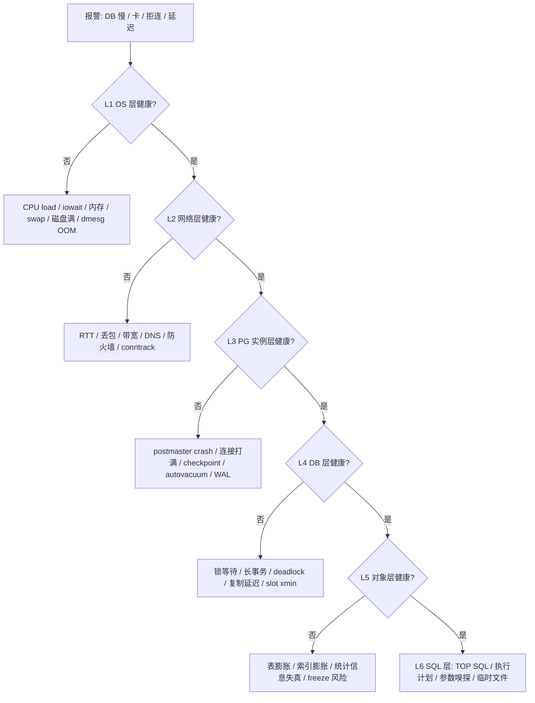
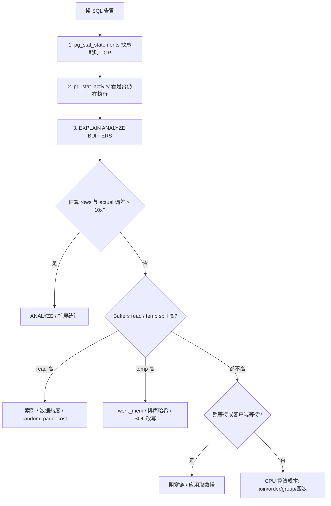
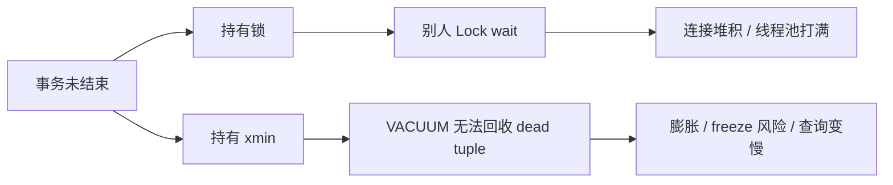
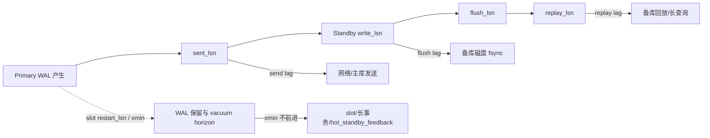
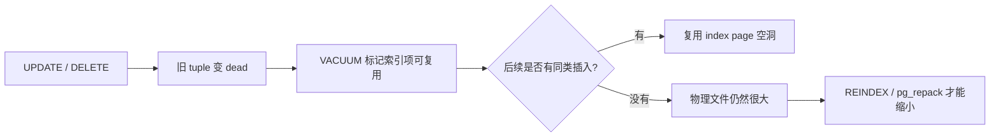
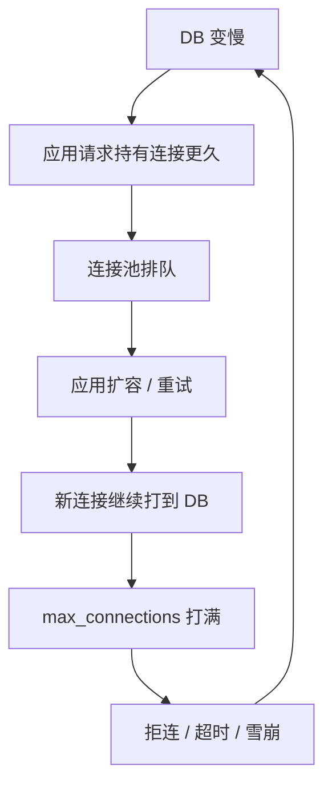

# 三、PostgreSQL 故障诊断

> 本章是“救火篇”。目标不是把所有理论讲完，而是让你在报警响起后的 5 分钟内，按固定漏斗确认：是不是数据库、卡在哪一层、谁是根因、先做哪个止血动作。本文在 `../../20260708_05.md` 的“四、故障诊断”基础上扩展，并补充了 `../../20161121_01.md` 中 OS 内核、文件句柄、I/O 调度、WAL 独立盘等部署侧排障参考。

## 3.0 救火约定：先止血，再根因，再复盘

生产故障现场最怕两件事：一是上来就杀进程，二是看了 20 分钟还没形成判断。我的默认动作是：**先采样、再止血、再深挖**。

**5 分钟目标**：

| 时间 | 动作 | 要回答的问题 |
|---|---|---|
| 0-1 分钟 | 看 OS / 网络 / 磁盘 | 是不是机器、磁盘、网络已经异常？ |
| 1-2 分钟 | 看连接数、等待事件、活跃 SQL | DB 是 CPU 跑满、IO 等待、锁等待，还是连接打满？ |
| 2-3 分钟 | 看阻塞链、长事务、WAL/复制 | 有没有一个会话、slot、standby 把全局卡住？ |
| 3-4 分钟 | 确定止血动作 | cancel、terminate、降级同步复制、扩容磁盘、限制连接？ |
| 4-5 分钟 | 做完验证 | 等待事件下降了吗？业务 RT 恢复了吗？WAL 不再增长了吗？ |

**现场三条纪律**：

1. **不要先猜 SQL**：先用漏斗分层，OS / 网络 / 实例 / DB / 对象 / SQL 一层层排除。
2. **不要裸杀**：杀之前至少留一份 `pg_stat_activity`、阻塞链、WAL/slot、OS 负载快照。
3. **不要删 `pg_wal`**：磁盘满时手删 WAL 文件通常会把可恢复故障变成不可恢复事故。

---

## 3.1 故障响应总框架：分层定位漏斗

报警来了，第一件事不是打开某条慢 SQL，而是走漏斗。



### 3.1.1 一分钟 OS 快照

**触发条件**：业务大面积报慢、数据库连接不上、`pg_stat_activity` 还没登录进去。  
**预期现象**：如果 OS 已经异常，通常会看到 iowait 高、磁盘满、swap、OOM、网络队列异常。  
**做完会发生什么 / 证伪**：OS 一切正常，才继续往 PG 内部钻；如果 OS 异常，先处理机器资源，不要先优化 SQL。

```bash
# Linux 主机上执行；托管 RDS 则看云监控的 CPU/iowait/磁盘/网络面板
uptime
free -h
df -h
vmstat 1 5
iostat -xz 1 3
ss -s
dmesg -T | egrep -i 'out of memory|oom|killed process|blocked for more|i/o error|nvme|xfs|ext4' | tail -50
```

### 3.1.2 一分钟 PG 总览

**触发条件**：能登录数据库，想先判断瓶颈类型。  
**预期现象**：等待事件会把现场分成几类：`Lock` 是锁，`IO` 是磁盘/WAL，`Client` 多半是客户端不收包或连接池问题，`NULL` 且 active 多通常是 CPU 正在跑。  
**证伪**：`wait_event_type` 没有集中项，同时业务仍慢，要继续看 TOP SQL、应用连接池、上游调用。

```sql
-- 实例身份和是否处于恢复态
SELECT now() AS sample_time,
       pg_postmaster_start_time() AS postmaster_start,
       now() - pg_postmaster_start_time() AS uptime,
       pg_is_in_recovery() AS is_standby,
       version();

-- 活跃会话等待事件分布：第一眼判断 Lock / IO / Client / CPU
SELECT COALESCE(wait_event_type, 'CPU-or-running') AS wait_type,
       COALESCE(wait_event, 'on-cpu-or-none') AS wait_event,
       count(*) AS sessions
FROM pg_stat_activity
WHERE backend_type = 'client backend'
  AND state = 'active'
GROUP BY 1, 2
ORDER BY sessions DESC;

-- 数据库级健康快照
SELECT datname,
       numbackends AS conns,
       xact_commit,
       xact_rollback,
       round(100.0 * xact_rollback / NULLIF(xact_commit + xact_rollback, 0), 2) AS rollback_pct,
       deadlocks,
       temp_files,
       pg_size_pretty(temp_bytes) AS temp_bytes,
       blk_read_time,
       blk_write_time
FROM pg_stat_database
WHERE datname NOT IN ('template0', 'template1')
ORDER BY numbackends DESC;
```

### 3.1.3 日志快照

**触发条件**：连接失败、实例重启、出现 deadlock、checkpoint 风暴、归档失败。  
**预期现象**：日志里会出现 `FATAL`、`PANIC`、`deadlock detected`、`archive command failed`、`checkpoint starting`。  
**证伪**：日志无异常且 PG 内部指标正常，转向应用层和网络层。

```bash
# systemd 部署
journalctl -u postgresql --since '30 minutes ago' --no-pager

# 自建 PGDATA 日志目录，按实际 log_directory 调整
find "$PGDATA" -maxdepth 3 -type f -name '*.log' -mmin -60 -print
```

---

## 3.2 三个核心查询（救命级 SQL）

这三类查询是现场第一刀：**谁在跑、谁在等、谁锁了谁**。

### 3.2.1 谁在跑：当前活跃慢 SQL

**触发条件**：RT 飙升、CPU 高、IO 高、业务说“数据库慢”。  
**预期现象**：能看到长时间 active 的 SQL、等待事件、客户端来源。  
**证伪**：没有长 active SQL，说明慢可能来自锁等待、连接池排队、复制延迟、OS 层。

```sql
SELECT pid,
       usename,
       datname,
       client_addr,
       application_name,
       backend_type,
       now() - query_start AS query_age,
       now() - xact_start AS xact_age,
       state,
       wait_event_type,
       wait_event,
       query_id,
       left(query, 1000) AS query
FROM pg_stat_activity
WHERE backend_type = 'client backend'
  AND state = 'active'
  AND now() - query_start > interval '5 seconds'
ORDER BY query_age DESC;
```

### 3.2.2 谁在等：等待事件与长事务

**触发条件**：活跃 SQL 不多但业务仍卡；或 `wait_event_type` 集中在 `Lock` / `IO` / `Client`。  
**预期现象**：能识别等待类型、长事务、空闲事务、2PC。  
**证伪**：没有等待、没有长事务，就继续看连接池和历史 TOP SQL。

```sql
-- 等待事件总览
SELECT wait_event_type,
       wait_event,
       state,
       count(*) AS sessions
FROM pg_stat_activity
WHERE backend_type = 'client backend'
  AND wait_event IS NOT NULL
GROUP BY 1, 2, 3
ORDER BY sessions DESC;

-- 长事务：会挡 vacuum、挡 xmin、持有锁
SELECT pid,
       usename,
       datname,
       client_addr,
       application_name,
       state,
       now() - xact_start AS xact_age,
       wait_event_type,
       wait_event,
       left(query, 1000) AS query
FROM pg_stat_activity
WHERE xact_start IS NOT NULL
  AND now() - xact_start > interval '10 minutes'
ORDER BY xact_age DESC;

-- 长 2PC：很多人会漏掉，prepared transaction 一样会挡 vacuum
SELECT gid,
       prepared,
       now() - prepared AS age,
       owner,
       database,
       transaction
FROM pg_prepared_xacts
WHERE now() - prepared > interval '10 minutes'
ORDER BY prepared;
```

### 3.2.3 谁锁了谁：阻塞链

**触发条件**：`wait_event_type='Lock'`、DDL 卡住、连接数快速升高但 CPU/IO 不高。  
**预期现象**：能看到 blocked pid 与 blocker pid，通常一两个 blocker 堵住一串会话。  
**证伪**：`blocking_pid` 为空但仍在等，可能是 lightweight lock、IO、客户端等待，换 wait event 路线。

```sql
WITH blocked AS (
    SELECT a.pid AS blocked_pid,
           a.usename AS blocked_user,
           a.datname AS blocked_db,
           a.client_addr AS blocked_client,
           now() - a.query_start AS blocked_query_age,
           now() - a.xact_start AS blocked_xact_age,
           a.wait_event_type,
           a.wait_event,
           left(a.query, 500) AS blocked_query,
           unnest(pg_blocking_pids(a.pid)) AS blocking_pid
    FROM pg_stat_activity a
    WHERE a.wait_event_type = 'Lock'
)
SELECT b.*,
       ba.usename AS blocking_user,
       ba.client_addr AS blocking_client,
       ba.application_name AS blocking_app,
       ba.state AS blocking_state,
       now() - ba.query_start AS blocking_query_age,
       now() - ba.xact_start AS blocking_xact_age,
       left(ba.query, 500) AS blocking_query
FROM blocked b
JOIN pg_stat_activity ba ON ba.pid = b.blocking_pid
ORDER BY b.blocked_query_age DESC;
```

### 3.2.4 生成止血命令前先 dry-run

**触发条件**：已经确认某些会话是 blocker 或失控慢 SQL。  
**预期现象**：生成可人工确认的 cancel / terminate 语句。  
**证伪**：如果生成的 pid 包含 autovacuum、replication、备份、DDL 维护任务，不能盲杀。

```sql
-- 先生成命令，不直接执行
SELECT pid,
       usename,
       application_name,
       state,
       now() - query_start AS query_age,
       format('SELECT pg_cancel_backend(%s);', pid) AS cancel_sql,
       format('SELECT pg_terminate_backend(%s);', pid) AS terminate_sql,
       left(query, 300) AS query
FROM pg_stat_activity
WHERE backend_type = 'client backend'
  AND pid <> pg_backend_pid()
  AND state = 'active'
  AND now() - query_start > interval '5 minutes'
ORDER BY query_age DESC;
```

---

## 3.3 慢 SQL 排查七步法

慢 SQL 的正确顺序是：**先找最贵的，再看当前是否还在跑，然后读执行计划**。不要一上来就加索引。



### 3.3.1 第一步：找总耗时 TOP，而不是找单次最慢

**触发条件**：业务整体变慢，需要找优化收益最大的 SQL。  
**预期现象**：`total_exec_time` 高的 SQL 才是“总成本大户”；`mean_exec_time` 高但 calls 很少的 SQL 未必是优先级最高。  
**证伪**：TOP SQL 调用量很低且不是告警时间段产生的，说明需要按时间窗口查日志或 APM。

```sql
-- 需要 shared_preload_libraries 包含 pg_stat_statements，并已 CREATE EXTENSION
CREATE EXTENSION IF NOT EXISTS pg_stat_statements;

-- PostgreSQL 13+；老版本把 total_exec_time / mean_exec_time 改成 total_time / mean_time
SELECT d.datname,
       s.userid::regrole AS role_name,
       s.queryid,
       s.calls,
       round(s.total_exec_time::numeric, 2) AS total_ms,
       round(s.mean_exec_time::numeric, 2) AS mean_ms,
       round(s.max_exec_time::numeric, 2) AS max_ms,
       s.rows,
       left(s.query, 800) AS query
FROM pg_stat_statements s
JOIN pg_database d ON d.oid = s.dbid
ORDER BY s.total_exec_time DESC
LIMIT 20;
```

### 3.3.2 第二步：确认它现在是否还在跑

**触发条件**：`pg_stat_statements` 找到疑似 SQL 后。  
**预期现象**：通过 `query_id` 把历史统计与当前会话关联起来。  
**证伪**：当前没有同 `query_id` 的 active 会话，说明问题可能已经过去，要从日志和历史指标复盘。

```sql
SELECT pid,
       now() - query_start AS age,
       wait_event_type,
       wait_event,
       client_addr,
       application_name,
       left(query, 1000) AS query
FROM pg_stat_activity
WHERE query_id = :queryid
ORDER BY age DESC;
```

### 3.3.3 第三步：读执行计划，必须带 BUFFERS

**触发条件**：需要判断是估算错、IO 多、排序落盘、join 方式错。  
**预期现象**：能看到 `actual rows`、`loops`、`Buffers: shared hit/read`、临时文件、JIT。  
**证伪**：`EXPLAIN ANALYZE` 复现不了线上慢，说明参数、绑定变量、数据热度或锁等待不同。

```sql
-- SELECT 可直接跑；写语句必须包事务并 ROLLBACK
BEGIN;
EXPLAIN (ANALYZE, VERBOSE, BUFFERS, WAL, SETTINGS, TIMING, SUMMARY)
SELECT ...;
ROLLBACK;
```

读计划时只盯 6 个信号：

| 信号 | 说明 | 快速动作 |
|---|---|---|
| `actual rows` 与 `rows` 差 > 10 倍 | 统计信息失真 | `ANALYZE`、扩展统计 |
| `loops` 很大 | 内层节点被重复执行 | 看 Nested Loop / 子查询 |
| `Buffers read` 高 | 物理读多 | 索引、热数据、磁盘、成本参数 |
| `temp read/write` 高 | 排序/哈希落盘 | 调 SQL 或局部增大 `work_mem` |
| `Rows Removed by Filter` 高 | 索引列不准 | 复合索引、部分索引、改谓词 |
| `Batches > 1` | Hash 表溢出 | 增大 `work_mem` 或改 join |

### 3.3.4 第四步：统计信息修复

**触发条件**：估算行数与实际行数差一个数量级以上，或 bulk load 后没 analyze。  
**预期现象**：`ANALYZE` 后执行计划更贴近实际，Seq Scan / Join 顺序可能变化。  
**证伪**：`ANALYZE` 后仍偏差大，说明是多列相关、数据倾斜或表达式谓词，需要扩展统计或改 SQL。

```sql
-- 先看哪些表统计陈旧
SELECT schemaname,
       relname,
       n_live_tup,
       n_mod_since_analyze,
       last_analyze,
       last_autoanalyze
FROM pg_stat_user_tables
ORDER BY n_mod_since_analyze DESC
LIMIT 20;

-- 修复单表统计
ANALYZE VERBOSE schema_name.table_name;

-- 多列相关性：PG 10+ 扩展统计
CREATE STATISTICS st_table_a_b_dep (dependencies, ndistinct, mcv)
ON col_a, col_b
FROM schema_name.table_name;
ANALYZE schema_name.table_name;
```

### 3.3.5 第五步：临时文件与 work_mem

**触发条件**：计划里出现 `temp read/write`，或 `pg_stat_database.temp_bytes` 快速增长。  
**预期现象**：排序、Hash Join、Hash Aggregate 落盘，通常伴随 IO 高。  
**证伪**：局部增大 `work_mem` 后 temp 消失但总耗时没变，说明瓶颈不在排序/哈希。

```sql
-- 数据库维度看临时文件
SELECT datname,
       temp_files,
       pg_size_pretty(temp_bytes) AS temp_bytes
FROM pg_stat_database
ORDER BY temp_bytes DESC;

-- 只在当前事务验证，不要全局盲目调大
BEGIN;
SET LOCAL work_mem = '256MB';
EXPLAIN (ANALYZE, BUFFERS, SETTINGS)
SELECT ...;
ROLLBACK;

-- 事后打开慢查询临时文件日志，便于下次定位
ALTER SYSTEM SET log_temp_files = '128MB';
SELECT pg_reload_conf();
```

### 3.3.6 第六步：必要时止血慢 SQL

**触发条件**：单条 SQL 已经拖垮实例，且业务确认可以重试。  
**预期现象**：`pg_cancel_backend` 只取消当前查询，连接仍在；`pg_terminate_backend` 断开连接并回滚事务。  
**证伪**：取消后同类 SQL 立刻重来，说明应用有重试风暴，需要在应用/网关限流。

```sql
-- 优先 cancel：适合 SELECT、报表、可重试查询
SELECT pg_cancel_backend(pid)
FROM pg_stat_activity
WHERE pid = :pid
  AND pid <> pg_backend_pid();

-- 再 terminate：适合 idle in transaction、确定无用的 blocker
SELECT pg_terminate_backend(pid)
FROM pg_stat_activity
WHERE pid = :pid
  AND pid <> pg_backend_pid();

-- 给业务角色加保护，避免同类事故反复发生
ALTER ROLE app_user SET statement_timeout = '30s';
ALTER ROLE app_user SET lock_timeout = '3s';
```

---

## 3.4 长事务 / 死锁 / 锁等待诊断与止血

这三类很像，但处理方式不同：

| 类型 | 典型现象 | 根因 | 现场动作 |
|---|---|---|---|
| 长事务 | `xact_start` 很老、`idle in transaction` | 应用开事务不提交，挡 vacuum / xmin | 找 owner，优先 terminate idle 事务 |
| 锁等待 | `wait_event_type='Lock'`，一堵一串 | DDL/DML/行锁顺序冲突 | 找 blocker，cancel/terminate blocker |
| 死锁 | 日志 `deadlock detected`，事务被自动回滚 | 不同事务锁顺序相反 | 查日志和 SQL 顺序，应用改锁顺序 |



### 3.4.1 长事务诊断

**触发条件**：`n_dead_tup` 持续升高、WAL/slot 不回收、DDL 卡住、锁等待多。  
**预期现象**：能看到 `idle in transaction` 或长时间 active 的事务。  
**证伪**：长事务都来自合法报表/备份，要调整阈值、隔离到只读库，而不是直接杀。

```sql
SELECT pid,
       usename,
       datname,
       client_addr,
       application_name,
       state,
       backend_xmin,
       age(backend_xmin) AS backend_xmin_age,
       now() - xact_start AS xact_age,
       now() - state_change AS state_age,
       wait_event_type,
       wait_event,
       left(query, 1000) AS query
FROM pg_stat_activity
WHERE xact_start IS NOT NULL
ORDER BY xact_start NULLS LAST
LIMIT 30;
```

### 3.4.2 锁等待诊断

**触发条件**：DDL 一直不结束、业务写入堆积、`wait_event_type='Lock'`。  
**预期现象**：能看到未授予的锁、锁模式、对象名。  
**证伪**：没有 heavyweight lock 等待，则去看 LWLock、IO 或客户端等待。

```sql
SELECT a.pid,
       a.usename,
       a.state,
       now() - a.query_start AS query_age,
       l.locktype,
       l.mode,
       l.granted,
       l.relation::regclass AS relation_name,
       l.page,
       l.tuple,
       l.virtualxid,
       l.transactionid,
       pg_blocking_pids(a.pid) AS blocking_pids,
       left(a.query, 800) AS query
FROM pg_locks l
JOIN pg_stat_activity a ON a.pid = l.pid
WHERE NOT l.granted
   OR a.wait_event_type = 'Lock'
ORDER BY query_age DESC;
```

### 3.4.3 死锁诊断

**触发条件**：业务偶发失败，错误包含 `deadlock detected`；`pg_stat_database.deadlocks` 增加。  
**预期现象**：数据库会在 `deadlock_timeout` 后自动回滚其中一个事务，日志记录互相等待的 SQL。  
**证伪**：如果事务只是一直等，没有 deadlock 日志，那是锁等待，不是死锁。

```sql
-- 看死锁计数是否增长
SELECT datname, deadlocks
FROM pg_stat_database
ORDER BY deadlocks DESC;

-- 建议生产开启：下次死锁/长锁等待能留下证据
ALTER SYSTEM SET log_lock_waits = on;
ALTER SYSTEM SET deadlock_timeout = '1s';
SELECT pg_reload_conf();
```

### 3.4.4 止血三件套

**触发条件**：已经确认 blocker 或失控事务，业务接受回滚/重试。  
**预期现象**：阻塞链消失，等待会话继续执行或失败重试。  
**证伪**：杀掉 blocker 后又出现新的 blocker，说明是业务锁顺序或热点行设计问题。

```sql
-- 1. 只取消当前 SQL：优先级最高，破坏性较小
SELECT pg_cancel_backend(:pid);

-- 2. 断开整个连接：用于 idle in transaction / blocker / 无法 cancel 的会话
SELECT pg_terminate_backend(:pid);

-- 3. DDL 防雪崩写法：永远带 lock_timeout
BEGIN;
SET LOCAL lock_timeout = '100ms';
SET LOCAL statement_timeout = '5min';
ALTER TABLE schema_name.table_name ADD COLUMN new_col text;
COMMIT;
```

### 3.4.5 长期预防参数

**触发条件**：事故根因是应用无超时、连接泄漏、事务未提交。  
**预期现象**：未来同类 SQL 会提前失败，而不是拖垮实例。  
**证伪**：超时后应用错误率升高但数据库稳定，说明要配合应用重试和幂等。

```sql
ALTER SYSTEM SET statement_timeout = '60s';
ALTER SYSTEM SET lock_timeout = '5s';
ALTER SYSTEM SET idle_in_transaction_session_timeout = '10min';
SELECT pg_reload_conf();

-- 更推荐按角色设置，避免影响 DBA 维护会话
ALTER ROLE app_user SET statement_timeout = '30s';
ALTER ROLE app_user SET lock_timeout = '3s';
ALTER ROLE app_user SET idle_in_transaction_session_timeout = '5min';
```

---

## 3.5 WAL / 流复制延迟排错

复制延迟不要只看一个 “lag 秒数”，要拆成三段：

1. **send lag**：主库 WAL 还没发出去，偏网络 / walsender / 主库压力。
2. **flush lag**：备库收到但没落盘，偏备库 IO。
3. **replay lag**：备库已落盘但没回放，偏备库长查询、回放能力、锁冲突。
4. **xmin / slot lag**：复制 slot 或 standby feedback 卡住 xmin，主库 WAL / dead tuple 不能回收。



### 3.5.1 主库看 send / flush / replay

**触发条件**：监控报主备延迟、同步提交变慢、只读库读到旧数据。  
**预期现象**：可以把延迟定位在发送、落盘、回放哪一段。  
**证伪**：所有 LSN 差都很小但业务仍说旧，可能读到了错误实例或应用缓存未刷新。

```sql
SELECT application_name,
       client_addr,
       state,
       sync_state,
       pg_size_pretty(pg_wal_lsn_diff(pg_current_wal_lsn(), sent_lsn)) AS primary_not_sent,
       pg_size_pretty(pg_wal_lsn_diff(sent_lsn, write_lsn)) AS sent_not_written,
       pg_size_pretty(pg_wal_lsn_diff(write_lsn, flush_lsn)) AS written_not_flushed,
       pg_size_pretty(pg_wal_lsn_diff(flush_lsn, replay_lsn)) AS flushed_not_replayed,
       write_lag,
       flush_lag,
       replay_lag
FROM pg_stat_replication
ORDER BY pg_wal_lsn_diff(pg_current_wal_lsn(), replay_lsn) DESC;
```

### 3.5.2 备库看接收与回放

**触发条件**：怀疑备库自身 IO 慢、回放慢、长查询阻塞回放。  
**预期现象**：`receive_lsn - replay_lsn` 大表示备库已收到但没回放；`replay_delay_time` 大表示可见数据旧。  
**证伪**：备库 receive/replay 都正常，则回主库看发送或应用路由。

```sql
-- 在 standby 执行
SELECT pg_is_in_recovery() AS is_standby,
       pg_last_wal_receive_lsn() AS receive_lsn,
       pg_last_wal_replay_lsn() AS replay_lsn,
       pg_size_pretty(pg_wal_lsn_diff(pg_last_wal_receive_lsn(), pg_last_wal_replay_lsn())) AS receive_not_replay,
       now() - pg_last_xact_replay_timestamp() AS replay_delay_time;

-- standby 上找长查询：可能与 hot_standby_feedback 一起拖住主库清理
SELECT pid,
       usename,
       client_addr,
       state,
       now() - xact_start AS xact_age,
       wait_event_type,
       wait_event,
       left(query, 800) AS query
FROM pg_stat_activity
WHERE xact_start IS NOT NULL
ORDER BY xact_start
LIMIT 20;
```

### 3.5.3 replication slot / xmin 卡死

**触发条件**：主库 `pg_wal` 持续增长、复制消费者停了、逻辑复制延迟、磁盘快满。  
**预期现象**：inactive slot 的 `restart_lsn` 很老，或 `xmin/catalog_xmin` 不为空且长期不前进。  
**证伪**：slot 正常 active 且 retained 很小，WAL 堆积另有原因，去看归档失败或长事务。

```sql
-- PG 13+ 可看 wal_status / safe_wal_size；老版本去掉这两列
SELECT slot_name,
       slot_type,
       active,
       restart_lsn,
       confirmed_flush_lsn,
       xmin,
       catalog_xmin,
       wal_status,
       pg_size_pretty(safe_wal_size) AS safe_wal_size,
       pg_size_pretty(pg_wal_lsn_diff(pg_current_wal_lsn(), restart_lsn)) AS retained_wal
FROM pg_replication_slots
ORDER BY pg_wal_lsn_diff(pg_current_wal_lsn(), restart_lsn) DESC NULLS LAST;
```

### 3.5.4 WAL/复制止血动作

| 动作 | 触发条件 | 预期现象 | 证伪手段 |
|---|---|---|---|
| 取消 standby 长查询 | replay lag 大，standby 有长查询 | 回放追上，`receive_not_replay` 下降 | 取消后 replay 仍不动，转查备库 IO |
| 临时关闭 `hot_standby_feedback` | 主库 xmin 被备库长查询拖住 | 主库 vacuum/WAL 回收恢复，但备库查询可能冲突失败 | 关闭后 xmin 仍不动，查 slot/2PC |
| drop inactive slot | 消费者已废弃，slot inactive 且 WAL 快爆 | checkpoint 后 WAL 可回收 | drop 后仍增长，查归档失败/长事务 |
| 同步复制降级 | sync standby 故障导致主库 commit 卡 | 写入 RT 立即恢复 | 降级后仍慢，瓶颈不是同步复制 |

```sql
-- standby 上取消长查询
SELECT pg_cancel_backend(:standby_query_pid);

-- 主库或备库：临时关闭 feedback，需评估 standby 查询冲突
ALTER SYSTEM SET hot_standby_feedback = off;
SELECT pg_reload_conf();

-- 主库：确认消费者废弃后才能 drop slot
SELECT pg_drop_replication_slot('slot_name');

-- 同步复制止血：只在 sync standby 故障导致 commit 卡住时使用
ALTER SYSTEM SET synchronous_standby_names = '';
SELECT pg_reload_conf();
```

---

## 3.6 突发 IO/CPU 但与业务无关：autovacuum / checkpoint / bgwriter

现场经常遇到：业务 QPS 没涨，TOP SQL 没变，但 IO/CPU 突然冲高。三大“隐形写入源”是：

1. **autovacuum 风暴**：清理 dead tuple、freeze，尤其 anti-wraparound vacuum。
2. **checkpoint 风暴**：WAL 到阈值触发频繁 checkpoint，大量脏页集中写出。
3. **bgwriter/backend write**：后台刷脏跟不上，用户 backend 自己写脏页。

### 3.6.1 autovacuum 风暴

**触发条件**：IO 高、查询抖动、`pg_stat_progress_vacuum` 有大表、XID age 接近阈值。  
**预期现象**：能看到 vacuum phase、扫描进度、是否 anti-wraparound。  
**证伪**：没有 vacuum worker 或进度很小，转查 checkpoint / 业务 SQL。

```sql
-- 当前 vacuum 进度
SELECT pid,
       datname,
       relid::regclass AS table_name,
       phase,
       heap_blks_total,
       heap_blks_scanned,
       heap_blks_vacuumed,
       round(100.0 * heap_blks_scanned / NULLIF(heap_blks_total, 0), 2) AS scan_pct,
       index_vacuum_count,
       max_dead_tuples,
       num_dead_tuples
FROM pg_stat_progress_vacuum
ORDER BY heap_blks_total DESC;

-- autovacuum worker 当前在干什么
SELECT pid,
       now() - xact_start AS age,
       wait_event_type,
       wait_event,
       left(query, 1000) AS query
FROM pg_stat_activity
WHERE backend_type = 'autovacuum worker'
   OR query LIKE 'autovacuum:%';

-- freeze 风险：age 接近 autovacuum_freeze_max_age 时不能随便杀
SELECT datname,
       age(datfrozenxid) AS xid_age,
       mxid_age(datminmxid) AS mxid_age
FROM pg_database
ORDER BY xid_age DESC;
```

**止血动作**：

```sql
-- 非 anti-wraparound 且确认影响业务时，可取消某个 autovacuum；它之后还会再来
SELECT pg_cancel_backend(:autovacuum_pid);

-- 降低 autovacuum 瞬时 IO；代价是清理变慢
ALTER SYSTEM SET autovacuum_vacuum_cost_delay = '5ms';
ALTER SYSTEM SET autovacuum_vacuum_cost_limit = '1000';
SELECT pg_reload_conf();

-- 根治：对大表单独降低触发阈值，避免攒到风暴
ALTER TABLE schema_name.big_table SET (
  autovacuum_vacuum_scale_factor = 0.02,
  autovacuum_analyze_scale_factor = 0.01,
  autovacuum_vacuum_cost_limit = 2000
);
```

**证伪手段**：取消或限速后 IO 下降，但 `n_dead_tup`、`xid_age` 仍持续上升，说明只是缓解，必须安排低峰手工 vacuum 或调大 autovacuum 能力。

### 3.6.2 checkpoint 风暴

**触发条件**：写入抖动、周期性卡顿、日志频繁出现 checkpoint、`checkpoints_req` 远大于 timed。  
**预期现象**：requested checkpoint 多，说明 `max_wal_size` 太小或写入突增。  
**证伪**：checkpoint 指标正常，转查 bgwriter/backend write 或存储层。

```sql
-- PG 16 及以下常用视图
SELECT checkpoints_timed,
       checkpoints_req,
       round(checkpoint_write_time / 1000.0, 2) AS checkpoint_write_s,
       round(checkpoint_sync_time / 1000.0, 2) AS checkpoint_sync_s,
       buffers_checkpoint,
       buffers_clean,
       maxwritten_clean,
       buffers_backend,
       buffers_backend_fsync
FROM pg_stat_bgwriter;

-- PG 17+ 如果存在 pg_stat_checkpointer，可直接看完整 checkpointer 指标
SELECT * FROM pg_stat_checkpointer;
```

**止血动作**：

```sql
-- 拉长 checkpoint，把集中写摊平；需要结合磁盘空间评估 max_wal_size
ALTER SYSTEM SET checkpoint_completion_target = 0.9;
ALTER SYSTEM SET max_wal_size = '64GB';
ALTER SYSTEM SET checkpoint_timeout = '15min';
SELECT pg_reload_conf();

-- 只在“已释放空间 / 准备重启 / 需要尽快回收 WAL”时手工 checkpoint
-- IO 风暴中盲目 CHECKPOINT 可能更卡
CHECKPOINT;
```

**证伪手段**：调整后 requested checkpoint 增速下降，日志中 checkpoint 间隔拉长；如果仍频繁，说明 WAL 产生速率过高或归档/slot 卡住。

### 3.6.3 bgwriter 与 backend write

**触发条件**：用户 SQL 延迟抖动，iowait 高，但 checkpoint/autovacuum 不明显。  
**预期现象**：`buffers_backend` 或 `buffers_backend_fsync` 高，说明用户 backend 被迫刷脏页。  
**证伪**：backend write 不高，则看 SQL 物理读、存储、文件系统。

```sql
-- PG 16 及以下
SELECT buffers_clean,
       maxwritten_clean,
       buffers_backend,
       buffers_backend_fsync,
       buffers_alloc
FROM pg_stat_bgwriter;

-- PG 16+ 可用 pg_stat_io 细看不同 backend_type 的读写
SELECT backend_type,
       object,
       context,
       reads,
       writes,
       writebacks,
       fsyncs,
       round(write_time, 2) AS write_ms,
       round(fsync_time, 2) AS fsync_ms
FROM pg_stat_io
WHERE writes > 0 OR fsyncs > 0
ORDER BY write_time DESC NULLS LAST
LIMIT 30;
```

**止血动作**：

```sql
-- 让 bgwriter 更积极，减少 backend 自己写；需观察是否增加背景 IO
ALTER SYSTEM SET bgwriter_lru_maxpages = 1000;
ALTER SYSTEM SET bgwriter_lru_multiplier = 4.0;
SELECT pg_reload_conf();

-- 如果是临时大批量写入导致，业务侧先降速/分批提交
-- 数据库侧可给批处理会话设置较短 statement_timeout 或迁移到低峰
ALTER ROLE batch_user SET statement_timeout = '10min';
```

---

## 3.7 索引膨胀机制与排查

B-Tree 索引的关键机制：**删除和更新产生的旧索引项不会立刻把物理文件变小，VACUUM 只是标记可复用；只有后续插入能复用这些空间。要真正缩小索引文件，通常需要 REINDEX。**

这就是“B-Tree 不释放空间，只 REUSE”的现场含义。



### 3.7.1 粗筛：表大小 vs 索引大小

**触发条件**：磁盘增长、查询变慢、写入变慢、索引比表还大。  
**预期现象**：找到索引总大小远大于 heap 的表。  
**证伪**：索引大但都是必要复合索引/GIN，不能直接认定膨胀。

```sql
SELECT n.nspname AS schema_name,
       c.relname AS table_name,
       pg_size_pretty(pg_relation_size(c.oid)) AS heap_size,
       pg_size_pretty(pg_indexes_size(c.oid)) AS indexes_size,
       round(pg_indexes_size(c.oid)::numeric / NULLIF(pg_relation_size(c.oid), 0), 2) AS idx_heap_ratio,
       s.n_live_tup,
       s.n_dead_tup,
       round(100.0 * s.n_dead_tup / NULLIF(s.n_live_tup, 0), 2) AS dead_pct
FROM pg_class c
JOIN pg_namespace n ON n.oid = c.relnamespace
LEFT JOIN pg_stat_user_tables s ON s.relid = c.oid
WHERE c.relkind IN ('r', 'p')
  AND n.nspname NOT IN ('pg_catalog', 'information_schema')
ORDER BY pg_indexes_size(c.oid) DESC
LIMIT 30;
```

### 3.7.2 精查：pgstattuple / pgstatindex

**触发条件**：粗筛发现异常大索引，需要确认是否 bloat。  
**预期现象**：`avg_leaf_density` 低、deleted pages 多、dead tuple 比例高。  
**证伪**：叶子密度正常，说明索引大是因为数据量或字段宽，不是膨胀。

```sql
CREATE EXTENSION IF NOT EXISTS pgstattuple;

-- 表 dead tuple 情况
SELECT *
FROM pgstattuple('schema_name.table_name'::regclass);

-- B-Tree 索引健康度
SELECT *
FROM pgstatindex('schema_name.index_name'::regclass);
```

### 3.7.3 找长期未使用的大索引

**触发条件**：写入慢、磁盘紧、维护窗口前准备清理索引。  
**预期现象**：找到 `idx_scan=0` 且体积大的非主键/非唯一索引。  
**证伪**：外键、月度报表、灾备查询可能很少用但必须保留，删除前必须查业务。

```sql
SELECT schemaname,
       relname AS table_name,
       indexrelname AS index_name,
       pg_size_pretty(pg_relation_size(indexrelid)) AS index_size,
       idx_scan,
       idx_tup_read,
       idx_tup_fetch
FROM pg_stat_user_indexes
WHERE idx_scan = 0
ORDER BY pg_relation_size(indexrelid) DESC
LIMIT 30;
```

### 3.7.4 修复动作

| 动作 | 触发条件 | 预期现象 | 证伪手段 |
|---|---|---|---|
| `REINDEX INDEX CONCURRENTLY` | 单个 B-Tree 明确膨胀 | 新索引替换旧索引，磁盘下降 | 新索引大小仍大，说明不是膨胀 |
| `REINDEX TABLE CONCURRENTLY` | 表上多个索引膨胀 | 整表索引重建，锁较轻但耗时 | 期间 IO 过高，需暂停维护窗口 |
| `VACUUM (ANALYZE)` | dead tuple 多但空间可复用即可 | 查询计划和可见性改善 | 物理文件不变是正常的 |
| `DROP INDEX CONCURRENTLY` | 确认无用索引 | 写入成本下降、磁盘下降 | SQL 变慢则误删，需重建 |

```sql
-- 在线重建单个索引；仍会消耗 IO 和额外磁盘空间
REINDEX INDEX CONCURRENTLY schema_name.index_name;

-- 在线重建表上所有索引
REINDEX TABLE CONCURRENTLY schema_name.table_name;

-- 删除确认无用的大索引
DROP INDEX CONCURRENTLY schema_name.index_name;

-- 写多表可考虑降低 fillfactor，重建后生效
ALTER INDEX schema_name.index_name SET (fillfactor = 80);
REINDEX INDEX CONCURRENTLY schema_name.index_name;
```

---

## 3.8 连接风暴与池化雪崩

连接风暴的本质不是“连接数多”这么简单，而是：**应用池总连接上限 > 数据库可承载连接数；慢 SQL 让连接占用时间变长；应用重试继续扩池；最后 DB 连接打满，正常请求也进不来。**



### 3.8.1 连接分布诊断

**触发条件**：连接数告警、业务报 `too many connections`、CPU 不高但请求排队。  
**预期现象**：能定位是哪个用户、库、客户端、应用名打满连接。  
**证伪**：连接数不高但应用排队，说明应用池自身打满或上游慢。

```sql
SHOW max_connections;
SHOW superuser_reserved_connections;

SELECT count(*) AS total_client_connections
FROM pg_stat_activity
WHERE backend_type = 'client backend';

SELECT datname,
       usename,
       application_name,
       client_addr,
       state,
       count(*) AS conns
FROM pg_stat_activity
WHERE backend_type = 'client backend'
GROUP BY 1, 2, 3, 4, 5
ORDER BY conns DESC
LIMIT 30;

SELECT state,
       wait_event_type,
       wait_event,
       count(*) AS conns
FROM pg_stat_activity
WHERE backend_type = 'client backend'
GROUP BY 1, 2, 3
ORDER BY conns DESC;
```

### 3.8.2 找连接泄漏与空闲事务

**触发条件**：大量 idle / idle in transaction；应用发布后连接不释放。  
**预期现象**：某个 client/app 持有大量 idle 连接，或事务空闲很久。  
**证伪**：idle 连接来自 PgBouncer 且数量符合池配置，不是泄漏。

```sql
SELECT pid,
       usename,
       datname,
       client_addr,
       application_name,
       state,
       now() - state_change AS state_age,
       now() - xact_start AS xact_age,
       left(query, 500) AS last_query
FROM pg_stat_activity
WHERE backend_type = 'client backend'
  AND state IN ('idle', 'idle in transaction', 'idle in transaction (aborted)')
ORDER BY state_change
LIMIT 50;
```

### 3.8.3 连接风暴止血

**触发条件**：连接数接近 `max_connections`，新请求拒连，且已定位非关键 idle 连接。  
**预期现象**：释放连接槽，让关键业务和 DBA 能登录。  
**证伪**：杀 idle 后瞬间又被打满，说明应用仍在重连，需要业务侧限流/暂停实例。

```sql
-- 批量清理超过 10 分钟的普通 idle 连接；先改 usename/application_name 白名单
WITH victims AS (
    SELECT pid
    FROM pg_stat_activity
    WHERE backend_type = 'client backend'
      AND state = 'idle'
      AND now() - state_change > interval '10 minutes'
      AND usename = 'app_user'
    ORDER BY state_change
    LIMIT 50
)
SELECT pg_terminate_backend(pid)
FROM victims;

-- 清理空闲事务，优先级高于普通 idle
WITH victims AS (
    SELECT pid
    FROM pg_stat_activity
    WHERE backend_type = 'client backend'
      AND state LIKE 'idle in transaction%'
      AND now() - state_change > interval '5 minutes'
      AND pid <> pg_backend_pid()
    ORDER BY state_change
    LIMIT 20
)
SELECT pg_terminate_backend(pid)
FROM victims;
```

### 3.8.4 限制入口与池化方案

**触发条件**：应用实例数多、每个实例连接池过大、发布/重启会冲击 DB。  
**预期现象**：数据库连接数稳定在可控范围，应用侧排队而不是打爆 DB。  
**证伪**：限流后应用大量超时，说明池太小或 SQL 太慢，需要两边一起改。

```sql
-- 限制单个角色/数据库连接数，防止一个业务打爆全库
ALTER ROLE app_user CONNECTION LIMIT 100;
ALTER DATABASE appdb CONNECTION LIMIT 300;

-- PG 14+：清理长期 idle 会话
ALTER ROLE app_user SET idle_session_timeout = '10min';
ALTER ROLE app_user SET idle_in_transaction_session_timeout = '5min';
```

PgBouncer 事务池化参考：

```ini
pool_mode = transaction
max_client_conn = 5000
default_pool_size = 50
reserve_pool_size = 20
reserve_pool_timeout = 3
server_idle_timeout = 60
query_wait_timeout = 30
```

OS 层也要对齐。`../../20161121_01.md` 里强调过 `fs.nr_open`、`nofile`、`somaxconn`、TCP backlog 等资源限制；如果这些太小，表现可能是 PostgreSQL 没满但连接建立失败。

```bash
ulimit -n
sysctl fs.nr_open net.core.somaxconn net.ipv4.tcp_max_syn_backlog
ss -ant state syn-recv '( sport = :5432 )'
```

---

## 3.9 磁盘满 / WAL 堆积 / replication slot 卡死

磁盘满是最容易“越救越坏”的事故。第一原则：**不要删除 `pg_wal` 里的 WAL 文件**。正确顺序是：确认哪个目录满，确认 WAL 为什么不回收，解除保留原因，然后 checkpoint 回收。

### 3.9.1 磁盘与 WAL 体积确认

**触发条件**：磁盘使用率 > 85%，写入失败，日志出现 `No space left on device`。  
**预期现象**：确认是 data、pg_wal、归档目录、日志目录还是临时文件占满。  
**证伪**：`pg_wal` 不大但磁盘满，去查日志、base backup、临时文件、应用误写。

```bash
# 主机上执行，确认具体哪个挂载点满
df -h
du -sh "$PGDATA" "$PGDATA/pg_wal" 2>/dev/null
find "$PGDATA" -maxdepth 3 -type f -size +1G -mtime -7 -print
```

```sql
-- 数据库内看 pg_wal 文件总量，需足够权限
SELECT count(*) AS wal_files,
       pg_size_pretty(sum(size)) AS wal_total_size
FROM pg_ls_waldir();

-- 看关键 WAL 参数
SELECT name, setting, unit, context
FROM pg_settings
WHERE name IN ('max_wal_size', 'min_wal_size', 'wal_keep_size',
               'archive_mode', 'archive_command', 'max_slot_wal_keep_size');
```

### 3.9.2 归档失败

**触发条件**：`archive_mode=on`，`pg_wal/archive_status` 下 `.ready` 堆积，日志有 archive failed。  
**预期现象**：`failed_count` 增加，`last_failed_wal` 接近当前时间。  
**证伪**：归档正常但 WAL 不回收，转查 slot、长事务、wal_keep_size。

```sql
SELECT *
FROM pg_stat_archiver;

-- 修复 archive_command 后，切一个 WAL 触发归档验证
SELECT pg_switch_wal();
```

```bash
# 主机上看 ready 是否堆积
find "$PGDATA/pg_wal/archive_status" -name '*.ready' | wc -l
```

### 3.9.3 slot 卡死与 xmin 卡死

**触发条件**：`pg_wal` 持续增长、复制消费者停掉、逻辑复制订阅端故障。  
**预期现象**：inactive slot retained WAL 很大；或 `xmin/catalog_xmin` 长期不变。  
**证伪**：slot 没问题，查 prepared xacts、长事务、归档。

```sql
SELECT slot_name,
       slot_type,
       active,
       restart_lsn,
       confirmed_flush_lsn,
       xmin,
       catalog_xmin,
       pg_size_pretty(pg_wal_lsn_diff(pg_current_wal_lsn(), restart_lsn)) AS retained_wal
FROM pg_replication_slots
ORDER BY pg_wal_lsn_diff(pg_current_wal_lsn(), restart_lsn) DESC NULLS LAST;

-- 谁持有最老 xmin
SELECT pid,
       usename,
       datname,
       backend_xmin,
       age(backend_xmin) AS xmin_age,
       state,
       now() - xact_start AS xact_age,
       left(query, 800) AS query
FROM pg_stat_activity
WHERE backend_xmin IS NOT NULL
ORDER BY age(backend_xmin) DESC;

-- prepared transaction 也会卡住 xmin
SELECT gid,
       prepared,
       now() - prepared AS age,
       owner,
       database,
       transaction,
       age(transaction) AS xid_age
FROM pg_prepared_xacts
ORDER BY prepared;
```

### 3.9.4 磁盘满止血动作

| 动作 | 触发条件 | 预期现象 | 证伪手段 |
|---|---|---|---|
| 扩容磁盘 / 清理非 PG 文件 | 已经 95%+，写入失败 | 立即恢复写入余量 | 清理后仍快速增长，根因未解 |
| 修复归档命令 | `.ready` 堆积 | `pg_stat_archiver` 成功增长 | 失败数继续增长，命令仍错 |
| drop 废弃 slot | inactive slot 保留大量 WAL | checkpoint 后 WAL 文件减少 | slot active 或业务仍需，不能 drop |
| 结束卡 xmin 的事务 | backend_xmin 很老 | vacuum/WAL 回收恢复 | 结束后仍不回收，查其他 slot/归档 |
| `CHECKPOINT` | 根因解除后希望尽快回收 WAL | pg_wal 体积下降 | 不下降说明仍有保留条件 |

```sql
-- 只在确认 slot 已废弃时执行
SELECT pg_drop_replication_slot('slot_name');

-- 结束卡住 xmin 的空闲事务
SELECT pg_terminate_backend(:pid);

-- 防止未来 slot 无限保留 WAL，PG 13+
ALTER SYSTEM SET max_slot_wal_keep_size = '50GB';
SELECT pg_reload_conf();

-- 根因解除后再 checkpoint，促使 WAL 回收/复用
CHECKPOINT;
```

**红线**：不要手删 `pg_wal` / `pg_xlog` 文件；不要在未确认消费者状态时 drop slot；不要为了腾空间删除当前日志证据。

---

## 3.10 Postmaster crash 与启动恢复

PostgreSQL 的崩溃恢复依赖 WAL。单个 backend 崩溃时，postmaster 通常会终止其他 backend，然后进入 crash recovery；恢复完成前客户端会看到连接中断或拒绝。

### 3.10.1 判断是 backend crash、postmaster crash 还是 OS kill

**触发条件**：连接突然全断、实例重启、日志出现 `database system was interrupted`。  
**预期现象**：日志和 `pg_postmaster_start_time()` 能确认是否重启；dmesg 能确认是否 OOM / segfault。  
**证伪**：postmaster 没重启但业务断连，可能是网络、连接池、代理层。

```sql
-- 实例恢复后执行
SELECT pg_postmaster_start_time() AS started_at,
       now() - pg_postmaster_start_time() AS uptime,
       pg_is_in_recovery() AS is_standby;
```

```bash
pg_isready -h 127.0.0.1 -p 5432
systemctl status postgresql --no-pager
journalctl -u postgresql --since '2 hours ago' --no-pager
dmesg -T | egrep -i 'out of memory|oom|killed process|segfault|panic|i/o error|nvme|xfs|ext4' | tail -100
pg_controldata "$PGDATA" | egrep 'Database cluster state|Latest checkpoint|REDO|Time of latest checkpoint'
```

### 3.10.2 启动恢复卡住时看什么

**触发条件**：重启后长时间无法接受连接。  
**预期现象**：大 WAL 回放、磁盘慢、归档恢复等待、权限/配置错误都会在日志中体现。  
**证伪**：日志持续推进 redo LSN，说明在恢复，不要反复重启；日志停在同一错误，才处理错误。

```bash
# 看恢复日志是否推进
tail -200 "$PGDATA/log/postgresql.log"

# 看 WAL 目录是否可读、磁盘是否满
df -h
du -sh "$PGDATA/pg_wal"

# 看进程是否还在消耗 IO/CPU
ps -ef | grep '[p]ostgres'
iostat -xz 1 3
```

### 3.10.3 crash 现场止血与禁忌

| 动作 | 触发条件 | 预期现象 | 证伪手段 |
|---|---|---|---|
| 先保留日志和 core | 出现 PANIC/segfault | 后续能定位扩展/内核/硬件问题 | 没证据只能猜 |
| 释放磁盘空间 | `No space left on device` | 实例能继续恢复 | 空间释放后仍失败，查权限/损坏 |
| 快速重启 | postmaster 仍在但不响应，确认无恢复推进 | 服务重新进入 recovery 或 ready | 重启后同错，不能无限重启 |
| 不删 `postmaster.pid` | 启动提示 pid 存在 | 避免双 postmaster 写同一数据目录 | 确认无 postgres 进程后才人工处理 |
| 不轻用 `pg_resetwal` | WAL 损坏且无备份可用 | 最后一搏，可能丢数据 | 有备份/PITR 时优先恢复备份 |

```bash
# 受控快速重启；不同发行版 service 名可能不同
systemctl restart postgresql

# 或使用 pg_ctl
pg_ctl -D "$PGDATA" restart -m fast

# 确认没有残留 postgres 进程后，才考虑处理 postmaster.pid
ps -ef | grep '[p]ostgres'
```

部署侧预防与 `../../20161121_01.md` 对齐：

- `core_pattern` 和 core limit 要配置好，否则 crash 后没有 core。
- `nofile`、`nproc`、`memlock` 不足会表现为启动失败或连接异常。
- `swappiness=0`、关闭透明大页、合理 I/O 调度能减少抖动。
- WAL 放独立高 IOPS 盘能显著降低 checkpoint / WAL fsync 故障面。

---

## 3.11 故障复盘模板与 runbook

故障复盘不是写检讨，而是把“下次少花 20 分钟”沉淀成机制。复盘报告必须能回答四件事：**影响多大、为什么发生、为什么没提前发现、怎么保证不再发生**。

### 3.11.1 事故分析报告模板（RCA）

```markdown
# 事故标题

## 1. 摘要
- 事故编号：INC-YYYYMMDD-XX
- 级别：P0 / P1 / P2
- 开始时间：
- 恢复时间：
- 总时长：
- 影响范围：哪些业务、多少请求、多少用户、是否数据错误
- 当前状态：已恢复 / 降级中 / 风险仍在

## 2. 时间线
| 时间 | 事件 | 证据 | 负责人 |
|---|---|---|---|
| 10:01 | 告警触发 | Grafana 链接 | SRE |
| 10:03 | 确认 Lock wait 激增 | pg_stat_activity 快照 | DBA |
| 10:06 | terminate blocker | SQL 审计记录 | DBA |
| 10:08 | RT 恢复 | APM 链接 | SRE |

## 3. 影响评估
- 用户影响：
- 业务影响：
- 数据影响：有无丢失、重复、延迟、错误写入
- SLA/SLO 影响：错误预算消耗

## 4. 根因
- 直接原因：例如 DDL 未设置 lock_timeout，被长事务阻塞，引发锁队列
- 深层原因：例如发布流程没有 DDL 防护；应用事务无超时
- 促成因素：监控缺失、权限流程、容量不足、runbook 不清晰

## 5. 现场处置
- 做了什么：cancel / terminate / 扩容 / 降级 / 回滚
- 为什么这么做：触发条件和风险评估
- 做完如何验证：等待事件、RT、错误率、WAL、连接数

## 6. 证据附件
- pg_stat_activity 快照
- pg_locks / blocking chain
- pg_stat_replication / pg_replication_slots
- pg_stat_bgwriter / pg_stat_checkpointer
- OS iostat/vmstat/df/dmesg
- PostgreSQL 日志片段

## 7. 纠正与预防措施
| 类型 | 动作 | Owner | 截止时间 | 验收标准 |
|---|---|---|---|---|
| 代码 | 统一事务超时 | App | YYYY-MM-DD | 线上 app_user statement_timeout 生效 |
| 数据库 | DDL 工具强制 lock_timeout | DBA | YYYY-MM-DD | 无 timeout 不允许执行 DDL |
| 监控 | 增加 idle in transaction 告警 | SRE | YYYY-MM-DD | >5min 触发 P2 |
| 演练 | 连接风暴演练 | SRE | YYYY-MM-DD | 5 分钟内完成止血 |

## 8. 经验教训
- 做得好的：
- 做得不好的：
- 下次第一步应该做什么：
```

### 3.11.2 5 分钟 runbook：一屏复制版

**触发条件**：任何“数据库慢 / 卡 / 延迟 / 拒连”报警。  
**预期现象**：5 分钟内完成分层和止血决策。  
**证伪**：执行完仍无法判断，升级 DBA/SRE，同时保留所有快照。

```sql
-- 0. 实例状态
SELECT now(), pg_postmaster_start_time(), now() - pg_postmaster_start_time() AS uptime,
       pg_is_in_recovery(), version();

-- 1. 等待事件分布
SELECT COALESCE(wait_event_type, 'CPU-or-running') AS wait_type,
       COALESCE(wait_event, 'on-cpu-or-none') AS wait_event,
       state,
       count(*)
FROM pg_stat_activity
WHERE backend_type = 'client backend'
GROUP BY 1, 2, 3
ORDER BY count(*) DESC;

-- 2. 当前慢 SQL
SELECT pid, usename, client_addr, application_name,
       now() - query_start AS query_age,
       now() - xact_start AS xact_age,
       state, wait_event_type, wait_event,
       left(query, 800) AS query
FROM pg_stat_activity
WHERE backend_type = 'client backend'
ORDER BY query_start NULLS LAST
LIMIT 30;

-- 3. 阻塞链
SELECT pid,
       pg_blocking_pids(pid) AS blocking_pids,
       now() - query_start AS age,
       wait_event_type,
       wait_event,
       left(query, 500) AS query
FROM pg_stat_activity
WHERE wait_event_type = 'Lock'
ORDER BY age DESC;

-- 4. 长事务 / 2PC
SELECT pid, usename, state, backend_xmin, age(backend_xmin),
       now() - xact_start AS xact_age,
       left(query, 500) AS query
FROM pg_stat_activity
WHERE xact_start IS NOT NULL
ORDER BY xact_start NULLS LAST
LIMIT 20;

SELECT gid, prepared, now() - prepared AS age, owner, database
FROM pg_prepared_xacts
ORDER BY prepared;

-- 5. vacuum / freeze
SELECT pid, datname, relid::regclass, phase,
       heap_blks_total, heap_blks_scanned, heap_blks_vacuumed
FROM pg_stat_progress_vacuum;

SELECT datname, age(datfrozenxid) AS xid_age, mxid_age(datminmxid) AS mxid_age
FROM pg_database
ORDER BY xid_age DESC;

-- 6. 复制 / slot
SELECT application_name, client_addr, state, sync_state,
       pg_size_pretty(pg_wal_lsn_diff(pg_current_wal_lsn(), replay_lsn)) AS total_lag,
       write_lag, flush_lag, replay_lag
FROM pg_stat_replication;

SELECT slot_name, slot_type, active, xmin, catalog_xmin,
       pg_size_pretty(pg_wal_lsn_diff(pg_current_wal_lsn(), restart_lsn)) AS retained_wal
FROM pg_replication_slots;

-- 7. 三个止血动作：按风险从低到高
-- SELECT pg_cancel_backend(:pid);
-- SELECT pg_terminate_backend(:pid);
-- CHECKPOINT;  -- 只在解除 WAL 保留根因后使用
```

### 3.11.3 30 秒速记卡

```text
【故障漏斗】
OS → 网络 → PG 实例 → DB 等待 → 对象膨胀/统计 → SQL

【三条救命 SQL】
1. pg_stat_activity：谁在跑、谁在等
2. pg_blocking_pids：谁锁了谁
3. pg_replication_slots / pg_stat_replication：WAL 为什么不回收、复制卡在哪

【长事务链路】
长事务 / 长 2PC / standby feedback → xmin 不前进 → vacuum 不能清理 → 膨胀/WAL 堆积 → 慢/磁盘满

【WAL 延迟拆分】
send 慢 = 网络/主库发送
flush 慢 = 备库 IO
replay 慢 = 备库回放/长查询
xmin 慢 = slot/长事务/feedback

【止血优先级】
pg_cancel_backend < pg_terminate_backend < 降级同步复制 < drop slot < pg_resetwal
越往后风险越高，越需要确认和留证。
```

---

## 参考资料

- [../../20260708_05.md](../../20260708_05.md)：重点引用“四、故障诊断”中的分层定位漏斗、三个核心查询、慢 SQL 七步法、止血三件套、WAL/replication lag、autovacuum/checkpoint/bgwriter 与索引膨胀说明。
- [../../20161121_01.md](../../20161121_01.md)：引用 OS 内核参数、资源限制、I/O 调度、WAL 独立盘、透明大页/NUMA 等部署侧排障背景。
- PostgreSQL 官方文档：`pg_stat_activity`、`pg_locks`、`pg_stat_replication`、`pg_replication_slots`、`pg_stat_progress_vacuum`、`pg_stat_statements`、`auto_explain`、`EXPLAIN`、`VACUUM`、`REINDEX CONCURRENTLY`。
