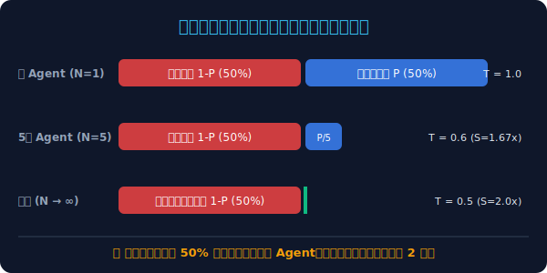
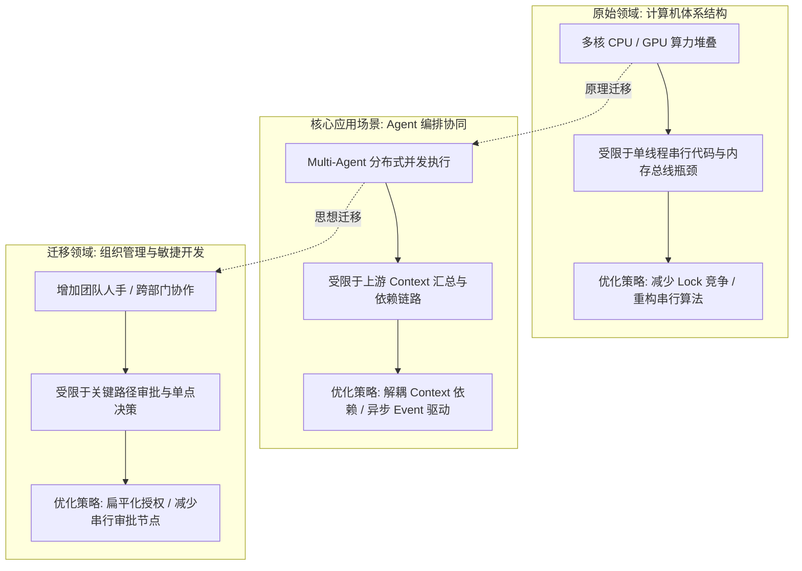

# 阿姆达尔定律（Amdahl's Law）
> **一句话核心摘要**：系统提升整体性能的加速比上限，由无法被并行化的串行部分决定；在 Multi-Agent 编排中，Agent 并行协同的提速上限永远被串行依赖牢牢锁死。

---

## 🔍 求真讲法：这个定理从哪里来？

### 背景与动机

1967 年，在 AFIPS（美国信息处理联合会）春季联合计算机会议上，计算机体系结构领域的先驱 **吉恩·阿姆达尔（Gene Amdahl）** 提交了一篇仅有 2 页、却彻底重塑了整个计算机工业界思想体系的论文。

当时，IBM 及整个行业正沉浸在一个无比乐观的“多处理机狂想曲”中：人们普遍认为，只要简单地将几十个、几百个 CPU 堆叠在一起，计算机的处理性能就能呈线性增长几十或几百倍。

然而，Amdahl 凭借深厚的架构经验泼了一盆冰凉的冷水。他指出：**无论计算机系统拥有多么庞大的并行计算能力，任何复杂任务中总有一部分逻辑是无法拆分、必须一步接一步串行执行的。** 正是这些看似微小的“串行死角”，会像不可逾越的墙一样，迅速封顶整个系统的性能上限。

这一洞察后来被称为**阿姆达尔定律（Amdahl's Law）**，它成为了现代并行计算、分布式系统架构以及 Agent 编排协同中最深刻的物理法则之一。

---

### 核心假设

阿姆达尔定律的数学推导基于以下三个关键的前提假设：

1. **固定工作量假设（Fixed-size Workload）**：待解决的问题规模是恒定不变的（例如处理固定大小的文件或完成一个特定的 workflow），我们引入更多算力或 Agent 仅仅是为了**缩短执行时间**，而不是扩大处理规模。
2. **任务二分假设（Strict Binary Partitioning）**：系统中的任务可以被完美且严格地划分为两部分——完全不可并行的“绝对串行部分”与可以被无缝拆分的“完全可并行部分”。
3. **零并行开销假设（Zero Overhead）**：增加并行处理器或 Agent 节点时，节点之间的通信、上下文同步、调度与资源竞争开销忽略不计（\(O(1)\) 开销）。

---

### 推导过程

让我们带读者走一遍简单而优雅的数学推导路径。

假设某个任务在单处理器（或单 Agent）上执行的总时间为 \(T_1 = 1\)。

我们将任务拆解为两部分：
- **可并行部分比例**：设为 \(P\)（\(0 \le P \le 1\)）
- **不可并行（串行）部分比例**：设为 \(1 - P\)

现在，如果我们引入 \(N\) 个并行处理节点（如 \(N\) 个 CPU 核心或 \(N\) 个协同 Agent）：
- **串行部分**：依然无法加速，耗时保持为 \(1 - P\)
- **并行部分**：被 \(N\) 个节点等分，耗时缩短为 \(\frac{P}{N}\)

因此，在 \(N\) 个并行节点协同下的**总执行时间 \(T_N\)** 为：
$$T_N = (1 - P) + \frac{P}{N}$$

**系统加速比（Speedup, \(S\)）** 定义为“单节点原始耗时”与“多节点并行耗时”的比值：
$$S(N) = \frac{T_1}{T_N} = \frac{1}{(1 - P) + \frac{P}{N}}$$

#### 极限推导（极限加速比上限）
当并行节点数无限增加，即 \(N \to \infty\) 时，并行部分的耗时 \(\frac{P}{N} \to 0\)。此时加速比达到数学极限：
$$S_{max} = \lim_{N \to \infty} \frac{1}{(1 - P) + \frac{P}{N}} = \frac{1}{1 - P}$$

> **关键结论**：系统的最大加速比仅由串行比例 \(1 - P\) 决定！
> - 如果一个 Agent 工作流中有 **50%** 的任务必须串行（\(1-P=0.5\)），无论你启动 100 个还是 100 万个 Agent，系统加速比的绝对极限就是 **\(1 / 0.5 = 2\) 倍**！
> - 如果串行比例为 **10%**（\(1-P=0.1\)），加速比上限永远不会超过 **10 倍**！

#### 直观比例与耗时变化图示

以下 SVG 图示直观展现了在串行占比 50% 时，增加并行节点数对总耗时和加速比的边际效益递减现象：
  
  
  
---

### 直觉理解

为了更通俗地感受到阿姆达尔定律的“味道”，我们来看一个生活中的类比：**“建造房子与凝固水泥”**。

假设建造一座房子总共需要 100 个工时：
1. **挖地基与搬砖**（耗时 50 工时）：这是可并行任务。如果雇佣 1 个工人，需要 50 小时；如果雇佣 50 个工人同时搬，1 小时就能干完。
2. **等待浇筑的水泥自然凝固**（耗时 50 小时）：这是绝对串行任务。由于化学反应的物理限制，水泥必须静置等待 50 小时才能承重。

哪怕你雇佣了 10 万个工人把砌墙时间压缩到了 **1 秒钟**，你依然必须在工地死等 **50 个小时** 让水泥凝固。这座房子的建设周期永远无法缩短到 50 小时以下！

在架构设计中，**串行部分就是那个“必须等待凝固的水泥”**。

---

## 🛠️ 求存讲法：这个定理能做什么？

### 核心用途

在系统工程与软件架构中，阿姆达尔定律扮演着“警醒者”与“投资指南”的角色：

1. **破除“盲目堆叠资源”的幻觉**：防止架构师在未分析瓶颈的情况下，盲目增加 CPU 核心、服务器节点或 Agent 数量。
2. **指明性能优化的投入产出比（ROI）**：
   - 优化占比仅 5% 的可并行任务，收益极其微弱；
   - **缩小串行部分比例 \(1 - P\)**（比如将 50% 的串行依赖通过解耦降至 5%），系统加速比上限将从 **2 倍飞跃至 20 倍**！

---

### 跨领域迁移

阿姆达尔定律的思想远远超出了计算机体系结构，它在软件工程、Agent 多智能体协同以及企业管理中均适用：

---

### 适用边界（假设再探）

阿姆达尔定律并非万能公式，它的成立有着明确的边界条件：

| 维度 | 阿姆达尔定律成立（适用于） | 假设破灭/不成立（不适用于） |
| :--- | :--- | :--- |
| **问题规模** | **强缩放（Strong Scaling）**：问题规模固定，只追求速度变快。 | **弱缩放（Weak Scaling）**：问题规模随着算力增加而等比例扩大（适用 **古斯塔夫森定律 Gustafson's Law**）。 |
| **协同开销** | **低开销（\(O(1)\) 通信）**：节点增多不额外增加系统通信与调度负担。 | **高开销（\(O(N^2)\) 通信）**：Agent 节点增多导致消息广播和上下文同步开销爆炸，甚至出现“越并行越慢”。 |
| **依赖关系** | **二分依赖**：任务可以明确切分为“纯串行”与“纯并行”。 | **动态依赖/概率依赖**：依赖图谱动态变化，存在推测执行或投机并行（Speculative Execution）。 |

---

### ✅ 正例：生活/学习/工作中的运用

#### 场景 1（核心）：Agent 编排中的全栈代码生成与集成流水线
在一个 Multi-Agent 软件开发系统中，流程如下：
1. **需求分析与架构设计**（Agent 必须串行推理，耗时 20 分钟）；
2. **拆分 10 个子模块并发编写**（10 个 Coder Agent 并行，原本耗时 60 分钟，并行后降至 6 分钟）；
3. **系统整体代码集成与单元测试**（依赖所有模块完成，必须串行，耗时 14 分钟）。

总耗时从 94 分钟降至 40 分钟（加速比 2.35 倍）。**此时即使你增加到 1000 个 Coder Agent，把编写耗时降为 0，整体耗时依然卡在 34 分钟（极限加速比 2.76 倍）**。必须优化需求分析与集成测试这两个串行节点，才能突破瓶颈。

#### 场景 2（核心）：分布式 Deep Research Agent 研报生成
编排 50 个 Search Agent 分头爬取 50 个行业数据（完全并行，耗时 5 秒），最后由 1 个 Master Summarizer Agent 统一读取所有上下文并撰写长篇研报（由于注意力机制和逻辑串联，必须串行耗时 45 秒）。
- 串行比例高达 90%；
- 投入再多 Search Agent（哪怕 10000 个），研报生成耗时永远不可能少于 45 秒。

#### 场景 3：CI/CD 自动化构建流水线
前端项目构建中，编译 200 个独立组件可以利用多核并行，耗时从 100 秒降至 10 秒；但最后一步打包成 bundle 并在服务器部署只能串行运行（耗时 30 秒）。无论 Jenkins 调度机增加到多少核，构建耗时上限始终是 30 秒。

#### 场景 4：团队开会与方案决策
10 个员工各自撰写季度规划（并行 2 小时）；写完后必须召开全员会议逐一讨论并由老板最终签字（串行 4 小时）。增加再多员工并行写方案，也不能缩短这 4 小时的串行决策链。

---

### ❌ 反例：假设不成立时会怎样？

#### 反例 1：通信爆炸导致的“逆加速现象”（Negative Speedup）
- **前提假设破坏**：“零并行开销”假设破灭。
- **现象**：在一个 Multi-Agent 自由讨论组（如 20 个 Agent 共同协商制定旅游路线）中，每个 Agent 发言后都必须向其他 \(N-1\) 个 Agent 广播上下文。通信复杂度为 \(O(N^2)\)。
- **结果**：当 Agent 数量从 5 个增加到 50 个时，Agent 消耗在处理接收到的冗余上下文上的时间远超并发思考带来的收益，**总耗时反而不降反升**（加速比 \(S < 1\)）。

#### 反例 2：古斯塔夫森定律（Gustafson's Law）下的 AI 大模型训练
- **前提假设破坏**：“固定工作量”假设破灭。
- **现象**：在训练万亿参数大模型时，投入的 GPU 从 100 张扩展到 10,000 张。工程师的目标不是“把 100GB 的数据快 100 倍训练完”，而是“在相同的时间（如 2 周）内训练 10TB 的数据”。
- **结果**：随着算力增加，问题规模 \(G(N)\) 等比例扩大，串行部分所占的**相对时间比例**被极大稀释。系统加速比随 GPU 数量呈现近乎线性的增长。

---

## 💡 思考：值得深究的问题

1. **[Agent 编排相关]** 在 Agent 工作流中，如果串行依赖 \(1 - P\) 无法在逻辑上消除，我们能否通过 **“推测执行（Speculative Execution / Draft Agent）”** （即在上一阶段结果未出时，让 downstream Agent 基于概率预测预先生成）来突破阿姆达尔定律的上限？这种做法会引入什么新的副作用？
2. **[架构设计]** 为什么在 Multi-Agent 架构设计中， **“减少 Agent 之间的上下文强依赖（Decoupling Context）”** 往往比 **“提升单个 Agent 的推理速度（Faster Inference）”** 能带来数量级更高的整体提速？
3. **[数学推导]** 如果假设 Agent 间的通信协调开销随着节点数 \(N\) 呈平方级增加（即 \(T_{overhead} = k \cdot N^2\)），请写出此时系统的实际加速比公式 \(S(N)\)，并求出使系统性能达到极值的最佳 Agent 数量 \(N_{opt}\)。
4. **[管理学思考]** 软件工程经典法则“人月神话”（向进度落后的项目中添加人力只会让项目更落后）与阿姆达尔定律在本质上有何异同？

---

## 📚 延伸阅读

1. **Gustafson's Law（古斯塔夫森定律）** ：揭示了在可扩展问题规模下，如何通过打破固定工作量假设实现近乎线性的超大算力加速比。
2. **Brooks' Law（布鲁克斯法则 / 《人月神话》）** ：探讨了团队沟通成本（\(O(N^2)\) 开销）与任务串行性对软件工程进度的约束。
3. **Gene Amdahl 1967 原始论文**：*Validity of the single processor approach to achieving large scale computing capabilities*, AFIPS Conference Proceedings.
