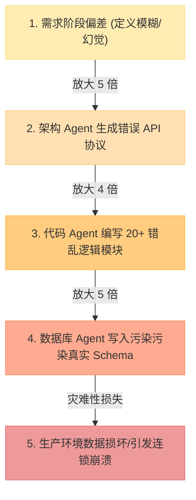

<变更成本曲线（Boehm's Cost of Change Curve）>
> 软件缺陷修复或需求变更的代价随着项目生命周期的推移呈指数级上升；在 Agent 编排网络中，“左移校验”（Shift-Left Verification）是防止 Token 爆炸与物理副作用蔓延的黄金法则。

---

## 🔍 求真讲法：这个定理从哪里来？

### 背景与动机

20 世纪 70 年代末，软件工程界正处于著名的“软件危机”（Software Crisis）阵痛期。随着大型主机系统与防务、航空项目的膨胀，软件项目频繁陷入预算超支、严重延期甚至整盘崩溃的泥潭。

当时任职于美国 TRW 公司的首席系统科学家 **巴里·波姆（Barry Boehm）** 观察到一种极其反常却普遍存在的现象：为什么同样是修改一行代码逻辑，项目初期修改只需要半小时，而在系统交付前夕修改却需要耗费整整几周，甚至导致几十个关联模块跟着崩溃？

波姆收集并分析了大量涉及航天、国防及大型企业的实证统计数据（Empirical Data），于 1981 年在其划时代著作《软件工程经济学》（*Software Engineering Economics*）中提出了著名的 **变更成本曲线（Boehm's Cost of Change Curve）**。

波姆用数据揭示了一个残酷的经济学事实：**软件生命周期中发现并修复缺陷的成本，不是线性增加的，而是呈现陡峭的指数级（Exponential）增长。**

```
【需求定义】($1)  ──>  【架构设计】($5)  ──>  【编码实现】($10)  ──>  【集成测试】($20-$50)  ──>  【生产上线】($100-$1000+)
```

---

### 核心假设

变更成本曲线的指数级增长并非凭空产生，而是建立在以下四个核心前提假设之上：

1. **阶段依赖性假设（Sequential Dependency）**：系统的后续阶段高度依赖前置阶段的输出。上游的每一个决策（如需求或架构定义），都是下游所有建造活动的基石。
2. **错误级联放大假设（Error Cascade & Fan-Out）**：上游的一个微小模糊或误读，会在下游衍生出 N 个模块设计、2N 个具体实现函数以及 5N 个测试用例。
3. **隐性知识与上下文丢失假设（Context Erosion）**：随着时间推移，原始决策者的隐性上下文逐渐淡化，后期参与修复的人员需要付出巨额的理解与阅读成本（Context Recovery Cost）。
4. **回滚破坏半径扩散假设（Blast Radius Expansion）**：越到后期，系统与外部数据、数据库、第三方接口以及真实用户的耦合度越高，变更引发的破坏半径（Blast Radius）呈现几何级数扩散。

---

### 推导过程

#### 1. 成本指数增长的数学表达

若将项目生命周期离散化为阶段 $t \in \{1, 2, 3, 4, 5\}$（分别对应：需求 Clarification、架构 Architecture、编码 Code、测试 Test、生产 Deployment），在阶段 $t_0$ 引入但在阶段 $t$ 才被发现和修复的缺陷成本 $C(t)$ 可表示为：

$$C(t) = C_0 \cdot \gamma^{(t - t_0)}$$

其中：
- $C_0$ 为在缺陷产生本阶段即时拦截的基线成本。
- $\gamma > 1$ 为放大系数（根据 Boehm 的实证测量，在传统瀑布模型中 $\gamma$ 通常在 $3 \sim 10$ 之间）。

#### 2. 可视化图示：Boehm 成本曲线与现代敏捷/Agent 校验平坦化

<svg viewBox="0 0 600 300" width="100%" height="auto" xmlns="http://www.w3.org/2000/svg">
  <!-- Background Grid & Axes -->
  <rect width="600" height="300" fill="#f8f9fa" rx="8" />
  <line x1="60" y1="250" x2="560" y2="250" stroke="#6c757d" stroke-width="2" />
  <line x1="60" y1="30" x2="60" y2="250" stroke="#6c757d" stroke-width="2" />
  
  <!-- Axis Labels -->
  <text x="310" y="285" font-size="12" fill="#495057" text-anchor="middle" font-weight="bold">生命周期阶段 (Lifecycle Stage)</text>
  <text x="25" y="140" font-size="12" fill="#495057" text-anchor="middle" transform="rotate(-90 25,140)" font-weight="bold">修复/变更成本 (Cost)</text>

  <!-- Stage Tick Marks & Text -->
  <text x="80" y="268" font-size="11" fill="#495057" text-anchor="middle">1.需求/规划</text>
  <text x="190" y="268" font-size="11" fill="#495057" text-anchor="middle">2.架构设计</text>
  <text x="300" y="268" font-size="11" fill="#495057" text-anchor="middle">3.编码/生成</text>
  <text x="410" y="268" font-size="11" fill="#495057" text-anchor="middle">4.集成测试</text>
  <text x="520" y="268" font-size="11" fill="#495057" text-anchor="middle">5.生产上线</text>

  <!-- Curve 1: Traditional Boehm Exponential Curve (Red) -->
  <path d="M 80,240 Q 300,230 410,160 T 530,40" fill="none" stroke="#dc3545" stroke-width="3.5" />
  
  <!-- Curve 2: Shift-Left & Modern CI/CD Agent Flattened Curve (Green) -->
  <path d="M 80,242 C 200,235 350,210 530,170" fill="none" stroke="#198754" stroke-width="3" stroke-dasharray="6,4" />

  <!-- Points & Highlights -->
  <circle cx="530" cy="40" r="5" fill="#dc3545" />
  <text x="525" y="28" font-size="11" fill="#dc3545" font-weight="bold" text-anchor="end">传统 Boehm 指数曲线 (高达 100x-1000x)</text>

  <circle cx="530" cy="170" r="5" fill="#198754" />
  <text x="540" y="165" font-size="11" fill="#198754" font-weight="bold">左移校验/平坦化曲线 (Flattened Curve)</text>

  <!-- Key Annotations -->
  <line x1="80" y1="240" x2="80" y2="40" stroke="#adb5bd" stroke-width="1" stroke-dasharray="2,2" />
  <text x="90" y="60" font-size="11" fill="#0d6efd" font-weight="bold">🎯 左移拦截区 (Shift-Left Zone)</text>
</svg>

#### 3. 错误级联的放大机制流程



---

### 直觉理解

想象你在建造一栋 50 层高的大厦：

- **设计图阶段（需求/规划）**：如果你发现阳台设计偏了 1 米，建筑师只需要拿橡皮擦花 10 秒钟擦掉，再用铅笔重新画一条线。成本是一块橡皮擦。
- **地基施工阶段（编码前）**：如果你在地基刚浇筑时发现位置偏了，你需要停工、拆除钢模、重新平整土地。成本是几十万水泥费用和数天工期。
- **大厦封顶阶段（生产上线）**：如果大厦建到了 50 层，你突然发现 1 楼的核心承重墙偏了 1 米导致整体结构倾斜——此时你无法“局部修改”，唯一的办法是炸毁整座大厦重新来过！

这就是变更成本曲线的直觉味道：**试图在结果生成后去纠正源头的错误，就等于在 50 层大厦封顶后再去改 1 楼的地基。**

---

## 🛠️ 求存讲法：这个定理能做什么？

### 核心用途

1. **指导质量保证（QA）重构**：从传统的“后置测试”（在软件写完后再找 Bug）转向“前置验证”（需求评审、架构静态检查、静态类型系统）。
2. **推动“左移”原则（Shift-Left Testing）**：将测试、安全审计与合规检查尽可能拖向生命周期的最左端（需求与设计阶段）。
3. **软件投资决策（ROI 计算）**：为“为什么要在前期澄清和架构设计上投入 30% 预算”提供坚实的经济学理据。

---

### 跨领域迁移

从传统软件工程迁移到现代 **Multi-Agent 编排协作网络**，Boehm 曲线呈现出极强的映射性：

```mermaid
graph LR
    subgraph 传统软件工程 (Software Engineering)
        S1[需求分析] --> S2[架构设计] --> S3[代码编写] --> S4[集成测试] --> S5[生产部署]
    end

    subgraph LLM Multi-Agent 编排 Pipeline
        A1[Requirement Clarifier Agent] --> A2[Architecture Planning Agent] --> A3[Code/Tool Call Agent] --> A4[Execution & Sandbox Agent] --> A5[Production Environment Action]
    end

    S1 -.-> A1
    S2 -.-> A2
    S3 -.-> A3
    S4 -.-> A4
    S5 -.-> A5
```

在 Multi-Agent Pipeline 中，上游 Agent 的“幻觉（Hallucination）”或“意图推导偏差”，若未被及时捕捉：
- **Token 成本指数增长**：下游多个 Worker Agent 会围绕错误的前提生成数以万计的无效 Token。
- **时间与重试延迟爆表**：长链条递归重试导致系统高延迟。
- **物理副作用不可逆**：下游 Agent 调用的外部 API、数据库删改、邮件发送等操作产生无法简单回滚的破坏。

---

### 适用边界（假设再探）

Boehm 变更成本曲线并不是在所有场景下都呈现极其陡峭的指数形态。现代敏捷开发（Agile）与微服务架构在一定程度上**平坦化（Flattened）**了曲线。

| 维度 | 传统瀑布架构 / 单体应用 | 现代敏捷 / 微服务 / CI-CD | 物理/写操作 Multi-Agent Pipeline | 无副作用纯文本 Agent Pipeline |
| :--- | :--- | :--- | :--- | :--- |
| **曲线斜率** | **陡峭指数级** ($\gamma \approx 5\sim10$) | **平坦化** ($\gamma \approx 1.2\sim1.5$) | **陡峭指数级** ($\gamma \approx 8\sim20$) | **极平坦近乎常数** ($\gamma \approx 1.1$) |
| **决定因素** | 耦合度高、手动测试慢、上线周期长 | 自动化测试、解耦模块、灰度发布 | 外部物理副作用（数据库/资金/接口）不可逆 | 纯内存计算、Token 可重置、无外部状态改变 |
| **拦截策略** | 严苛的大而全前期设计（BDUF） | 持续集成、小步快跑、单体演进 | **前置 Guardrails / 步骤级 Checkpoint** | 允许错误发生，后置 Self-Refine |

> [!IMPORTANT]
> **结论**：当 Agent 具备“物理写操作”（如操作数据库、发邮件、划扣资金）时，Boehm 曲线极其陡峭；当 Agent 仅执行“无副作用的文本推理”时，变更成本曲线趋于平坦。

---

### ✅ 正例：生活/学习/工作中的运用

#### 1. Agent 编排：需求 Clarification Agent 的“左移”Guardrail 拦截
在构建企业级数据分析 Agent 时，用户输入：“把我们库里没用的日志清一下”。
- **未左移（高成本）**：需求直接传给 SQL Agent，SQL Agent 误生成 `DROP TABLE system_logs;` 并由 Execution Agent 直接执行。恢复数据库需数天并导致系统停服，损失数万元。
- **左移拦截（低成本）**：在 Pipeline 最左端设置 **Requirement Clarification Agent**。拦截检测到语义模糊与高危倾向，立即向用户二次确认：“您指的是删除 30 天前的临时审计日志，还是清空整个系统日志表？”——仅消耗 80 个 Token（约 0.001 元），将巨大灾难化解在萌芽期。

#### 2. Agent 编排：Architecture Agent 的强类型 Schema Contract 校验
在 Multi-Agent 软件开发流水线中，Architecture Agent 负责输出 OpenAPI 规范 JSON。
- 架构节点输出后，立刻通过 Pydantic / JSON Schema 编译器进行静态结构校验（Shift-Left Evaluation）。
- 若 Schema 缺失必需字段，在第 2 步立刻退回给 Architecture Agent 修正（花费 500 Token）；避免了下游 5 个 Code Generation Agent 在错误规范下并行生成 3,000 行不可编译的代码（节省 100,000 Token 及几分钟耗时）。

#### 3. 软件开发：CI/CD 单元测试与 Pre-commit 门禁
开发团队引入 `pre-commit` hook 与 GitHub Actions：
- 开发者提交代码时，本地语法检查与单元测试在 3 秒内阻断了空指针异常。成本仅为开发者 10 秒钟的修改时间。
- 相比于发布上线后由用户触发 Bug、客服工单上报、紧急热修复（Hotfix）、重新灰度的整套流程，成本降低了 100 倍以上。

#### 4. 产品设计：MVP 低保真原型验证
创业团队在开发一款新 App 前：
- 用 Figma 绘制低保真交互草图，找 10 个目标用户进行 30 分钟访谈，发现“某核心功能根本无人关心”。
- 团队立即调整方向，仅损失 2 天的设计时间；避免了投入 5 名工程师开发 3 个月后无人问津的毁灭性灾难。

---

### ❌ 反例：假设不成立时会怎样？

#### 1. 陷入“分析瘫痪”（Analysis Paralysis）的过度前置
在需求高度不确定、处于极度早期探索的产品阶段，团队硬性套用 Boehm 曲线，要求在需求与架构阶段做到“绝对完美”。花费 3 个月编写了 200 页的超详尽设计文档，结果市场需求发生剧变，整个项目被直接关停。
- **原因**：当“变更的方向”本身完全未知时，过度的前置设计反而构成了最大的浪费（Sunk Cost）。

#### 2. 在“无副作用/纯创意型 Agent”中强制增加前置人工审批
在一个负责创作小说或生成营销文案的 Multi-Agent Pipeline 中，架构师在每个 Sub-Agent 之间都插入了严格的人工审批（Human-in-the-loop Checkpoint）。
- **原因**：创意生成属于无副作用、可低成本重试（Retry）的场景。后置发现文案不好只需点一次“重新生成”（Cost 近乎为 0），前置强行拦截反而严重破坏了 Agent 的自动化流畅度与响应速度。

#### 3. 强行在单体旧系统中做“伪左移”
在没有自动化测试基础设施的古老 Legacy 系统中，团队宣称要“左移”。他们在需求阶段召开了十几次长会，但由于代码库高度耦合且无测试覆盖，上线时依旧触发了大量的未知隐患。
- **原因**：缺少“自动化验证”能力时，“左移”只会沦为口头上的过早优化（Premature Optimization），无法真正降低后期变更成本。

---

## 💡 思考：值得深究的问题

1. **Token 延迟 vs 崩溃成本的黄金平衡点**：在 LLM Agent 编排中，每增加一层前置校验 Agent（Guardrail / Evaluator），都会增加系统的首字延迟（TTFT）与固定 Token 开销。如何建立数学模型，精确计算“前置校验开销”与“后置失败重试代价”的期望平衡点（Optimal Checkpoint Threshold）？
2. **状态快照（State Snapshotting）如何重塑 Agent 的 Boehm 曲线**：现代 Agent 框架（如 LangGraph, AutoGen）引入了图节点状态持久化与 Rewind/Time-travel 机制。这种能力是否彻底平坦化了 Agent 的变更成本曲线？它能否完全替代前置 Guardrails？
3. **Self-Correction 智能体的“错误级联陷阱”**：当 Agent 具备 Self-Refine（自我反思修复）能力时，如果反思发生在 Pipeline 的末端（后置），Agent 可能会基于错误的中间结果进行“自我合理化修补”，从而引发二次幻觉。我们该如何将 Self-Correction 机制有效“左移”？
4. **代码生成时代，成本瓶颈的转移**：当 AI 代码生成工具把“编码实现”的成本压到趋近于零时，Boehm 成本曲线的最高点与最陡峭段会转移到哪里？（提示：需求意图理解与系统整合测试）。

---

## 📚 延伸阅读

1. **Barry W. Boehm** - 《*Software Engineering Economics*》 (1981, Prentice-Hall)
   - *变更成本曲线的奠基之作，系统阐释了 COCOMO 模型与软件工程经济学理论。*
2. **Kent Beck** - 《*Extreme Programming Explained: Embrace Change*》
   - *探讨敏捷开发、TDD（测试驱动开发）与 CI/CD 如何重构并平坦化传统 Boehm 成本曲线。*
3. **Agent Pipeline & Guardrails 实践**：
   - *LangGraph Checkpoint & Time-Travel Architecture Documentation*
   - *NeMo Guardrails & Guardrails AI Framework for LLM Left-Shift Verification*
