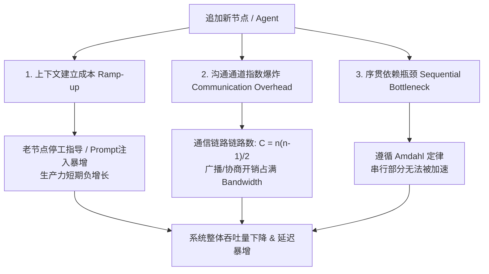
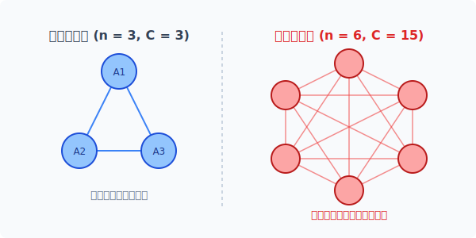
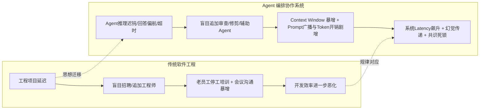

# 布鲁克斯法则（Brooks's Law）
> 一句话核心摘要：向已经延迟的系统中盲目堆叠协作节点（无论是人类工程团队还是多 Agent 编排系统），不仅无法拯救进度，反而会因上下文建立成本、通信开销指数爆炸以及不可拆分依赖而让系统陷入更深的延迟泥潭。

---

## 🔍 求真讲法：这个定理从哪里来？

### 背景与动机

20 世纪 60 年代，IBM 展开了一场计算机历史上豪赌般的工程巨著——开发支持 IBM System/360 阵营的操作系统 **OS/360**。当时，IBM 投入了数千名顶尖工程师，耗资超过 50 亿美元（远超原子弹的研制成本），然而项目不仅陷入严重的预算超支，交付日期更是一推再推。

负责该项目的总工程师 **弗雷德里克·布鲁克斯（Frederick P. Brooks Jr.）** 在带领团队艰难爬出工程泥潭后，深刻反思了这一工程史诗级的“灾难”。1975 年，他在其划时代的著作《人月神话》（*The Mythical Man-Month*）中提出了这一震惊业界、迄今仍被尊为软件工程第一铁律的法则：

> **"Adding manpower to a late software project makes it later."**
> （向已延迟的软件项目中追加人手，只会让项目更加延迟。）

当时传统工业界的管理者习惯于线性数学思维：“如果 1 个人干 10 天能盖好一面墙，那么 10 个人干 1 天就能盖好”。布鲁克斯指出，软件开发并非“砌砖”，而是“复杂脑力协同”。最著名的比喻便是：**“孕育一个婴儿需要 9 个月，无论你安排多少名孕妇，都无法在 1 个月内生出孩子。”**

```
 传统工业思维 (线性可叠加)            软件与Agent复杂协同 (布鲁克斯效应)
┌─────────────────────────┐         ┌─────────────────────────┐
│ 1人 × 10天  = 10人月    │         │ 1人 × 10天  = 10天      │
│ 10人 × 1天  = 10人月    │         │ 10人 × 1天  = 30天 (延迟)│
└─────────────────────────┘         └─────────────────────────┘
```

---

### 核心假设

布鲁克斯法则的成立建立在以下 **3 个关键前提假设** 之上：

* **假设 1：项目/系统已经处于延迟或故障状态（Late Project / Debounced System）**：任务时间窗口紧迫，原有节点已产生积压或异常。
* **假设 2：任务之间存在不可解耦的序贯依赖（Task Interdependency & Sequential Constraints）**：处理流程包含逻辑前后依赖，无法简单进行无限粒度的并行切分。
* **假设 3：新增节点存在非零的上下文同步与沟通摩擦（Non-zero Context Ramp-up & Communication Overhead）**：新节点无法瞬间拥有全局先验知识，且节点间存在信息交换成本。

---

### 推导过程

为何追加资源会导致更严重的延迟？我们可以从数学与系统论的角度将其剖析为三个阶梯式递进的开销：



#### 1. 重新培训与上下文建立成本（Ramp-up Time）
新节点（新员工或新 Agent）进入系统时，必须先吸收上下文（Context Window / Domain Knowledge）。
* **工程场景**：老工程师必须暂停核心开发，花费几周时间带新人熟悉代码库和架构。
* **Agent 场景**：新增 Agent 需要载入历史对话 Memory、工具链定义描述（Tools Schema）以及 System Prompt。主控 Agent 必须花费额外的计算与 Token 传输去“交代背景”。

#### 2. 沟通通道与协同开销指数增长（Communication Overhead）
在一个包含 $n$ 个独立协同节点的系统里，潜在的双向通信通道数 $C$ 为：

$$C = \frac{n(n - 1)}{2} = O(n^2)$$

* 当 $n = 3$ 时，通信链路为 $3$ 条；
* 当 $n = 6$ 时，通信链路激增至 $15$ 条；
* 当 $n = 20$ 时，通信链路高达 $190$ 条！

下面直观地展示了节点增加对系统通信拓扑的剧烈冲击：

  

当多节点协同开销（Communication + Overhead）超过新节点带来的算力边际增量时，系统的总产出曲线会产生拐点，陷入**负收益区间**。

#### 3. 任务的可拆分性限制（Task Divisibility）
根据 **阿姆达尔定律（Amdahl's Law）**，假设任务中不可并行的串行比例为 $s$ ($0 \le s \le 1$)，无论增加多少节点 $N$，理论最大加速比受限于：

$$\text{Speedup}(N) = \frac{1}{s + \frac{1-s}{N}} \xrightarrow{N \to \infty} \frac{1}{s}$$

若一个推理任务中 50% 的步骤必须等待上一步生成结果（ $s=0.5$ ），哪怕堆叠一万个 Agent，加速比上限也绝不可能超过 2 倍。

---

### 直觉理解

想象一个繁忙的餐厅后厨：

假设原本只有一位主厨在给一道复杂的法餐做酱汁调味，突然顾客开始抱怨出菜太慢（项目延迟）。

经理非常焦虑，一口气往这个只有 3 平方米的灶台前挤进了 5 位新厨师。结果如何？
1. **培训摩擦**：老主厨不得不停下手头的火候控制，花费 10 分钟给 5 位新厨师解释这锅汤熬到了哪一步、盐放了多少。
2. **空间碰撞**：5 个人在一个窄小的空间里争抢勺子、锅具和调料瓶，光是问“盐在哪里？你切完胡萝卜了吗？”就吵成一片。
3. **不可拆分**：这道酱汁必须先炖煮 20 分钟才能勾芡，5 个人同时盯着这锅汤，炖煮的 20 分钟一秒也不会减少。

最终，出菜速度不仅没有变快，汤还熬糊了。这就是布鲁克斯法则的现实味道。

---

## 🛠️ 求存讲法：这个定理能做什么？

### 核心用途

在软件项目管理和分布式系统架构设计中，布鲁克斯法则提供了极其关键的防守性指导：
1. **止损决策依据**：当项目发生延期时，拒绝“通过加人拯救进度”的直觉诱惑。
2. **正确应对策略**：面对延期，唯三有效的工程杠杆是：**砍需求（Trim Scope）**、**重写解耦架构（Decouple Architecture）** 或 **重新评估延长交付时间（Adjust Deadline）**。
3. **控制协同边界**：指导团队与集群节点划分，保持微型自主单元（如 Amazon 的 2-Pizza Team 架构）。

---

### 跨领域迁移：从工程团队到 Agent 编排

在现代 AI 应用与大语言模型系统架构中，布鲁克斯法则正以惊人的相似性在 **Multi-Agent 协作/编排（Agentic Workflows & Swarm Systems）** 场景中重现。



当一个复杂的 Agent 流水线（例如多 Agent 协作写代码、生成研究报告）出现响应慢、幻觉累积或步骤卡顿时，开发者往往倾向于“再加一个 Refinement Agent 去审查”、“再加一个 Critic Agent 来纠错”、“再加两个 Search Agent 搜集补充信息”。

结果往往引发 **“Agent 版本的布鲁克斯陷阱”**：
1. **Context Window 膨胀（Ramp-up Cost）**：新 Agent 为了执行任务，必须被注入极其庞大的历史对话与中间状态，导致 Token 消耗成倍翻番，首包延迟（TTFT）大幅增加。
2. **Token & 协议广播风暴（Communication Overhead）**：Agent 之间互相发消息协商，全连接网状拓扑导致模型调用次数呈 $O(n^2)$ 增加，API 费用飙升甚至遭遇 Rate Limit。
3. **推理序贯瓶颈（Task Divisibility）**：代码编写与逻辑链推演本质上是深度序贯依赖的，追加的 Critic Agent 必须等 Worker Agent 吐完 Token 才能开始工作，并发收益为零。

---

### 适用边界（假设再探）

布鲁克斯法则并非物理定律，它的生效取决于“假设条件”。了解何时成立、何时失效，是避免误用该法则的关键。

| 维度 | 布鲁克斯法则**成立**（追加节点更慢） | 布鲁克斯法则**不成立**（追加节点加速） |
| :--- | :--- | :--- |
| **任务拆分度** | **高耦合、强序贯任务**<br>(如复杂推理、架构设计、算法重构) | **高度可并行、无状态任务**<br>(如批量网页抓取、独立文件格式转换) |
| **上下文建立成本** | **高依赖上下文**<br>(需要载入数万 Token 复杂系统状态/全局变量) | **零上下文/超小上下文**<br>(单次标准 API 查询、独立纯函数计算) |
| **沟通拓扑结构** | **网状全连接拓扑 (Mesh Network)**<br>(Agent 间自由讨论、互相质询、多方协商) | **严格单向管道/树状拓扑 (Pipeline/Star)**<br>(无节点间交叉沟通，仅向上汇总) |
| **节点初始化速度** | **高延迟冷启动**<br>(需要耗费大量计算资源与 Prompt 引导) | **瞬时零成本启动**<br>(标准预置 Agent/Serverless 算力节点) |

---

### ✅ 正例：生活/学习/工作中的运用

#### 场景 1：Agent 编排——“越审越慢”的智能写作流水线
* **背景**：某团队设计了一个生成长篇行业分析报告的 Agent 流水线。初始架构为：`Writer Agent` $\to$ `Reviewer Agent`。发现生成的报告偶尔有事实错误且耗时 1 分钟。
* **做法**：团队试图引入 `Fact-Checker Agent`、`Style-Editor Agent` 和 `Tone-Adjuster Agent` 协同治理。每个 Agent 拿到前序产生的所有上下文进行二次加工与质询。
* **结果**：整体流水线耗时从 1 分钟飙升至 8 分钟，Token 开销增长 600%。由于多个 Agent 对同一个段落产生冲突意见，在互相修正中陷入死循环（Consensus Deadlock）。
* **评价**：典型地陷入了追加 Agent 陷阱。

#### 场景 2：Agent 编排——分层星型拓扑（Map-Reduce）成功破除布鲁克斯限制
* **背景**：某代码审计 Agent 系统需要扫描包含 1000 个独立模块的项目。
* **做法**：设计者将任务切分为 1000 个互不干扰的静态分析任务，动态 Spawn 100 个同构的 `Scan-Agent`，每个 Agent **仅接收当前文件代码片段**（零全局 Context），处理完直接将结果输出给中央 `Aggregator Agent`。
* **结果**：审计时间从 30 分钟缩短至 1 分钟。
* **评价**：由于任务完全可拆分且解耦了沟通通道（通信开销由 $O(n^2)$ 降为 $O(n)$），假设不成立，因此成功实现线性加速。

#### 场景 3：项目管理——研发攻坚期“拉群灾难”
* **背景**：某核心业务系统在上线前夕发现了一个严重 Bug，项目经理非常焦虑，把前端、后端、运维、测试、DBA、产品经理等 25 个人全拉进一个“紧急攻坚微信群”。
* **做法**：群里每隔 5 分钟就有人问“进展如何？”、“谁改了配置？”，技术骨干不得不频繁停下来在群里回复排查细节。
* **结果**：技术骨干 80% 的精力消耗在解释和沟通上，定位 Bug 的时间被拉长了一倍。
* **评价**：向高压延迟项目追加沟通节点，极大地增加了协同开销。

#### 场景 4： Agent 编排中的“内存隔离与隔离代理”优化
* **背景**：在复杂 Agent 工作流中，主控 Agent 不盲目新增并行子 Agent，而是采用 **Context Sub-sampling (上下文子采样)** 机制。
* **做法**：当原 Agent 出现推演偏差时，不直接给它挂载“监督 Agent”，而是将其暂停，抽取最核心的诊断 Task 提交给专门的单功能工具组件（Tool Calling）处理，处理完毕后仅返回简短的结构化 JSON 结论。
* **结果**：消除了大段 Context 的重载开销，阻止了链路爆炸，成功解消了延迟。

---

### ❌ 反例：假设不成立时会怎样？

#### 反例 1：分布式爬虫 Agent 矩阵（完全独立可拆分）
* **现象**：向一个进度落后的网页抓取任务中，从 10 个爬虫 Agent 追加到 1000 个 Agent，抓取速度提升近 100 倍。
* **原因剖析**：各 Agent 之间完全不需要通信（ $C = 0$ ），且不需要吸收全局历史 Context（Zero Ramp-up Time），阿姆达尔定律中的串行比例 $s \approx 0$。核心假设全部失效，布鲁克斯法则在此不适用。

#### 反例 2：严格无状态的 Map-Reduce 代码重构
* **现象**：将 10,000 个 Python 2 语法文件重构为 Python 3 语法，追加 50 个转换 Agent 后，处理总时长成倍下降。
* **原因剖析**：文件之间无交叉引用依赖，每个 Agent 只需要独立处理单文件规则转换。节点间无需沟通，追加算力即等于追加生产力。

---

## 💡 思考：值得深究的问题

1. **Context Window 与布鲁克斯法则**：在 LLM Agent 编排中，如果未来模型的 Context Window 达到无限大且 Token 成本趋近于零，布鲁克斯法则在 Agent 系统中会消失吗？为什么？（提示：思考 Attention 机制的 $O(N^2)$ 计算复杂度与 Prompt 信息污染/迷失问题）。
2. **Agent 拓扑剪枝**：在动态 Agent 架构（如 Dynamic Multi-Agent Swarm）中，如何设计一套定量指标（如通信 Token 比率、串行依赖度），在检测到系统触发“布鲁克斯陷阱”时自动进行节点收缩（Scale In）与拓扑降级？
3. **粒度权衡（Granularity Dilemma）**：Agent 编排中“单 Agent 充当全能巨石（Monolithic Prompt）”与“拆分为数十个微型 Agent（Micro-Agents）”各自的风险是什么？如何在提示词过载与通信开销爆炸之间找到最佳均衡点？
4. **反布鲁克斯架构设计**：如何利用“记忆隔离（Memory Isolation）”和“单向消息队列（Asynchronous Event-Driven Bus）”将多 Agent 系统的沟通开销从 $O(n^2)$ 强制降低到 $O(n)$？

---

## 📚 延伸阅读

1. **《人月神话》（The Mythical Man-Month）** - Frederick P. Brooks Jr. 著
   * 经典必读图书，尤其是第 2 章《人月神话》与第 16 章《没有银弹》（No Silver Bullet）。
2. **阿姆达尔定律（Amdahl's Law）与康威定律（Conway's Law）**
   * 理解并行计算极限与系统架构/组织架构同构性的核心理论基础。
3. **Multi-Agent Orchestration Patterns: Router, Pipeline, and Swarm Architecture**
   * 深入探究现代 LLM 框架（如 LangGraph, AutoGen, CrewAI）中不同拓扑结构的沟通成本与性能开销对比。
