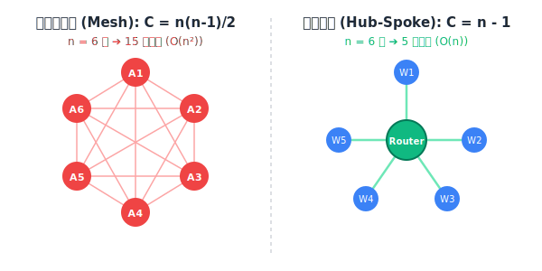
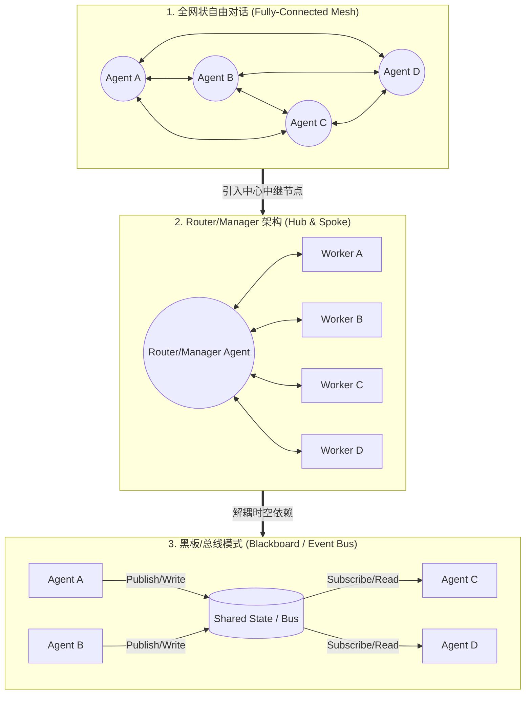
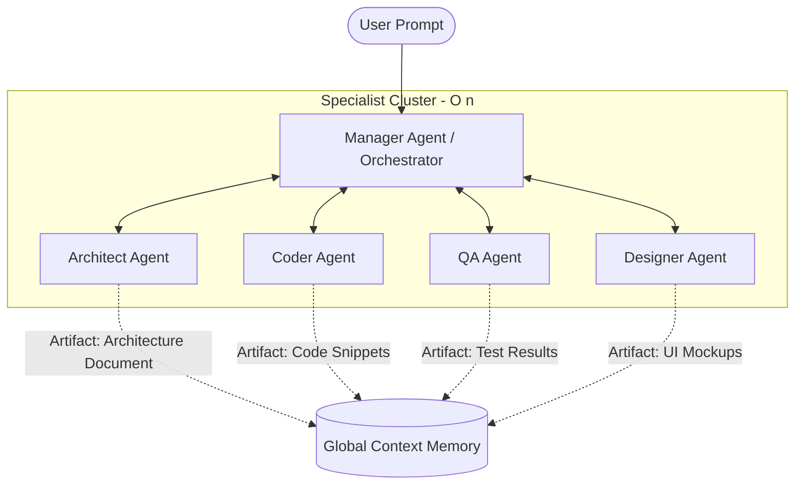

# 沟通通道公式（Communication Channels Formula）
> 一句话核心摘要：沟通成本随节点数量呈平方级爆发（ $C = \frac{n(n-1)}{2}$ ），唯有重构通信拓扑结构，才能避免系统在无尽的“信息噪音”与“协调内耗”中崩溃。

---

## 🔍 求真讲法：这个定理从哪里来？

### 背景与动机

在 20 世纪 60 年代，IBM 正在研发创时代的 Operating System/360（OS/360）操作系统。这是计算机史上最大规模的软件工程项目之一，数千名工程师投入其中，预算一再超支，进度严重滞后。

项目负责人**弗雷德里克·布鲁克斯（Frederick P. Brooks Jr.）** 为了赶进度，采取了最直觉的做法：**向项目组疯狂增派程序员**。

然而，令人震惊的现象发生了——**加入的人手越多，项目的进度反而拖延得越厉害**。

布鲁克斯在后来出版的软件工程圣经《人月神话》（*The Mythical Man-Month*）中提出了著名的**布鲁克斯法则（Brooks' Law）**：
> *"Adding manpower to a late software project makes it later."* （向落后的软件项目添加人力，只会让项目更加落后。）

为什么人多反而办不成事？因为**团队的总工作量不仅包含“具体的生产任务”，还包含“人与人之间为了达成一致所付出的沟通与协调开销”**。当团队人数线性增加时，成员之间潜在的互相沟通路径（通道）并不是线性增长，而是呈**平方级（ $O(n^2)$ ）剧烈爆炸**。

随后，项目管理协会（PMI）将其标准化收录进 **PMBOK（项目管理知识体系指南）**，正式确立了**沟通通道公式（Communication Channels Formula）**。

---

### 核心假设

沟通通道公式 $C = \frac{n(n-1)}{2}$ 的成立建立在以下 **4 个核心假设** 之上：

* **完全对称性**：任意两个节点 $A$ 和 $B$ 之间的沟通是双向且等价的（ $A \rightarrow B$ 与 $B \rightarrow A$ 共享同一条逻辑通道 ）。
* **全连接点对点（Fully-Connected Mesh）**：不存在中央中继器、代理人或层级隔离，所有节点均可无门槛、直接与其他任意节点进行私聊或广播。
* **无中心化无路由**：网络中没有统一的信息汇总与路由分发机制（无 Hub/Broker/Manager）。
* **独立维系开销**：每一条建立的沟通通道都会产生非零的维护成本（包括上下文对齐、信息同步、状态确认等）。

---

### 推导过程

#### 1. 组合数学推导
假设系统中有 $n$ 个独立参与节点（可以是项目成员、软件服务或 AI Agent）。
如果要让每两个节点之间都能直接建立私密通信，这就等价于从 $n$ 个元素中无序抽取 2 个元素构成的组合数：

$$C = \binom{n}{2} = \frac{n!}{2!(n-2)!} = \frac{n(n-1)}{2}$$

从代数展开来看：

$$C = \frac{1}{2}n^2 - \frac{1}{2}n \implies C \in O(n^2)$$

#### 2. 差分递增视角（ $n \to n+1$ ）
当系统中已有 $n$ 个节点时，通道数为 $C_n$。此时新增第 $n+1$ 个节点：
- 新节点必须与现存的 $n$ 个节点分别建立 1 条新的沟通通道。
- 新增通道数恰好为 $n$。

递推公式为：
$$C_{n+1} = C_n + n$$

其增长序列为标准的**三角形数（Triangular Numbers）**：
- $n = 1 \implies C = 0$
- $n = 2 \implies C = 1$
- $n = 5 \implies C = 10$
- $n = 10 \implies C = 45$
- $n = 50 \implies C = 1,225$
- $n = 100 \implies C = 4,950$

仅仅将节点翻 10 倍（10 人到 100 人），沟通通道却暴增了 **110 倍**！

#### 3. 可视化拓扑对比（SVG 图示）

下面的图示直观展示了**全网状拓扑（Mesh）的通道爆炸**与**星型拓扑（Hub-Spoke）的拓扑收敛**：

  

---

### 直觉理解

想象一下**两种派对交流场景**：

1. **自由私聊派对（Mesh 模式）**：
   在一个 10 人的房间里，没有主持人。如果每个人都必须单独和另外 9 个人各自窃窃私语 5 分钟，全场总共需要发生 **45 场一对一对话**。整晚的时间全消耗在重复自我介绍、对齐背景信息上。一旦其中两人达成了一个新共识，还必须分别跑去找剩下的 8 个人更新信息，否则就会出现致命的信息不对称。

2. **主持人主持派对（Hub-Spoke 模式）**：
   引入 1 名主持人（Router/Manager）。每个人有想法只需向主持人汇报（产生 9 条通道），由主持人统一汇总、去重并向大家发布总结。通道总数骤降至 **9 条**，效率提升了 500%！

---

## 🛠️ 求存讲法：这个定理能做什么？

### 核心用途

在传统工程与管理学中，沟通通道公式是指导**组织架构拆分**与**通信系统设计**的基本准则：

1. **控制团队规模极限（Pizza Team 原则）**：
   亚马逊创始人贝佐斯提出著名的“两个披萨原则（Two-Pizza Team Rule）”——一个团队的规模不应大到两个披萨不够吃（通常为 5～8 人）。当 $n=7$ 时，沟通通道为 21 条，人力尚能维持高效协商；若团队扩展到 20 人，通道暴增至 190 条，团队将陷入“开会整整一天，却没有任何产出”的泥潭。

2. **指导软件系统解耦**：
   在微服务或分布式系统中，服务之间如果采用全网状的 Mesh 点对点调用（例如每个微服务直接 RPC 调用其他所有微服务），网络连接数与配置依赖关系将呈 $O(n^2)$ 爆炸。系统会变得极度脆弱，任何一个微服务的变动都会引发全网涟漪效应。

---

### 跨领域迁移：多 Agent 编排协作（Multi-Agent Systems）

随着大语言模型（LLM）的发展，多 Agent 系统（MAS）正在成为复杂任务处理的主流架构。然而，**Agent 系统的沟通开销远比人类团队更加昂贵**——人类开会消耗时间，Agent 盲目沟通消耗的是**实打实的 Token 费用、Context 污染以及系统死锁风险**！

#### 1. 多 Agent 场景中的 $O(n^2)$ 灾难
若未建立严格的通信规范，允许 $n$ 个 Agent 之间自由 Prompt 交互或广播：
- **Token 爆炸**：系统消息量呈 $O(n^2)$ 增加，每一次交互都在消耗昂贵的 API Token。
- **上下文污染（Context Pollution）**：Agent 的 Context Window 填充了海量无用的点对点对话历史，导致 LLM 注意力分散、出现严重幻觉（Hallucination）。
- **死锁与环形等待（Deadlock）**：Agent A 等待 Agent B 确认，Agent B 等待 Agent C，Agent C 又在等待 Agent A，整个 Multi-Agent 状态机卡死。

#### 2. 拓扑优化策略迁移路径

通过引入拓扑隔离，可以将沟通复杂度从 $O(n^2)$ 降至 $O(n)$ 甚至 $O(\log n)$：

---

### 适用边界（假设再探）

沟通通道公式并不是在所有场景下都会导致 $O(n^2)$ 的物理消耗。其适用边界如下表所示：

| 维度 | 成立条件（ $O(n^2)$ 爆发 ） | 不成立/收敛条件（ $O(n)$ 或 $O(1)$ ） |
| :--- | :--- | :--- |
| **交互模式** | 任意节点间需要**双向协商与状态确认** | **单向广播**（1-to-N）或**只读数据订阅** |
| **拓扑结构** | 无中心全连接网状拓扑（Mesh） | 星型（Hub-Spoke）、分层树状（Hierarchy）、总线型（Bus） |
| **状态共享** | 节点各自维护私有状态，靠点对点消息对齐 | **共享集中式状态**（如 Redis、Blackboard 模式） |
| **信息链路** | 实时同步阻塞式通信 | 异步解耦事件驱动（Event-Driven Queue） |

---

### ✅ 正例：生活/学习/工作中的运用

#### 1. 多 Agent 编排：Router-Agent 路由与分层网格架构
* **场景**：在构建大型软件自动生成系统（如 ChatDev 或 AutoGen 框架）时，如果让 Product Manager, Architect, Coder, Tester, Reviewer 等 10 个 Agent 自由互聊，不仅产生数百万 Token 账单，还会因为轮流争论陷入无限循环。
* **做法**：设计一个 **Router/Manager Agent**。Worker Agent 仅向 Manager 汇报执行结果，由 Manager 进行任务分发与决策。沟通通道从 $\frac{10 \times 9}{2} = 45$ 条强制压缩至 $10 - 1 = 9$ 条。

#### 2. Agent 编排：黑板模式（Blackboard Pattern）与状态共享总线
* **场景**：在智能体数据挖掘流水线中，多个 Agent 需要对同一份复杂数据进行协同标注和推理。
* **做法**：采用 **Blackboard（黑板）模式**。所有 Agent 都不直接与其他 Agent 对话，而是将其推理结果写入全局黑板（Shared State）。关注该结果的 Agent 自行订阅黑板状态更新。通道复杂度彻底收敛至 $O(n)$。

#### 3. 软件架构：微服务中的 API 网关与消息队列（Kafka/RabbitMQ）
* **场景**：电商系统中存在订单、库存、支付、物流、营销等 50 个微服务。
* **做法**：若采用点对点 HTTP 调用，通道数为 1225 条；引入 Kafka 消息总线后，各个微服务只需向 Kafka 投递事件（OrderCreated），其他服务自行订阅。所有服务仅与 Message Broker 连接，通信链路收敛为 50 条。

#### 4. 企业管理：敏捷 Scrum 团队与“两个披萨”原则
* **场景**：一家科技公司拥有 100 名研发人员。
* **做法**：公司未采用 100 人的全员平铺大组，而是拆分为 10 个独立的 Scrum 小组（每组 8-10 人），组内设 Scrum Master，组间通过 Scrum of Scrums（代表会议）对接。将全网 $C_{100} = 4,950$ 降至局部 $10 \times C_{10} + C_{10} = 450 + 45 = 495$，沟通噪音降低了 90%。

---

### ❌ 反例：假设不成立时会怎样？

#### 1. 单向只读广播模式（Master-Replica Broadcast）
* **反例现象**：在分布式数据库主从复制或 CDN 节点分发中，尽管拥有 10,000 个 Edge 节点，但系统通信并没有发生 $O(n^2)$ 爆炸。
* **原因剖析**：破除了“双向协商”前提。主节点仅需向所有从节点广播只读数据流（1-to-N 单向），从节点之间不需要彼此交互确认。此时通道数仅为 $n$（若使用组播协议甚至接近 $O(1)$）。

#### 2. 无状态流水线（Pipe & Filter / Sequential DAG）
* **反例现象**：在传统 Data Pipeline 或顺序执行的 Agent Chain（如 Agent A $\rightarrow$ Agent B $\rightarrow$ Agent C $\rightarrow$ Agent D）中，即使节点再多，系统开销也是极低且可预测的。
* **原因剖析**：破除了“全连接”前提。节点仅与其上游和下游单向传递数据，通信复杂度固定为 $n - 1 \in O(n)$。

#### 3. 完全共享只读内存系统（Immutable Shared Memory）
* **反例现象**：在多核 CPU 的并行计算中，上千个计算核心同时读取同一块只读常量内存区，并没有产生核间通信阻塞。
* **原因剖析**：由于内存只读且完全透明，核与核之间无需进行缓存一致性协议（Cache Coherency Protocol）的双向握手协商，取消了动态对齐开销。

---

## 💡 思考：值得深究的问题

1. **群体共识与 Token 开销的博弈**：
   在多 Agent 系统中，群体共识（Consensus/Debate）往往能提高复杂决策的准确率（利用了 $O(n^2)$ 多视角碰撞的优势）。如何在保留“多 Agent 充分辩论”优点的同时，设计局部拓扑（如分组辩论赛制），避免 Token 消费发生平方级爆发？

2. **Context Window 扩大能否拯救沟通爆炸？**：
   随着 LLM 上下文窗口扩展到 2M 甚至无限，有人认为“可以让所有 Agent 把所有聊天记录全部带上”。物理 Context 容纳得下，是否意味着沟通复杂度下降了？这对 LLM 的注意力机制（Attention Matrix 开销本身也是 $O(N^2)$）和推理幻觉有什么隐含威胁？

3. **AI 原生时代的布鲁克斯法则**：
   布鲁克斯法则提出已有 50 年。在 AI Agent 充当数字员工的今天，如果向一个落后的 Agent 协作项目中无限制增加 AI Agent，项目会提前完成还是更快崩溃？AI Agent 之间的“对齐开销”与人类相比有什么本质异同？

---

## 📚 延伸阅读

1. **《人月神话》（The Mythical Man-Month）** - Frederick P. Brooks Jr.
   * *推荐理由*：软件工程领域的不朽名著，深入剖析了软件开发中的沟通成本、复杂性以及团队协作规律。
2. **PMBOK® Guide（项目管理知识体系指南）** - Project Management Institute (PMI)
   * *推荐理由*：系统化讲解沟通管理计划、干系人分析及沟通通道计算公式的标准出处。
3. **Multi-Agent Collaboration Frameworks (AutoGen / MetaGPT / CrewAI)**
   * *推荐理由*：现代多 Agent 编排框架的工程实践，展示了层次化（Hierarchical）、顺序化（Sequential）及黑板模式（Blackboard）等不同通信拓扑的具体实现。
