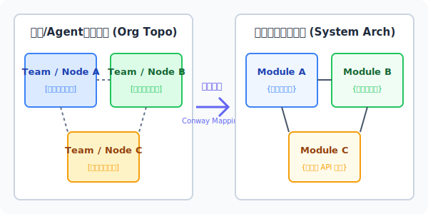
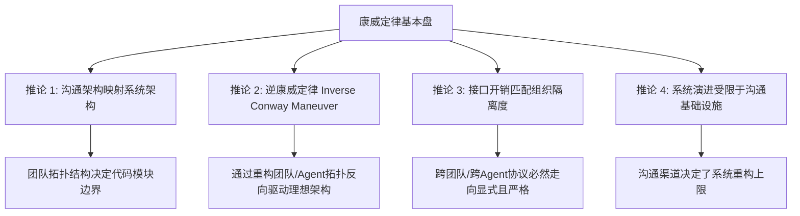
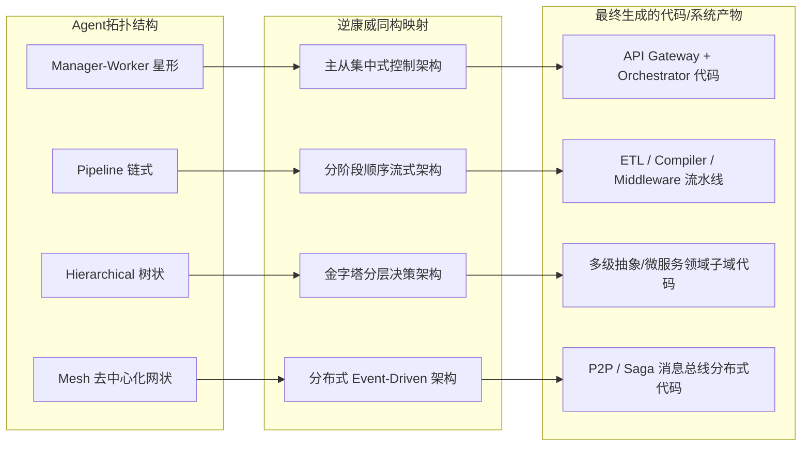

# 康威定律（Conway's Law）
> 设计系统的组织，其产生的设计等同于这些组织的沟通结构。—— 梅尔文·康威 (Melvin Conway), 1967

---

## 🔍 求真讲法：这个定理从哪里来？

### 背景与动机
1967 年，计算机科学家兼独立顾问**梅尔文·康威（Melvin Conway）** 在给《哈佛商业评论》（Harvard Business Review）投稿的一篇论文中提出了一个关于系统设计本质的深刻观察。

当时的背景是大型计算机软件系统刚刚兴起，企业在组织大型程序员团队开发编译器和操作系统时遇到了极大的混乱。康威观察到了一件非常有趣且近乎神奇的事情：
* 当一个由 **4 个小组**组成的团队去研发 COBOL/ALGOL 编译器时，最终产出的编译器无一例外都是 **4 个阶段（4-pass）** 的；
* 而当团队调整为 **5 个小组**时，产出的编译器就自然演变成了 **5 个阶段（5-pass）** 的。

康威试图将这一现象总结成论文，但《哈佛商业评论》以“缺乏数学证明”为由拒绝发表。随后，该论文在 1968 年被 IT 行业杂志《Datamation》接收发表，题目为 *《How Do Committees Invent?》（委员会是如何发明的？）*。

1975 年，软件工程圣组《人月神话》的作者**弗里德里希·布鲁克斯（Fred Brooks）**在其著作中引用了这一结论，并正式将其命名为**“康威定律”（Conway's Law）**。这个定律从一个最初被当作笑谈的经验总结，逐步成为了微服务架构、现代软件工程以及分布式 AI 系统（Agent 编排）的核心设计基石。

---

### 核心假设
康威定律并非凭空产生的魔术，它的推导建立在以下四个核心假设之上：

* **假设 1：信息交互依赖机制（Information Dependency Assumption）**  
  复杂系统是由多个具有依赖关系的子模块构成的，模块之间的接口定义与逻辑协调，本质上需要由设计者的沟通来产生与维持。
* **假设 2：沟通成本与有限理性（Bounded Rationality & Communication Overhead）**  
  人类（或智能体节点）的认知边界和沟通带宽是有限的。组内沟通开销较低、频率极高；跨组/跨节点沟通开销极高、频率较低且存在信息衰减。
* **假设 3：组织隔离屏障（Organizational Isolation）**  
  组织架构、部门墙、地理位置分隔或协议屏障会导致信息传递的阻尼。团队倾向于在内部解决复杂逻辑，而在团队之间建立最简接口。
* **假设 4：系统可分性与映射偏好（System Decomposability）**  
  系统在被设计时，设计者会本能地按照“现有团队/节点的职责划分”来切割系统边界，从而最小化跨边界沟通成本。

---

### 推导过程

根据上述前提假设，我们可以将系统设计过程抽象为一个“沟通网络到系统拓扑”的映射方程：

设组织沟通拓扑为图 $G_{org} = (V_{org}, E_{org})$，其中顶点 $V_{org}$ 表示团队/节点，边 $E_{org}$ 表示沟通带宽；  
设产生的软件系统拓扑为图 $G_{sys} = (V_{sys}, E_{sys})$，其中顶点 $V_{sys}$ 表示系统模块，边 $E_{sys}$ 表示模块间的耦合度/接口调用。

由于跨节点沟通成本 $C_{comm}(i, j) \propto \frac{1}{E_{org}(i, j)}$，设计团队在最小化认知开销时，会收敛于同构映射：
$$G_{sys} \cong G_{org}$$

以下 SVG 图示展示了组织沟通结构如何同构映射为软件系统代码架构：

  
  
#### 四大推论与延伸

基于康威定律，业界衍生出了四大经典推论：

1. **沟通架构映射系统架构（Communication structure dictates system design）**  
   任何系统的边界、接口和数据流走向，都是团队（或 Agent 节点）日常沟通路径的物理投射。
2. **逆康威定律（Inverse Conway Maneuver）**  
   与其被动接受既有组织形态塑造的糟心架构，不如**主动按照理想的目标系统架构去重组团队拓扑与沟通协议**，从而逼迫产物向理想架构演进。
3. **接口开销与组织隔离相匹配**  
   组内/节点内由于信任度高、沟通顺畅，接口往往是隐式、强耦合的；跨组/跨节点由于隔离度高，接口必然演变为主从依赖、显式且协议严密的 RPC/API。
4. **系统的演进受限于沟通基础设施**  
   如果沟通工具（如 Slack、GitLab、Agent 之间的 Message Broker）不支持某些协作路径，系统架构就永远无法向该方向演进。

---

### 直觉理解
想象一下**房屋装修**场景：
如果你请了一个施工队，里面包含“水管工小张”和“电工老王”，但小张和老王彼此不对付、从不讲话（组织隔离，无沟通通道）。
那么最终在你家墙壁里，水管和电线绝对不可能紧密穿在同一个复合管道里；相反，你会发现墙上一定被凿出了**两条截然分开、平行延伸的槽**（模块隔离），而且在交叉点必然有一个极其臃肿、加厚加宽的“防护隔离盒”（显式适配接口）。

这就是康威定律：**人不说话，代码/管线就必须分家；人经常拉手，代码/管线就势必拧在一起。**

---

## 🛠️ 求存讲法：这个定理能做什么？

### 核心用途
在传统软件工程中，康威定律是**微服务拆分**和**组织架构重构（Org Design）** 的核心理论基础：
* 解释了为什么单体巨石应用（Monolith）是由一个“所有人在同一个大群里大杂烩”的团队写出来的；
* 指导企业如何通过“Two-Pizza Teams”（亚马逊的两个披萨小团队原则）来孵化高内聚、低耦合的微服务架构。

---

### 跨领域迁移：映射至 AI Agent 编排协作

在多智能体系统（Multi-Agent System）时代，**Agent 团队的通信拓扑结构（Topology）直接塑造了其生成的代码架构、数据流走向及决策机制**。

我们可以将人类组织模式与 Agent 编排拓扑及产物架构建立直接映射：

#### 逆康威定律在 Agent 编排中的实践路径：

如果你想让 Multi-Agent 系统生成一套**高内聚、低耦合的微服务架构代码**：
* ❌ **错误做法**：让 5 个 Agent 组成全连接 Mesh 网状大群，自由 Prompt 对话讨论。结果必然是逻辑混乱、循环依赖、接口职责不清的“意大利面条代码”。
* ✅ **逆康威做法**：**先定义通信协议与拓扑！** 建立包含 `Architect Agent`（主控）与若干限定边界的 `Domain Agent`（领域专家），并严格限制 Agent 只能通过标准的 OpenRPC/JSON-Schema 消息体通信。Agent 的通信墙强行倒逼生成的代码天然具备完美的领域驱动设计（DDD）边界。

---

### 适用边界（假设再探）

康威定律并非在所有条件下都绝对成立，其有效性取决于沟通开销和认知约束的存在。

| 维 度 | 康威定律成立（典型场景） | 康威定律失效/边界条件 |
| :--- | :--- | :--- |
| **沟通成本** | 跨团队/跨 Agent 节点沟通成本显著大于零 | 零沟通成本（如单个超大上下文单体 Agent 内部推理） |
| **认知带宽** | 单个节点无法容纳全量系统复杂度 | 超级智能体（AGI）具备全知全能的全局认知视角 |
| **通信协议** | 节点间采用显式、受限的消息接口（如 Agent Tool Calls） | 节点共享完全透明的内存/全局上下文（Global Shared Memory） |
| **组织边界** | 部门/Agent 节点之间存在明确的职责划分与利益诉求 | 毫无边界约束的单体自演化模型 |

---

### ✅ 正例：生活/学习/工作中的运用

#### 案例 1：Agent 编排——逆康威 Maneuver 驱动全栈代码生成
* **场景**：构建一个能自动生成完整 SaaS 产品的 Agent 编排团队。
* **做法**：采用 **Manager-Worker (Star) 拓扑**。设计 `Product Orchestrator Agent` 为中心节点，`Frontend Agent`、`Backend Agent` 和 `DB Schema Agent` 为 Worker 节点。强制规定：Worker 之间禁止直接对话，所有接口定义必须经由中心节点生成 OpenAPI 契约进行同步。
* **效果**：由于 Agent 之间的通信强加了契约隔绝，产出的代码天然实现了前后端分离、接口契约明确、数据库 SQL 与业务逻辑解耦，完美达到生产级代码质量。

#### 案例 2：Agent 编排——Code Review 协作链（Pipeline 模式）
* **场景**：Agent 自动漏洞检测与修复。
* **做法**：设计 **Pipeline 链式拓扑**：`Security Scanner Agent` $\rightarrow$ `Patch Generator Agent` $\rightarrow$ `QA Test Agent`。
* **效果**：系统生成的产物形成了天然的责任链设计模式（Chain of Responsibility），每一个 Agent 节点只输出上游所需的特定数据结构，避免了安全扫描逻辑与测试执行逻辑的交叉污染。

#### 案例 3：传统软件工程——微服务拆分与 Two-Pizza Teams
* **场景**：某电商巨头重构单体系统。
* **做法**：按业务领域将 500 人的研发部拆分为数十个 6-8 人的全栈独立小组（User, Cart, Order, Payment），每个小组只对自己的微服务 API 负责。
* **效果**：系统架构迅速演变为了高度模块化的微服务体系，部署发布效率提升了数十倍。

#### 案例 4：企业协作——跨国客服系统的“孤岛模式”
* **场景**：跨国企业的客服团队按照“英语区、亚太区、欧洲区”相互独立的组织架构进行管理。
* **效果**：其内部开发的工单系统（CRM）天然被切割为三个相互隔离的数据孤岛，导致跨国用户转单时工单信息无法同步，用户必须重复陈述问题。

---

### ❌ 反例：假设不成立时会怎样？

#### 反例 1：Agent 编排中的“全网状 Mesh 通信失控”
* **现象**：开发者给 6 个 Agent 赋予了全局广播对话权限（Mesh 拓扑），让它们自由协作编写一个游戏。
* **结果（假设破坏）**：由于节点间无沟通屏障与结构化协议，Agent 之间产生了成百上千条无序对话，生成的代码中包含了大量的全局变量引用、交叉函数回调和死循环依赖。**沟通没有结构，系统就没有结构**。

#### 反例 2：组织变革中的“假微服务，真单体”
* **现象**：企业名义上成立了 10 个微服务小组，但要求所有小组每天必须参加 2 小时的全员同步例会，且共享同一个数据库（DB Gateway 未隔离）。
* **结果（假设破坏）**：虽然组织名义上分开了，但由于沟通网络依然高度密不可分，最终产出的是极其痛苦的“分布式单体（Distributed Monolith）”——改动一个服务导致全量服务崩溃。

#### 反例 3：单个超级 Agent Prompt 直出无模块划分
* **现象**：使用具备 200 万 Token 上下文能力的单体大模型直接生成 10,000 行代码。
* **结果（假设破坏）**：由于不存在多个 Agent 节点，沟通成本为零（假设 2 不成立），模型倾向于将所有逻辑写在少数几个巨大的文件中，缺乏良好的函数封装与模块边界。

---

## 💡 思考：值得深究的问题

1. **[Agent 编排]** 在 Multi-Agent 协作中，如果系统在运行时动态改变 Agent 的通信拓扑（例如根据任务复杂度从 Pipeline 链式无缝切换为 Mesh 网状），生成的代码架构会发生怎样的“架构漂移”？如何保证产物的确定性？
2. **[逆康威陷阱]** 逆康威定律主张“通过改变组织/Agent拓扑来驱动系统架构”。但在实际操作中，如果物理实体或 Agent 节点的真实认知能力跟不上强行设定的拓扑结构，会导致怎样的“组织/Agent 认知排异反应”？
3. **[单体 Agent 进化]** 在 LLM 上下文窗口无限长、推理速度极快的前提下，单个超级 Agent 内部的“思维链（Chain of Thought）与子例程（Sub-routine）调用”是否依然符合康威定律？内部 Prompt 模块的通信开销如何影响其逻辑架构？
4. **[协议即架构]** 强类型的接口协议（如 Protobuf/JSON Schema）在 Agent 编排中本质上充当了“组织纪律”。协议的严苛程度是如何反向塑造 Agent 团队之间的信任成本与决策效率的？

---

## 📚 延伸阅读

1. **Melvin E. Conway (1967)**: *How Do Committees Invent?* (Datamation, 14(4):28-31) —— 康威定律的开山经典之作。
2. **Fred Brooks (1975)**: *The Mythical Man-Month (人月神话)* —— 详细阐述了组织规模、沟通开销与系统复杂度的关系。
3. **Matthew Skelton & Manuel Pais (2019)**: *Team Topologies: Organizing Business and Technology Teams for Fast Flow* —— 现代逆康威定律在团队拓扑与微服务组织重构方面的终极指南。
4. **Agentic Design Patterns (2024)**: *Multi-Agent Collaboration Protocols & Communication Architecture* —— 探索多智能体编排与同构拓扑映射的前沿研究。
