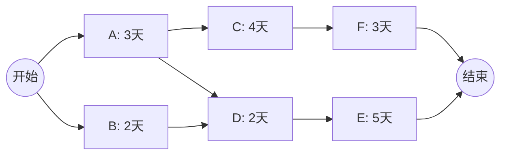
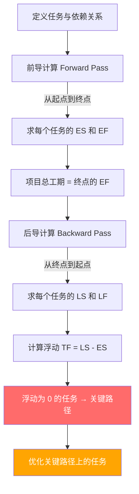
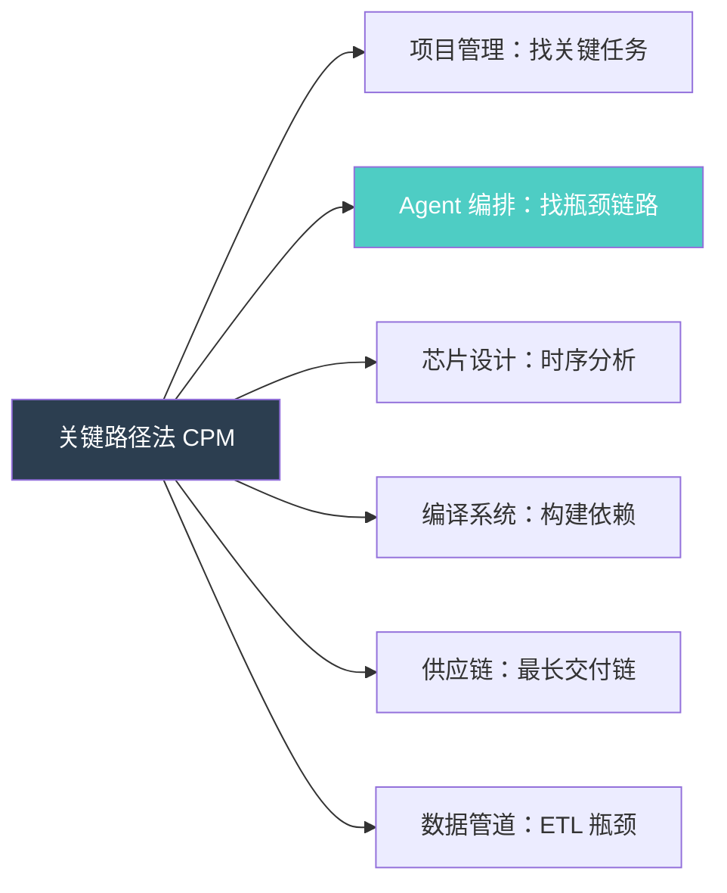
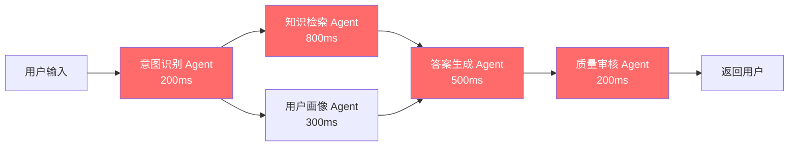

# 关键路径法（Critical Path Method, CPM）

> **在项目网络图中，最长路径决定项目总工期；关键路径上的任务零浮动，任何延迟都会直接延迟整个项目。**

---

## 🔍 求真讲法：这个定理从哪里来？

### 背景与动机

1957 年，美国杜邦（DuPont）公司面临一个棘手的问题：化工厂需要定期停机维护，但每停一天就意味着巨额产能损失。维护涉及上百个任务——拆设备、清管道、换零件、测试安全——它们之间存在复杂的先后依赖关系。**怎样安排才能让停机时间最短？**

杜邦的 **Morgan R. Walker** 找到了 Remington Rand（后来的 Univac）公司的计算机科学家 **James E. Kelley Jr.**，两人联手将这个问题建模成一张"项目网络图"，然后用当时最先进的 UNIVAC I 计算机来求解。

他们发现了一个深刻而简洁的事实：**在所有从起点到终点的路径中，最长的那条路径就是项目不可能更快完成的下限。** 这条路径上的每个任务都"一刻不能耽搁"——它们的时间余量（浮动）为零。

这就是 **关键路径法（Critical Path Method, CPM）** 的诞生。它首次在杜邦的化工厂维护项目中应用，成功将停机时间从 **125 小时缩短到 78 小时**，节省了数百万美元。

> 💡 几乎同一时期（1958 年），美国海军在北极星导弹（Polaris）项目中也独立发展出了 PERT（Program Evaluation and Review Technique）。CPM 和 PERT 是孪生兄弟——CPM 侧重确定性工期估算，PERT 则引入了概率分布。

### 核心假设

关键路径法建立在以下关键前提之上：

- **确定性工期**：每个任务的持续时间（Duration）是已知的、确定的
- **明确的依赖关系**：任务之间的先后顺序（前驱/后继）已完全定义
- **有向无环图（DAG）**：任务网络不存在循环依赖
- **单一开始和结束节点**：项目有明确的起点和终点
- **资源无限假设**：默认不考虑资源冲突（可用资源足够多，不会因资源不足而阻塞并行任务）
- **时间连续**：任务一旦开始不可中断

### 推导过程

CPM 的核心算法分为两遍扫描：**前导计算（Forward Pass）** 和 **后导计算（Backward Pass）**。

#### 关键术语

| 缩写 | 全称 | 含义 |
|------|------|------|
| **ES** | Earliest Start | 最早开始时间 |
| **EF** | Earliest Finish | 最早结束时间 |
| **LS** | Latest Start | 最迟开始时间 |
| **LF** | Latest Finish | 最迟结束时间 |
| **TF** | Total Float | 总浮动（可延迟而不影响项目总工期的时间） |

#### 示例项目网络

假设一个包含 7 个任务的项目：



#### 第一遍：前导计算（Forward Pass）→ 求 ES 和 EF

**规则**：`EF = ES + Duration`；当一个任务有多个前驱时，`ES = max(所有前驱的 EF)`

```
从左往右推进：
┌─────────────────────────────────────────────────────┐
│  任务 A: ES=0, EF=0+3=3                            │
│  任务 B: ES=0, EF=0+2=2                            │
│  任务 C: ES=3(A完成), EF=3+4=7                     │
│  任务 D: ES=max(3,2)=3(等A和B都完成), EF=3+2=5     │
│  任务 E: ES=5(D完成), EF=5+5=10                    │
│  任务 F: ES=7(C完成), EF=7+3=10                    │
│                                                     │
│  ➜ 项目最早完成时间 = max(10, 10) = 10 天           │
└─────────────────────────────────────────────────────┘
```

#### 第二遍：后导计算（Backward Pass）→ 求 LS 和 LF

**规则**：`LS = LF - Duration`；当一个任务有多个后继时，`LF = min(所有后继的 LS)`

```
从右往左回推（项目总工期 = 10）：
┌─────────────────────────────────────────────────────┐
│  任务 F: LF=10, LS=10-3=7                          │
│  任务 E: LF=10, LS=10-5=5                          │
│  任务 D: LF=5(E的LS), LS=5-2=3                     │
│  任务 C: LF=7(F的LS), LS=7-4=3                     │
│  任务 B: LF=3(D的LS), LS=3-2=1                     │
│  任务 A: LF=min(3,3)=3, LS=3-3=0                   │
└─────────────────────────────────────────────────────┘
```

#### 第三步：计算浮动，找关键路径

**浮动 = LS − ES = LF − EF**

| 任务 | Duration | ES | EF | LS | LF | **TF** | **关键？** |
|------|----------|----|----|----|----|--------|-----------|
| A    | 3        | 0  | 3  | 0  | 3  | **0**  | ✅ 是      |
| B    | 2        | 0  | 2  | 1  | 3  | **1**  | ❌ 否      |
| C    | 4        | 3  | 7  | 3  | 7  | **0**  | ✅ 是      |
| D    | 2        | 3  | 5  | 3  | 5  | **0**  | ✅ 是      |
| E    | 5        | 5  | 10 | 5  | 10 | **0**  | ✅ 是      |
| F    | 3        | 7  | 10 | 7  | 10 | **0**  | ✅ 是      |

> ⚠️ 本例存在**两条关键路径**：`A → C → F`（3+4+3=10 天）和 `A → D → E`（3+2+5=10 天），总工期均为 10 天。任务 B 有 1 天浮动，不在关键路径上。

#### CPM 算法流程



### 直觉理解

想象你要从城市 A 开车到城市 B，有三条路线可选：

- 🛤️ **高速公路**：需要 5 小时（最长）
- 🛤️ **省道**：需要 3 小时
- 🛤️ **小路**：需要 2 小时

但你和两个朋友同时出发，约好在城市 B 会合后一起吃饭。**你们几点能吃上饭？答案是 5 小时后**——因为必须等走高速公路的那个人到了才行。

走省道的朋友到了之后可以"悠闲等待 2 小时"（浮动 = 2），走小路的朋友可以等 3 小时（浮动 = 3）。但走高速公路的那个人**一分钟都不能耽搁**（浮动 = 0）——他就是"关键路径"。

**你让走省道的朋友改走更快的路线，没有用——大家还是得等高速公路那位。只有缩短高速公路的行程，才能让大家更早吃上饭。**

这就是 CPM 的精髓：**瓶颈在最长路径，优化非瓶颈毫无意义。**

---

## 🛠️ 求存讲法：这个定理能做什么？

### 核心用途

在项目管理领域，CPM 是最基础也最强大的工具之一：

1. **确定项目最短工期**：不需要猜测，数学精确计算
2. **识别关键任务**：哪些任务绝对不能延迟
3. **合理分配资源**：非关键任务可以延迟，释放资源给关键任务
4. **进度压缩（Crashing）**：在需要赶工时，知道应该压缩哪些任务
5. **风险预警**：关键路径上的任务是风险最高的

### 跨领域迁移

CPM 的思想远不止于项目管理，它本质上是 **DAG 最长路径问题** 的应用：



| 原始领域 | 迁移领域 | 映射关系 |
|---------|---------|---------|
| 项目任务 | Agent 节点 | 每个任务 → 每个 Agent |
| 任务依赖 | 数据流依赖 | 先后关系 → 输入/输出依赖 |
| 任务工期 | Agent 执行时间 | 持续时间 → 推理/API 调用耗时 |
| 关键路径 | 瓶颈链路 | 零浮动任务链 → 最慢串行链 |
| 浮动时间 | 并行宽裕度 | 可延迟时间 → 可容忍的等待时间 |
| 进度压缩 | 性能优化 | 赶工/加班 → 更快模型/缓存/并发 |

### 适用边界（假设再探）

| 条件 | 成立时 ✅ | 不成立时 ❌ | 现实影响 |
|------|----------|------------|---------|
| 工期确定 | 可精确计算关键路径 | 工期不确定时需用 PERT/蒙特卡洛 | Agent 推理时间波动大时，关键路径可能在运行时变化 |
| DAG 无环 | 算法正常工作 | 存在循环依赖时无法计算 | Agent 之间互相等待会导致死锁 |
| 资源无限 | 并行任务不受限 | 资源有限时需做资源平衡 | Agent 并发数受 API 限流或计算资源约束 |
| 依赖明确 | 路径计算准确 | 隐式依赖导致遗漏 | Agent 之间的隐式状态共享可能导致隐藏依赖 |
| 不可中断 | 计算简洁 | 任务可被抢占时模型更复杂 | Agent 任务可以被取消重试时，模型需要调整 |

### ✅ 正例：生活/学习/工作中的运用

#### 正例 1：做一顿晚餐

你要做三道菜：红烧肉（60 分钟）、炒青菜（10 分钟）、蛋汤（15 分钟）。米饭需要 30 分钟，但可以和做菜并行。

```
关键路径：淘米(5min) → 煮饭(30min)
                                          → 上菜
红烧肉(60min) ─────────────────────────── → 上菜  ← 这是关键路径！

开饭时间由红烧肉决定（60分钟），不是由炒青菜决定。
你提前切好青菜（优化非关键路径）不会让你更早开饭。
但如果你用高压锅做红烧肉（30分钟），开饭时间就缩短了！
```

#### 正例 2：Agent DAG 编排——智能客服系统

一个复杂的客户请求需要多个 Agent 协作处理：



- **关键路径**：意图识别(200ms) → 知识检索(800ms) → 答案生成(500ms) → 质量审核(200ms) = **1700ms**
- **非关键路径**：意图识别(200ms) → 用户画像(300ms) → 答案生成(500ms) = 1000ms，浮动 = 500ms
- **优化策略**：优化知识检索 Agent（如加缓存、用向量索引）对总延迟影响最大。优化用户画像 Agent 不会缩短总响应时间！

#### 正例 3：Agent DAG 编排——多模态内容生成

生成一篇图文并茂的研究报告：

```
Agent DAG:
  研究主题解析(100ms) ─┬─ 文献搜索 Agent(3000ms) ─┬─ 报告撰写 Agent(2000ms) ─ 排版 Agent(500ms)
                       ├─ 数据分析 Agent(1500ms) ─┘
                       └─ 图表生成 Agent(1000ms) ─────────────────────────── 排版 Agent

关键路径: 解析(100ms) → 文献搜索(3000ms) → 报告撰写(2000ms) → 排版(500ms) = 5600ms

优化方向: 文献搜索最慢(3000ms)，是瓶颈中的瓶颈！
- 可用并行搜索多个数据库
- 可用缓存热门文献
- 绝对不要先去优化图表生成 Agent（它有 2100ms 的浮动）
```

#### 正例 4：软件发布流程

```
代码合并(1h) → 编译构建(2h) → 自动化测试(3h) → 安全扫描(1h) → 部署(0.5h) = 7.5h  ← 关键路径
代码合并(1h) → 文档生成(0.5h) → 文档审核(0.5h) = 2h（浮动 5.5h）

→ 要缩短发布周期，应优化自动化测试（最耗时的关键任务），
  而不是让文档团队加班。
```

#### 正例 5：芯片时序分析

在数字电路设计中，信号从输入引脚经过多层逻辑门到达输出引脚。关键路径就是 **最长延迟路径**——它决定了芯片的最高运行频率。工程师优化关键路径上的门延迟（换更快的晶体管、减少逻辑层级），非关键路径上的优化不影响时钟频率。

### ❌ 反例：假设不成立时会怎样？

#### 反例 1：工期不确定——Agent 推理时间剧烈波动

假设知识检索 Agent 的响应时间在 200ms ~ 3000ms 之间随机波动（取决于检索命中率）。此时：

- 原来的关键路径 `A1 → A2 → A5 → A6` 可能不再是关键路径
- 当 A2 碰巧很快（200ms）时，`A1 → A3 → A5 → A6` 反而成了关键路径
- **关键路径在运行时动态变化**，静态 CPM 分析失效

> **应对**：使用 PERT 或蒙特卡洛模拟，计算每条路径成为关键路径的概率。在 Agent 编排中，可以对历史执行数据做统计分析，识别"高概率关键路径"。

#### 反例 2：资源受限——API 并发限制

你的 Agent DAG 设计为 5 个 Agent 并行执行，但 LLM API 只允许 2 个并发请求。此时：

```
设计上的并行:  A1 A2 A3 A4 A5 同时执行，各需 1 秒 → 总计 1 秒
实际执行:      [A1 A2] → [A3 A4] → [A5] → 总计 3 秒！

原本不在关键路径上的任务，因为排队等待资源，变成了新的瓶颈。
资源约束创造了新的"伪关键路径"。
```

> **应对**：使用资源约束下的关键路径法（Resource-Constrained CPM）或关键链法（Critical Chain Method）。在 Agent 编排中，需要考虑 API rate limiting 和计算资源的实际约束来重新规划。

#### 反例 3：存在循环依赖——Agent 互相等待

```
Agent A 需要 Agent B 的输出
Agent B 需要 Agent C 的输出
Agent C 需要 Agent A 的输出  ← 循环！

DAG 假设被破坏，CPM 无法计算，系统陷入死锁。
```

> **应对**：在设计 Agent 工作流时必须确保拓扑结构为 DAG。如果确实需要迭代，应将循环展开为有限次迭代（如最多 3 轮修订），每轮作为独立的阶段。

---

## 💡 思考：值得深究的问题

1. **动态关键路径**：在 Agent 编排中，每个 Agent 的执行时间是运行时才知道的。如何设计一个"实时 CPM"系统，在执行过程中动态更新关键路径，并将资源动态调配给当前的瓶颈 Agent？

2. **多条关键路径的风险**：当项目存在多条关键路径时（如本文示例），风险实际上更高了——任何一条关键路径上的延迟都会影响总工期。在 Agent DAG 中，多条关键路径是应该被消除（通过差异化设计）还是应该被保留（因为它意味着资源利用率更高）？

3. **CPM 与 TOC 的关系**：Eliyahu Goldratt 的约束理论（Theory of Constraints）和 CPM 都关注"瓶颈"。二者的核心区别是什么？在 Agent 编排场景中，你会选择用哪种思维框架来优化系统？

4. **边际效益递减**：当你把关键路径上最慢的任务优化到足够快后，原来的次关键路径会变成新的关键路径。这个过程何时应该停止？在 Agent 系统中，如何定量判断"优化到此为止"？

5. **从 CPM 到因果推断**：CPM 本质上建立了任务之间的因果链。如果我们把 Agent DAG 中的每条边视为因果关系而非仅仅是数据依赖，这会如何改变我们对系统的理解和优化策略？

---

## 📚 延伸阅读

1. **PERT（Program Evaluation and Review Technique）**：CPM 的概率版本，用三点估算（乐观/最可能/悲观）替代确定性工期。适合 Agent 执行时间不确定的场景。

2. **关键链法（Critical Chain Method, CCM）**：Goldratt 提出的改进版 CPM，将资源约束纳入考量，使用缓冲管理替代浮动管理。对 Agent 编排中的资源受限场景更加实用。

3. **DAG 调度理论（DAG Scheduling）**：计算机科学中的经典问题，研究如何在有限处理器上最优调度 DAG 任务。与 Agent 编排的并发调度直接相关。推荐阅读 Coffman & Graham 的经典论文 *Optimal Scheduling for Two-Processor Systems*。
