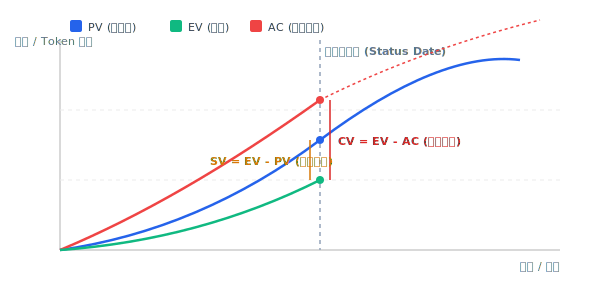
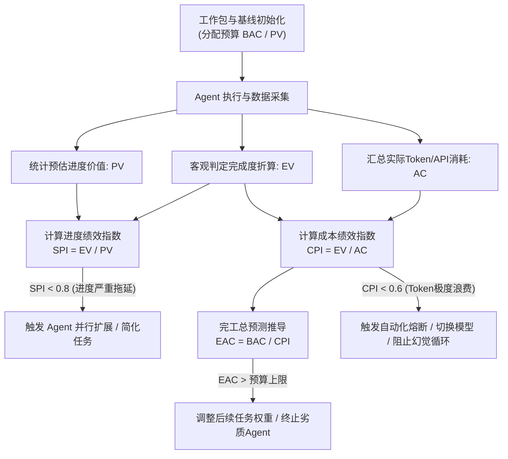
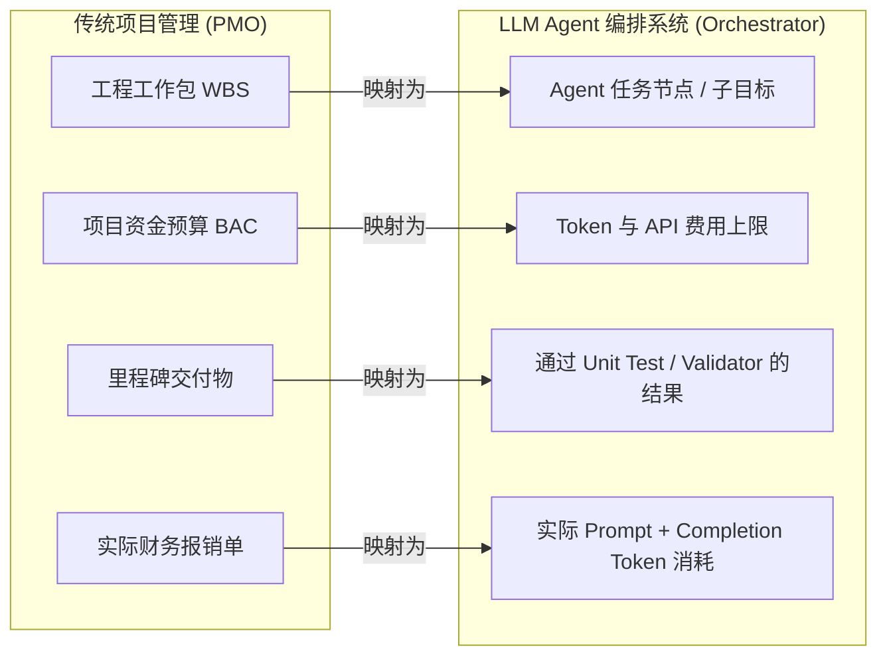

# 挣值管理（Earned Value Management, EVM）

> 一句话核心摘要：挣值管理是一种将“计划进度”、“实际进度”与“实际成本”统一度量的三维监控框架，通过比较“干了多少活（EV）”、“原计划干多少活（PV）”和“花了多少钱/Token（AC）”，精准诊断项目与 Agent 协作中的绩效偏差与超支风险。

---

## 🔍 求真讲法：这个定理从哪里来？

### 背景与动机

在 20 世纪 60 年代之前，大型工程项目（如美国的国防建设、阿波罗登月计划）频繁遭遇灾难性的预算超支和严重延期。当时的项目管理者只能依靠传统的财务审计工具——定期对比“**计划花多少钱**”和“**实际花了多少钱**”。

然而，这种传统的双线比较隐藏着一个致命盲点：
假设一个项目到年中预算为 100 万美元，实际花掉了 80 万美元。财务报表会欣喜地得出结论：“我们节省了 20 万美元，项目健康！”
但真相可能是：项目实际上只完成了原本计划 10% 的工作量！为了这区区 10% 的进度，就已经挥霍了 80% 的预算。

为了打破这种“只算财务账，不算进度账”的假象，美军国防部（US DoD）在 1967 年正式推出了 C/SCSC（Cost/Schedule Control Systems Criteria，成本/进度控制系统标准），其核心思想就是引入第三条线——**挣值（Earned Value, EV）**。它强制要求项目管理者回答一个核心问题：**“你花掉的每一分钱，究竟换回来了价值多少的工作结果？”**

到了 21 世纪，随着大语言模型（LLM）与 Multi-Agent（多智能体）编排协作的兴起，EVM 焕发了全新的生命力。在大型 Agent 任务中，“时间”与“Token 预算（API 费用）”是极易挥霍的有限资源。如果我们只看 Agent 运行了多久、消耗了多少 Token，而无法客观度量 Agent “真正完成了多少可验证的有效工作”，Agent 就极易陷入“死循环思考”或“幻觉重试”，造成严重的算力与资金浪费。

### 核心假设

挣值管理（EVM）要能够精准生效，必须依赖以下 4 项核心前提假设：

1. **工作可拆解性假设（WBS 结构）**：复杂的大型项目必须能够被按层次清晰拆解为可独立度量、权责明确的“工作包”（Work Packages）。
2. **预算可量化假设（BAC / PV 基线）**：每一个工作包在执行之前，必须分配好明确的计划价值（Planned Value, PV）与完工总预算（Budget at Completion, BAC）。
3. **完成度可客观判定假设（EV 量化）**：已完成的工作必须有客观、可量化的物理或逻辑判定标准（如“0/100 规则”、“单元测试通过率”），严禁凭主观感觉估算完成度。
4. **成本可追溯假设（AC 归集）**：执行过程中消耗的所有实际成本（时间、资金、Token 消耗量）必须能实时、精准地归集到对应的具体工作包上。

### 推导过程

EVM 的核心逻辑建立在 **三条基线** 与 **四大衍生指标** 之上。

#### 1. 三个基础物理量（基线）
- **PV (Planned Value, 计划值)**：截至某一时刻，按计划应该完成的工作的预算价值。
- **EV (Earned Value, 挣值)**：截至某一时刻，实际已经完成的工作按原预算折算出的价值。
- **AC (Actual Cost, 实际成本)**：截至某一时刻，为了完成这些工作实际所消耗的总成本（在 Agent 场景下即实际 Token/API 费用）。

#### 2. 偏差与绩效指标推导
衡量项目是提前还是落后、是省钱还是超支，数学推导极其优雅直观：

- **进度偏差 ( $SV$ ) 与 进度绩效指数 ( $SPI$ )** ：
  $$SV = EV - PV$$
  $$SPI = \frac{EV}{PV}$$
  - 当 $SPI > 1$ ( $SV > 0$ )：实际干的活超过计划，进度提前。
  - 当 $SPI < 1$ ( $SV < 0$ )：实际干的活低于计划，进度落后。

- **成本偏差 ( $CV$ ) 与 成本绩效指数 ( $CPI$ )**：
  $$CV = EV - AC$$
  $$CPI = \frac{EV}{AC}$$
  - 当 $CPI > 1$ ( $CV > 0$ )：每单位花费换来的产出大于预期，成本节约。
  - 当 $CPI < 1$ ( $CV < 0$ )：每单位花费换来的产出低于预期，成本超支（Agent 处于“高消耗低产出”状态）。

#### 3. 完工预测（EAC）推导
假设项目后续的执行效率保持当前的成本绩效（ $CPI$ ）不变，推导最终完工估算（Estimate at Completion, EAC）：
$$EAC = \frac{BAC}{CPI}$$
其中 $BAC$ （Budget at Completion）为项目的总预算。如果 $CPI = 0.5$ ，说明效率只有预期的一半，最终总支出将翻倍达到 $2 \times BAC$ 。

#### 可视化 1：EVM 三线对比与偏差预测 S 曲线图

  

#### 可视化 2：EVM 计算与决策推导逻辑流

#### 关键计算指标速查表

| 指标全称 | 缩写 | 计算公式 | 核心含义 | 目标区间 |
| :--- | :--- | :--- | :--- | :--- |
| 计划值 (Planned Value) | **PV** | $\sum \text{计划预算}$ | 此时此刻“应该干完多少活” | 参照基线 |
| 挣值 (Earned Value) | **EV** | $\sum \text{已完成工作预算}$ | 此时此刻“实际干完了多少活” | 越大越好 |
| 实际成本 (Actual Cost) | **AC** | $\sum \text{实际开销}$ | 此时此刻“为了干这些活花了多少钱/Token” | 越合理越好 |
| 进度偏差 (Schedule Variance) | **SV** | $EV - PV$ | 进度领先( $>0$ )还是滞后( $<0$ ) | $\ge 0$ |
| 成本偏差 (Cost Variance) | **CV** | $EV - AC$ | 资金/Token 节约( $>0$ )还是超支( $<0$ ) | $\ge 0$ |
| 进度绩效指数 | **SPI** | $EV / PV$ | 每单位计划进度换取的实际进度效率 | $\ge 1.0$ |
| 成本绩效指数 | **CPI** | $EV / AC$ | 每消耗 1 个 Token / 1 元换取的有效价值 | $\ge 1.0$ |
| 完工估算 (Estimate at Completion) | **EAC** | $BAC / CPI$ | 按当前效率运行，最终的总消耗预测 | $\le BAC$ |

### 直觉理解

想象你请了一个承包商装修新家，总预算 10 万元（BAC），约定 10 天干完，平均每天计划完成 1 万元的工作量（每天 PV = 1 万元）。

- **第 5 天晚上**，你到现场检查。承包商拿着发票对你说：“我已经花了 6 万元了（AC = 6 万）。”
- 如果没有 EVM，你可能会想：“计划 5 天花 5 万，他花了 6 万，虽然超了 1 万，但似乎也还好？”
- 结果你仔细一数，发现他**居然只铺好了 3 间房的木地板**（按预算每间 1 万，实际挣值 **EV = 3 万**）。

此时运用 EVM 指标分析：
1. **进度落后**： $SV = 3 - 5 = -2$ 万元（迟了 2 天的进度）， $SPI = 3 / 5 = 0.6$ 。
2. **严重超支**： $CV = 3 - 6 = -3$ 万元（干了 3 万的活却花了 6 万）， $CPI = 3 / 6 = 0.5$ （**每花 2 块钱才干出 1 块钱的活！**）。
3. **完工预测**：如果让他继续这么磨洋工，这套装修最终会花掉 $EAC = 10 / 0.5 = 20$ 万元！

这就是 EVM 的魔力：它瞬间剥开了“工作很忙、花钱很多”的伪装，直击“真实产出”的本质。

---

## 🛠️ 求存讲法：这个定理能做什么？

### 核心用途

在项目管理领域，EVM 是解决“进度与成本脱节”的终极武器。它能提供：
1. **客观看护**：避免基于“感觉”汇报进度（如程序员常说的“完成了 90%”，但最后 10% 做了三个月）。
2. **早期预警**：在项目仅推进到 15%~20% 时，CPI 指数就已经趋于稳定，能够提早几个月发出超支警告。
3. **闭环控制**：通过 EAC 与 VAC（完工偏差 $VAC = BAC - EAC$ ）为项目纠偏、追加预算或削减范围提供定量数据支撑。

### 跨领域迁移：LLM Multi-Agent 编排协作场景

在大模型时代，多智能体（Multi-Agent）系统扮演着越来越重要的角色。然而，Agent 在执行长链条复杂任务（如大型代码库迁移、自主数据挖掘、深度报告撰写）时，经常面临两大痛点：
- **死循环与幻觉**：Agent 陷入重复重试或无效思考，消耗了数百万 Token（AC 飙升），但关键任务毫无进展（EV 停滞）。
- **黑盒调度**：传统调度器只看任务超时（Timeout），无法判断 Agent 是在“艰苦攻关”还是在“无效自嗨”。

将 EVM 迁移至 Agent 编排系统中，映射关系如下：

通过实时监控 Agent 节点的 $CPI_{\text{agent}} = \frac{\text{EV}_{\text{validated}}}{\text{AC}_{\text{token\_cost}}}$ ：
- 当 $CPI_{\text{agent}} < 0.5$ 时，编排器能立即判定该 Agent 正处于“低效幻觉”状态，自动触发**熔断**、**切换 Prompt 策略**、**降级模型**或**转交 Peer Agent**。

### 适用边界（假设再探）

EVM 并不是万能的神药，其有效性严格受限于前提条件：

| 维度 | EVM 适用场景 (高效) | EVM 不适用/失效场景 (高风险) |
| :--- | :--- | :--- |
| **任务类型** | 结构化、目标清晰、可拆解的项目（如工程建造、软件重构、批量数据处理） | 探索性研究、突破性科学实验、前沿艺术创作（无法预先确定 WBS） |
| **完成度标准** | 具有客观二元或阶段判定（如“测试通过”、“通过校验”） | 极度依赖主观审美与动态变化的软性要求 |
| **Agent 行为** | 确定性流水线/ DAG 编排的多 Agent 协作 | 开放式自由涌现（Emergent）与无边界自由探索 Agent |
| **成本结构** | 可线性累加与追溯的直接成本（Token/API 费用） | 包含巨大且难以摊销的沉没/固定基础设施成本 |

### ✅ 正例：生活/学习/工作中的运用

#### 正例 1：大型多 Agent 代码库重构系统中的动态熔断与资源重分配
- **场景**：在一个包含 50 个微服务代码重构的任务中，编排器为每个微服务分配 100 万 Token 预算（ $PV_{\text{total}} = 5000$ 万 Token）。
- **EVM 应用**：定义“单元测试通过的类”为挣值单位。第 3 小时，编排器扫描到负责“支付模块”的 Code-Refactor-Agent 已消耗 800 万 Token（ $AC = 800$ 万），但只有 1 个类的单元测试通过（ $EV = 100$ 万 Token 价值）。
- **决策**： $CPI = 100 / 800 = 0.125$ 。编排器判定该 Agent 陷入死循环，立即中止该 Agent 任务，释放其占用的并发线程，并将该模块打回重构规划节点重新拆解。

#### 正例 2：长篇研究报告生成 Agent 集群的 Token 效率管控
- **场景**：报告生成集群包含 Outline-Agent、Web-Search-Agent、Fact-Checker-Agent 和 Synthesizer-Agent。
- **EVM 应用**：Fact-Checker-Agent 被分配了 200 万 Token 预算用于核验 50 个核心数据点。在核验到第 10 个数据点时（完成 20% 进度， $EV = 40$ 万 Token 价值），由于频繁调用非结构化网页解析，已消耗 160 万 Token（ $AC = 160$ 万）。
- **决策**： $CPI = 40 / 160 = 0.25$ ，编排器自动干预，将 Web-Search-Agent 的搜索策略从“广度自适应检索”降级为“精准结构化 API 检索”，防止后续 Token 耗尽导致整份报告打回。

#### 正例 3：软件开发团队 Sprint 容量与交付管控
- **场景**：敏捷团队在 Sprint 开始前规划了 100 个故事点（ $BAC = 100$ Points）。
- **EVM 应用**：第 5 天（Sprint 一半），团队消耗了 50 人天资源（ $AC = 50$ ），但经过 Code Review 并 Merged 到主干的 Code 仅折合 30 个故事点（ $EV = 30$ ），而计划应完成 50 个点（ $PV = 50$ ）。
- **决策**： $SPI = 0.6$ ， $CPI = 0.6$ 。站会上 Scrum Master 不再听信“正在测试马上就好”的表象，而是依据数据削减后半段非核心 Requirement 的 Scope，确保核心 MVP 顺利交付。

#### 正例 4：个人考研/复习备考绩效追踪
- **场景**：备考规划 600 小时（ $BAC = 600$ 小时），按章节难度分配权重。
- **EVM 应用**：复习到第 2 个月，累计刷题投入 200 小时（ $AC = 200$ ），但在真题模拟测试中，实际真正掌握（正确率达标）的章节价值仅占总计划的 15%（ $EV = 90$ 小时价值）。
- **决策**： $CPI = 90 / 200 = 0.45$ 。考生意识到当前“边看视频边发呆”的复习方式效率过低，及时调整为“主动回忆+错题重做”的深度学习模式。

### ❌ 反例：假设不成立时会怎样？

#### 反例 1：科研 Agent 在探索性难题中遭遇“EVM 误杀”
- **场景**：部署一个 Auto-Science Agent 尝试发现某种新材料的分子合成路径。
- **失效原因**：违背了“工作可拆解与线性完成度假设”。科研的前 99 次尝试均为失败（ $EV = 0$ ），消耗了数千万 Token（ $AC$ 极高），导致计算出的 $CPI \approx 0$ 。
- **后果**：如果按 EVM 规则自动熔断，系统就会在 Agent 距离成功突破仅一步之遥时强制杀掉进程，导致前功尽弃。

#### 反例 2：将“Agent 输出 Token 数”错误映射为 EV 导致的“假繁荣”
- **场景**：编排器开发者将 Agent 生成的代码行数或 Token 输出量作为 $EV$ 计量指标。
- **失效原因**：违背了“完成度必须客观有效”的假设。 Agent 输出了大量重复的模板代码、废话注释和无效日志（高 Token 输出，但逻辑质量为 0）。
- **后果**：计算出的 $EV$ 表面上很高， $CPI \ge 1.5$ ，编排器以为项目大获成功，最终在交付验收时单元测试完全不通过，导致整个系统崩溃。

---

## 💡 思考：值得深究的问题

1. **质量维度如何内生纳入 EVM 框架？**
   传统的 EVM 主要监控“进度”和“成本”，默认“交付物质量符合标准”。在 LLM 生成内容（代码、文章、推理）存在幻觉的背景下，如何设计一个包含“代码复杂度 / 幻觉率”的 **QEV (Quality-adjusted Earned Value)** 动态修正公式？

2. **自适应 Agent（Self-Planning Agent）如何应对 PV 基线坍塌？**
   在 Agent 执行过程中，如果 Agent 根据环境反馈自主重构了后续的执行路径（WBS 发生动态变化），原有的计划值 $PV$ 和总预算 $BAC$ 将瞬间失效。编排系统应如何建立**基线重置（Baseline Re-baselining）** 机制，避免频繁误报？

3. **非线性涌现场景下的 EAC 预测失效问题**
   EVM 经典的完工估算公式 $EAC = BAC / CPI$ 建立在“未来效率与过去一致”的线性假设上。然而 Multi-Agent 协作常伴随知识积累的“非线性拐点”（例如前 80% 时间构建 RAG 索引，后 20% 时间瞬间爆发完成产出）。如何结合 Bayesian 网络或强化学习来改进传统 EAC 模型？

4. **度量开销（Tracking Overhead）与系统轻量化的平衡**
   细粒度地监控每个子 Agent 的 EVM 指标，本身需要调用 Validator Agent 或运行测试套件，这也会产生额外的 Token 与时间开销。如何寻找 EVM 监控采样频率的最优解？

---

## 📚 延伸阅读

1. **PMI《项目管理知识体系指南》（PMBOK Guide）与 ANSI/EIA-748 标准**：深入了解传统工程与防御项目中 EVM 的 32 条标准管理准则。
2. **Earned Schedule (ES) 理论**：由 Walt Lipke 提出的挣值延伸理论，专门修复了传统 EVM 在项目后期 $SV \to 0$ 、 $SPI \to 1.0$ 导致的进度指标失效问题。
3. **《LLM Multi-Agent Orchestration: Cost, Performance and Failure Recovery》**：探索现代大模型多智能体架构中，如何引入借鉴项目管理的度量指标与容错机制。
