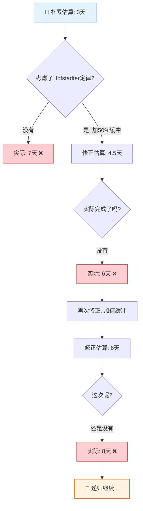
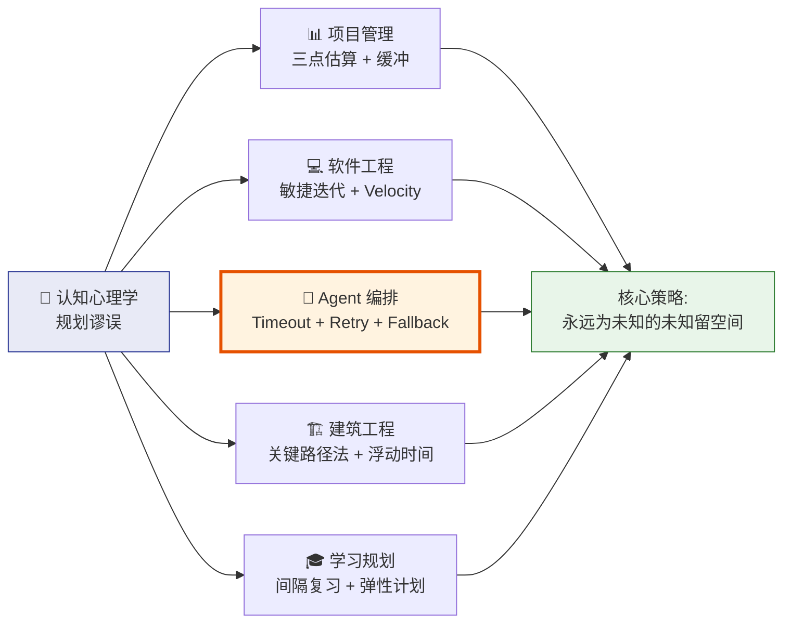
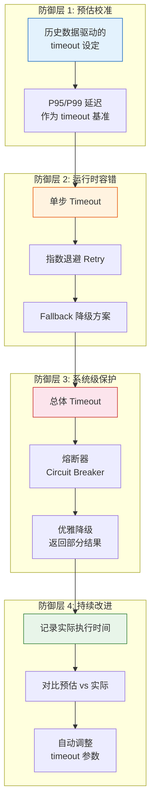
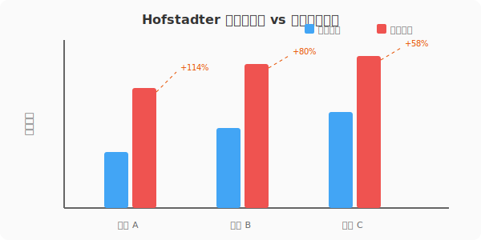

# 霍夫施塔特定律（Hofstadter's Law）

> **事情总比预期更久，即使你已经考虑了这一点。**
> *It always takes longer than you expect, even when you take into account Hofstadter's Law.*

---

## 🔍 求真讲法：这个定律从哪里来？

### 背景与动机

1979 年，一个名叫 **Douglas Hofstadter** 的认知科学家出版了一本奇书——《**哥德尔、艾舍尔、巴赫：集异璧之大成**》（*Gödel, Escher, Bach: An Eternal Golden Braid*，简称 GEB）。这本书探讨了数学、艺术和音乐中的递归与自指涉结构，后来拿下了普利策奖。

在书中讨论国际象棋程序的章节里，Hofstadter 观察到一个令人沮丧的现象：**人工智能研究者们总是乐观地预测"再过十年，计算机就能下赢世界冠军"——但这个"十年"每过十年就被重新说一遍。** 从 1957 年 Herbert Simon 预言"十年内计算机将击败人类棋手"开始，到 1979 年这本书出版时，这个预言已经被乐观地重复了整整二十年，却依然没有实现（直到 1997 年深蓝才击败卡斯帕罗夫）。

Hofstadter 用一句精妙的递归句式，把这个观察浓缩成了一条定律：

> **Hofstadter's Law: It always takes longer than you expect, even when you take into account Hofstadter's Law.**

这句话的幽默之处在于——**它自己引用了自己**。你读到这条定律时，心想："好，我已经考虑到它了，我会多留些时间。"但定律说：**即便如此，你还是会低估。** 然后你再多留一些……它仍然告诉你：**不够。** 这是一个无限递归的警告，永远无法被"充分考虑"。

这不是纯粹的玩笑。它背后指向了认知心理学中一个深刻且被大量实验验证的偏见——**规划谬误（Planning Fallacy）**。

### 核心假设

霍夫施塔特定律的成立依赖于以下认知前提：

- **人类存在系统性的乐观偏见（Optimism Bias）**：我们在预测未来时，倾向于想象"一切顺利"的最佳路径（best-case scenario），而忽略可能出现的障碍、意外和延迟。
- **规划谬误（Planning Fallacy）是普遍的**：由 Kahneman 和 Tversky 在 1979 年同年提出，指人类即使拥有过去的延误经验，在面对新任务时仍然会低估完成时间。我们会把每一个新任务都当作"特殊情况"来处理，而忽略统计基线。
- **复杂任务的不确定性是不可消除的**：任务越复杂，未知的未知（unknown unknowns）就越多，时间估算的误差就越大。
- **自指涉结构使得"修正"本身也不可靠**：即使你意识到了自己会低估，你对"低估了多少"的估计本身也会被低估——这形成了一个递归的认知陷阱。

### 推导过程

霍夫施塔特定律不是数学定理，而是一个经验性的认知规律。但我们可以用一个简单的递归模型来理解它的自指涉结构：

**第一层：朴素估算**

假设你估计一个任务需要时间 $T_0$。

**第二层：考虑低估**

你知道自己会低估，所以加了缓冲：$T_1 = T_0 \times k$ （ $k > 1$ ，比如 1.5）

**第三层：Hofstadter 递归**

但定律说"即使你考虑了这一点"——所以你的修正本身也被低估了：

$$T_2 = T_1 \times k = T_0 \times k^2$$

**第 n 层：无穷递归**

$$T_n = T_0 \times k^n \quad (n \to \infty)$$

当然，现实中 $k$ 不是固定常数，实际完成时间也不会趋向无穷。但这个模型揭示了一个核心洞察：**每一层"修正"都只部分抵消了低估，永远无法完全消除。**



### 直觉理解

> **装修房子的类比**
>
> 你找装修公司，他们说："两个月就能搞定。"你想起上次装修拖了一个月，于是预留三个月。结果呢？隐蔽工程有问题、瓷砖到货延迟、工人过年回家、设计方案中途改了两次……最终花了五个月。
>
> 下次你学聪明了，直接预留六个月。但这次赶上了原材料涨价供货不稳、物业审批流程变了、邻居投诉施工噪音限时施工……还是超了。
>
> **这就是 Hofstadter 定律的味道：你的"聪明"永远追不上现实的"花样"。** 因为让你超时的不是你能预见的那些风险，而是你根本没想到会出现的那些意外。

---

## 🛠️ 求存讲法：这个定律能做什么？

### 核心用途

在认知科学和项目管理领域，Hofstadter 定律的核心作用是：

1. **警告我们不要信任直觉估算**：任何基于直觉的时间估算都系统性地偏低。
2. **推动采用外部视角（Outside View）**：不要问"我觉得这个任务需要多久"，而要问"类似的任务历史上花了多久"——这正是 Kahneman 提出的"参考类预测法"（Reference Class Forecasting）。
3. **为系统设计提供鲁棒性原则**：既然超时是常态，那么系统设计就不应该假设任务按时完成，而应该内置容错机制。

### 跨领域迁移



### 适用边界（假设再探）

| 维度 | ✅ 定律成立 | ❌ 定律不适用 |
|------|------------|--------------|
| **任务复杂度** | 复杂、多步骤、有未知依赖的任务 | 极简单、高度重复的机械任务（如拧100颗螺丝） |
| **经验水平** | 新手或面对新领域时尤其显著 | 大量重复执行同一任务的专家（如流水线工人） |
| **估算方式** | 基于直觉的"内部视角"估算 | 基于历史数据的统计估算（参考类预测法可显著降低偏差） |
| **系统类型** | 有外部依赖、人机协作的开放系统 | 确定性的封闭系统（如数学计算 $2+2=4$） |
| **文化语境** | 存在乐观偏见文化的组织 | 有"安全文化"传统、习惯性高估风险的组织（如航天） |

> **关键边界**：Hofstadter 定律描述的是**认知偏见**，不是物理定律。它可以被系统化的方法论（如参考类预测法、蒙特卡洛模拟）部分对抗，但很难完全消除——因为人类终究要在某个环节做出主观判断。

### ✅ 正例：生活/学习/工作中的运用

#### 正例 1：软件项目的 Sprint 规划

一个 Scrum 团队在第一个 Sprint 中承诺完成 40 个故事点，实际只完成了 25 个。第二个 Sprint 他们"吸取教训"，只承诺 30 个——结果完成了 22 个。直到第四个 Sprint，团队才通过历史 Velocity 数据（外部视角），稳定在 20-23 个故事点。

**Hofstadter 教训**：不要用直觉估算产能，用历史数据说话。

#### 正例 2：Agent 编排中的 Timeout 设计

你设计了一个多 Agent 协作流水线：Agent A 调用外部 API 获取数据 → Agent B 做数据清洗 → Agent C 生成报告。你估计整个流程 10 秒就够了，设了 15 秒的 timeout。但在生产环境中：

- API 偶尔响应慢（2秒 → 8秒）
- 数据量偶尔比预期大 3 倍
- Agent C 的 LLM 调用偶尔触发 rate limit

**正确做法**：

```python
# ❌ 朴素做法：固定 timeout
pipeline_timeout = 15  # 秒

# ✅ Hofstadter 做法：分层 timeout + 指数退避重试 + fallback
agent_config = {
    "agent_a": {
        "timeout": 10,          # 单步 timeout
        "retry": 3,             # 重试次数
        "backoff": "exponential", # 指数退避
        "fallback": "use_cache"  # 降级方案：用缓存数据
    },
    "agent_b": {
        "timeout": 15,
        "retry": 2,
        "fallback": "skip_cleaning"  # 降级方案：跳过清洗
    },
    "agent_c": {
        "timeout": 30,
        "retry": 2,
        "fallback": "return_partial"  # 降级方案：返回部分结果
    },
    "pipeline": {
        "total_timeout": 60,    # 总超时：比"预期"的3-4倍
        "circuit_breaker": True  # 熔断器
    }
}
```

#### 正例 3：三点估算仍然不够

项目经理使用 PERT 三点估算法：乐观时间 $O = 3$ 天、最可能时间 $M = 5$ 天、悲观时间 $P = 10$ 天。PERT 公式给出期望值：

$$T_e = \frac{O + 4M + P}{6} = \frac{3 + 20 + 10}{6} \approx 5.5 \text{ 天}$$

但实际花了 9 天。为什么？因为"悲观时间"本身就是乐观的——你只能想象你能想象到的风险。**真正让你超时的，是你根本没想到的那些事情（unknown unknowns）。**

#### 正例 4：Agent 编排中的多轮对话超时

设计一个客服 Agent 系统，预期每轮对话 3-5 个来回就能解决用户问题。实际上线后发现：

- 用户描述模糊需要多轮澄清
- Agent 理解错误需要修正
- 需要调用后端系统等待响应
- 用户中途离开再回来

平均对话轮次是 8-12 轮，会话持续时间是预期的 3 倍。

**Hofstadter 教训**：Agent 系统要设计弹性会话管理，支持会话暂存、超时续接、上下文压缩。

#### 正例 5：学习一门新技术

你计划用两周学完 Rust 语言。第一周你觉得进展不错，第二周你遇到了生命周期（Lifetime）和所有权（Ownership）系统——然后你发现两周只够你"知道自己不知道什么"。实际学到能写生产代码的程度，花了两个月。

**Hofstadter 教训**：学习计划要留出"挫折缓冲区"，并且用实际完成的里程碑（而非主观感觉）来衡量进度。

### ❌ 反例：假设不成立时会怎样？

#### 反例 1：高度标准化的流水线作业

丰田汽车生产线上，安装一个车门需要 57 秒。这个时间经过数千次重复测量，误差在 ±2 秒以内。在这种**高度标准化、无外部依赖、无认知判断**的场景中，Hofstadter 定律几乎不适用——因为不确定性已经被工程化地消除了。

**启示**：如果你能把 Agent 任务标准化到"流水线"级别（固定输入格式、固定处理逻辑、固定输出格式），超时风险会大幅降低。但大多数 Agent 任务做不到这一点，因为 LLM 的响应本质上是非确定性的。

#### 反例 2：帕金森定律的反向效应

**帕金森定律**（Parkinson's Law）说："工作会膨胀到填满可用时间。"如果你给了太多缓冲，团队可能反而会放慢节奏，最终恰好在 deadline 前完成。在这种情况下，任务没有超时——但也没有提前完成。Hofstadter 定律被帕金森定律"中和"了。

**启示**：在 Agent 编排中，这提醒我们 timeout 不能设得无限大。**过长的 timeout 意味着资源浪费和响应迟缓。** 需要找到"足够宽容但不浪费"的平衡点。

#### 反例 3：专家的校准直觉

气象预报员说"明天有 70% 概率下雨"，经过长期验证，确实在他们说 70% 的日子里，大约 70% 的时间下了雨。这种**经过大量反馈校准的专家直觉**可以比较准确地估算不确定性。

**启示**：如果你的 Agent 系统有足够多的历史运行数据，并且用这些数据来校准 timeout 参数（而非凭直觉设定），你可以部分抵消 Hofstadter 效应。但"部分"二字很关键——因为分布的尾部（罕见但极端的异常情况）永远比你想象的更肥。

---

## 🧩 Agent 编排中的 Hofstadter 生存指南

基于 Hofstadter 定律，Agent 编排系统应该内置以下防御机制：



  

---

## 💡 思考：值得深究的问题

1. **递归的极限在哪里？** Hofstadter 定律是自指涉的，但在实践中，经过多少次"考虑-修正"循环后，你的估算会趋近于稳定？存在一个收敛点吗？还是说复杂系统的不确定性本质上是不可收敛的？

2. **Agent 编排中的"Hofstadter 感知器"**：能否设计一个 Meta-Agent，它的唯一职责就是监控其他 Agent 的实际执行时间 vs 预估时间，并动态调整 timeout 参数？这个 Meta-Agent 自己的执行时间估算，是否也会受到 Hofstadter 效应的影响？（又一层递归！）

3. **乐观偏见是 Bug 还是 Feature？** 从进化心理学角度看，如果人类总是准确预估任务难度，很多伟大的工程可能根本不会被启动（"如果我事先知道要花十年，我根本不会开始"）。乐观偏见是否是推动人类文明进步的必要"幻觉"？

4. **AI Agent 是否也有 Hofstadter 效应？** LLM 不是人类，理论上不应该有认知偏见。但 LLM 在预测自己的 token 生成量、任务完成步骤数时，是否也存在系统性的低估？如果存在，这是从训练数据中"学到"的人类偏见，还是复杂系统的固有属性？

5. **从 Hofstadter 到反脆弱**：Nassim Taleb 提出的"反脆弱"概念认为，好的系统应该从意外中受益。一个 Agent 编排系统能否不仅仅"容忍"超时，而是利用超时事件来自动优化自身？比如：每次超时都触发一次架构微调，使得系统越来越强健？

---

## 📚 延伸阅读

1. **《哥德尔、艾舍尔、巴赫》** — Douglas Hofstadter (1979)
   原始出处。这本书远不止于这条定律，它探讨了意识、递归、自指涉和人工智能的深层联系。如果你只读一本关于"思维如何思考自身"的书，就是这本。

2. **《思考，快与慢》** — Daniel Kahneman (2011)
   系统地介绍了规划谬误（Planning Fallacy）和内部视角 vs 外部视角的概念。第 23 章"外部观点"直接讨论了为什么我们总是低估时间和成本。

3. **参考类预测法（Reference Class Forecasting）**
   由 Bent Flyvbjerg 发展的方法论，通过查找历史上相似项目的实际完成数据来校准预测。这是目前已知的、对抗规划谬误最有效的系统化方法。在 Agent 编排中，这意味着用历史运行日志的 P95 延迟来设定 timeout，而非凭直觉。

---

> *"在所有的认知偏见中，规划谬误可能是最顽固的一个——因为即使你知道它的存在，它依然会找到新的方式来欺骗你。这就是 Hofstadter 定律的残酷之美。"*
