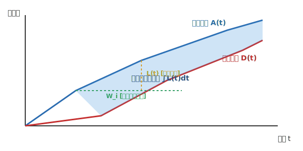
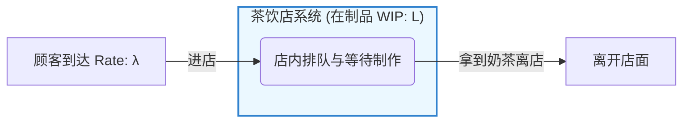
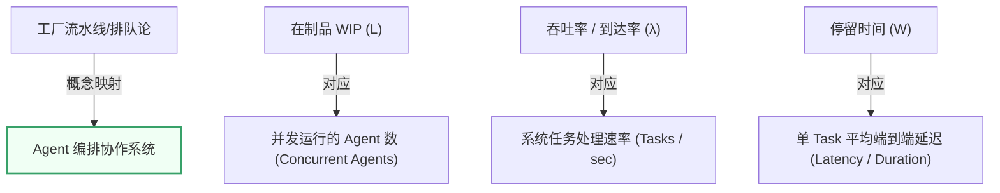
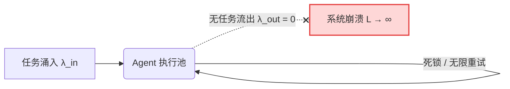

# 利特尔定律（Little's Law）

> **一句话核心摘要**：在任意处于统计平衡的稳定系统中，系统内的平均在制品数量（ $L$ ）等于任务的平均到达率（ $\lambda$ ）乘以任务在系统中的平均停留时间（ $W$ ），即 $L = \lambda \times W$ 。在 Agent 编排协作场景中，这意味着控制并发 Agent 数量本质上就是控制系统的负载、吞吐量与响应延时。

---

## 🔍 求真讲法：这个定理从哪里来？

### 背景与动机

在 20 世纪 50 年代至 60 年代初，随着工业流水线、电话交换网以及早期计算机排队系统的兴起，**排队论（Queueing Theory）** 成为一门炽手可热的学科。科学家和工程师们一直在直觉上相信一个简单的关系：

> “一家店里平均有多少顾客，取决于顾客进店的速度，以及每个顾客在店里停留的时间。”

当时，人们在各种特定的假设下（比如假设顾客到达服从泊松分布、服务时间服从指数分布）验证了这个结论。然而，没有人能够证明：**这个简单的乘法关系是否对任意排队系统都普遍成立？**

直到 1961 年，麻省理工学院（MIT）的教授 **约翰·利特尔（John D. C. Little）** 在论文 A Proof for the Queueing Formula: $L = \lambda W$ 中，给出了极其简洁且严密的数学证明。他证实了：**无论系统内部的排队规则有多复杂（FIFO、LIFO 或优先级排队）、无论服务时间的分布如何，只要系统达到长期平稳状态，这个定律就绝对成立！** 这使得利特尔定律成为了运筹学、计算机系统性能工程和现代敏捷/Agent编排调度领域中最基石性的公式之一。

```
       John Little (1961)
  ┌─────────────────────────┐
  │   任意排队与服务机制     │
  │  (无论是人、数据包还是Agent)│
  └────────────┬────────────┘
               │ 严密证明 (不依赖具体分布)
               ▼
       L = λ × W (恒成立)
```

---

### 核心假设

利特尔定律之所以极其强大，是因为它的前提条件少得令人发指。但“少”不等于“没有”，要让公式 $L = \lambda \times W$ 成立，必须严格满足以下三点前提：

- **系统的平稳性（Stationarity / Long-term Stability）**：系统必须处于长期统计平衡状态。即长时间来看，任务的**流入速率等于流出速率**。系统既不能无限积压崩塌，也不能处于刚启动时的剧烈过渡态。
- **测量周期的长期性（Long-term Average）**：统计的时间跨度 $T$ 必须足够长，使得短期内的突发流量（Burst）和随机扰动被平滑掉。
- **任务的守恒性（Conservation of Items）**：进入系统的任务最终都必须离开系统，既不能在系统内部无故凭空消失（如未经记录的静默丢弃），也不能无中生有。

---

### 推导过程

虽然严格的概率论证明涉及遍历性定理（Ergodic Theorem），但我们可以通过**几何累积图**极其直观地理解其推导逻辑：

设在观察时间区间 $[0, T]$ 内：
- $A(t)$ 为到时刻 $t$ 为止累计进入系统的任务总数；
- $D(t)$ 为到时刻 $t$ 为止累计离开系统的任务总数；
- $L(t) = A(t) - D(t)$ 为时刻 $t$ 系统中的**在制品数量（WIP, Work-in-Progress）**。

#### 1. 面积的双重含义
我们在二维平面上画出 $A(t)$ 和 $D(t)$ 的曲线，两条曲线之间的阴影面积表示系统在 $[0, T]$ 区间内累积的总“任务·时间”（即所有任务在系统中停留时间的总和）：

$$\text{总阴影面积} = \int_{0}^{T} L(t) \, dt$$

  

#### 2. 代数求均值
我们可以从两个不同的视角来计算这个阴影面积：

1. **纵向按时间切割（求系统平均在制品数 $L$ ）**：
   平均在制品数等于阴影面积除以总时间 $T$ ：
   $$\bar{L} = \frac{1}{T} \int_{0}^{T} L(t) \, dt$$

2. **横向按任务切割（求单个任务平均停留时间 $W$ ）**：
   若在时间 $T$ 内总共处理了 $N(T)$ 个任务，每个任务停留时间为 $W_i$ ，则平均停留时间为：
   $$W = \frac{1}{N(T)} \sum_{i=1}^{N(T)} W_i = \frac{1}{N(T)} \int_{0}^{T} L(t) \, dt$$

3. **平均到达率 $\lambda$**：
   $$\lambda = \frac{N(T)}{T}$$

#### 3. 完美结合
现在，我们将 $\lambda$ 与 $W$ 相乘：
$$\lambda \times W = \left( \frac{N(T)}{T} \right) \times \left( \frac{1}{N(T)} \int_{0}^{T} L(t) \, dt \right) = \frac{1}{T} \int_{0}^{T} L(t) \, dt = \bar{L}$$

当测量时间 $T \to \infty$ 时，边界误差趋近于 0，因此导出终极公式：
$$L = \lambda \times W$$

---

### 直觉理解

为了直观感受这个公式，让我们来看一个**网红茶饮店**的例子：



* **到达率 $\lambda$**：每分钟有 **2 位** 顾客进店（ $\lambda = 2$ 人/分钟）。
* **停留时间 $W$**：从点单、等待制作到拿到奶茶，平均每位顾客需要 **15 分钟**（ $W = 15$ 分钟）。
* **在制品 $L$**：请问在任意时刻，茶饮店里平均挤着多少人？

即使你完全不懂排队论，你的直觉也会告诉你：**$2 \times 15 = 30$ 人**。
无论店员是先做谁的、中间有没有做错重做，只要进店速率和停留时间稳定，店内的拥挤程度（ $L$ ）就被这二者严格锁定。

---

## 🛠️ 求存讲法：这个定理能做什么？

### 核心用途

1. **容量规划与排队管理**：估计服务器并发连接池、工厂车间缓冲库（WIP）大小、医院候诊区座椅数量。
2. **性能瓶颈诊断**：在不破坏系统内部实现的情况下，通过观测外部的流量（ $\lambda$ ）和延迟（ $W$ ），推算出系统内部积压的负载（ $L$ ）。
3. **敏捷看板（Kanban）**：控制限制在制品数量（WIP Limit），以缩短需求的交付周期（Lead Time）。

---

### 跨领域迁移：Agent 编排协作中的映射

在现代大模型多 Agent 编排系统（如 Master-Worker 模式、DAG 图调度 Agent、多智能体协同框架）中，利特尔定律是架构师控制资源消耗、降低 API 额度超限风险并保障响应延时的**核心理论基石**。



#### 关键推论公式变体：

1. **吞吐量计算**： $\lambda = \frac{L}{W}$
   要提高 Agent 系统的总吞吐量 $\lambda$ ，只有两条路：**增加并行 Agent 数量（提高 $L$ ）**，或者**缩短单 Task 的处理时间（降低 $W$ ）**。
2. **并发控制**： $L_{max} = \lambda_{limit} \times W$
   当上游大模型 API 存在 Rate Limit（例如最大 RPM 或 Token/min 限制了最高吞吐率 $\lambda_{limit}$ ）时，系统所能承受的最大并发 Agent 数 $L_{max}$ 是被严格限制的。

---

### 适用边界（假设再探）

利特尔定律虽然通用，但若忽视了前提假设，盲目套用就会踩坑：

| 维度 | 成立的黄金地带 ✅ | 失效的危险边缘 ❌ |
| :--- | :--- | :--- |
| **系统状态** | 长期平稳（流入速率 $\approx$ 流出速率） | 刚启动/关闭时的剧烈瞬态，或无限积压的雪崩状态 |
| **守恒性** | 进入的任务 100% 最终完成离开 | 任务超时被丢弃、Agent 陷入死锁死循环、静默 Drop |
| **时间尺度** | 统计周期 $T \gg$ 单个任务处理时间 $W$ | 仅观测几秒钟的微观突发流量（Burst） |
| **容量限制** | 队列长度允许承载 $L$ 的波动 | 队列已满导致拒绝服务（Block / Drop-tail） |

---

### ✅ 正例：生活/学习/工作中的运用

#### 场景 1：API Rate Limit 约束下的 Agent 编排并发度调优（Agent 编排）
* **背景**：某自动化代码审计 Agent 系统，每次调用大模型耗时平均 $W = 12$ 秒（包括 Prompt 构建、LLM 推理、工具调用返回）。LLM 供应商限制账号调用速率为 $\lambda_{limit} = 100 \text{ RPM} \approx 1.67 \text{ req/sec}$ 。
* **应用**：架构师需要设置线程池/协程池的并发 Agent 限额 $L$ 。根据利特尔定律：
  $$L = \lambda \times W = 1.67 \times 12 = 20$$
* **决策**：最完美的并发 Agent 限制数应设为 **20**。如果将并发设为 50，虽然增加了 $L$ ，但受限于 API $\lambda_{limit} = 1.67$ ，任务会被 API 拒响应或触发 429 Rate Limit；如果并发仅设为 5，则吞吐量只能达到 $5 / 12 = 0.41 \text{ req/sec}$ ，算力被严重浪费。

#### 场景 2：Map-Reduce 式 Agent 阵列的瓶颈诊断（Agent 编排）
* **背景**：一个舆情分析 Agent 编排系统中，Master Agent 将新闻拆分给 Worker Subagents。系统监控显示：队列中一直积压着平均 $L = 60$ 个待处理新闻块，用户要求的整体处理吞吐量必须达到 $\lambda = 5 \text{ 块/秒}$ 。
* **应用**：计算单 Task 允许的最大平均延迟：
  $$W = \frac{L}{\lambda} = \frac{60}{5} = 12 \text{ 秒}$$
* **决策**：日志显示当前 Worker Agent 的单块平均处理时间为 $W_{actual} = 30 \text{ 秒}$ 。这说明系统性能不达标。架构师有两个解法：
  1. **扩容并发数**：将 Worker Agent 的并发数从 60 提升到 $L_{new} = 5 \times 30 = 150$ 。
  2. **优化 Prompt / 换快模型**：将 Worker Agent 的 Prompt 精简，或改用 Small LLM，将单 Task 延迟 $W$ 从 30 秒压缩到 12 秒以内。

#### 场景 3：Agent 协作流水线中的 WIP Limit 避免死锁（Agent 编排）
* **背景**：在一个“需求 Agent $\to$ 架构 Agent $\to$ 编码 Agent $\to$ 测试 Agent”的串行流水线中。
* **应用**：若不限制需求 Agent 的生成速度（ $\lambda_{in}$ 极高），架构 Agent 前的在制品队列 $L$ 会急速膨胀。根据 $W = L / \lambda$ ，后续 Agent 拿到上下文的等待延迟 $W$ 将呈线性剧增，导致整体响应极其迟钝。
* **决策**：在各 Agent 衔接处设置 WIP 限制（如每个环节最多容纳 3 个在处理任务），根据利特尔定律，限制 $L$ 直接压低了端到端延迟 $W$ ，显著提升系统的实时响应体验。

#### 场景 4：机场安检通道开通决策（日常生活）
* **背景**：高峰期机场每分钟到达 $\lambda = 30$ 名旅客，安检区域最多容纳 $L = 60$ 人排队。
* **应用**：每位旅客安检耗时 $W = 4$ 分钟。单个安检通道的吞吐量为 $1/4 = 0.25$ 人/分钟。
* **决策**：为了防止排队区溢出（保持 $L \le 60$ 且平衡），系统总吞吐量必须达到 $\lambda = 30$ 。因此需要开通的通道数为 $30 / 0.25 = 120$ 个并行通道人次（即开启 120 / (4) = 30 条安检通道）。

---

### ❌ 反例：假设不成立时会怎样？

#### 反例 1：Agent 发生死锁与无限重试（守恒假设破坏）
* **过程**：在某个 Agent 编排系统中，因工具调用的外部 API 宕机，导致 Subagent 陷入无限 retry 或死锁状态，任务既不报错退出，也不成功完成。
* **现象**：新任务还在以 $\lambda_{in} = 2 \text{ req/sec}$ 不断涌入，但离开速率 $\lambda_{out} \to 0$ 。
* **结论**：系统守恒假设被破坏！系统内 $L(t)$ 随时间无限增长（ $L \to \infty$ ），此时静态计算出 $W = L / \lambda$ 失去几何意义，实际观察到的延迟为无穷大，系统崩溃。



#### 反例 2：突发雪崩流量与冷启动（平稳状态假设破坏）
* **过程**：在系统刚启动的瞬间（冷启动），或者突然遭遇 1000 个请求在 100ms 内瞬间涌入（极端 Burst）。
* **现象**：此时 Agent 容器还在拉起，LLM 连接池正在初始化。在极短的 1 秒钟内， $L = 1000$ ，但离开率 $\lambda$ 为 0。
* **结论**：系统严重处于非平稳过渡态（Transient State）。如果此时用 $L = \lambda \times W$ 去推算未来延迟，会得出极端错误的结论。利特尔定律只对**长期平均**有效，不能用于微观瞬时预测。

---

## 💡 思考：值得深究的问题

1. **LLM 的非线性输出（TTFT 与 TPS）如何影响 $W$ 的测量？**
   在 Agent 编排中，LLM 的响应时间 $W$ 由“首 Token 延迟（TTFT）”和“后续 Token 吐出速率（Time per Output Token）”两部分组成。对于长文本输出和短文本输出，单 Task 的 $W$ 差异巨大。在流式输出（Streaming）场景下，我们应该如何定义一个 Agent 任务的“完成/离开”时刻？
2. **多层嵌套 Agent 架构中，各层 WIP 如何叠加？**
   若 Master Agent 的 WIP 限额为 $L_1$ ，每个 Master 会衍生出平均 $k$ 个 Subagent（其 WIP 为 $L_2$ ）。整套分层系统中的利特尔定律如何层层嵌套？下层 Agent 的延迟增加会如何通过利特尔定律传导放大上层 Agent 的 WIP 积压？
3. **如何设计自适应 WIP 调节器（Adaptive WIP Controller）？**
   大模型供应商的 Rate Limit（TPM/RPM）和响应延迟 $W$ 在一天中是动态波动的（如高峰期 LLM 响应变慢）。如何利用利特尔定律结合反馈控制（PID 算法），实现动态增减并发 Agent 数量 $L$ ，确保吞吐量最大化的同时绝不触发 Rate Limit 429 报错？
4. **平均值（ $L, W$ ）与长尾延迟（P99 Latency）的矛盾**：
   利特尔定律只给出了**平均在制品数**和**平均停留时间**的关系。但在 Agent 编排中，一个被卡住的 Subagent（P99 延迟）可能会拖垮整个 DAG 图的合并节点。利特尔定律能够为优化 P99 延迟提供帮助吗？它的盲区在哪里？

---

## 📚 延伸阅读

1. **Little, J. D. C. (1961).  A Proof for the Queueing Formula: $L = \lambda W$ . Operations Research, 9(3), 383-389.**
   *推荐理由*：John Little 教授的原始论文，仅有短短几页，证明优雅精妙，是计算机科学与运筹学历史上最值得一读的经典文献之一。
2. **Kingman's Formula (金曼公式 / VUT 公式)**
   *推荐理由*：利特尔定律告诉你 $L, \lambda, W$ 的等式关系，而金曼公式进一步揭示了当系统资源利用率（Utilization）接近 100% 时，队列等待时间 $W$ 是如何由于随机波动而呈指数级暴涨的。
3. **《Team Topologies》与敏捷看板 (Kanban) 中的 WIP 控制**
   *推荐理由*：了解如何将利特尔定律从纯代码/算法层面迁移到人类团队协作以及 AI Agent 团队的组织架构设计中。
