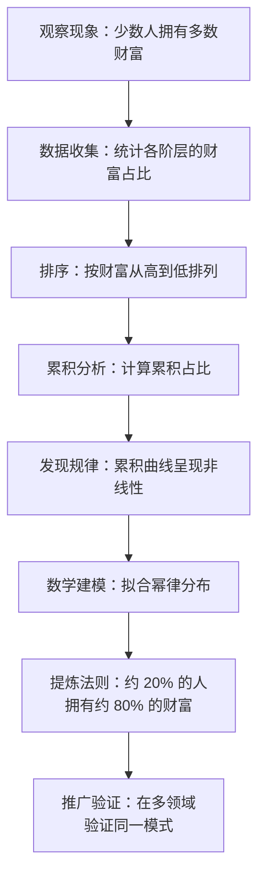
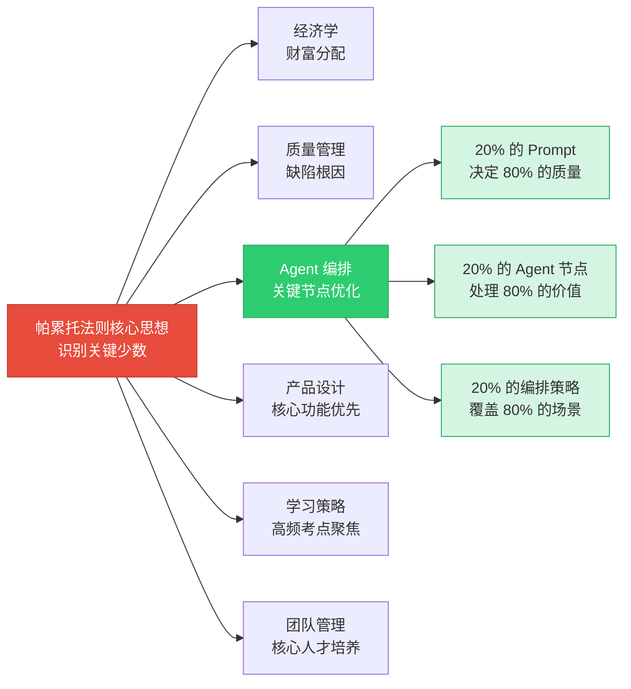
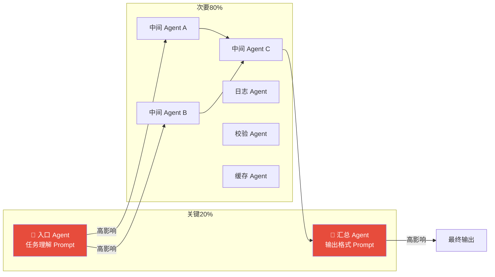
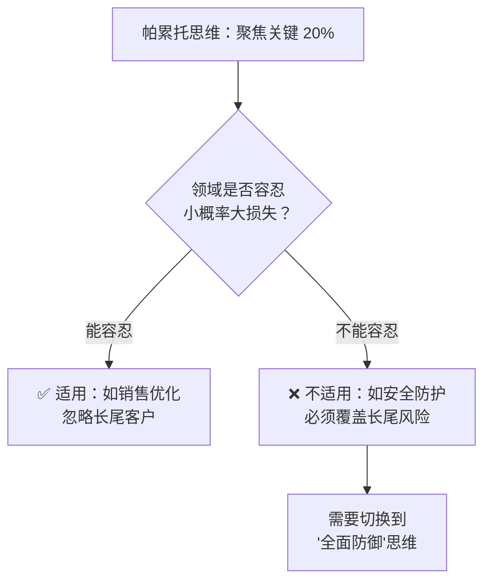

# 帕累托法则（80/20 法则）

> **80% 的结果来自 20% 的原因——世界从来不是均匀分布的，找到那关键的 20%，就是撬动全局的杠杆。**

---

## 🔍 求真讲法：这个法则从哪里来？

### 背景与动机

1896 年的意大利，一位名叫**维尔弗雷多·帕累托（Vilfredo Pareto）**的经济学家正在研究一个看似简单的问题：意大利的土地到底是怎么分配的？

他翻阅大量税务数据后，发现了一个令人震惊的事实——**意大利 80% 的土地集中在 20% 的人手中**。帕累托起初以为这是意大利的特殊现象，但当他把目光转向英国、法国、普鲁士等国时，发现了几乎相同的分布模式。

这个发现在当时并没有引起太大波澜。直到半个世纪后的 1940 年代，美国质量管理大师**约瑟夫·朱兰（Joseph Juran）**在工厂质量控制中重新发现了这个规律：**大多数质量缺陷来自少数几个根本原因**。朱兰将这个现象正式命名为"帕累托法则"（Pareto Principle），并将其推广到管理学领域。

> 💡 帕累托本人研究的是财富分配的不平等现象，而朱兰赋予了它更广泛的管理学意义——"**关键的少数与琐碎的多数**"（the vital few and the trivial many）。

### 核心假设

帕累托法则的成立依赖于以下前提假设：

- **分布非均匀性**：系统中各要素的贡献/影响是不均匀的，呈现幂律分布（Power Law）而非正态分布
- **因果可分离性**：原因和结果之间可以被识别和度量，能够区分出"关键少数"和"次要多数"
- **相对稳定性**：在观察的时间窗口内，分布格局相对稳定，不会频繁剧烈变化
- **可聚合性**：个体贡献可以被加总和排序，从而进行占比分析

> ⚠️ 注意：80/20 只是一个**近似比例**，不是精确的数学常数。实际观察可能是 70/30、90/10，甚至 99/1。核心是**不均匀分布**这一事实本身。

### 推导过程

帕累托法则背后的数学基础是**幂律分布（Power Law Distribution）**：

$$
P(X \geq x) \propto x^{-\alpha}
$$

其中 $\alpha$ 是幂律指数，决定了分布的"不均匀程度"。

**从幂律到 80/20 的推导路径：**

**帕累托图（Pareto Chart）示意：**

<svg viewBox="0 0 600 300" xmlns="http://www.w3.org/2000/svg">
  <!-- 背景 -->
  <rect width="600" height="300" fill="#fafafa" rx="8"/>
  
  <!-- 坐标轴 -->
  <line x1="80" y1="250" x2="550" y2="250" stroke="#333" stroke-width="2"/>
  <line x1="80" y1="30" x2="80" y2="250" stroke="#333" stroke-width="2"/>
  
  <!-- Y轴标签 -->
  <text x="25" y="145" font-size="12" fill="#333" transform="rotate(-90,25,145)">贡献占比 (%)</text>
  <text x="70" y="255" font-size="10" fill="#666" text-anchor="end">0</text>
  <text x="70" y="195" font-size="10" fill="#666" text-anchor="end">25</text>
  <text x="70" y="140" font-size="10" fill="#666" text-anchor="end">50</text>
  <text x="70" y="85" font-size="10" fill="#666" text-anchor="end">75</text>
  <text x="70" y="40" font-size="10" fill="#666" text-anchor="end">100</text>

  <!-- 网格线 -->
  <line x1="80" y1="190" x2="550" y2="190" stroke="#eee" stroke-width="1"/>
  <line x1="80" y1="135" x2="550" y2="135" stroke="#eee" stroke-width="1"/>
  <line x1="80" y1="80" x2="550" y2="80" stroke="#eee" stroke-width="1"/>
  
  <!-- 柱状图 - 按贡献从大到小 -->
  <rect x="100" y="70" width="60" height="180" fill="#e74c3c" rx="3" opacity="0.9"/>
  <rect x="175" y="130" width="60" height="120" fill="#e74c3c" rx="3" opacity="0.7"/>
  <rect x="250" y="190" width="60" height="60" fill="#3498db" rx="3" opacity="0.6"/>
  <rect x="325" y="215" width="60" height="35" fill="#3498db" rx="3" opacity="0.5"/>
  <rect x="400" y="230" width="60" height="20" fill="#3498db" rx="3" opacity="0.4"/>
  <rect x="475" y="240" width="60" height="10" fill="#3498db" rx="3" opacity="0.3"/>

  <!-- 柱状图标签 -->
  <text x="130" y="268" font-size="10" fill="#333" text-anchor="middle">原因A</text>
  <text x="205" y="268" font-size="10" fill="#333" text-anchor="middle">原因B</text>
  <text x="280" y="268" font-size="10" fill="#333" text-anchor="middle">原因C</text>
  <text x="355" y="268" font-size="10" fill="#333" text-anchor="middle">原因D</text>
  <text x="430" y="268" font-size="10" fill="#333" text-anchor="middle">原因E</text>
  <text x="505" y="268" font-size="10" fill="#333" text-anchor="middle">原因F</text>

  <!-- 累积曲线 -->
  <polyline points="130,70 205,107 280,143 355,163 430,178 505,185"
            fill="none" stroke="#f39c12" stroke-width="3" stroke-linecap="round"/>
  <circle cx="130" cy="70" r="4" fill="#f39c12"/>
  <circle cx="205" cy="107" r="4" fill="#f39c12"/>
  <circle cx="280" cy="143" r="4" fill="#f39c12"/>
  <circle cx="355" cy="163" r="4" fill="#f39c12"/>
  <circle cx="430" cy="178" r="4" fill="#f39c12"/>
  <circle cx="505" cy="185" r="4" fill="#f39c12"/>

  <!-- 20% 分界线 -->
  <line x1="240" y1="30" x2="240" y2="250" stroke="#e74c3c" stroke-width="2" stroke-dasharray="6,4"/>
  <text x="245" y="25" font-size="11" fill="#e74c3c" font-weight="bold">← 20% 的原因</text>

  <!-- 80% 标注 -->
  <line x1="82" y1="80" x2="240" y2="80" stroke="#e74c3c" stroke-width="1" stroke-dasharray="4,3"/>
  <text x="155" y="55" font-size="12" fill="#e74c3c" font-weight="bold">贡献了 ~80%</text>
  
  <!-- 图例 -->
  <rect x="400" y="30" width="12" height="12" fill="#e74c3c" rx="2"/>
  <text x="417" y="41" font-size="10" fill="#333">关键少数 (20%)</text>
  <rect x="400" y="48" width="12" height="12" fill="#3498db" rx="2"/>
  <text x="417" y="59" font-size="10" fill="#333">次要多数 (80%)</text>
  <rect x="400" y="66" width="12" height="3" fill="#f39c12"/>
  <text x="417" y="73" font-size="10" fill="#333">累积曲线</text>
</svg>

### 直觉理解

想象你家有一个**衣柜**：

你有 50 件衣服，但仔细想想——你日常反复穿的，其实只有大约 10 件（20%）。这 10 件衣服承包了你 80% 的穿着场景。剩下 40 件？它们安静地挂在那里，偶尔翻一下，大部分时间在吃灰。

这就是帕累托法则的本质：**不是所有事物都同等重要，少数关键要素承担了大部分的价值**。

再想想你的手机 App——你装了几十个，但每天打开的也就那么 4、5 个。你认识几百个人，但真正能帮到你的核心朋友可能不超过 20 个。

世界的底层运行逻辑，就是这种"极度不均匀"。

---

## 🛠️ 求存讲法：这个法则能做什么？

### 核心用途

帕累托法则在其诞生领域——**经济学与质量管理**中，有着直接的应用：

| 领域 | 应用 | 具体表现 |
|------|------|---------|
| 经济学 | 财富分配分析 | 少数人拥有大部分社会财富 |
| 质量管理 | 缺陷根因分析 | 少数缺陷类型导致大部分质量问题 |
| 销售管理 | 客户价值分层 | 20% 的客户贡献 80% 的收入 |
| 时间管理 | 任务优先级排序 | 20% 的任务产出 80% 的成果 |
| 软件工程 | Bug 修复优先级 | 20% 的代码模块产生 80% 的 Bug |

### 跨领域迁移

帕累托法则的核心思想——**识别关键少数、集中力量突破**——可以迁移到几乎所有需要做资源分配决策的场景：

### 适用边界（假设再探）

帕累托法则并非万能。以下是它成立与不成立的边界：

| 条件 | 是否成立 | 说明 |
|------|---------|------|
| 幂律分布的系统 | ✅ 成立 | 财富、流量、Bug 分布等 |
| 正态分布的系统 | ❌ 不成立 | 人的身高、考试分数等接近均匀 |
| 各要素独立可分 | ✅ 成立 | 能识别出哪些原因对应哪些结果 |
| 要素高度耦合 | ⚠️ 部分成立 | 因果关系复杂时，难以分离"关键少数" |
| 静态/缓变系统 | ✅ 成立 | 短期内分布格局稳定 |
| 剧烈变化的系统 | ❌ 不成立 | 今天的"关键 20%"明天可能完全不同 |
| 样本量足够大 | ✅ 成立 | 统计规律需要足够多的观测 |
| 极小样本 | ❌ 不成立 | 样本太小时，幂律分布不显著 |
| 可度量的系统 | ✅ 成立 | 能量化各要素的贡献 |
| 不可度量的系统 | ⚠️ 难判断 | 如"幸福感"的来源难以排序 |

### ✅ 正例：生活/学习/工作中的运用

**正例 1：Agent 编排——关键 Prompt 优化**

在一个多 Agent 协作系统中，你有 10 个环节的 Prompt 需要设计。与其平均花力气打磨每一个，不如先做数据分析：哪些环节的 Prompt 质量对最终输出影响最大？

通常你会发现——**入口 Agent 的任务理解 Prompt** 和 **最终汇总 Agent 的输出格式 Prompt** 这两个环节（约占 20%），决定了整个系统 80% 的产出质量。优先投入精力优化这两个关键节点，远比在所有节点上"平均用力"更有效。

**正例 2：Agent 编排——资源调度优化**

在 Agent 编排系统中运行成本是有限的（Token 消耗、API 调用次数、响应延迟）。通过分析历史数据，你发现 20% 的任务类型消耗了 80% 的计算资源。针对这 20% 的高频高成本任务做专项优化（如缓存、结果复用、模型降级），就能用最小的改动获得最大的性能提升。

**正例 3：学习考试——高频考点聚焦**

备考时，统计历年真题会发现：20% 的知识点覆盖了 80% 的考题。优先掌握这些高频考点，就能在有限时间内最大化分数收益。这不是投机取巧，而是**基于数据的理性资源分配**。

**正例 4：软件开发——Bug 修复优先级**

微软的研究表明，修复 20% 的最高频 Bug，就能消除 80% 的用户投诉。在 Agent 系统中同理——先修复那些影响面最大的错误输出模式，比逐一处理每个边缘 case 更高效。

**正例 5：产品功能——核心功能打磨**

大多数用户只使用产品 20% 的功能。与其堆砌功能数量，不如先把这 20% 的核心功能打磨到极致。Agent 产品也一样——用户最常用的几个指令/场景，才是优化的重点。

### ❌ 反例：假设不成立时会怎样？

**反例 1：安全领域——不能忽略"次要多数"**

在网络安全中，你不能只关注 20% 的高频攻击向量而忽略其余。因为**一次低概率的零日漏洞攻击就可能造成毁灭性损失**。安全领域的分布更接近"长尾风险"——尾部的"次要多数"虽然每个概率低，但任何一个发生都不可承受。

在 Agent 编排中同理：如果你只优化高频场景的 Prompt，忽视了罕见但危险的输入模式（如 Prompt 注入攻击），一次失误就可能导致整个系统被攻破。

**反例 2：均匀分布系统——不存在"关键少数"**

在一个设计良好的负载均衡系统中，每台服务器承担的请求量大致相同。此时不存在"20% 的服务器处理 80% 的流量"这种情况——系统被刻意设计成均匀分布。

类似地，在一个精心设计的 Agent 流水线中，如果每个 Agent 节点的职责被均匀切分且质量要求相当，那么帕累托法则就不适用。此时"每个节点都同等重要"是事实，而非效率低下。

**反例 3：剧烈变化的环境——"关键 20%"不断漂移**

在高速变化的市场或技术环境中，今天的关键客户明天可能流失，今天的核心技术明天可能过时。如果僵化地锁定"关键 20%"而不动态更新，反而会错失新的增长点。Agent 编排中，如果用户需求快速迭代，昨天优化好的"关键 Prompt"可能今天就不再是瓶颈了。

---

## 💡 思考：值得深究的问题

1. **帕累托嵌套问题**：如果 20% 的工作贡献了 80% 的价值，那么在这 20% 中是否还存在"20% 中的 20%"（即 4%）贡献了"80% 中的 80%"（即 64%）？这种**嵌套帕累托**在你的 Agent 编排中是否成立？如果成立，你是否能找到那个"超级关键节点"？

2. **Agent 编排中的动态帕累托**：随着用户需求和业务场景的变化，Agent 系统中的"关键 20%"是否会漂移？你应该多久重新评估一次哪些节点是关键的？是否可以设计一个**自适应机制**让系统自动发现当前的"关键少数"？

3. **帕累托与公平性的张力**：帕累托法则鼓励"集中资源给关键少数"，但这是否会导致"赢者通吃"的马太效应？在 Agent 系统中，如果永远只优化高频场景，低频但有价值的长尾场景是否会被永远忽视？如何平衡效率与覆盖面？

4. **识别"关键 20%"的方法论**：帕累托法则告诉你"存在关键少数"，但没有告诉你**如何找到它们**。在一个复杂的 Agent 协作系统中，你用什么方法论来识别哪些节点、哪些 Prompt、哪些数据流是"关键的 20%"？是 A/B 测试、敏感性分析，还是其他方法？

5. **80/20 vs 长尾理论**：克里斯·安德森提出的"长尾理论"似乎与帕累托法则矛盾——长尾理论认为"那 80% 的次要多数加起来也能创造巨大价值"。在 Agent 编排中，你是应该聚焦"关键少数"还是覆盖"长尾多数"？什么条件下应该采用哪种策略？

---

## 📚 延伸阅读

1. **《The 80/20 Principle》**（Richard Koch）—— 最经典的帕累托法则通俗读物，系统讲解如何在生活和工作中应用 80/20 思维
2. **幂律分布（Power Law）与齐普夫定律（Zipf's Law）** —— 帕累托法则背后的数学基础，理解为什么"不均匀"是自然界的常态而非例外
3. **约束理论（Theory of Constraints, TOC）** —— 与帕累托法则互补的管理理论，由高德拉特提出，聚焦于"识别并消除系统瓶颈"——也是一种"找到关键少数"的思路
