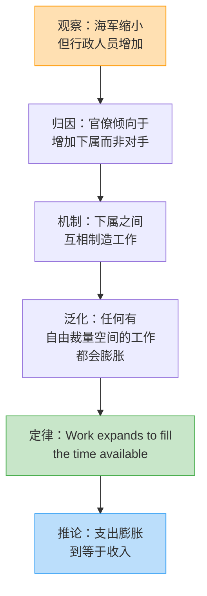
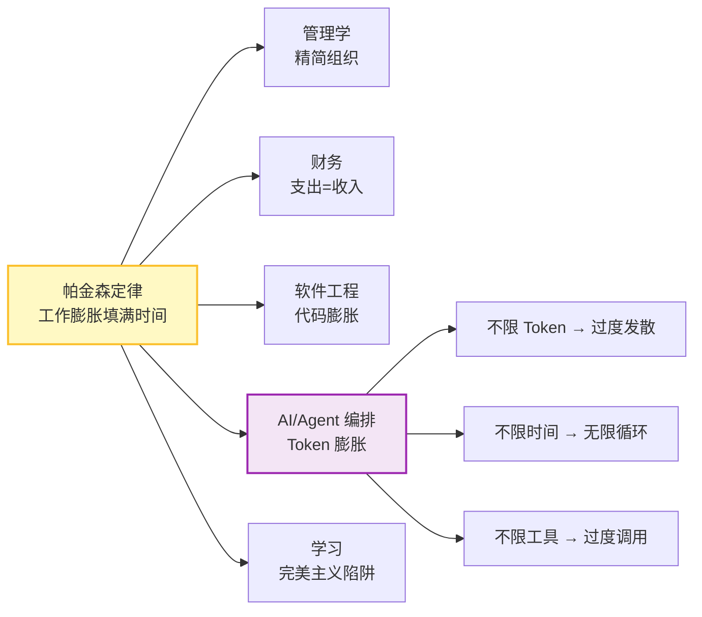
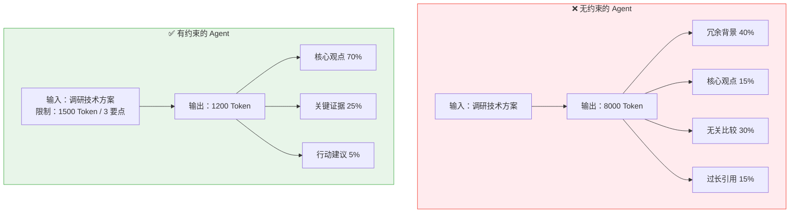

# 帕金森定律（Parkinson's Law）

> **工作会自动膨胀，直到填满所有可用的时间。** —— Cyril Northcote Parkinson, 1955

---

## 🔍 求真讲法：这个定律从哪里来？

### 背景与动机

1955 年 11 月 19 日，英国历史学家 **西里尔·诺斯古德·帕金森**（Cyril Northcote Parkinson）在《经济学人》（*The Economist*）杂志上发表了一篇看似幽默、实则犀利的短文。文章的第一句话就成了经典：

> **"Work expands so as to fill the time available for its completion."**

帕金森并非凭空臆想。他是一位严谨的历史学家，长期研究**英国海军部**（British Admiralty）的行政体系。他发现了一个荒诞的事实：

| 年份 | 皇家海军主力舰数量 | 海军部行政人员数量 |
|------|--------------------|--------------------|
| 1914 | 62 艘 | 2,000 人 |
| 1928 | 20 艘（↓ 67%） | 3,569 人（↑ 78%） |

**舰队缩小了三分之二，管理舰队的人反而增长了近一倍。** 这不是因为工作量增加了，而是因为官僚体系有一种天然的**自我膨胀**倾向——每个管理者都倾向于增加下属而非对手，而下属之间又会互相制造工作。

帕金森用辛辣的英式幽默总结了两条"官僚动力学"：

1. **"官员希望增加的是下属，而非对手。"**（An official wants to multiply subordinates, not rivals.）
2. **"官员们互相制造工作。"**（Officials make work for each other.）

1957 年，帕金森将这篇文章扩展为著作《帕金森定律》（*Parkinson's Law: The Pursuit of Progress*），一经出版便轰动世界，被翻译成数十种语言。

### 核心假设

帕金森定律成立依赖于以下隐含假设：

- **没有硬性约束**：任务没有严格的截止时间、资源上限或质量标准
- **执行者有自主裁量权**：执行者可以自由决定在任务上投入多少时间和精力
- **缺乏外部反馈机制**：没有人在过程中检查"这个工作量是否合理"
- **复杂度可以被人为制造**：任务本身具有足够的模糊性，使得"做更多"总是看起来合理的
- **激励结构不对齐**：做得多≠做得好，但做得多看起来更忙、更重要

### 推导过程

帕金森定律的"推导"并非数学证明，而是一条从经验观察到一般规律的**归纳推理链**：

我们可以用一个简单的模型来理解这种膨胀机制：

**设定**：一个任务的"最小必要工作量"为 $W_{min}$，分配的时间为 $T$。

$$W_{actual} = W_{min} + k \cdot (T - T_{min})$$

其中：
- $T_{min}$ 是完成最小必要工作的时间
- $k > 0$ 是"膨胀系数"，反映执行者制造额外工作的倾向
- 当 $T \gg T_{min}$ 时，$W_{actual} \gg W_{min}$，大量时间被浪费在不必要的工作上

**关键洞察**：额外的工作量 $k \cdot (T - T_{min})$ 并不产生额外的价值，它只是让人**感觉**更忙。

### 直觉理解

想象你搬家。

如果搬家公司说：**"你有 2 小时打包"**——你会迅速抓起重要的东西，塞进箱子，果断丢掉不需要的，2 小时搞定。

如果搬家公司说：**"你有 2 周打包"**——你会开始逐个整理抽屉、纠结每件旧衣服要不要留、给十年没联系的朋友发消息问他们想不想要你的旧书、上网搜索最优的打包技巧、买 5 种不同尺寸的收纳盒……2 周刚好用完，东西可能还没完全打包好。

**时间越充裕，你制造的"伪工作"就越多。最终结果可能还不如紧迫时更好。**

这就像气体的特性——气体会自动膨胀，填满整个容器。工作就是气体，时间就是容器。**容器多大，气体就膨胀到多大。**

---

## 🛠️ 求存讲法：这个定律能做什么？

### 核心用途

在管理学和组织行为学中，帕金森定律是**反官僚主义**的核心武器：

1. **组织设计**：解释为什么机构总是越来越臃肿，提醒管理者主动精简
2. **项目管理**：为设定紧凑但合理的截止时间提供理论依据
3. **预算控制**：解释"预算用不完明年就会被砍"的恶性循环
4. **个人效率**：番茄工作法、时间盒（Timeboxing）等生产力方法论的理论基石

### 跨领域迁移

帕金森定律的核心思想——**"资源不设上限则必然被浪费"**——可以迁移到几乎所有涉及资源分配的领域：

| 原始领域 | 迁移领域 | 膨胀表现 |
|----------|----------|----------|
| 官僚行政 | **Agent 编排** | 不限 Token，Agent 输出无限展开 |
| 时间管理 | 软件开发 | 不设 Sprint 边界，功能蔓延（Feature Creep） |
| 政府预算 | 个人财务 | 收入增加多少，消费就增加多少 |
| 组织扩张 | 数据存储 | 硬盘越大，垃圾文件越多 |
| 会议管理 | LLM 对话 | 上下文窗口越大，冗余信息越多 |

### 适用边界（假设再探）

帕金森定律**不是**万能的。它有明确的适用条件：

| 条件 | 定律成立 ✅ | 定律失效 ❌ |
|------|------------|------------|
| 时间约束 | 没有截止时间或截止时间过松 | 有紧迫且刚性的截止时间 |
| 任务定义 | 任务边界模糊、目标不清晰 | 任务有明确的完成标准（DoD） |
| 反馈机制 | 没有过程中的检查和反馈 | 有频繁的检查点和质量评审 |
| 激励结构 | "做得多"比"做得好"更受奖励 | 以结果和价值衡量绩效 |
| 执行者类型 | 有自主裁量权的知识工作者/Agent | 高度标准化的流水线工人 |
| 资源弹性 | 资源可以弹性获取（如 Token） | 资源硬性有限（如物理材料） |

> [!IMPORTANT]
> **对 LLM Agent 来说，帕金森定律几乎总是成立**，因为 Agent 天然满足所有"定律成立"的条件：没有内在的时间压力、任务边界常常模糊、Token 资源弹性充足、且 LLM 天然倾向于生成更多内容（训练目标鼓励详尽回答）。

### ✅ 正例：生活/学习/工作中的运用

#### 正例 1：Agent 编排——Token 预算制

在一个多 Agent 协作系统中，**研究 Agent** 被要求"调研某个技术方案"。

- **没有约束时**：Agent 生成 8000 Token 的调研报告，包含大量冗余背景知识、不相关的技术比较、过长的引用——核心观点淹没在信息洪流中。
- **设定约束后**：`max_tokens=1500`，要求"用 3 个要点总结核心发现"——Agent 被迫聚焦，输出精炼、信息密度极高。

#### 正例 2：Agent 编排——时间盒（Timeboxing）策略

在一个"规划-执行-审查"三阶段的 Agent 工作流中：

| 阶段 | 无时间盒 | 有时间盒（30 秒/阶段） |
|------|---------|----------------------|
| 规划 | 反复修改计划，3 分钟 | 快速确定方向，25 秒 |
| 执行 | 过度展开子任务，5 分钟 | 聚焦核心任务，28 秒 |
| 审查 | 生成冗长审查报告，2 分钟 | 简要确认结果，15 秒 |
| **总计** | **10 分钟** | **68 秒** |
| **结果质量** | 略好 | 几乎相同 |

**10 倍的时间只带来了边际改善**——这就是帕金森定律在 Agent 编排中的典型体现。

#### 正例 3：学期论文与截止时间

老师布置一篇 3000 字的论文：
- 给 **1 周**：大多数学生第 5 天开始写，2 天完成，质量尚可
- 给 **1 个月**：大多数学生前 3 周零星收集资料，最后 3 天突击写完，质量……也差不多

时间多了 4 倍，但实际有效工作时间几乎一样。多出来的时间被"研究"（其实是拖延）和"完善"（其实是纠结无关细节）吃掉了。

#### 正例 4：年度预算与"突击花钱"

每到财年末（12 月），政府部门和企业部门都会出现"突击花钱"现象——**如果今年预算没用完，明年的预算就会被削减**。于是大家疯狂采购不一定需要的设备、安排不一定必要的培训。

这是帕金森定律的财务推论：**支出会膨胀到等于收入（或预算）。**

#### 正例 5：Agent 编排——工具调用次数限制

一个 Agent 被赋予"搜索并总结信息"的任务：
- **不限工具调用**：Agent 调用搜索 15 次，每次略微变换关键词，最终信息重复度极高
- **限制最多 3 次搜索**：Agent 精心设计搜索词，3 次搜索覆盖核心信息，效率提升 5 倍

### ❌ 反例：假设不成立时会怎样？

#### 反例 1：急诊室医生——时间压力下定律失效

急诊室医生面对生死攸关的患者，手术时间是**硬性约束**（"黄金小时"）。没有人会因为"还有时间"就把一台急救手术做得更"精致"。在这种场景下：
- 任务有**清晰的完成标准**（稳定生命体征）
- 时间约束是**刚性的**（超时 = 死亡风险）
- 反馈是**即时的**（生命监测仪）

帕金森定律在此完全失效——时间再多，工作也不会膨胀，因为"完成"的定义是明确的。

#### 反例 2：Agent 有明确的"完成定义"时

如果给 Agent 的指令是：

> "判断这个 SQL 查询是否存在注入风险，回答'是'或'否'，并给出一行理由。"

无论给它 100 Token 还是 10000 Token 的上限，输出都差不多长——因为**任务的完成标准极度明确**，没有膨胀空间。帕金森定律要求任务具有"模糊性"才能发生膨胀。

#### 反例 3：物理资源硬约束

一个陶艺师只有 2 公斤黏土。无论给他多少时间，他做出的作品重量不会超过 2 公斤。**当资源是物理性的、不可弹性扩展的**，帕金森定律不适用。这也提示我们：在 Agent 编排中，Token 上限就是那块"2 公斤的黏土"——**把弹性资源变成硬性约束**。

---

## 💡 思考：值得深究的问题

1. **Agent 的"最优紧迫度"在哪里？** 约束太松导致帕金森膨胀，约束太紧导致输出质量骤降。对于不同类型的 Agent 任务（创意生成 vs. 事实查询 vs. 代码编写），最优的 Token 预算 / 时间限制应该如何确定？是否存在一条"质量-约束"的 U 形曲线？

2. **帕金森定律 vs. 侯世达定律（Hofstadter's Law）**："事情总是比你预期的要花更长时间，即使你已经考虑了侯世达定律。" 这两条定律似乎矛盾——一个说时间太多会浪费，一个说时间总是不够。它们的适用域如何划分？在 Agent 编排中，哪一条更常见？

3. **多 Agent 系统中的"帕金森级联"**：当多个 Agent 串联工作时，如果上游 Agent 因帕金森定律膨胀了输出，下游 Agent 需要处理更多的输入，从而也膨胀自己的工作……这种"级联膨胀"效应如何量化和阻断？是否需要在每个 Agent 之间设置"压缩网关"？

4. **"反帕金森"策略的副作用**：如果我们对 Agent 施加极其严格的约束（极低的 Token 上限、极短的超时时间），会不会从"过度发散"走向另一个极端——"过度压缩"，导致遗漏关键信息？如何在"帕金森膨胀"和"信息丢失"之间找到平衡？

5. **帕金森定律是否适用于自我改进的 Agent？** 如果一个 Agent 具备自我反思能力（如"我是否生成了过多冗余内容？"），它能否自发地对抗帕金森定律？还是说，自我反思本身也会成为另一种"膨胀"（meta-膨胀）？

---

## 📚 延伸阅读

1. **📖《帕金森定律》原著**（Cyril Northcote Parkinson, 1957）—— 用英式幽默解剖官僚主义的经典之作，薄薄一本，2 小时读完，笑中带泪。

2. **🔗 相关定律：侯世达定律（Hofstadter's Law）** —— "It always takes longer than you expect, even when you take into account Hofstadter's Law." 与帕金森定律构成有趣的对照：一个关注时间过剩的浪费，一个关注时间不足的焦虑。

3. **🔗 相关定律：布鲁克斯定律（Brooks's Law）** —— "Adding manpower to a late software project makes it later."（《人月神话》）与帕金森定律共同揭示了组织管理中"更多资源 ≠ 更好结果"的反直觉真理。在 Agent 编排中的对应：**增加更多 Agent 不一定能加速任务，反而可能因协调开销而减慢。**
