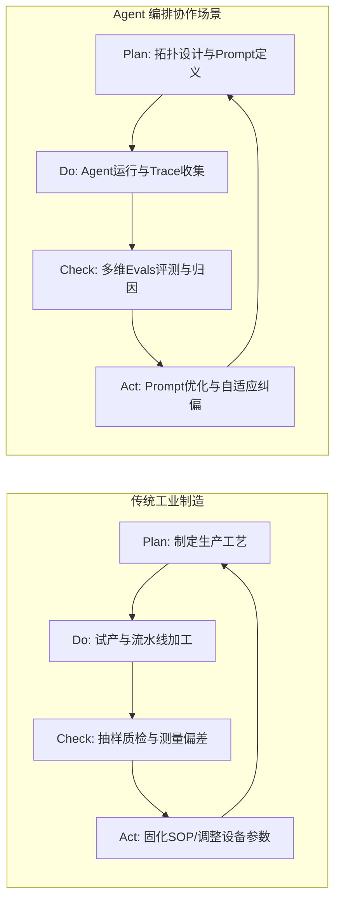
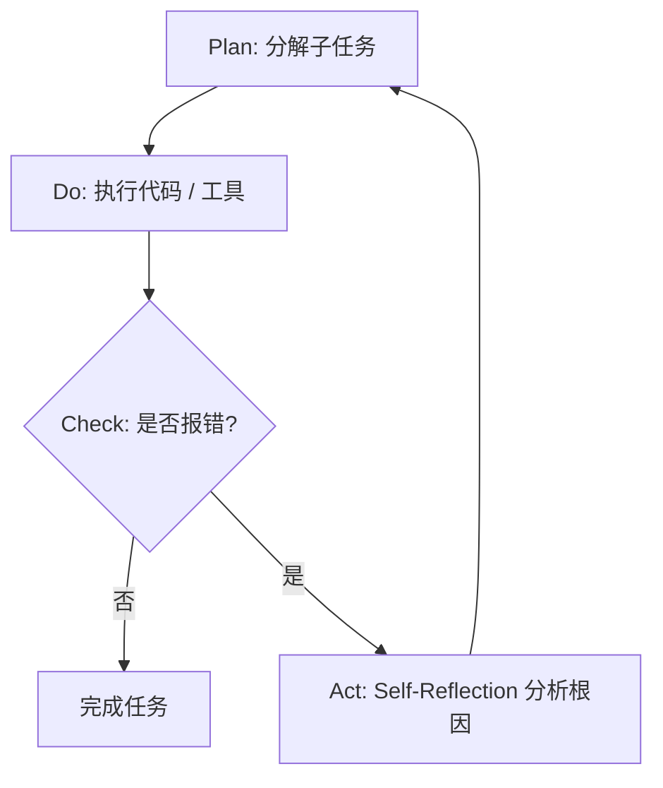

# PDCA 循环（戴明环 / Deming Cycle）
> **一句话核心摘要**：通过“计划（Plan）- 执行（Do）- 检查（Check）- 处理（Act）”的螺旋式持续闭环，将经验转化为标准化规则，驱动复杂系统从无序试错走向自我进化的底层质量哲学。

---

## 🔍 求真讲法：这个定理从哪里来？

### 背景与动机

20 世纪 20 年代，工业革命后的美国正面临大规模流水线生产的质量控制难题。贝尔实验室的物理学家兼统计学家**沃特·阿曼德·休哈特（Walter A. Shewhart）**首次将统计学引入质量管理，提出了“规格 - 生产 - 检查”（Specification-Production-Inspection）的三步控制概念，这是 PDCA 循环的萌芽。

第二次世界大战后，日本的工业体系几乎化为废墟，“日本制造”在当时一度是低质廉价的代名词。1950 年，美国统计质量控制专家**威廉·爱德华兹·戴明（W. Edwards Deming）**受邀前往日本，向日本的科学家、工程师和企业高管系统性地讲解了休哈特的思想，并将其扩充重构为 **Plan（计划）- Do（执行）- Check（检查）- Act（处理）** 四阶段闭环。

日本企业（如丰田汽车）将这一哲学融入企业骨髓，演变为享誉世界的**精益生产与持续改善（Kaizen）**文化。正是在 PDCA 循环的驱动下，日本制造在短短数十年间实现了质量飞跃，响彻全球。为了纪念戴明的贡献，这一闭环模型被全球管理学界正式命名为**“戴明环（Deming Cycle）”**。

```
       [ 改善 Quality Improvement ]
                  ▲
                 /   ┌───────┐
                /    │  Act  │  (标准化/纠偏)
               /  ┌──┴──────┴──┐
              /   │   Check    │  (偏差评估)
             / ┌──┴────────────┴──┐
            /  │        Do        │  (数据收集)
           / ┌─┴──────────────────┴─┐
          /  │         Plan         │  (SMART目标)
         / └─┴──────────────────────┴─┐
   ▲    /                             │
  /│\  /    [ SOP 止逆块 / Baseline ] │ (防止质量滑坡)
   │  /───────────────────────────────┘
   │ /
  ─┴─ Slope of Continuous Improvement
```

### 核心假设

PDCA 循环之所以能在各种复杂系统中生效，建立在以下 4 个核心前提假设之上：

*   **假设 1：系统的不可预测性与动态复杂性（Uncertainty）**：不存在能够一劳永逸预知所有变量的“完美静态设计”。复杂系统必须在与环境交互的动态试错中逐步寻找最优解。
*   **假设 2：过程的可观测性与定量化评估（Observability）**：系统的执行轨迹（Traces）、输入输出与中间状态必须是可记录、可对比、可度量的。若缺乏数据沉淀，检查（Check）将退化为主观猜测。
*   **假设 3：知识的提取与标准化止逆能力（Standardization）**：单次改善的经验必须能够被提炼并固化为可复制的标准（SOP / Prompt / Rule）。若无法标准化，系统将在同一个坑里反复跌倒。
*   **假设 4：闭环的连续演进性（Continuity）**：上一次循环 Act 产出的新标准，必须自动成为下一次循环 Plan 的起点基线（Baseline），形成无限上升的螺旋，而非单次终止的线性流程。

### 推导过程

#### 1. PDCA 螺旋演进模型（SVG 可视化）

下图展示了 PDCA 如何借由“标准化 SOP”抵住滑块，推动系统沿着质量改善斜坡持续攀升：

<svg xmlns="http://www.w3.org/2000/svg" viewBox="0 0 600 300" width="100%" height="100%">
  <!-- Background -->
  <rect width="600" height="300" fill="#f8fafc" rx="8"/>
  
  <!-- Slope -->
  <path d="M 50 250 L 520 80" stroke="#94a3b8" stroke-width="4" stroke-dasharray="6,6"/>
  <polygon points="50,250 520,80 520,250" fill="#e2e8f0" opacity="0.4"/>
  <text x="420" y="230" fill="#64748b" font-size="14" font-weight="bold">品质与效能提升斜坡 (Kaizen)</text>

  <!-- Deming Wheel (Circle) -->
  <g transform="translate(320, 145)">
    <circle cx="0" cy="0" r="65" fill="#ffffff" stroke="#2563eb" stroke-width="4"/>
    <!-- Quarter lines -->
    <line x1="-65" y1="0" x2="65" y2="0" stroke="#cbd5e1" stroke-width="2"/>
    <line x1="0" y1="-65" x2="0" y2="65" stroke="#cbd5e1" stroke-width="2"/>
    
    <!-- Quadrant Texts -->
    <text x="-32" y="-25" fill="#1e40af" font-size="15" font-weight="bold">Plan</text>
    <text x="12" y="-25" fill="#1e40af" font-size="15" font-weight="bold">Do</text>
    <text x="8" y="35" fill="#1e40af" font-size="15" font-weight="bold">Check</text>
    <text x="-38" y="35" fill="#1e40af" font-size="15" font-weight="bold">Act</text>
    
    <!-- Rotating Arrow Concept -->
    <path d="M 45 -20 A 50 50 0 0 1 20 45" fill="none" stroke="#3b82f6" stroke-width="3" marker-end="url(#arrow)"/>
  </g>

  <!-- SOP Wedge (止逆块) -->
  <polygon points="210,195 255,180 255,200" fill="#ef4444"/>
  <rect x="140" y="200" width="115" height="35" rx="4" fill="#fee2e2" stroke="#ef4444" stroke-width="1.5"/>
  <text x="150" y="222" fill="#991b1b" font-size="13" font-weight="bold">SOP 标准化止逆块</text>
  <text x="110" y="185" fill="#dc2626" font-size="12">防止质量向下滑落</text>

  <!-- Rolling Direction Arrow -->
  <line x1="320" y1="70" x2="390" y2="47" stroke="#16a34a" stroke-width="3" marker-end="url(#green-arrow)"/>
  <text x="310" y="40" fill="#15803d" font-size="14" font-weight="bold">螺旋上升演进 (Next PDCA)</text>

  <!-- Definitions -->
  <defs>
    <marker id="arrow" viewBox="0 0 10 10" refX="5" refY="5" markerWidth="6" markerHeight="6" orient="auto-start-reverse">
      <path d="M 0 0 L 10 5 L 0 10 z" fill="#3b82f6"/>
    </marker>
    <marker id="green-arrow" viewBox="0 0 10 10" refX="5" refY="5" markerWidth="6" markerHeight="6" orient="auto-start-reverse">
      <path d="M 0 0 L 10 5 L 0 10 z" fill="#16a34a"/>
    </marker>
  </defs>
</svg>

#### 2. 量化状态演化方程

如果我们将系统的质量或效能表示为状态变量 $Q_t$，其演化机制可以形式化表达为：

$$Q_{t+1} = Q_t + \Delta Q_{\text{Act}}\Big( E_{\text{Check}}\big( Y_{\text{Do}}(X_{\text{Plan}}) \big) \Big) - \delta \cdot \mathcal{S}$$

其中：
*   $X_{\text{Plan}}$ 表示在 Plan 阶段设定的目标与决策空间（如 SMART 目标与 Prompt 架构）。
*   $Y_{\text{Do}}$ 表示系统在真实环境下的运行输出与日志轨迹（Execution Traces）。
*   $E_{\text{Check}}$ 表示评估函数，对比实际产出与目标的偏差 $\Delta = Y_{\text{Do}} - X_{\text{Plan}}$。
*   $\Delta Q_{\text{Act}}$ 表示处理阶段带来的增量收益。当且仅当成功经验被标准化（SOP 锁死）时，$\Delta Q_{\text{Act}} > 0$。
*   $\delta \cdot \mathcal{S}$ 表示系统自然的**熵增衰减**（环境变化、知识遗忘、依赖漂移等）。

> **结论**：若缺乏 **Act（标准化）** 环节，$\Delta Q_{\text{Act}} \to 0$，系统将在熵增作用下陷入 $Q_{t+1} < Q_t$ 的质量退化困境。

### 直觉理解

想象你在学习打高尔夫球或练习投篮：

*   **Plan（计划）**：你盯着篮框，脑海中设定目标——“以 45 度角抛物线投出手中的球”。
*   **Do（执行）**：你弯膝、起跳、挥臂投出篮球。
*   **Check（检查）**：你的眼睛看到球砸在了篮框前沿偏左 5 厘米处弹出，肌肉感知到刚才出手时手腕发力偏轻。
*   **Act（处理）**：你调整大脑中的肌肉记忆（标准化规则：“下次出手手腕多发 5% 的力，身体稍微向右正对篮框”），并将这个修正作为下一次投篮（下一个 PDCA 循环）的起始姿势。

如果你闭着眼睛投篮（没有 Check），或者每次投偏后都不调整动作随意乱投（没有 Act），即便投一万次球，你也无法成为神投手。**PDCA 就是给系统装上“眼睛”与“肌肉记忆调整机制”。**

---

## 🛠️ 求存讲法：这个定理能做什么？

### 核心用途

1.  **现代质量管理（ISO 9001 / 六西格玛）**：制造与服务业消除缺陷、降低波动率的基石。
2.  **软件工程与 DevSecOps**：敏捷开发 Sprint 循环（Plan 计划 -> Do 编码 -> Check 复盘与测试 -> Act 重构与CI/CD流程固化）。
3.  **大模型与 Agent 编排协作**：Agent 系统的构建绝对不是一次性的静态 Prompt 编写，而是基于追踪与评测的动态生命周期治理。

### 跨领域迁移

从工业制造迁移到 **Agent 编排协作场景**，PDCA 的四个阶段映射如下：



#### 阶段映射对比表

| 阶段 | 传统质量管理 | Agent 编排协作生命周期 |
| :--- | :--- | :--- |
| **Plan (计划)** | 明确 SMART 目标，制定产品规格与生产工艺流程 | **架构设计**：定义 Agent 角色职责、系统 Prompt、Tool Schema 接口规范，编排 Multi-Agent 协作拓扑（DAG / Router） |
| **Do (执行)** | 按照工艺流程投入试产，收集生产线日志 | **运行交互**：Agent 接收 Task 运行，调用 Tools 生成回答，全程记录 Execution Traces（LLM Calls, Tool Inputs/Outputs, Memory） |
| **Check (检查)** | 测量零件尺寸，对比合格率标准，分析不良根因 | **Evals 评测**：基于 LLM-as-a-Judge、代码单元测试、精准度 Benchmark，对幻觉、工具误用、死循环做归因分析 |
| **Act (处理)** | 成功经验写入 SOP 工艺手册，故障设备停机整改 | **系统演进**：优化 System Prompt、更新 Few-shot 示例库、重构 Tool 函数；或触发 Agent 自身的 Self-Correction / Reflection 机制 |

### 适用边界（假设再探）

| 条件维度 | PDCA 高效成立区 | 假设破裂 / PDCA 失效区 | 原因分析 |
| :--- | :--- | :--- | :--- |
| **反馈时延 (Latency)** | 短周期反馈（如秒级 Agent 运行日志） | 极长周期反馈（如 5 年后的宏观经济变化） | Check 延迟过大会导致 Act 滞后，无法指导当前循环 |
| **因果可归因性 (Causality)** | 系统变量清晰，归因链路明确 | 极高随机性 / 黑天鹅环境 | 盲目 Check 会导致“伪归因”，错误的 Act 反而破坏系统 |
| **重复使用频率 (Frequency)** | 高频高复用场景（如 Agent API 服务） | 一次性极端特例场景 | 标准化 (Act) 的成本大幅超过重复使用的边际收益 |

### ✅ 正例：生活/学习/工作中的运用

#### 1. Agent 编排与 Evals 评测闭环（核心应用场景）
在开发一个 Text-to-SQL 数据分析 Agent 时：
*   **Plan**：设计 Schema-aware System Prompt，注入数据库表结构，定义 `execute_sql` 工具。
*   **Do**：上线测试，处理 500 个真实用户的自然语言查询，全量记录 Execution Trajectory。
*   **Check**：运行 Evals 脚本，发现 SQL 语法正确率为 92%，但遇到复杂的多表 `LEFT JOIN` 时错误率达 40%（根因：模型不知道两表间的隐性外键关系）。
*   **Act**：在 System Prompt 中补全隐性外键注释，并在 Few-shot 示例集中补充 3 个复杂的 `LEFT JOIN` 边界案例（标准化），使下一轮测试正确率提升至 98%。

#### 2. Agent 运行时的自适应 Reflection 机制（Self-Correction）
在微观的单次任务执行中，Agent 自身内部运行着微型 PDCA：
*   **Plan**：分解复杂任务为 3 个子步骤（Code Generation -> Execution -> Validation）。
*   **Do**：生成 Python 代码并调用 Code Interpreter 执行。
*   **Check**：捕获 Interpreter 返回的 `IndexError: list index out of range` 异常日志。
*   **Act**：触发 Reflection 模块，分析数组越界原因，修补代码逻辑后重新尝试执行，实现自愈。



#### 3. 个人学习中的“错题本”提分法
*   **Plan**：设定目标——本周攻克“动态规划”算法题，计划每天刷 3 道题。
*   **Do**：限时独立做题，记录解题耗时与思考路径。
*   **Check**：对照标准答案，发现 30% 的题目在“状态转移方程边界条件”上扣分。
*   **Act**：将边界漏洞归纳进错题本，总结“边界处理三步检查法”（标准化），下周针对性复习。

#### 4. OKR 目标管理与团队敏捷复盘
*   **Plan**：季度初制定 OKR（如：Agent 响应延迟降低 50%）。
*   **Do**：按 Weekly 双周 Sprint 推进异步调用与缓存改造。
*   **Check**：双周复盘例会对比 P99 延迟指标，发现大模型 Streaming 输出阶段延迟符合预期，但某第三方 API 工具调用耗时过长。
*   **Act**：将该第三方 Tool 改为并发异步调用，更新团队架构开发规范 SOP。

### ❌ 反例：假设不成立时会怎样？

#### 1. “只有 Do-Do-Do”的伪勤奋陷阱（破坏 Check & Act）
*   **现象**：Agent 开发者每天都在手动编写新的 Prompt，不断给 Agent 堆加更多的 Tools，但**从来不跑 Benchmark 测试，也不看 Execution Traces**。
*   **后果**：系统陷入“低水平重复错误”。当用户反馈回答质量下降时，开发者只能凭感觉盲目微调，导致旧 Bug 没解决，新 Bug 又不断产生。

#### 2. “只 Check 不 Act”的假闭环（缺乏标准化止逆）
*   **现象**：团队建立了极其完善的监控大屏与 Evals 评测每周报告（Check 极度详尽），发现 Agent 在特定场景下存在严重幻觉。但**没有人去更新 Prompt，没有把案例加入 Few-shot，也没有重构 Tool 接口**。
*   **后果**：由于没有 SOP 止逆块，评测报告变成了“废纸”，系统质量随着底层大模型 API 的更新而波动衰退（滑块滑落）。

#### 3. 归因错误导致的伪改善（破坏 Check 假设）
*   **现象**：某一天的 Agent 用户满意度突然下降，开发者未经深入 Trace 分析，主观断定是“System Prompt 太长导致模型遗忘”（归因错误），于是删除了大量约束提示词。
*   **后果**：实际上满意度下降是因为当天第三方 Vector DB 超时。错误的 Act 操作把原本设计合理的 Prompt 改乱，系统整体能力遭受毁灭性破坏。

---

## 💡 思考：值得深究的问题

1.  **Agent 编排中的 Act 自动化**：在 Prompt 工程逐渐向 DSPy 等自动编译框架演进的背景下，如何让 Agent 系统自动将 Check 中的 Evals 失败 Trajectory 转化为 Few-shot 示例或 Prompt 梯度优化，实现真正**无人值守的自动化 PDCA 闭环**？
2.  **非确定性 LLM 的 Check 信度度量**：大语言模型具有天然的随机性与非确定性（Non-deterministic）。在 Check 环节中，如何区分“系统架构设计缺陷导致的必然错误”与“LLM 随机采样带来的偶然波动”？
3.  **PDCA 循环频次的过度拟合风险**：PDCA 循环的迭代周期（Cycle Time）是越短越好吗？如果针对每次单点报错都立刻执行 Act 强行修改 Prompt，是否会导致 Prompt **过拟合（Overfitting）** 到特定边缘案例，从而损害 Agent 的通用泛化能力？
4.  **如何防止 PDCA 陷入“局部最优”**：PDCA 是一种渐进式的连续改善（Continuous Improvement）哲学。当系统架构遇到根本性的技术范式转变时，过度依赖 PDCA 渐进式修补是否会让团队忽视破坏性创新（Disruptive Innovation）？

---

## 📚 延伸阅读

1.  **《走出危机》（Out of the Crisis）** - 威廉·爱德华兹·戴明（W. Edwards Deming）：戴明质量管理哲学的开山巨著，深入阐述了 14 条管理原则与 PDCA 思想。
2.  **DSPy 论文与开源框架** - Stanford NLP Group：展示了如何通过“编译与优化”思想取代人工 Prompt 调试，用算法实现 Agent 编排中的 Plan-Do-Check-Act 自动化闭环。
3.  **ISO 9001:2015 质量管理体系标准**：理解工业界如何将 PDCA 架构化、标准化并落地为企业治理体系的权威指南。
