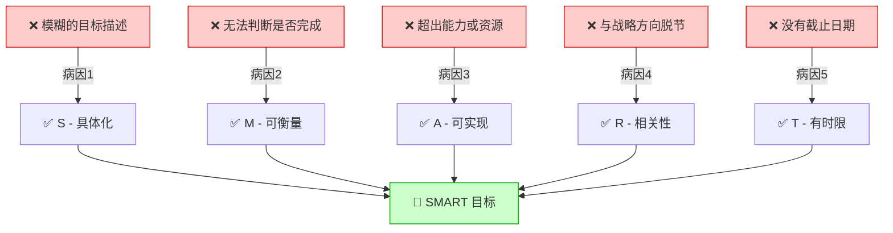
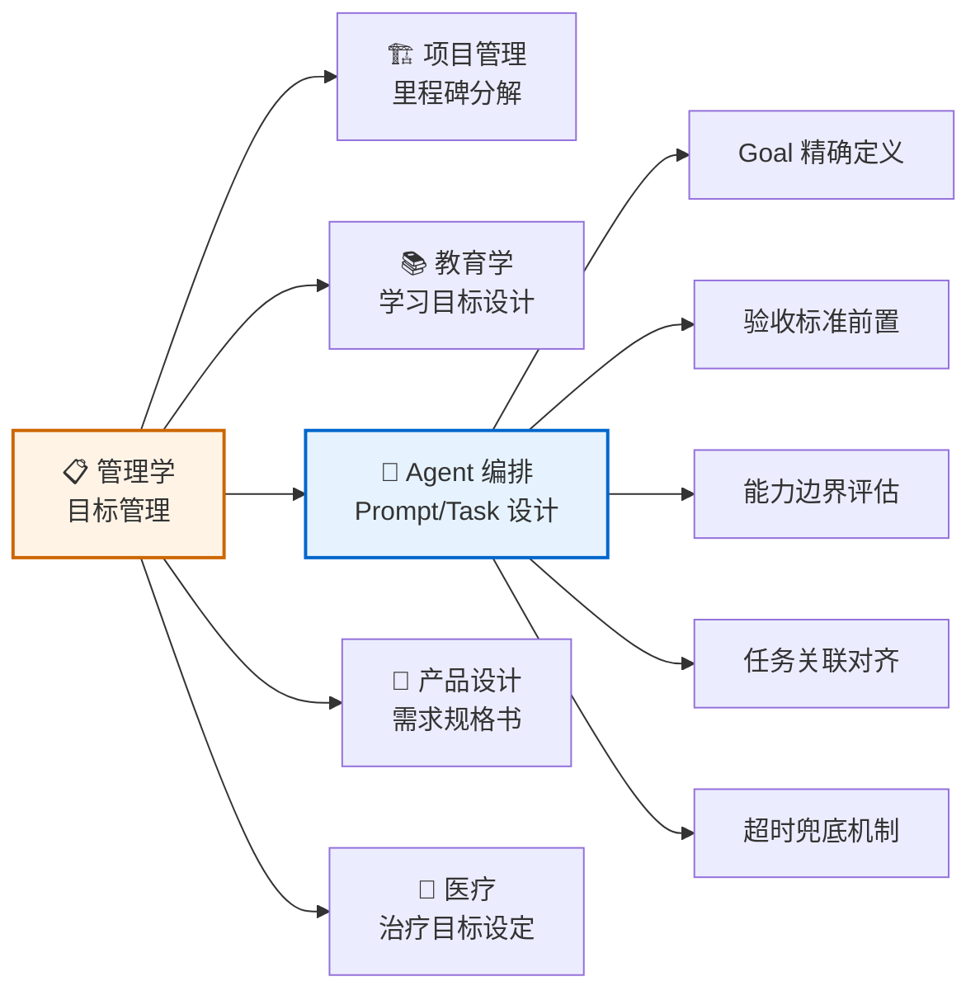
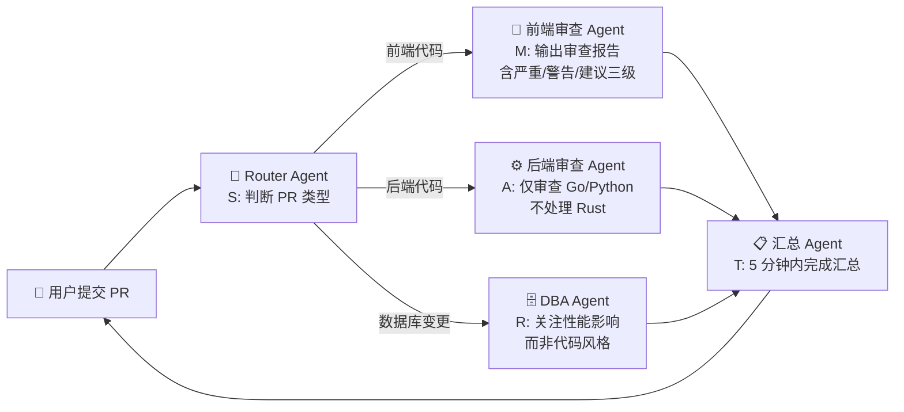

# SMART 原则（Specific, Measurable, Achievable, Relevant, Time-bound）

> **目标若不能被精确描述，就不能被有效执行——无论执行者是人还是 Agent。**

---

## 🔍 求真讲法：SMART 原则从哪里来？

### 背景与动机

1981 年 11 月，美国华盛顿水务公司（Washington Water Power Company）的管理顾问 **George T. Doran** 在《Management Review》杂志上发表了一篇仅两页的短文：*"There's a S.M.A.R.T. Way to Write Management's Goals and Objectives"*。

当时的企业管理界正面临一个尴尬的困境：彼得·德鲁克（Peter Drucker）在 1954 年提出的"目标管理"（MBO, Management by Objectives）理论已经风靡了近三十年，几乎每家大公司都在搞目标管理，但**绝大多数管理者依然写不出一个好目标**。

Doran 在论文中一针见血地指出：

> "管理者们习惯性地把目标写成'提高客户满意度'、'加强团队协作'这样的模糊口号。这些不是目标——它们是愿望。"

他发现，问题的根源不是管理者不重视目标，而是**缺少一个实操性的检验框架**——一个能让任何人拿起笔来就能判断"这个目标写得好不好"的清单。于是他提出了五个维度的检验标准，并巧妙地取了首字母缩写——**S.M.A.R.T.**：

| 字母 | 英文 | 含义 |
|:---:|:---|:---|
| **S** | Specific | 具体的——目标必须清晰明确，不能含糊 |
| **M** | Measurable | 可衡量的——必须有量化指标或明确的完成标准 |
| **A** | Achievable | 可实现的——在现有资源和条件下是可行的 |
| **R** | Relevant | 相关的——与更大的战略目标保持一致 |
| **T** | Time-bound | 有时限的——必须设定明确的截止日期 |

这篇两页纸的短文，后来成为管理学史上被引用最多的文献之一。

### 核心假设

SMART 原则建立在以下关键假设之上：

- **假设一：目标的质量决定执行的质量**——好的目标自带执行路径，差的目标只会制造混乱
- **假设二：模糊性是目标失败的首要原因**——不是执行力不够，而是目标本身就无法被执行
- **假设三：目标可以被结构化分解**——任何复杂目标都可以拆解为满足五个维度的子目标
- **假设四：执行者需要明确的"完成信号"**——如果不知道"做到什么程度算完成"，执行必然失控
- **假设五：时间约束是行动的催化剂**——没有截止日期的目标永远不会开始

### 推导过程

SMART 原则并非数学推导，而是一种**归纳性框架**——从大量目标管理的失败案例中，提炼出目标失败的五个最常见病因，然后取其反面作为"健康目标"的标准。



用一个具体的改写过程来展示：

| 维度 | ❌ 改写前 | ✅ 改写后 |
|:---:|:---|:---|
| S | 提高销售业绩 | 华东区 Q3 新客户签约数 |
| M | 提高销售业绩 | 从当前月均 12 单提升到月均 18 单 |
| A | 月均签约 100 单 | 月均签约 18 单（团队 5 人，人均 3.6 单，历史最高人均 4 单） |
| R | 学习法语 | 签约数提升以支撑年度营收增长 20% 的战略目标 |
| T | 尽快完成 | 在 2025 年 9 月 30 日前达成 |

最终的 SMART 目标：**"华东区销售团队在 2025 年 Q3（7-9月）将新客户月均签约数从 12 单提升至 18 单，以支撑年度营收增长 20% 的战略目标。"**

### 直觉理解

> 🧭 **导航类比**：SMART 原则就像你给导航软件输入目的地。
>
> - 你说"带我去个好玩的地方"——导航无法启动（不 Specific）
> - 你说"去北京"——导航能规划路线了（Specific）
> - 你说"去北京，300 公里内算到达"——导航能判断是否到了（Measurable）
> - 你说"开车去北京，但我油只够 50 公里"——导航会告诉你不现实（not Achievable）
> - 你说"去北京开会"但其实会议在上海——目的地本身就选错了（not Relevant）
> - 你说"去北京，随便什么时候到"——你可能永远不会出发（not Time-bound）
>
> **给 Agent 写 Prompt，和给导航输入目的地，是完全相同的逻辑。**

---

## 🛠️ 求存讲法：SMART 原则能做什么？

### 核心用途

在管理学的原始领域中，SMART 原则主要用于：

1. **绩效管理**——帮助管理者为团队设定清晰的 KPI
2. **项目管理**——将项目里程碑分解为可交付的 SMART 子目标
3. **个人发展**——将职业规划从"愿景"转化为可执行的行动清单
4. **战略落地**——将公司级战略分解为部门和个人级别的行动目标

### 跨领域迁移

SMART 原则的思想可以从管理学迁移到多个领域，尤其在 **AI Agent 编排协作**中展现出惊人的适配度：



**SMART → Agent Prompt 设计的映射关系：**

| SMART 维度 | Agent 编排中的对应 | 实操建议 |
|:---:|:---|:---|
| **S** - 具体 | Prompt 必须明确任务边界 | 用"你需要做 X，不需要做 Y"来框定范围 |
| **M** - 可衡量 | 必须定义验收标准 | 明确输出格式、字段要求、质量指标 |
| **A** - 可实现 | 任务不超出 Agent 能力 | 考虑上下文窗口、工具权限、知识边界 |
| **R** - 相关 | 子任务与总目标对齐 | 编排时确保每个 Agent 的任务都服务于最终目标 |
| **T** - 有时限 | 必须设置超时和兜底 | 设定 timeout，定义超时后的 fallback 策略 |

### 适用边界（假设再探）

SMART 原则并非万能。以下是其成立和失效的边界：

| 场景 | SMART 是否适用 | 原因 |
|:---|:---:|:---|
| 明确的执行性任务（写报告、改 Bug） | ✅ 完全适用 | 目标可以被精确描述和衡量 |
| 探索性研究（寻找新方向） | ⚠️ 部分适用 | S 和 M 可能过早限制探索空间 |
| 创意性工作（艺术创作、头脑风暴） | ⚠️ 慎用 | 过度具体化会扼杀创造力 |
| 应对黑天鹅事件（危机响应） | ❌ 不适用 | 目标在事先无法被精确预设 |
| Agent 多轮对话中的即时调整 | ⚠️ 需要变通 | 每一轮的"T"需要动态更新 |
| 长期愿景设定（10 年规划） | ⚠️ 仅 R 适用 | 时间跨度太长，M/A/T 难以预设 |

> [!IMPORTANT]
> **SMART 最适合"执行层"目标，而非"愿景层"目标。** 愿景可以模糊（"让每个人都用上 AI"），但拆解出来的执行目标必须 SMART（"在 Q3 前将 Agent 响应延迟从 3s 降到 1s"）。

### ✅ 正例：生活/学习/工作中的运用

**正例 1：Agent 任务编排——数据分析流水线**

❌ 模糊指令：
```
"分析一下这个数据集，给我一些洞察。"
```

✅ SMART 指令：
```
"请对 sales_2025_q2.csv 进行分析：
 - S：聚焦华东区 Top 10 客户的月度购买趋势
 - M：输出包含趋势图（折线图）、环比增长率表格、3 条关键发现
 - A：数据已清洗，仅需分析，无需爬取或补全
 - R：用于 Q3 销售策略会议的决策支撑
 - T：在 60 秒内完成分析并返回结果"
```

**正例 2：多 Agent 协作——代码审查流水线**



每个 Agent 的任务都被 SMART 化：Router 有明确的分类标准（S），审查 Agent 有结构化的输出格式（M），DBA Agent 有能力边界限定（A），所有产出都对齐"提高代码质量"的总目标（R），并且有超时保护（T）。

**正例 3：个人学习——备考计划**

> "我要在 2025 年 12 月 15 日前（T）通过 PMP 认证考试（S），模拟考得分达到 75% 以上（M）。我已有 3 年项目管理经验且已报名 35 学时培训课程（A），这是我晋升为技术总监的必要条件（R）。"

**正例 4：产品需求——功能设计**

> "在 v2.1 版本（T: 8 月 15 日发布）中，新增用户导出功能（S），支持 CSV 和 Excel 两种格式（M），单次导出上限 10 万行以适配现有内存限制（A），以满足企业客户批量数据处理的需求（R）。"

**正例 5：Agent Prompt 模板化**

将 SMART 原则固化为 Agent 的 System Prompt 模板：

```markdown
## 任务描述（Specific）
[精确描述要做什么、不做什么]

## 完成标准（Measurable）
[列出验收条件和输出格式要求]

## 能力约束（Achievable）
[声明可用工具、知识范围、上下文限制]

## 目标对齐（Relevant）
[说明本任务在整体流程中的角色]

## 时间约束（Time-bound）
[设定超时时间和超时后的降级策略]
```

### ❌ 反例：假设不成立时会怎样？

**反例 1：过度 SMART 导致"目标近视"**

某团队为客服 Agent 设定了严格的 SMART 目标："每次对话在 3 轮内解决用户问题，解决率达到 95%"。结果：
- Agent 为了追求 3 轮解决，对复杂问题草草给出不完整的答案
- 解决率统计上达标了，但用户满意度反而下降
- **根因**：M（可衡量）的指标选错了——衡量的是"速度"而非"质量"

> 📌 **教训**：SMART 要求目标可衡量，但**选错衡量指标比没有指标更危险**。在 Agent 编排中，验收标准必须和真实的用户价值对齐，而非和容易测量的表面指标对齐。

**反例 2：在探索性任务中强行 SMART**

一个研究团队要求 AI Agent "在 2 小时内找到 3 个可行的新产品方向"。结果：
- Agent 为了凑数，输出了 3 个平庸且相似的方向
- 真正有突破性的方向需要更长时间的发散思考
- **根因**：S（具体）和 T（时限）过早收窄了探索空间

> 📌 **教训**：探索性任务应该用"方向 SMART"而非"终点 SMART"——定义探索的范围和方法，而非预设探索的结论。

**反例 3：Agent 能力被高估（A 假设失效）**

给一个通用 LLM Agent 设定目标："分析这份 500 页 PDF 的财务数据，生成完整的审计报告"。目标写得非常 SMART，但 Agent 的上下文窗口装不下 500 页内容，也不具备专业审计知识。

> 📌 **教训**：**A（可实现）是最容易被忽略的维度**。在 Agent 编排中，必须评估 Agent 的真实能力边界：上下文长度、工具权限、领域知识、推理能力。否则再 SMART 的目标也只是空中楼阁。

---

## 💡 思考：值得深究的问题

1. **SMART 的"S"和"创造力"之间的张力**：如果目标越具体越好，那探索性任务该如何设定目标？是否存在一种"渐进式 SMART"——先模糊后具体，随着探索的深入逐步收窄目标？

2. **Agent 编排中的"动态 SMART"**：在多轮对话或多步骤 Agent 工作流中，目标应该是一开始就完全 SMART 化，还是允许在执行过程中动态调整？如果允许调整，如何防止目标漂移？

3. **"M"的悖论——衡量指标的选择本身就是一个需要智慧的决策**：在 Agent 评估中，我们用什么指标来衡量"Agent 完成了任务"？准确率？用户满意度？完成时间？这些指标之间往往是矛盾的。如何为 Agent 设定不会互相冲突的 M？

4. **SMART 是否需要第六个字母？** 有人提出 SMART**ER**（加上 Evaluated 和 Reviewed）。在 Agent 编排的语境下，"可评估"和"可复盘"是否应该成为目标设计的必选项？一个 Agent 的任务完成后，如何自动化地进行结果评估和流程复盘？

5. **从"人设目标"到"Agent 自主设目标"**：当 Agent 具备自主规划能力时（如 AutoGPT 类系统），SMART 原则应该由谁来执行？是人类在 System Prompt 中硬编码，还是让 Agent 自己学会用 SMART 来分解任务？这会带来什么风险？

---

## 📚 延伸阅读

1. **📄 原始论文**：George T. Doran, *"There's a S.M.A.R.T. Way to Write Management's Goals and Objectives"*, Management Review, Vol. 70, Issue 11, 1981, pp. 35-36. ——仅两页，却影响了四十年的管理实践。

2. **📖 《目标管理与自我控制》**（Peter Drucker, *The Practice of Management*, 1954）——SMART 原则的理论源头。德鲁克提出了"目标管理"的概念，SMART 是将其可操作化的工具。

3. **🤖 Prompt Engineering 最佳实践**——将 SMART 原则应用于 Agent Prompt 设计的现代实践。关注 OpenAI、Anthropic 等公司发布的 Prompt 设计指南，其中"清晰、具体、可验证"的要求与 SMART 的 S/M 高度一致。
