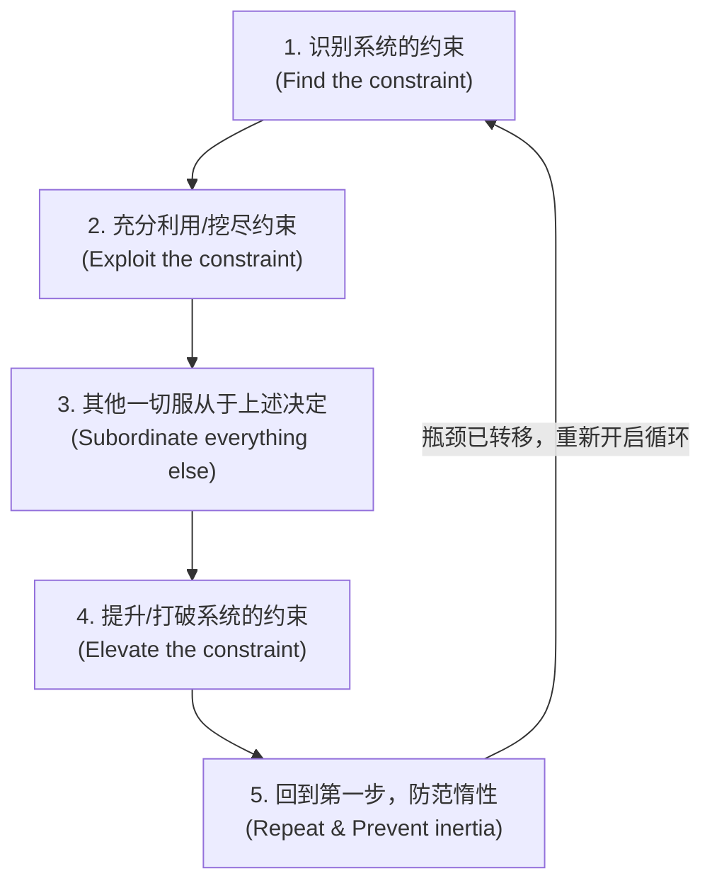
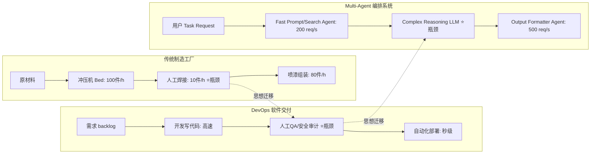

# 约束理论（Theory of Constraints, TOC / 瓶颈理论）
> 系统的最终产出由其最薄弱的环节（瓶颈）决定；盲目优化非瓶颈环节不仅无法提升系统整体效能，反而会造成大量的无用堆积与资源浪费。

---

## 🔍 求真讲法：这个定理从哪里来？

### 背景与动机

20 世纪 70 年代末至 80 年代初，全球制造业正陷入一场关于“局部效率”的迷思。企业管理者们疯狂地追求每个车间、每台机器、每个工人的“高利用率”（100% 稼动率），以为只要每个环节都在不停地干活，工厂的整体效益就会翻倍。然而现实却极其残酷：仓库里堆满了半成品（WIP, Work in Process），订单交付周期不断拉长，工厂资金链濒临断裂。

正在此时，以色列物理学家**埃利·高德拉特博士（Eliyahu M. Goldratt）**跨界走进了企业管理领域。作为一名受过严苛自然科学训练的物理学家，高德拉特用极其理性的眼光审视工厂运营，提出了一个惊人的发现：**工厂不是一堆孤立机器的集合，而是一条一环扣一环的链条。**

他在 1984 年出版的经典管理小说《目标》（*The Goal*）中，讲述了一个有温度的故事：
厂长亚历克斯（Alex Rogo）面临工厂即将被关停的危机。在一次带领童子军徒步（Hiking）的活动中，亚历克斯发现队伍总是拉得很长。跑得最快的人在前面闲逛，而走得最慢的小孩——**赫比（Herbie）**却被远远甩在后面。亚历克斯意识到：**整支队伍到达终点的时间，完全取决于赫比的脚步速度。** 前面的孩子跑得再快，除了拉大队伍间距（制造“半成品堆积”）之外，对让整支队伍更快到达终点没有任何帮助！

高德拉特把赫比包里沉重的食物分担给其他孩子（打破约束），并让赫比走在队伍最前面领队（服从约束），整支队伍顿时紧凑且迅速地到达了终点。这一直观深刻的洞察，演变成了改变全球工业界与 IT 架构设计的思想体系——**约束理论（Theory of Constraints, TOC）**。

```
徒步队伍类比：
[快孩子 A] --> [快孩子 B] --> [快孩子 C] ... (队伍拉长堆积) ... --> [赫比 Herbie (最慢)]
                         ▲
                     瓶颈环节 (决定整体到达速度)
```

---

### 核心假设

约束理论的立论建立在以下三个不可动摇的系统论假设之上：

*   **1. 系统依赖性假设（Systemic Interdependence）**
    现实中的复杂系统（无论是工厂流水线、软件架构，还是 Multi-Agent 协作网络）都是由相互关联、紧密耦合的节点构成的网路或链条，而非独立节点的简单加总。
*   **2. 瓶颈唯一/极少数假设（Constraint Existence）**
    在任意给定的时间窗口内，决定系统整体吞吐量（Throughput）的限制因素（瓶颈）是客观存在且极其稀缺的——通常只有 **1 个**（极少数情况下会有 2 个）。
*   **3. 非对称收益假设（Asymmetric Optimization Leverage）**
    对非瓶颈节点的改善，对系统整体目标的贡献为 **零**（甚至为负，因为会带来无用积压）；只有聚焦并改善瓶颈节点，才能带来非线性、系统级的正向收益。

---

### 推导过程

#### 1. 吞吐量与延迟的数学表达

假设一个线性流水线系统由 $n$ 个顺序依赖的 Processing Agent/工序节点组成，记为 $A_1, A_2, \dots, A_n$。每个节点的最大处理速率（Capacity）为 $R_i$（单位：task/s）。

系统整体的最大吞吐量 $T_{sys}$ 遵循极值原理（由最慢节点决定）：

$$T_{sys} = \min(R_1, R_2, \dots, R_n)$$

设最慢的节点为 $k$，即 $R_k = \min_i(R_i)$，节点 $k$ 即为系统的**瓶颈（Constraint）**。

若上游节点 $j$（其中 $j < k$）以其最大能力 $R_j$（$R_j > R_k$）盲目全速生产，则在节点 $k$ 前产生的任务积压速率为：

$$\Delta W = R_j - R_k > 0$$

在时间 $t$ 内，中间缓冲区（Buffer / Queue）将积压 $W(t) = (R_j - R_k) \cdot t$ 个待处理任务。根据利特尔法则（Little's Law），系统平均端到端延迟 $D_{sys}$ 为：

$$D_{sys} = \frac{W_{total}}{T_{sys}} = \sum_{i=1}^{n} \frac{W_i}{R_k}$$

由于 $W(t)$ 随时间持续增加，系统延迟将呈线性爆炸，内存与 Token 缓冲区随之面临溢出危险！

#### 2. 系统瓶颈与积压可视化 (SVG Diagram)

以下 SVG 图清晰展示了在一个 Agent 编排流水线中，上游并发过高而瓶颈 Agent 处理不及时导致内存/队列爆满的典型场景：

<svg viewBox="0 0 600 300" width="100%" height="100%" xmlns="http://www.w3.org/2000/svg">
  <!-- Background -->
  <rect x="0" y="0" width="600" height="300" fill="#f8fafc" rx="8"/>
  
  <!-- Flow lines -->
  <path d="M 50 150 L 150 150" stroke="#94a3b8" stroke-width="4" stroke-dasharray="5 5"/>
  <path d="M 270 150 L 350 150" stroke="#94a3b8" stroke-width="4"/>
  <path d="M 450 150 L 550 150" stroke="#94a3b8" stroke-width="4"/>

  <!-- Node 1: Fast Agent -->
  <rect x="50" y="100" width="100" height="100" rx="10" fill="#3b82f6" opacity="0.9"/>
  <text x="100" y="145" fill="#ffffff" font-size="14" font-weight="bold" text-anchor="middle">Retrieval Agent</text>
  <text x="100" y="165" fill="#e0f2fe" font-size="12" text-anchor="middle">速率: 100 req/s</text>
  <text x="100" y="185" fill="#93c5fd" font-size="10" text-anchor="middle">(非瓶颈节点)</text>

  <!-- Queue Buffer (Overflow Warning) -->
  <rect x="175" y="80" width="70" height="140" rx="6" fill="#fef2f2" stroke="#ef4444" stroke-width="2" stroke-dasharray="3 3"/>
  <text x="210" y="100" fill="#dc2626" font-size="11" font-weight="bold" text-anchor="middle">积压 Buffer</text>
  <!-- Queue Items -->
  <rect x="185" y="115" width="50" height="15" rx="3" fill="#fca5a5"/>
  <rect x="185" y="135" width="50" height="15" rx="3" fill="#fca5a5"/>
  <rect x="185" y="155" width="50" height="15" rx="3" fill="#fca5a5"/>
  <rect x="185" y="175" width="50" height="15" rx="3" fill="#ef4444"/>
  <text x="210" y="205" fill="#dc2626" font-size="10" text-anchor="middle">⚠️ 队列爆满</text>

  <!-- Node 2: Constraint Agent -->
  <rect x="330" y="100" width="120" height="100" rx="10" fill="#ef4444"/>
  <text x="390" y="140" fill="#ffffff" font-size="14" font-weight="bold" text-anchor="middle">Reasoning LLM</text>
  <text x="390" y="160" fill="#fee2e2" font-size="12" text-anchor="middle">速率: 5 req/s</text>
  <text x="390" y="180" fill="#fef08a" font-size="11" font-weight="bold" text-anchor="middle">🚨 系统瓶颈 (Constraint)</text>

  <!-- Output Node -->
  <rect x="490" y="115" width="80" height="70" rx="10" fill="#10b981"/>
  <text x="530" y="150" fill="#ffffff" font-size="13" font-weight="bold" text-anchor="middle">最终输出</text>
  <text x="530" y="170" fill="#d1fae5" font-size="11" text-anchor="middle">吞吐: 5 req/s</text>

  <!-- Annotations -->
  <text x="300" y="40" fill="#1e293b" font-size="15" font-weight="bold" text-anchor="middle">TOC 瓶颈视角：系统总吞吐量取决于最慢节点</text>
  <text x="300" y="265" fill="#64748b" font-size="12" text-anchor="middle">盲目提升上游 Retrieval 速度，只会加速 Buffer 溢出与内存/Token 浪费</text>
</svg>

#### 3. 持续改善的 5 大聚焦步骤（Five Focusing Steps）

高德拉特提出了解决系统约束的标准化五步迭代法：



*   **Step 1: 识别系统的约束（Find the constraint）**
    找出系统中最慢、最拥堵的节点。在 Agent 编排中，查看指标日志（Metrics/Tracing），找到耗时最长、排队请求最多的节点（如复杂推理 LLM、慢查询数据库或受限 API Key Rate Limit）。
*   **Step 2: 充分利用/挖尽系统的约束（Exploit the constraint）**
    在不追加大额投资的前提下，确保瓶颈节点 **100% 产能不被浪费**。剔除无效任务、过滤非法输入、防止瓶颈节点等待上游数据（设置前置缓存）、避免瓶颈节点因错误而重试。
*   **Step 3: 其他一切服从于上述决定（Subordinate everything else）**
    **这是 TOC 中最违背直觉但最重要的步骤！** 调整非瓶颈节点的生产节奏，让它们降速或按需生产，完全匹配瓶颈节点的速度（如 DBR 鼓-缓冲-绳机制 / 背压 Backpressure）。宁可让非瓶颈 Agent 闲置（Idle），也不允许盲目冲量导致中间队列堆积。
*   **Step 4: 提升/打破系统的约束（Elevate the constraint）**
    如果挖尽潜能后吞吐量仍不够，才投入资源扩容瓶颈节点。例如给瓶颈 Agent 增加 GPU 节点、多 API Key 轮询负载均衡、或者更换为更高效的硬件/算法模型。
*   **Step 5: 回到第一步，防范惰性（Repeat / Prevent inertia）**
    旧瓶颈打破后，系统的能力提升，**新的瓶颈必定会在另一个环节出现**（例如由 LLM 推理转移到了数据库写入或网络带宽）。千万不要让习惯和惰性成为新的约束，立即开启下一轮五步法。

---

### 直觉理解

想象你在用一个漏斗往细口瓶子里倒水：
*   **瓶口的宽度** 就是系统的瓶颈。
*   你倒水倒得有多快（上游非瓶颈能力）完全不重要。如果你倾倒的速度超过了瓶口下水的速度，水不会更快进入瓶子，只会**溅洒在桌子上**（系统崩塌/资源浪费）。
*   想要装满瓶子，你不需要换一个更大的水壶（优化非瓶颈），你只需要**把瓶口扩宽**（打破瓶颈），或者**放慢倒水的节奏以刚好匹配瓶口的吸收速度**（服从瓶颈）。

---

## 🛠️ 求存讲法：这个定理能做什么？

### 核心用途

TOC 诞生于制造管理与供应链优化，其核心用途是帮助管理者在复杂的系统网路中**摆脱“面面俱到”的陷阱，实现“极简聚焦”**：
1.  **资产轻量化与降本增效**：大幅减少在制品（WIP）积压，释放流动资金。
2.  **缩短交付周期（Lead Time）**：通过清除瓶颈和控制队列长度，使系统响应速度数量级提升。
3.  **精准投资规划**：拒绝盲目扩容，将有限的预算和精力 100% 砸在真正的瓶颈节点上。

---

### 跨领域迁移

从传统制造到软件工程，再到最新的 AI Multi-Agent 编排系统，TOC 的底层逻辑一脉相承：



---

### 适用边界（假设再探）

TOC 虽然强大，但并非万能灵药。理解它的前提条件与适用边界至关重要：

| 维度 | 适用于 TOC 的场景 ✅ | TOC 失效/不适用的场景 ❌ |
| :--- | :--- | :--- |
| **拓扑结构** | 具有明确依赖关系、顺序/串行主干的 Pipeline / 工作流 | 完全解耦、互不依赖的极度并发/胚胎式并行网络 |
| **瓶颈稳定性** | 瓶颈位置在一定时间周期内相对稳定（单点可识别） | 瓶颈极其高度动态漂移（每秒随着输入随机切换） |
| **资源约束类型** | 内部能力约束（如算力、Token Rate Limit、带宽） | 外部需求不足约束（瓶颈在市场无订单，内部优化无效） |
| **优化目标** | 追求整体系统的**最大吞吐量**与**最低端到端延迟** | 追求单点极致探索、冗余容错或探索性尝试 |

---

### ✅ 正例：生活/学习/工作中的运用

#### 正例 1：Multi-Agent Pipeline 中的 Drum-Buffer-Rope (DBR) 流量调配
*   **场景**：某智能法律合规 Agent 包含 3 个节点：`Document Parser` (100 doc/s) $\rightarrow$ `Deep Legal Reasoning Agent` (GPT-4o, 速率限制 2 req/s) $\rightarrow$ `Report Generator` (50 doc/s)。
*   **TOC 实践**：识别出 `Deep Legal Reasoning` 是瓶颈。实施 Step 3（服从瓶颈），在 `Document Parser` 与 `Reasoning Agent` 之间引入滑动窗口与背压机制（Backpressure Queue），上游根据 `Reasoning Agent` 的实际消耗节奏（Drum 鼓点）拉取数据（Rope 绳子）。
*   **收益**：避免了上游把上千份文档瞬间塞入内存导致 OOM，系统 API Rate Limit 报错率从 35% 降为 0%，整体吞吐量保持在满载 2 req/s 稳定运行。

#### 正例 2：打破瓶颈 Agent 的异构分流与算力池化 (Elevate)
*   **场景**：在大模型代码生成 Agent 系统中，`Code Syntax Checking` 和 `Test Generation` 速度极快，但 `Code Refactoring LLM Agent` 成为耗时极长的瓶颈。
*   **TOC 实践**：执行 Step 2 (Exploit) 与 Step 4 (Elevate)。先在前置检查中拦截语法错误的低质量代码（不浪费瓶颈资源）；随后建立异构路由，简单重构任务分发给轻量模型（Llama-3-8B），复杂重构才路由给 DeepSeek-R1 / Claude 3.5 Sonnet 扩展并发。
*   **收益**：打破了代码重构 Agent 的单一瓶颈，系统总体 Task 吞吐量提升了 400%。

#### 正例 3：软件开发团队的 CI/CD 与 Code Review 瓶颈突破
*   **场景**：开发团队有 20 名高效程序员每天产出 50 个 Pull Request（PR），但只有 2 名资深架构师负责 Code Review，架构师成为绝对瓶颈，导致 100+ 个 PR 堆积在分支中产生巨大冲突。
*   **TOC 实践**：管理者不再催促程序员写更多代码，而是要求程序员服从瓶颈（Subordinate）：部分程序员暂停新功能开发，协助编写自动化测试脚本、引入 AI PR 预审工具（Exploit 瓶颈），并授权中级工程师参与初审（Elevate 瓶颈）。
*   **收益**：未合并 PR 堆积减少 80%，新功能实际上线交付周期从 2 周缩短至 2 天。

#### 正例 4：个人知识管理中的“吸收瓶颈”
*   **场景**：某开发者购买了 50 门在线课程，收藏了 1000 篇技术文章，但实际应用能力没有提升。
*   **TOC 实践**：意识到瓶颈不在于“获取信息的速度”，而在于“实践与内化内涵的速度”。停止盲目买书和收藏（Subordinate），限制同时学习的课程数量为 1（Buffer 限制），专注于将一本书知识转化为代码项目（Exploit 瓶颈）。

---

### ❌ 反例：假设不成立时会怎样？

#### 反例 1：Agent 编排中的“盲目局部并发”导致 Token 暴涨与崩溃
*   **现象**：某研发团队发现 Multi-Agent 工作流跑得慢，在未经过 Metrics 分析的情况下，盲目将前端 `Web Scraping Agent` 的线程池由 5 扩容到 50。
*   **后果**：下游的 `Synthesizer LLM Agent`（瓶颈）无法消化海量抓取到的网页文本。中间 Prompt 缓冲区溢出，触发 OpenAI API 429 Rate Limit 封锁，甚至导致 Python 进程内存耗尽崩塌。**局部优化非瓶颈，导致系统性能不升反降。**

#### 反例 2：忽略“瓶颈转移（Inertia）”导致的无效过度投资
*   **现象**：某团队成功识别出 LLM 推理是瓶颈，花了 10 万美元购买了额外的 GPU 算力卡把 LLM 吞吐量提升了 10 倍。然而提升后，系统整体响应速度完全没有变快。
*   **原因**：他们忽视了 Step 5（防范惰性）。当 LLM 算力被扩容后，瓶颈瞬间转移到了底层的 `Vector Database Vector Search I/O` 上。团队没有重新评估新瓶颈，导致巨大的算力投资变成了闲置浪费。

#### 反例 3：网状拓扑中瓶颈漂移导致的“过度服从”
*   **现象**：在一个极其复杂的非结构化自治 Agent 讨论组（Multi-Agent Dynamic Mesh）中，瓶颈节点随用户的聊天话题随机切换。
*   **后果**：团队硬套 TOC Step 3（服从瓶颈），对上游 Agent 进行了严苛的限流。结果导致整个 Agent 网络因为过于频繁的互相等待而发生死锁（Deadlock），系统吞吐量降为零。

---

## 💡 思考：值得深究的问题

1.  **[Agent 编排相关]** 在自适应拓扑（Dynamic DAG / Routing）的 Multi-Agent 系统中，瓶颈 Agent 会随着输入 Task 的复杂度和类型发生**实时漂移**。传统的静态五步法失效时，如何设计动态感知瓶颈（Dynamic Constraint Sensing）与自动背压调节机制？
2.  **[管理与架构哲学]** TOC 的 Step 3（服从瓶颈）要求非瓶颈节点“宁可闲置也不盲目生产”，这与传统工程师思维中“让所有 Agent/CPU 核心满载 100% 运转”的直觉强烈冲突。在 Agent 架构中，如何从指标设计（Metrics）上引导开发者接受“局部闲置是为了全局最优”？
3.  **[边界探索]** 当系统瓶颈从内部（如算力/Token/API 限制）转移到外部“人机回环（Human-in-the-Loop 审批/反馈延迟）”时，TOC 理论应该如何扩展才能有效应对这种包含极度不确定性人类行为的复杂系统？

---

## 📚 延伸阅读

1.  **《目标》（*The Goal: A Process of Ongoing Improvement*）** —— Eliyahu M. Goldratt
    *推荐理由：TOC 的开山鼻祖著作。用小说体裁写的管理学巨著，读起来像悬疑故事，却蕴含极其深刻的系统论智慧。*
2.  **《凤凰项目：一个IT运维传奇如何助力企业赢》（*The Phoenix Project*）** —— Gene Kim, Kevin Behr, George Spafford
    *推荐理由：IT 界的《目标》。完美展示了如何把 Goldratt 的 TOC 理论和五步法迁移到 DevOps、软件工程与 IT 运维领域。*
3.  **分布式系统中的背压机制（Backpressure in Stream Processing）与 Drum-Buffer-Rope (DBR)**
    *推荐理由：TOC 思想在现代流处理（如 Reactive Streams, Akka, Ray）及 Multi-Agent 异步消息队列中的直接工程落地实现。*
