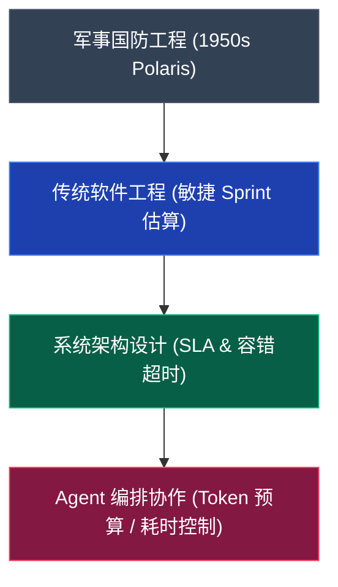

# 三点估算（Three-Point Estimation / PERT 估算）
> 面对未知与波动，摒弃单一妄想，用乐观、最可能与悲观的三重视角，为不确定的未来量出最理性的安全边界。

---

## 🔍 求真讲法：这个定理从哪里来？

### 背景与动机

1957 年，冷战阴云笼罩全球。美国海军发起了史上极其复杂的项目之一——**“北极星”（Polaris）潜射弹道导弹计划**。该项目涉及数千家承包商、上万个前所未有的高科技子任务，不仅技术难度极大，且几乎没有历史数据可供参考。

项目主管面临一个巨大的困境：**“每个环节的负责人都在凭感觉报工期。有人极度乐观，有人极度保守。我该相信谁？总工期究竟该怎么算？”**

为了解决这一在高度不确定性下的计划制定难题，美国海军特别项目局（Special Projects Office）联合咨询公司博思艾伦（Booz Allen Hamilton）以及洛克希德公司，共同研发了**计划评审技术（Program Evaluation and Review Technique，简称 PERT）**。

在 PERT 中，核心思想就是**放弃对“单一精准数值”的执念**，转而要求评估者提供三个维度的数据：
1. **乐观时间（Optimistic, $O$）**：一切顺风顺水时的最好情况；
2. **最可能时间（Most Likely, $M$）**：日常发生频率最高、最符合经验的常规情况；
3. **悲观时间（Pessimistic, $P$）**：各种意外墨菲定律叠加时的最坏情况。

通过将这三个点拟合为贝塔分布（Beta Distribution），人们第一次获得了在未知领域预测“期望时间”和“风险标准差”的科学数学工具。

---

### 核心假设

三点估算（PERT 贝塔分布模型）建立在以下 4 个核心假设之上：

*   **假设 1：不确定性符合贝塔分布（Beta Distribution）**  
    实际持续时间或资源消耗量是一个连续随机变量，其概率密度函数在极小区间 $[O, P]$ 上有界，且呈现单峰（Unimodal）形态。
*   **假设 2：最可能值 $M$ 是概率密度曲线的众数（Mode）**  
    $M$ 对应概率最高的峰值点，但概率曲线可能向乐观端或悲观端偏斜（Skewed）。
*   **假设 3：端点 $O$ 与 $P$ 位于分布的极端分位数**  
    乐观估计 $O$ 与悲观估计 $P$ 分别代表了大约 $1\%$ 或 $0.1\%$ 的极小概率边界，两者之间的跨度涵盖了约 $6$ 个标准差（ $6\sigma$ ）的范围。
*   **假设 4：各子任务间保持相互独立（Independence）**  
    在计算多任务组合时，假设各个子任务的风险与时间波动彼此无强耦合关系（利用中心极限定理进行标准差叠加）。

---

### 推导过程

#### 1. 期望值 $E$ 的公式推导

贝塔分布的概率密度函数在区间 $[O, P]$ 内由两个形状参数 $\alpha$ 和 $\beta$ 决定。通过对连续概率密度函数求期望值积分：

$$E = \int_{O}^{P} x \cdot f(x) \, dx$$

由于直接求贝塔分布的精确积分需要复杂的参数拟合，PERT 专家通过对常见贝塔分布形状的加权求积法（Trapezoidal/Simpson's rule approximation），推导出了一套极具工程实用价值的近似加权平均公式：

$$E = \frac{O + 4M + P}{6}$$

> **为什么最可能估计 $M$ 的权重是 $4$？**  
> 在 Simpson 积分近似中，区间中点与众数的组合加权赋予了峰值 $4$ 倍的权重，而两端极端值 $O$ 和 $P$ 各占 $1$ 的权重，总权重为 $1 + 4 + 1 = 6$。这既保留了众数的主导地位，又合理拉入了悲观与乐观的长尾影响。

#### 2. 标准差 $\sigma$ 与方差 $\sigma^2$ 的推导

假定乐观估计 $O$（ $99.9\%$ 顺畅）到悲观估计 $P$（ $99.9\%$ 阻碍）覆盖了统计学上 $6$ 个标准差的置信区间（即从 $-3\sigma$ 到 $+3\sigma$）：

$$P - O = 6\sigma \implies \sigma = \frac{P - O}{6}$$

单项任务的方差（Variance）则为：

$$\sigma^2 = \left(\frac{P - O}{6}\right)^2$$

根据**正态分布置信区间**（根据中心极限定理，多任务叠加后趋近正态分布）：
*   $E \pm 1\sigma$：包含约 **$68.27\%$** 的可能性
*   $E \pm 2\sigma$：包含约 **$95.45\%$** 的可能性
*   $E \pm 3\sigma$：包含约 **$99.73\%$** 的可能性

#### 3. 概率分布与估计点图解 (SVG)

下面的 SVG 图示展现了三点估算的贝塔概率分布曲线、各核心参数位置以及 $6\sigma$ 置信区间：

  

---

### 直觉理解

你可以把三点估算想象成 **“周五早高峰开车赶往机场”** ：

*   **乐观估计 $O = 30$ 分钟**：路上一个红灯都没遇到，一路绿灯，完全不堵车。
*   **最可能估计 $M = 45$ 分钟**：平时打车走这条路，通常红绿灯和车流情况下的标准耗时。
*   **悲观估计 $P = 90$ 分钟**：不幸碰上突发车祸、高架桥施工封路再加上下暴雨。

如果有人问你“去机场要多久？”，你如果直接回答 **45 分钟（单点估算）**，那你有很大概率会错过航班。因为悲观情况（延误 45 分钟）带来的影响远比乐观情况（提前 15 分钟）要严重得多。

通过三点估算公式计算：
$$E = \frac{30 + 4 \times 45 + 90}{6} = \frac{30 + 180 + 90}{6} = 50 \text{ 分钟}$$
标准差 $\sigma = \frac{90 - 30}{6} = 10 \text{ 分钟}$。

如果要达到 **$95\%$ 赶上飞机的安全置信度**，你需要预留 $E + 2\sigma = 50 + 20 = 70$ 分钟！三点估算赋予你的，正是一种**理性应对不确定性的“安全冗余计算法”**。

---

## 🛠️ 求存讲法：这个定理能做什么？

### 核心用途

在诞生之初的现代项目管理与国防工程中，三点估算主要用于：
1. **关键路径法（CPM/PERT）项目总工期预测**：避免因单点估算盲目乐观导致的项目严重滞后。
2. **项目风险度量（Risk Measurement）**：通过计算标准差 $\sigma$，量化不同子任务的不确定性高低，确定重点监控对象。
3. **合同交付 SLA 与概率承诺**：向客户承诺“在 X 天内有 95% 把握交付”而非给出虚假的固定日期。

---

### 跨领域迁移

从传统的军事/工程管理出发，三点估算的思想已经成功迁移至软件工程、供应链、金融风控，以及**当今最前沿的 AI Agent 编排与多 Agent 协作系统**中：

在 **Agent 编排（Agent Orchestration）** 领域，大语言模型（LLM）的输出具有**天然的不确定性**：
*   生成 Token 的数量不可预测（是否触发复杂的思维链 CoT？）
*   API 网络延迟与排队抖动不可预测；
*   Tool Call 工具调用的重试次数与失败率不可预测。

如果 Agent 调度器采用硬编码的单点超时或固定 Token 预算，极易导致 Agent 在处理复杂任务时被打断，或在简单任务上白白浪费资源。**三点估算为 Agent 编排提供了动态分配 Token 预算与设置自适应超时（Adaptive Timeout）的数学基石。**

---

### 适用边界（假设再探）

三点估算并非万能灵药，其成立前提与失效场景对比如下：

| 维度 | 适用场景（成立） | 限制/失效场景（不成立） |
| :--- | :--- | :--- |
| **分布形态** | 符合单峰贝塔分布，概率集中在 $M$ 附近 | 双峰/多峰分布，或强黑天鹅“肥尾分布”（Fat-tailed） |
| **估计质量** | 专家拥有历史经验或有效类比，能合理估计 $O, M, P$ | 完全未知的“已知未知/未知未知”，凭空瞎猜 |
| **耦合程度** | 子任务间强独立、弱耦合 | 级联连锁反应（如 Agent A 失败导致 Agent B/C/D 全部死锁） |
| **极端概率** | 悲观情况 $P$ 发生概率在 $1\%$ 左右（有界极值） | 存在无限循环（Infinite Loop）或系统崩溃等无限大灾难 |

---

### ✅ 正例：生活/学习/工作中的运用

#### 例子 1： Agent 编排——多 Agent 协作工作流的 Token 预算与超时阈值（SLA）分配

在复杂代码生成 Agent 系统中，包含四个协同节点：**需求分析 Agent $\to$ 架构设计 Agent $\to$ 代码生成 Agent $\to$ 单元测试 Agent**。

主编排器（Orchestrator）需要给整个工作流分配 Token 预算与超时时间，防止某节点挂起耗尽全局资源。

编排器对“代码生成 Agent”的消耗时间（秒）进行三点估算：
*   **乐观估计 $O = 5$ 秒**（代码极简，直接输出）
*   **最可能估计 $M = 12$ 秒**（正常生成 300 行代码，含一次简单修正）
*   **悲观估计 $P = 35$ 秒**（触发深层 CoT 推理，遇到语法错误进行 2 次重试）

**计算期望与标准差**：
$$E = \frac{5 + 4 \times 12 + 35}{6} = \frac{88}{6} \approx 14.67 \text{ 秒}$$
$$\sigma = \frac{35 - 5}{6} = 5.0 \text{ 秒}$$

**编排策略应用**：
*   **基础预估**：编排器按 $E = 14.67$ 秒计算下游 Agent 的排队时间；
*   **超时熔断阈值（Hard Timeout）**：为了确保 $99.73\%$（ $3\sigma$ ）的任务顺利完成同时拦截异常，设置熔断线为 $E + 3\sigma = 14.67 + 15 = 29.67 \text{ 秒}$。一旦超过约 30 秒无响应，立即触发 Agent 重置或降级处理。

---

#### 例子 2： Agent 编排——动态 Token 资金池（Token Pool）配额管理

在处理长文本总结的 Agent 编排中，单个 Prompt 消耗的 Token 波动剧烈：
*   **乐观 $O = 1,000$ Tokens**
*   **最可能 $M = 3,500$ Tokens**
*   **悲观 $P = 12,000$ Tokens**（文档结构异常导致展开大量检索块）

**计算期望与风险**：
$$E = \frac{1000 + 4 \times 3500 + 12000}{6} = \frac{27000}{6} = 4,500 \text{ Tokens}$$
$$\sigma = \frac{12000 - 1000}{6} \approx 1,833 \text{ Tokens}$$

当编排器并发运行 100 个 Agent 实例时：
*   **期望总消耗**： $100 \times 4500 = 450,000$ Tokens
*   **标准差叠加**（独立随机变量方差相加）：
    $$\sigma_{total} = \sqrt{100 \times (1833)^2} = 10 \times 1833 = 18,330 \text{ Tokens}$$
*   **配额预留**：编排器向 LLM API 供应商预留容量时，只需准备 $450,000 + 2 \times 18,330 \approx 486,660$ Tokens，即可达到 $95\%$ 的无卡顿运行保障，大幅优于直接按悲观值预留的 $1,200,000$ Tokens（节省了 $60\%$ 的资金占用）。

---

#### 例子 3：软件工程敏捷 Sprint 迭代点数评估

在敏捷开发 Scrum 扑克估算中，团队评估一个高难度重构 Task：
*   $O = 2$ 天（代码结构清晰，直接替换模版）
*   $M = 5$ 天（正常重构与单元测试）
*   $P = 14$ 天（遗留代码存在大量未测试隐患，引发连锁报错）

期望工时 $E = \frac{2 + 4 \times 5 + 14}{6} = 6$ 天，标准差 $\sigma = 2$ 天。团队经理在排期时，不按乐观的 2 天或最可能的 5 天排，而是记录该任务为 6 天，并在 Sprint 缓冲池（Buffer）中加上 $2\sigma = 4$ 天的弹性时间，从而避免了敏捷团队频繁“延期打脸”的尴尬。

---

#### 例子 4：个人高效学习与考试复习计划

准备一场综合性资格考试：
*   乐观估计 $O = 40$ 小时（资料全会，快速刷完）
*   最可能估计 $M = 75$ 小时（按章节逐一消化，做完真题）
*   悲观估计 $P = 130$ 小时（遇到较多硬骨头章节，需要重新查阅基础教材）

算得期望 $E \approx 78.3$ 小时。若每天能学习 3 小时，安排 26 天复习最为科学，同时预留约 $(P-O)/6 \times 2 \approx 30$ 小时的冲刺弹性期，避免因突发加班导致复习崩溃。

---

### ❌ 反例：假设不成立时会怎样？

#### 反例 1：Agent 编排中的“无限死循环”与黑天鹅事故（违背“有界极值”假设）

*   **场景**：在一个具备自主工具调用（Tool Use）能力的 Agent 编排系统中，设计了一个能够自动修改代码并运行测试的 Loop Agent。
*   **错误做法**：开发人员根据经验评估 $O=10s, M=30s, P=120s$，算出期望 $E=41.7s, \sigma=18.3s$。据此设置了超时限制为 $E + 3\sigma = 96.6s$。
*   **致命后果**：在生产环境中，Agent 遇到了一个边缘 Case，触发了正则表达式死循环，或者在两个工具之间互相调用死锁。持续消耗 LLM Token 并挂起系统进程。
*   **原因分析**：在存在死循环可能性的系统中，悲观情况 $P$ 实际上是无穷大（ $\infty$ ）。贝塔分布假设 $P$ 为有界极端概率，导致算出的 $E$ 和 $\sigma$ 完全失效。**防护措施**：必须在编排器层面设置死指令层面的硬性 Step 限制（如 `max_steps=10`），先强制约束边界，再使用三点估算。

---

#### 反例 2：多 Agent 连锁级联故障（违背“子任务相互独立”假设）

*   **场景**：编排器并行启动了 10 个 Agent 搜索不同的子话题，然后汇聚结果。
*   **错误做法**：编排器假设每个 Agent 的响应时间独立，利用三点估算算出整体在 20 秒内完成的概率为 $99\%$。
*   **致命后果**：运行过程中，由于 10 个 Agent 同时发起搜索，瞬时并发触发了底层 Search API 的 Rate Limit（限流）。所有 Agent 同时收到 429 报错并进入指数退避重试，造成系统在 20 秒内完全瘫痪。
*   **原因分析**：子任务之间存在隐式共享资源（API Rate Limit），风险发生了强正相关联。独立性假设破裂，导致算出的组合方差 $\sigma_{total}$ 严重偏小（实际风险被大幅低估）。

---

#### 反例 3：缺乏经验数据的凭空“拍脑袋”（估算源头严重失真）

*   **场景**：团队第一次使用全新的 GPT-5/Claude-4 模型进行复杂 Agent 编排，没有任何测试数据。
*   **错误做法**：工程师凭借个人偏好随意填入 $O=1s, M=2s, P=3s$，得出 $E=2s, \sigma=0.33s$。
*   **致命后果**：系统上线后，实际消耗中位数高达 15s。三点估算输出了一套非常“精确”的错误结论。
*   **原因分析**：“垃圾进，垃圾出”（Garbage in, Garbage out）。三点估算建立在对系统风险有基本感知的经验基线之上，不能替代前期必要的 Benchmark 基准测试。

---

## 💡 思考：值得深究的问题

1. **在 Agent 编排中，如何利用三点估算的 $\sigma$ 实现动态路由（Dynamic Routing）？**  
   *提示*：当一个子任务估算出的标准差 $\sigma$ 非常大（说明不确定性极高）时，编排器是否应该放弃直接调用单 Agent 思考，转而将其拆解为多个小 Agent，或者降级切换为确定性高的规则引擎（Rule Engine）？

2. **三角分布（Triangular Distribution）与贝塔分布（Beta Distribution）的三点估算有何区别？在轻量级 Agent 框架中该选哪个？**  
   *提示*：三角分布的期望公式为 $E = (O + M + P)/3$，在数学计算上更简单。在边缘侧或需要高频实时计算 Agent 节点的调度器中，使用三角分布会带来哪些利弊？

3. **当 Agent 编排引入 Human-in-the-loop（人工干预审批）时，三点估算的前提假设会发生什么改变？**  
   *提示*：人类响应时间往往呈现极度右偏的长尾分布（可能几秒钟回复，也可能去休假几周不回复）。此时 $P$ 值如何界定？如何防止人类节点的加入彻底摧毁系统的 SLA？

4. **如何利用 Monte Carlo（蒙特卡洛）模拟弥补 PERT 三点估算在复杂 DAG（有向无环图）Agent 编排中的不足？**  
   *提示*：当 Agent 编排存在分支条件、并行汇聚（Join）等复杂依赖时，单凭加法叠加期望和方差会产生“汇聚偏误”（Merge Bias），如何使用 Monte Carlo 模拟来求解真实临界路径？

---

## 📚 延伸阅读

1. **《Project Management Body of Knowledge (PMBOK® Guide)》 - PERT & Earned Value Section**  
   *推荐理由*：了解 PMI 官方对三点估算、PERT 网络图以及项目定量风险分析（Quantitative Risk Analysis）的标准定义与公式应用。
2. **中心极限定理（Central Limit Theorem, CLT）与方差可加性**  
   *推荐理由*：深入理解为什么多个不确定性子任务（即使自身不是正态分布）叠加后，整体系统的总延时/总 Token 消耗会趋近于正态分布，从而奠定 $E \pm k\sigma$ 置信区间的数学根基。
3. **LangGraph / AutoGen / CrewAI 中的超时与容错架构模式**  
   *推荐理由*：探索现代化 Multi-Agent 框架如何实现自适应重试、动态 Token 熔断以及基于统计学预估的 Agent 状态机编排。
