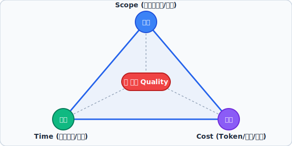
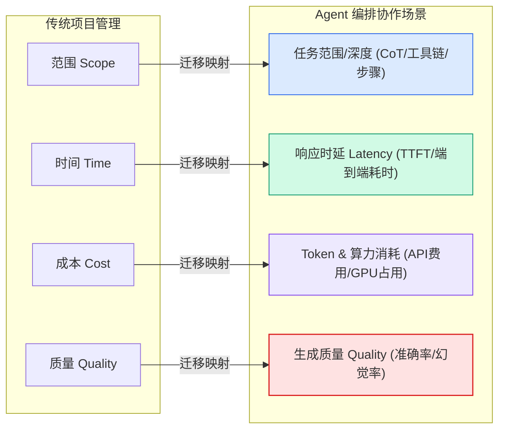

# 三重约束（铁三角 / Iron Triangle）
> **一句话核心摘要**：在任何复杂工程或 Agent 编排系统中，范围（Scope）、时间（Time）与成本（Cost）三者构成了不可兼得的物理约束；企图同时达到“功能最全、速度最快、消耗最少”是不可能的，而质量（Quality）正是这三者动态博弈后的集中体现。

---

## 🔍 求真讲法：这个定理从哪里来？

### 背景与动机

在项目管理诞生之前，人类建造金字塔、修筑长城或开发早期软件系统时，常常陷入严重的 **“三重噩梦”** ：项目要么无限期延期，要么预算严重超支，要么交出来的东西根本无法使用。

20 世纪 50 年代，随着现代工程复杂度的爆发（如阿波罗登月计划、大型国防与计算工程），人们急需一种科学的框架来指导资源调配。1969 年，项目管理学者 **马丁·巴恩斯（Dr. Martin Barnes）** 在其演讲中首次提出了著名的 **“铁三角”（Iron Triangle）** 模型。

巴恩斯发现：决策者总是存在“既要、又要、还要”的幻觉——既想要庞大的功能范围，又要求极短的工期，还只给微薄的预算。铁三角的提出，实际上是用一种直观的几何规律告诫所有人：**项目管理不是魔法，三大变量相互锚定，改变任意一方，必然强迫其他变量做出牺牲。**
  

  
---

### 核心假设

三重约束理论的成立基于以下三个核心物理与逻辑假设：

*   **假设一：资源边界与能力的有限性（Resource Finiteness）**
    在特定时间节点下，可调用的系统资源（算力、资金、人力、模型上下文窗口）总是存在硬上限，不可能无限制供给。
*   **假设二：三大变量的强耦合性（Coupling of Variables）**
    范围、时间与成本并非独立变量。试图调整其中任何一项（如扩大任务范围），必然会拉动另外至少一项变量发生补偿性变化（如增加成本或延长耗时）。
*   **假设三：质量是系统收敛的内部结果（Quality as an Emergent State）**
    质量不是挂在三角形之外的第四个独立维度，而是由“范围-时间-成本”所围成的内部空间大小决定的。**当外部三边被过度挤压（既要范围大、又要时间短、还不给成本），质量将成为唯一的泄压阀而迅速崩塌。**

---

### 推导过程

可以用一个简化的多目标最优化约束模型来推导铁三角的关系：

设系统的任务满意度/质量为 $Q$（Quality），任务范围与复杂度为 $S$（Scope），耗时/延迟为 $T$（Time），消耗的资源/成本为 $C$（Cost）。在资源生产率系数为 $k$ 的物理限制下，它们满足如下收敛不等式：

$$ Q \cdot S \le k \cdot (T \times C) $$

对其进行变形，可得出质量 $Q$ 的推导表达式：

$$ Q \le k \cdot \frac{T \times C}{S} $$

由上述推导公式可见：
1. **若强行锁死成本 $C$（如限制 Token 消费）和时间 $T$（要求毫秒级响应）**，当增加任务范围 $S$（如要求复杂代码重构与逻辑推演）时，系统质量 $Q$ 必定急剧下降（出现幻觉、语法错误）。
2. **若希望保持最高质量 $Q$ 与庞大范围 $S$**，则分子 $(T \times C)$ 必须成倍放大——要么容忍更长的等待时间 $T$，要么支付更高的成本 $C$（算力/API 计费）。

---

### 直觉理解

想象你去一家**饭店点餐**：
*   **想要“快”且“便宜”**（低时间 + 低成本）：你只能得到一份**预制汉堡**（小范围、普通品质）。
*   **想要“快”且“丰盛高档”**（低时间 + 大范围）：你必须支付**昂贵的价格**（高成本，让后厨多位顶尖大厨为你加急同时现炒）。
*   **想要“便宜”且“丰盛高档”**（低成本 + 大范围）：你就必须**耐心等待**（高时间，让一位厨师慢慢熬炖炖肉）。

你不可能要求店家为你提供一份“**5 秒钟出餐、顶级黑松露龙虾大餐、还要只收 5 块钱**”的饭。

---

## 🛠️ 求存讲法：这个定理能做什么？

### 核心用途

在工程与管理学中，三重约束是**期望管理（Expectation Management）**与**需求变更控制（Change Control）** 的基石：
1. **防范范围蠕变（Scope Creep）**：当客户临时增加功能需求时，管理人员通过铁三角清晰表达：“增加需求（Scope）可以，但必须追加预算（Cost）或延长工期（Time）。”
2. **风险决策裁决**：当项目面临截止日期逼近时，架构师根据铁三角主动裁剪不核心的功能（砍 Scope），以保障按时上线并维持最低可接受的质量（Quality）。

---

### 跨领域迁移

在现代 **Agent 编排协作（Agent Orchestration & Multi-Agent Systems）** 场景中，三重约束展现出极其深刻的映射关系：

*   **范围 Scope $\rightarrow$ Agent 任务深度与覆盖度**：包括思维链（CoT）推演层数、Tool 工具调用次数、上下文检索（RAG）深度、自我反思（Reflection）迭代轮数。
*   **时间 Time $\rightarrow$ 系统响应延迟与端到端耗时**：从首字延迟（TTFT）到 Multi-Agent 串行/并行协商的整体流水线耗时。
*   **成本 Cost $\rightarrow$ Token 消耗与计算资源开销**：LLM API 计费、GPU 算力集群占用量、向量数据库查询 Overhead。
*   **质量 Quality $\rightarrow$ Agent 输出的准确性与成功率**：代码可执行度、幻觉率、任务指令遵循度（Instruction Following）。

---

### 适用边界（假设再探）

三重约束并非在所有情况下都是绝对线性的，其边界如下表所示：

| 维度 | 约束成立（失效/生效） | 具体表现与机制说明 |
| :--- | :--- | :--- |
| **生效区间** | **资源固定与中高复杂度任务** | 算力/预算有上限、任务涉及复杂逻辑推理（如代码库重构、Deep Research）。此时三者博弈极度敏感。 |
| **技术断层失效** | **底座模型/算法突破（Pareto 前沿外移）** | 如从 GPT-3.5 升级到 GPT-4o，或引入 FlashAttention 优化。底层效率指数级提升，在相同 Cost/Time 下实现了 Scope 和 Quality 的双飞跃。 |
| **微观平庸区间** | **极低复杂度无状态任务** | 简单的字符串正则匹配、文本分类。由于计算量低于基础设施门槛，在极低 Cost 和极短 Time 下即可达到 100% Quality。 |

---

### ✅ 正例：生活/学习/工作中的运用

#### 正例 1：Agent 编排——Deep Research 深度研究 Agent（追求高 Quality/Scope $\rightarrow$ 放弃 Time，增加 Cost）
*   **场景**：用户要求 Agent 对“量子计算最新进展”生成一份 30 页严谨的学术综述。
*   **策略**：系统调度器（Orchestrator）允许 Agent 开展多轮拓扑图搜索、启动自我反思纠错循环（Reflection Loop），并行调用多个子 Agent 进行逻辑校验。
*   **约束表现**：最终生成质量极高（Quality 高）、涵盖范围极广（Scope 大）；但耗时达到 5 分钟（Time 增加），消耗了 800k Tokens（Cost 增加）。完全符合铁三角调配。

#### 正例 2：Agent 编排——实时客服 Router Agent（锁定低 Time/Cost $\rightarrow$ 严格裁剪 Scope）
*   **场景**：电商平台首页的智能客服前端交互，要求首字响应时间控制在 400ms 以内。
*   **策略**：路由 Agent 使用小参数轻量级模型（如 8B 模型量化版），只允许其根据 FAQ 规则库回答退换货等基础问题。遇到复杂纠纷时直接转接人工，拒绝进行复杂推演。
*   **约束表现**：响应极快（Time 短）、Token 成本极低（Cost 少）；但仅能处理简单任务（Scope 被严格压低），避开了模型能力不足带来的质量下滑。

#### 正例 3：Agent 编排——动态降级熔断机制（Cost 锁定 $\rightarrow$ Scope 弹性缩减）
*   **场景**：企业设置单次 Agent 任务 API 消费上限为 $0.50。
*   **策略**：当系统监控到多 Agent 讨论陷入死循环、Token 消费即将在 $0.45 触顶时，编排器触发紧急降级：强制终止多轮 debate，将原本要求的“全量单元测试与重构方案（大 Scope）”自动裁剪为“仅输出核心Bug修复建议（小 Scope）”。
*   **约束表现**：锁定 Cost 不超标，主动牺牲 Scope，从而避免了超时中断导致的零输出（Quality 彻底崩塌）。

#### 正例 4：日常学习——期末备考复习策略
*   **场景**：距离期末考试只剩 24 小时（Time 被死死锁定），且个人精力有限（Cost 锁定）。
*   **策略**：放弃全书逐章复习（砍 Scope），只集中精力攻克占分 80% 的核心考点与往年真题。
*   **约束表现**：通过主动缩小范围，保证了核心考点的复习质量，顺利通过考试。

---

### ❌ 反例：假设不成立时会怎样？

#### 反例 1：Agent 编排“三高陷阱”——忽视约束导致系统溃败
*   **错误做法**：某团队开发代码辅助 Agent，既要求“1 秒内返回结果”（低 Time），又要求“用 GPT-4o 级复杂度推演全项目架构”（高 Scope），还要求“单次调用 API 成本不得高于 $0.001”（低 Cost）。
*   **后果**：编排器被迫将 Prompt 极其简写，限制模型思考步骤。Agent 出现严重幻觉，删除了核心生产代码。**企图突破铁三角强行追求“三优”，最终导致 Quality（质量）彻底归零，产品被迫下线。**

#### 反例 2：边际收益递减——盲目增加 Cost 导致 Quality 反向下降
*   **错误做法**：在 RAG（检索增强生成）Agent 编排中，开发者认为只要不断增加成本（Cost）就能无限提升质量，因此把 200 页无清洗的原始文档全量塞入 Context Window，并让 10 个 Agent 进行无休止的全联通讨论。
*   **后果**：超长上下文引发了 LLM 的“大海捞针（Needle in a Haystack）”注意力注意力衰减问题，加上 Agent 之间的信息噪音放大，不仅耗时数分钟、消耗数十美金，最终生成的回答反而混乱不堪。**打破了“增加 Cost 必然提升 Quality/Scope”的盲目假设。**

---

## 💡 思考：值得深究的问题

1. **Pareto 最优前沿的动态路由**：在多 Agent 协同体系中，如何基于“时间-成本-质量”的三维 Pareto 最优前沿（Pareto Frontier），实现大模型（高 Cost/高 Quality）与小模型（低 Cost/低 Time）的自动化智能路由？
2. **人类注意力成本的转移**：当我们将 AI Agent 的响应延迟（Time）降至极致、削减 Token 成本（Cost）时，是否无形中把验证输出质量的成本转移给了人类用户（Human-in-the-loop）？这种转移在经济学上是否划算？
3. **架构创新是否真的打破了铁三角？**：投机采样（Speculative Decoding）或 KV-Cache 技术看似同时降低了响应时间（Time）并维持了质量（Quality），但它是否本质上是以消耗更多显存内存（提升了硬件 Cost）为隐性代价的？

---

## 📚 延伸阅读

1. **《PMBOK 指南（项目管理知识体系指南）》**—— 详细阐述了三重约束在项目范围管理、进度管理与成本管理中的标准化应用。
2. **Pareto Optimality & Multi-Objective Optimization（多目标优化与帕累托最优）**—— 理解计算资源受限条件下，响应速度、算力开销与输出精度博弈的数学理论 base。
3. **LLM Agent Orchestration Design Patterns（如 AutoGen, LangGraph 架构模式）**—— 探索如何在多 Agent 编排框架中通过 Dynamic Routing、State Machines 与 Trimmed Context 实践三重约束的动态平衡。
