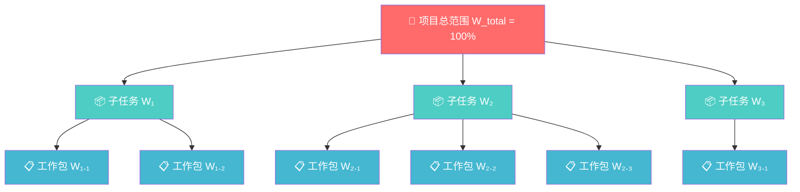
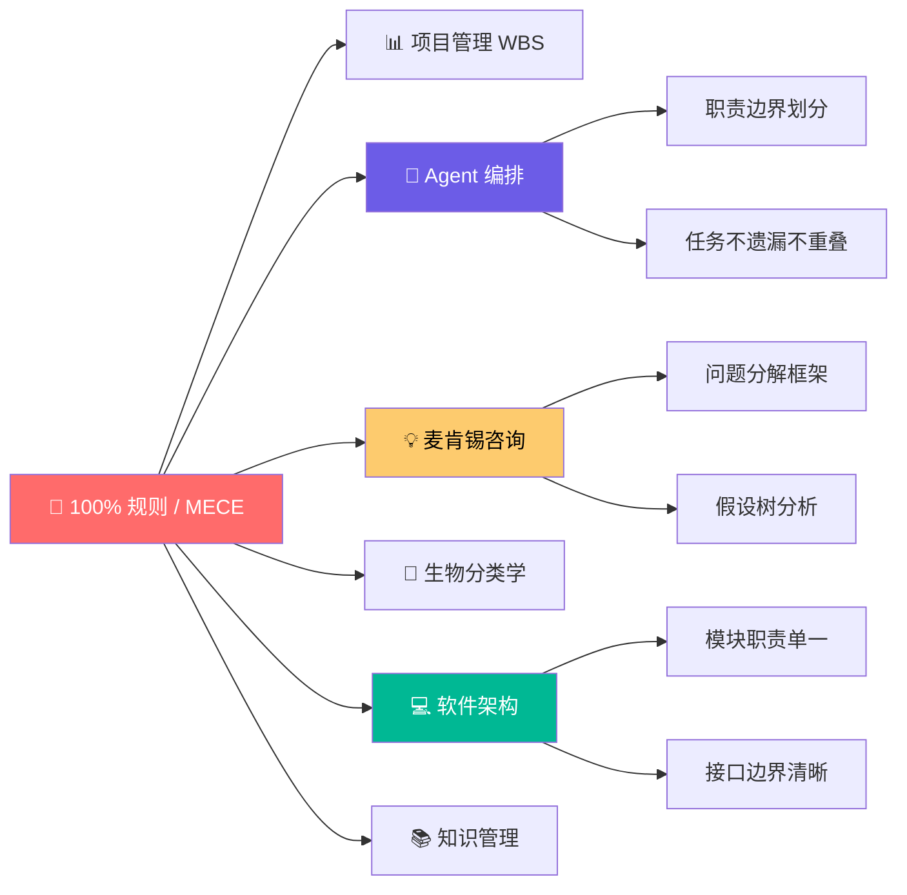
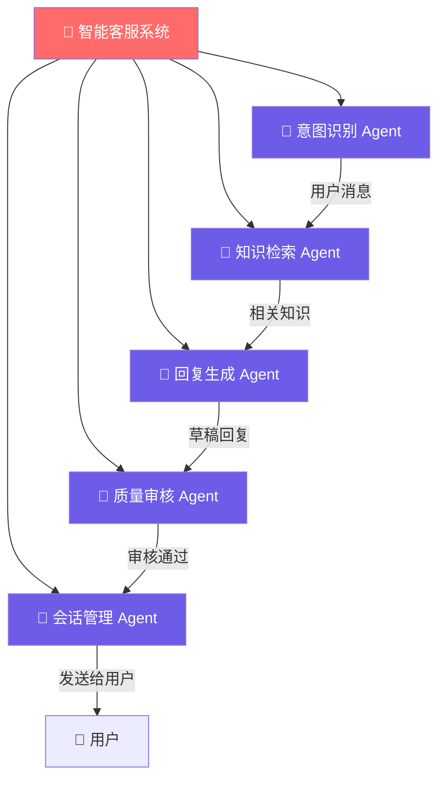

# WBS 分解原则：100% 规则

> **子任务之和必须恰好等于父任务的 100%——不遗漏、不重叠，这就是项目管理中最基础也最容易被违反的铁律。**

---

## 🔍 求真讲法：这个规则从哪里来？

### 背景与动机

1957 年，美国海军正在推进"北极星"导弹潜艇计划（Polaris Missile Program）。这是冷战时期最复杂的军事项目之一——涉及数千个承包商、数万个零部件、横跨十几个州的协作网络。项目经理们面临一个致命问题：

> **"我们怎么确保没有任何一项工作被遗漏，也没有两个团队在重复做同一件事？"**

当时的项目管理还停留在"列清单"的阶段。一个团队负责导弹发动机，另一个负责导航系统，第三个负责潜艇改装……但谁来确保"发动机与潜艇的接口安装"这种跨边界的工作不会掉进缝隙里？

1962 年，美国国防部（DoD）和 NASA 联合发布了 **PERT/COST 系统**，其中首次系统化地定义了 **Work Breakdown Structure（工作分解结构）**。到 1968 年，DoD 发布了军事标准 MIL-STD-881，正式将 WBS 制度化。

而 **100% 规则**，正是 WBS 最核心的约束——它说的是：

> **"在 WBS 的任何层级，所有子元素的工作总和必须恰好等于父元素所代表的全部工作——既不能少一块，也不能多出来。"**

这个规则后来被项目管理知识体系 **PMBOK**（Project Management Body of Knowledge）采纳，成为全球项目管理的基石。

### 核心假设

100% 规则成立需要以下前提条件：

- **可分解性假设**：父任务的工作范围是明确的、可被穷举分解的
- **互斥性假设（Mutually Exclusive）**：子任务之间没有工作内容的重叠
- **完备性假设（Collectively Exhaustive）**：所有子任务加在一起，恰好覆盖父任务的全部范围
- **单一归属假设**：每个工作包只能归属于唯一一个父节点
- **静态范围假设**：在分解的时间点上，父任务的范围是固定的（不会边分解边膨胀）

> 这五条假设合在一起，本质上就是麦肯锡咨询公司推崇的 **MECE 原则**（Mutually Exclusive, Collectively Exhaustive）——相互独立，完全穷尽。

### 推导过程

100% 规则不是一个需要数学证明的定理，而是一个**定义性约束**——它定义了"合格的 WBS"应该长什么样。让我们用一个递归结构来理解它：

**第 1 步：定义根节点**

根节点代表项目的全部范围，记为 $W_{total}$。

**第 2 步：第一次分解**

将 $W_{total}$ 分解为 $n$ 个子任务 $W_1, W_2, \ldots, W_n$，要求：

$$\sum_{i=1}^{n} W_i = W_{total} \quad \text{且} \quad W_i \cap W_j = \emptyset \quad (i \neq j)$$

**第 3 步：递归应用**

对每个 $W_i$，如果它还不够细，继续分解，且每一层都满足同样的 100% 规则。

**第 4 步：终止条件**

当子任务分解到**可管理的工作包**（Work Package）级别时停止——通常满足以下标准之一：
- 可以被一个人或一个小团队在 **8-80 小时**内完成
- 可以被清晰地**估算成本和时间**
- 可以被**明确指派**给一个责任人

> ⬆️ 在这棵树中，每一层的子节点之和 = 父节点的 100%。W₁ + W₂ + W₃ = W_total，W₁.₁ + W₁.₂ = W₁，以此类推。

### WBS 的五条关键规则

| 序号 | 规则 | 说明 | 常见违反方式 |
|:---:|------|------|------------|
| 1 | **100% 规则** | 子元素之和 = 父元素的 100% | 遗漏了"集成测试"这类横切工作 |
| 2 | **单一归属** | 每个工作包只属于一个父节点 | 同一工作在两个分支下各出现一次 |
| 3 | **可管理粒度** | 分解到可估算、可指派的级别 | 工作包还是"开发整个后端系统" |
| 4 | **3-6 层深度** | 通常不超过 6 层 | 分解了 10 层，管理成本大于收益 |
| 5 | **名词短语命名** | 用交付物而非动作命名 | ❌ "测试系统" → ✅ "系统测试报告" |

### 直觉理解

想象你要搬家。你打包了 20 个箱子，贴上标签："厨房用品""卧室衣物""书房书籍"……

**100% 规则就是说：**
- 你家里的所有东西，必须恰好装进这 20 个箱子里（**不遗漏**）
- 任何一件东西，不能同时出现在两个箱子里（**不重叠**）
- 20 个箱子打开后拼在一起，就是你家的全部家当（**100% 覆盖**）

如果你忘了打包阳台上的花盆 🌻——那就违反了 100% 规则。如果你在"厨房用品"和"杂物"两个箱子里都放了电饭煲——那也违反了。

---

## 🛠️ 求存讲法：这个规则能做什么？

### 核心用途

在项目管理中，100% 规则是一切计划编制的根基：

1. **范围管理**：确保项目范围不遗漏、不镀金（gold-plating）
2. **成本估算**：自底向上汇总工作包成本 = 项目总成本，不会漏算
3. **进度追踪**：每个工作包的完成度可以层层汇总为项目整体完成度
4. **责任分配**：通过 RACI 矩阵，确保每个工作包有且仅有一个负责人
5. **风险识别**：缺失的工作包往往就是隐藏的风险源

### 跨领域迁移

100% 规则的本质——**MECE 分解**——远远超出了项目管理的范畴。它是一种通用的思维工具：

| 领域 | MECE 的映射形式 | 核心关注点 |
|------|---------------|-----------|
| 项目管理 | WBS 100% 规则 | 工作范围不遗漏 |
| **Agent 编排** | **Agent 职责 MECE 划分** | **每个 Agent 权责清晰** |
| 麦肯锡咨询 | Issue Tree / 问题树 | 分析框架无盲区 |
| 软件工程 | 模块化 / 单一职责原则 | 模块边界不重叠 |
| 生物学 | 分类学（界门纲目科属种） | 每个物种只归一类 |
| 知识管理 | 分类体系 / 标签系统 | 文档可检索、不冗余 |

### 适用边界（假设再探）

100% 规则并非放之四海而皆准。当核心假设被破坏时，它的适用性会打折扣：

| 条件 | 100% 规则适用？ | 说明 |
|------|:---:|------|
| 范围明确、可预测的项目 | ✅ | 瀑布型项目、建筑施工、军事采购 |
| 敏捷/迭代型项目 | ⚠️ 部分适用 | 范围在持续演化，需要迭代更新 WBS |
| 探索性研究（R&D） | ❌ 勉强适用 | 下一步做什么取决于上一步的结果 |
| 创意类工作 | ❌ 勉强适用 | "写一首好歌"很难 MECE 分解 |
| **多 Agent 动态协作** | ⚠️ 需要扩展 | Agent 可能需要动态调整职责边界 |
| 跨组织协作（模糊边界） | ⚠️ 部分适用 | 组织间的"灰色地带"难以清晰切割 |

### ✅ 正例：生活/学习/工作中的运用

#### 正例 1：搬家打包（生活）

你和家人分工打包搬家：
- 爸爸负责「客厅家具」
- 妈妈负责「厨房物品」
- 你负责「卧室和书房」

三个人的范围加起来 = 整个家的 100%，没有遗漏（阳台、卫生间也划给了某个人），也没有重叠。

> ✅ 满足 100% 规则 → 搬家当天不会发现"洗衣机没人管"的尴尬。

#### 正例 2：Agent 编排——智能客服系统

设计一个多 Agent 客服系统，任务分解如下：

> ✅ 每个 Agent 职责明确，5 个 Agent 的职责之和 = 客服系统全部功能的 100%。意图识别只做识别，不做检索；检索只做检索，不做生成。**MECE，无盲区，无重叠。**

#### 正例 3：Agent 编排——数据分析流水线

一个数据分析任务被分解为：

| Agent | 职责 | 输入 | 输出 |
|-------|------|------|------|
| 数据采集 Agent | 从 API/数据库获取原始数据 | 数据源配置 | 原始数据集 |
| 数据清洗 Agent | 缺失值处理、格式统一 | 原始数据集 | 清洁数据集 |
| 特征工程 Agent | 派生特征、编码转换 | 清洁数据集 | 特征矩阵 |
| 模型训练 Agent | 模型选择、训练、调参 | 特征矩阵 | 训练好的模型 |
| 报告生成 Agent | 可视化、生成分析报告 | 模型 + 数据 | 分析报告 |

> ✅ 5 个 Agent 覆盖了从"原始数据"到"分析报告"的完整链路。任何一个环节缺失，流水线就断裂；任何两个 Agent 职责重叠，就会产生冲突和浪费。

#### 正例 4：课程学习计划（学习）

准备考研数学，用 100% 规则分解复习范围：

- 高等数学（56%权重）→ 极限、导数、积分、级数、微分方程
- 线性代数（22%权重）→ 行列式、矩阵、向量、特征值
- 概率论（22%权重）→ 概率、随机变量、数字特征、大数定律

> ✅ 三大板块 + 内部细分 = 考研数学大纲的 100%。不多不少，按权重分配复习时间。

#### 正例 5：软件产品发布（工作）

一个 App 发布前的工作分解：
- 功能开发（前端 + 后端 + 数据库）
- 测试（单元测试 + 集成测试 + 用户验收测试）
- 部署（CI/CD 配置 + 环境准备 + 上线操作）
- 文档（API 文档 + 用户手册 + 运维手册）

> ✅ 四大块覆盖了发布所需的全部工作，每块内部继续 MECE 细分。

### ❌ 反例：假设不成立时会怎样？

#### 反例 1：Agent 职责有盲区（违反"完备性"）

一个电商 Agent 系统被设计为：
- **商品推荐 Agent**：根据用户画像推荐商品
- **订单处理 Agent**：处理下单、支付、发货
- **客服 Agent**：处理售后投诉

看起来合理？但**退款流程**属于谁？它既涉及订单（需要修改订单状态），又涉及客服（用户发起退款请求），又涉及财务（实际退款操作）。如果没有一个 Agent 明确负责"退款"这个工作包——它就掉进了缝隙。

> ❌ 违反 100% 规则 → 用户退款请求在三个 Agent 之间踢皮球，最终无人处理。

> ⬆️ **"三不管地带"**——100% 规则被违反时的经典症状。

#### 反例 2：Agent 职责重叠（违反"互斥性"）

一个内容审核系统：
- **文本审核 Agent**：审核文字内容是否违规，包括图片中的文字 OCR
- **图片审核 Agent**：审核图片内容是否违规，包括图片中的文字

问题来了：一张包含违规文字的图片，两个 Agent 都会审核其中的文字部分。当两个 Agent 对同一段文字做出**矛盾判断**时（一个说违规，一个说不违规），系统该听谁的？

> ❌ 违反 MECE 的互斥性 → 职责重叠导致决策冲突、资源浪费，甚至系统死锁。

#### 反例 3：分解粒度不当（违反"可管理性"）

一个 Agent 编排系统的任务分解：
- Agent A：负责"所有与用户相关的事情"
- Agent B：负责"所有与数据相关的事情"

"所有与用户相关的事情"——这还叫分解吗？这个工作包太大，无法估算、无法追踪、无法验收。本质上是**伪分解**，看似满足了 100% 规则，实际上没有产生任何管理价值。

> ❌ 粒度太粗 = 没有真正分解 → Agent 内部依然是混沌的黑箱。

---

## 💡 思考：值得深究的问题

1. **动态 WBS 的可能性**：在 Agent 编排中，如果任务范围在执行过程中动态变化（比如一个 Agent 在执行中发现了新的子任务），100% 规则如何适应？是否需要一个"WBS 动态更新协议"？

2. **MECE 的代价**：严格的 MECE 分解意味着需要提前穷举所有可能的工作。但在高度不确定的环境中（如 AI 研究、创业探索），过早的穷举分解是否反而会限制创造力？如何在"结构化"和"灵活性"之间找到平衡？

3. **Agent 间的"灰色地带"治理**：在多 Agent 系统中，总有一些工作天然横跨多个 Agent 的职责边界（如"系统集成测试"涉及所有模块）。是应该设立专门的"集成 Agent"来处理这些交叉工作，还是通过 Agent 间的协商机制动态分配？

4. **100% 规则与帕金森定律的冲突**：帕金森定律说"工作会膨胀到填满可用时间"。如果 WBS 严格覆盖了 100% 的工作，会不会导致团队把精力平均分配，而忽视了"80/20 法则"——20% 的关键工作产生 80% 的价值？

5. **递归分解的停止条件**：在 Agent 编排中，如何判断一个任务已经分解到了"原子 Agent"的粒度？过细会导致 Agent 间通信成本爆炸（类似微服务拆太细），过粗又失去了分解的意义。最优粒度是否可以被量化？

---

## 📚 延伸阅读

1. **《PMBOK 指南》（第 7 版）**——项目管理知识体系的权威参考，WBS 的定义与 100% 规则的正式描述来源于此。

2. **《金字塔原理》（芭芭拉·明托）**——麦肯锡方法论中 MECE 原则的经典阐述。虽然面向的是咨询和写作，但其分解思想与 WBS 100% 规则一脉相承。

3. **MIL-STD-881（美国军事标准）**——WBS 的"出生证明"。了解 WBS 最初被创造出来时的军事背景，有助于理解为什么 100% 规则如此强调"不遗漏"——在军事项目中，遗漏一个子系统的后果是致命的。
