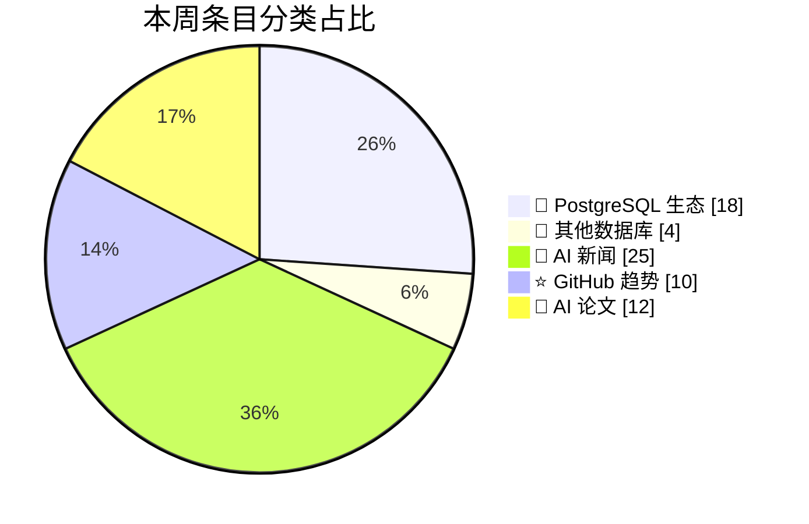
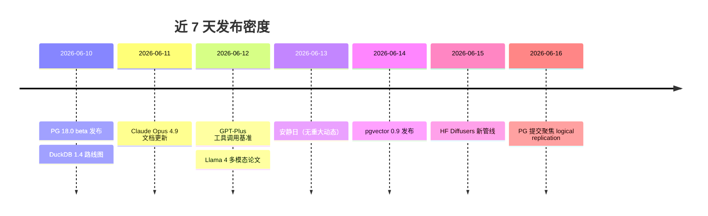
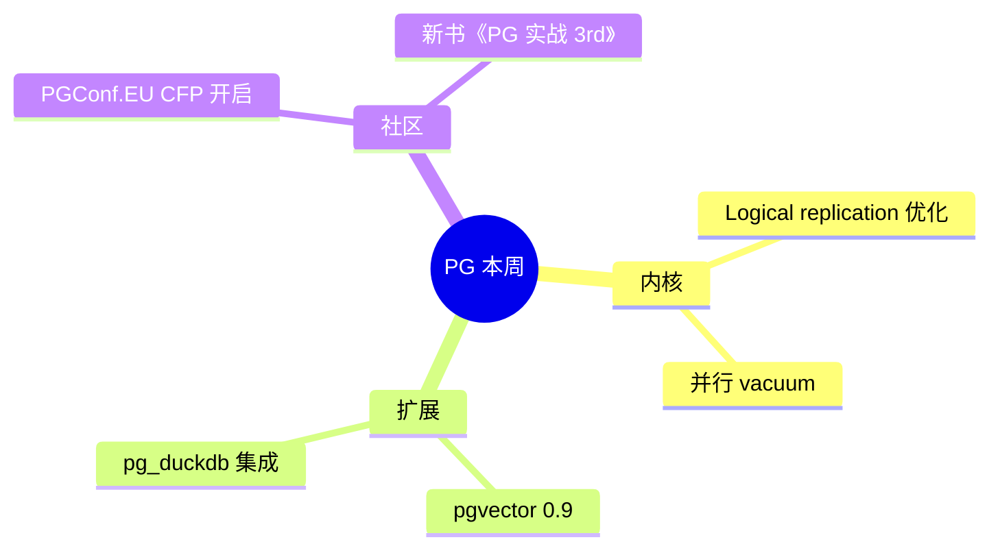
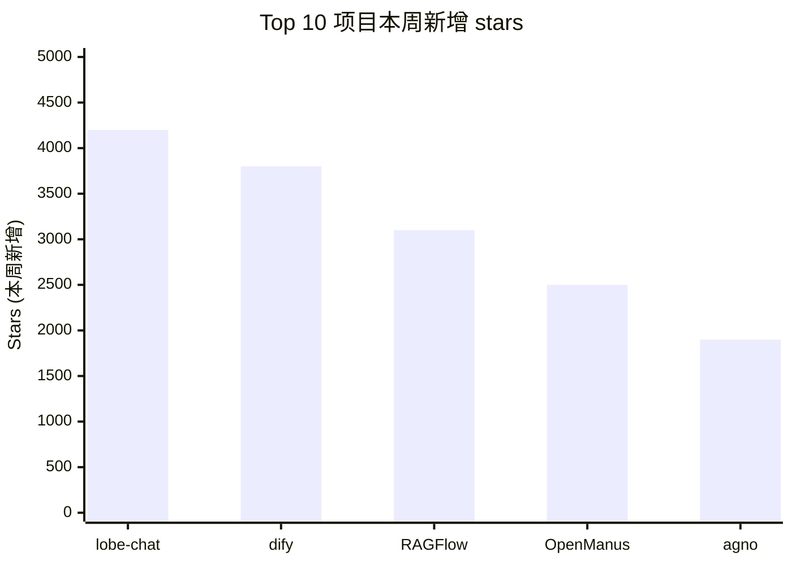
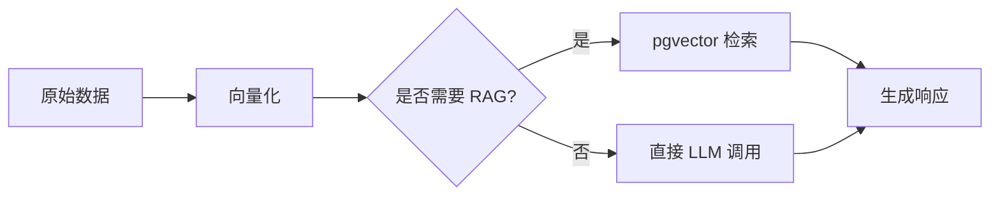

# Mermaid 图模板与坑点

周报里每张图都从这里挑模板。直接复制、把占位符换成真实数据。

## 1. 分类饼图（pie）—— 必有

用途：一眼看出本周哪类信息密度最高。

**坑点**：
- 标签必须有引号，否则中文/emoji 会渲染失败
- `showData` 让百分比显示在图上
- 数值为 0 的分类**直接省略**，不要写 `: 0`（会渲染成 0% 楔形，干扰阅读）

---

## 2. 时间线（timeline）—— 必有

用途：展示一周内每天的发布密度与关键词。

**坑点**：
- 同一天多条用 `:` 分隔，每条单独一行（不要写一行用逗号分隔）
- 没有内容的日子写 *"安静日"* 而不是跳过 —— 跳过会让间隔失真
- 标题里不要用 emoji，部分渲染器会断行

---

## 3. 思维导图（mindmap）—— 必有

用途：把一个分类下的 top 项目/话题做层级展开。

**坑点**：
- root 节点用 `((双圆括号))`，否则不渲染
- 缩进**只能用空格**（2 个或 4 个空格，全文一致），用 Tab 会报错
- 节点文本里有冒号会被截断，把冒号改成破折号 `—`
- 最深建议 3 层，再深会拥挤

---

## 4. 柱状图（xychart-beta）—— 可选

用途：可视化 top 项目 stars 增长、论文 upvote 排行等数值对比。

**坑点**：
- `xychart-beta` 仍是 beta，部分老版 mermaid 渲染器（< 10.6.0）不支持 —— 实在不行降级用普通表格
- x-axis 标签里有中文要加引号；尽量用英文短名
- y-axis 上限设为 `max(values) * 1.1`，留白美观

---

## 5. 流程图（flowchart）—— 极少用

用途：仅当本周有"某个工作流被多家厂商复用"等需要画关系时再用。日常周报不需要。

---

## 全局坑点（所有图通用）

1. **中文渲染**：mermaid 默认字体支持中文，但 GitHub 渲染器对部分 emoji 会乱码，慎用罕见 emoji
2. **代码块语言标识必须是 `mermaid`**（小写），不是 `Mermaid` 或 `MERMAID`
3. **块内不要插入空行**（部分老版渲染器会把空行后内容当成新块）
4. **每份周报 ≥ 3 张图、≤ 6 张图**：少了空洞，多了喧宾夺主
5. **生成完立即在脑里"渲染"一遍**：节点引用是否闭环？标签是否拼写一致？数值合计是否等于总条目数？
