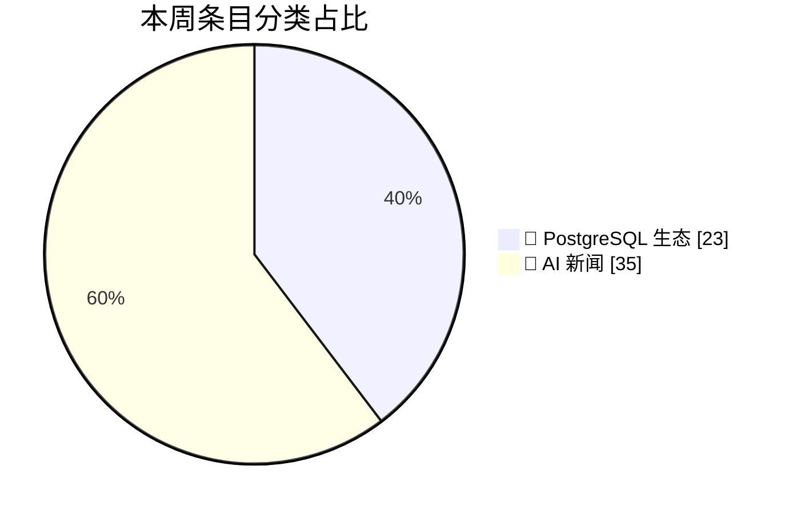
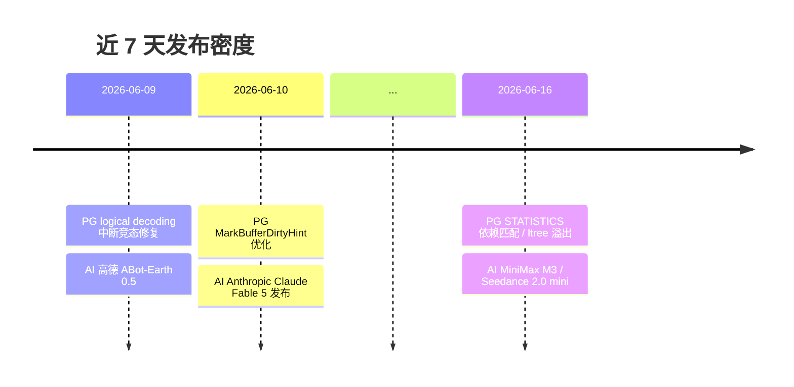
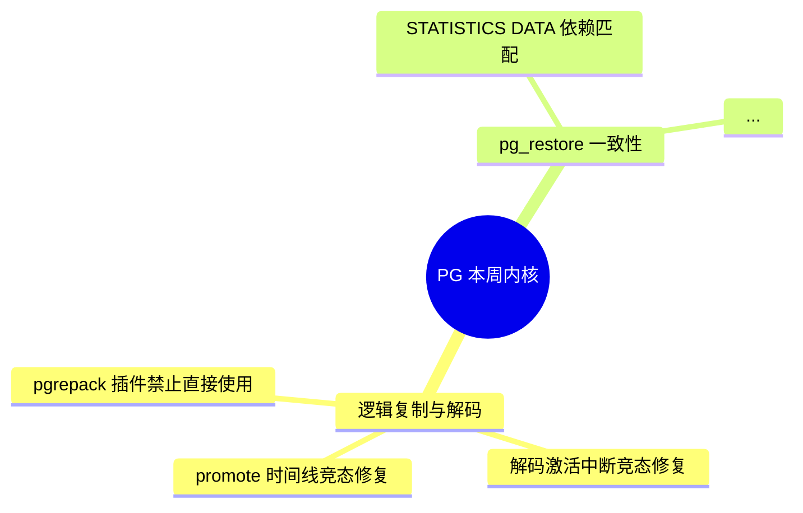
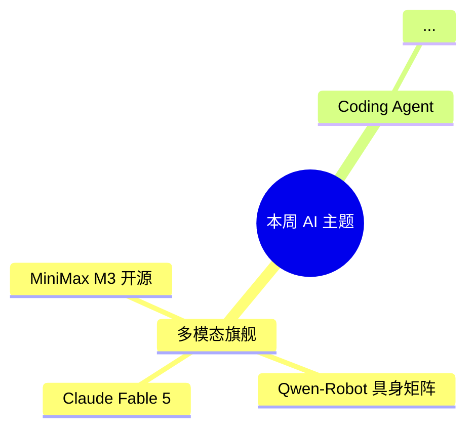

# Markdown 周报模板

每周输出文件固定章节结构，便于跨周对比。所有章节必须存在；某源为空时显示占位说明，不要删除整章。

## 文件元信息（开头）

```
# 数据库 / AI / GitHub / 论文 周报 · YYYY-MM-DD

> 📅 时间窗口：YYYY-MM-DD-7 ~ YYYY-MM-DD
> 🔗 数据源：10 个（成功 X / 空响应 X / 失败 X / 人工验证 X）
> 📊 总条目：N
```

## 章节大纲

| # | 标题 | 内容 |
|---|---|---|
| 一 | 本周速览 | 一段话总结 + pie 图 + timeline 图 |
| 二 | 🐘 PostgreSQL 生态 | 内核提交表 + 社区博客 + mindmap |
| 三 | 🦆 其他数据库（DuckDB 等） | DuckDB news 摘录 |
| 四 | 🤖 AI 新闻 | 表格速读 + top 3 深度展开 + AI mindmap |
| 五 | ⭐ GitHub 趋势项目（weekly） | 仓库列表（star 增量 / 语言 / 一句话） |
| 六 | 📄 AI 论文（HuggingFace Trending） | 论文列表（标题 / 机构 / 摘要 / 链接） |
| 七 | 数据源覆盖 | 10 源状态表 + 失败/空响应建议 |

## 必备 mermaid 图（每个用代码块包裹）

### 1. 分类 pie 图（章一）



> 当分类计数为 0 时仍要列出（如 `"⭐ GitHub 趋势" : 0`），保证结构稳定。

### 2. 每日时间线（章一）



### 3. PG 内核 mindmap（章二）



### 4. AI 主题 mindmap（章四）



## 内核提交表格（章二核心）

| 时间 | Commit | 作者 | 一句话 |
|---|---|---|---|
| 2026-06-16 | `ae39bd23` | Michael Paquier | pg_restore 改用依赖关系匹配 STATISTICS DATA |

要点：
- commit hash 短链化（取前 8 位），整 hash 链接用 `https://git.postgresql.org/gitweb/?p=postgresql.git;a=commit;h=<full>`。
- 剔除 typo fix、注释微调、pgindent、白名单格式调整等琐碎项。
- 作者名沿用 gitweb 上的 `<i class="author">` 内容（含 `Michael Paquier` 这种英文写法）。
- "一句话"用中文总结，长度 ≤ 50 字。

## AI 新闻速读表（章四）

| 时间 | 标题 | 来源 |
|---|---|---|
| 2026-06-16 | MiniMax 开源原生多模态旗舰 MiniMax M3 | ai-bot |

要点：
- 同主题双源覆盖时合并为一行，`来源`列写 `ai-bot + aibase`。
- 标题保留原文（中文为主），如原文过长可截断。
- 附 top 3 深度展开：每条含 📅 / 📍 链接 / 📝 一段话 / 🔍 影响面。

## 数据源覆盖表（章七）

固定 10 行，按 source_id 升序：

```
| # | 类别 | 源 | 状态 | 抓到条目数 | 备注 |
|---|---|---|---|---|---|
| 1 | PG | postgresweekly.com | ✅ ok | 0 | issue=652 resolved |
| 2 | PG | planet.postgresql.org | ⚠️ empty | 0 | NO_RECENT_ITEMS |
...
```

状态枚举：

- ✅ `ok`
- ⚠️ `empty`
- ❌ `error`
- 🙋 `human_required`

## 文件尾

```
*本周报由 db-ai-github-paper-weekly-news skill 于 YYYY-MM-DD HH:MM 自动生成。条目均附原始来源链接，请以原文为准。*
```

## 反模式（不要做）

- ❌ 跳过失败源章节（如某源失败就直接省略章节）—— 保留章节并标灰。
- ❌ 编造抓不到的内容 —— 严格遵循 `feedback_verify_before_writing`。
- ❌ 删去 mermaid 图让 markdown 更"干净" —— 图是核心交付物之一。
- ❌ 用 `web_search` 内置工具 —— 遵循 `~/.claude/CLAUDE.md`，用 `mcp__MiniMax__web_search`。
- ❌ 把英文源标题全部机翻成中文 —— 翻译会丢精度，原标题 + 简短中文标签即可。
- ❌ 单文件超 600 行 —— 必要时拆 `db-ai-weekly-YYYY-MM-DD-AI.md` 等子文件。