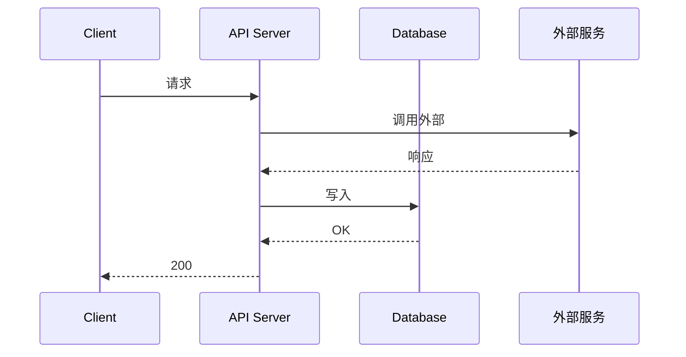

# 接口规格子模板(API Spec Template)

> 用于功能设计文档的 §7。每个对外接口都必须完整覆盖以下字段。
> "测试者看不到代码",所以本规格必须能独立支撑测试者写出请求构造 + 响应断言。

---

## 1. 接口标识

| 字段 | 值 |
|---|---|
| 接口名 | <动词 + 资源> |
| 方法 | GET / POST / PUT / DELETE / PATCH |
| 路径 | /api/... |
| 版本 | v1 / v2 |
| 是否公开 | 是 / 否 |
| 调用方 | 用户端 / 管理端 / 内部服务 / 第三方 |

---

## 2. 鉴权与授权

| 项 | 说明 |
|---|---|
| 鉴权方式 | Bearer JWT / Cookie Session / API Key / mTLS / 无 |
| 必填角色 | 任意已登录 / VIP / 管理员 / 内部服务 |
| 资源级权限 | 描述如何校验资源归属(例:order 只能由 owner 操作) |
| 越权行为 | 403 / 404(防探测)/ 401(未登录) |

---

## 3. 请求

### 3.1 Headers

| Header | 必填 | 用途 |
|---|---|---|
| Authorization | 是 | Bearer xxx |
| Idempotency-Key | 否(写接口建议填) | 幂等去重 |
| X-Request-Id | 否(建议生成) | 链路追踪 |
| Content-Type | 是 | application/json |

### 3.2 Path 参数

| 字段 | 类型 | 必填 | 约束 |
|---|---|---|---|
| id | int64 | 是 | > 0 |

### 3.3 Query 参数

| 字段 | 类型 | 必填 | 默认 | 约束 |
|---|---|---|---|---|
| page | int | 否 | 1 | 1 ≤ page ≤ 10000 |
| size | int | 否 | 20 | 1 ≤ size ≤ 100 |

### 3.4 Body 参数

| 字段 | 类型 | 必填 | 默认 | 约束 | 说明 |
|---|---|---|---|---|---|
| items | array | 是 | — | 1 ≤ len ≤ 50 | 商品清单 |
| items[].product_id | int64 | 是 | — | > 0,商品存在 |  |
| items[].quantity | int | 是 | — | 1 ≤ qty ≤ 999 |  |
| address_id | int64 | 是 | — | 属于当前用户 | 收货地址 |
| coupon_id | int64 | 否 | null | 属于当前用户且可用 |  |

**字段约束类型参考**:
- 字符串:min_len、max_len、charset(中文/英文/Unicode)、regex
- 数值:min、max、enum
- 数组:min_items、max_items、unique_items
- 嵌套:递归定义

### 3.5 请求示例

```json
{
  "items": [{"product_id": 1001, "quantity": 2}],
  "address_id": 8888
}
```

---

## 4. 响应

### 4.1 成功响应

**HTTP 状态码**:200 / 201 / 204

**Body Schema**:

| 字段 | 类型 | 必有 | 说明 |
|---|---|---|---|
| order_id | int64 | 是 | 主键 |
| status | int | 是 | 0=待支付,详见状态机 |
| total_amount | decimal | 是 | 应付金额,精度 0.01 |
| created_at | string (ISO8601) | 是 |  |

**示例**:

```json
{
  "order_id": 12345,
  "status": 0,
  "total_amount": "99.00",
  "created_at": "2026-06-17T10:00:00Z"
}
```

### 4.2 错误响应(全局规范)

```json
{
  "error": {
    "code": "ORDER_PRODUCT_OFFLINE",
    "message": "商品 1001 已下架",
    "trace_id": "abc123"
  }
}
```

| 顶层字段 | 类型 | 必有 | 说明 |
|---|---|---|---|
| error.code | string | 是 | 业务错误码,UPPER_SNAKE_CASE |
| error.message | string | 是 | 面向用户的提示,已国际化 |
| error.trace_id | string | 是 | 链路 ID,便于排查 |
| error.details | object | 否 | 字段级错误,用于表单回显 |

---

## 5. 错误码表(本接口全集)

| 错误码 | HTTP | 含义 | 触发条件 | 用户提示 | 是否可重试 |
|---|---|---|---|---|---|
| ORDER_PRODUCT_OFFLINE | 400 | 商品已下架 | items 中任意 product 已下架 | "商品 XXX 已下架" | 否 |
| ORDER_INSUFFICIENT_STOCK | 400 | 库存不足 | 任意 item 库存 < quantity | "商品 XXX 库存不足" | 是(等补货) |
| ORDER_ADDRESS_INVALID | 400 | 收货地址无效 | address_id 不属于当前用户 | "请重新选择收货地址" | 否 |
| UNAUTHORIZED | 401 | 未登录 | 缺 token / token 无效 | "请先登录" | 否 |
| FORBIDDEN | 403 | 无权限 | 资源不属于当前用户 | "无权限" | 否 |
| NOT_FOUND | 404 | 资源不存在 |  | "订单不存在" | 否 |
| RATE_LIMITED | 429 | 限流 | 超过 QPS 上限 | "操作过于频繁" | 是(退避) |
| INTERNAL_ERROR | 500 | 系统错误 | 兜底 | "系统繁忙" | 是(退避) |
|  |  |  |  |  |  |

**要求**:
- 每条错误必须有:HTTP 状态码 + 业务码 + 触发条件 + 用户提示。
- 错误码全局唯一,不要在两个接口里用同码不同义。

---

## 6. 幂等性

| 项 | 说明 |
|---|---|
| 是否幂等 | 是 / 否 |
| 幂等键 | Idempotency-Key / 业务唯一键(order_id) |
| 幂等窗口 | 24h(可配置) |
| 重复请求行为 | 返回首次结果 / 返回 409 冲突 |

**写接口必须显式声明**。未声明的接口视为"非幂等",测试者会做并发用例验证。

---

## 7. 限流

| 维度 | 上限 | 超限行为 |
|---|---|---|
| 用户级 | 100 QPS | 429 |
| IP 级 | 1000 QPS | 429 |
| 全局 | 10w QPS | 429 |
|  |  |  |

---

## 8. 时序与依赖(可选,但复杂接口建议画)



**关键点**:
- 同步依赖哪些服务?失败时如何处理?
- 是否有异步任务?何时触发?
- 是否有回调?回调路径是什么?

---

## 9. 安全注意

- 是否涉及敏感字段(身份证、银行卡、密码)?加密方式?
- 是否会泄露其他用户的信息?列表接口是否返回 owner 校验后的数据?
- 是否记录审计日志?

---

## 10. 兼容性

- 与旧版本的兼容策略(字段废弃、路径版本号、灰度开关)?
- 如果接口重构,旧路径保留多久?返回什么?

---

## 11. 监控与告警

- 关键指标(成功率、p99、错误码分布)
- 异常告警阈值
- 是否需要业务监控(如"订单金额异常"风控)

---

## 12. 测试关注点(给测试者的提示)

> 这一节是开发架构师主动告诉测试者:**这一接口最容易出问题的地方是什么**。

- 创建订单时,库存预占与订单写入不是原子的,需要测试"预占成功但写入失败"的回滚。
- 优惠券计算依赖外部服务,如果外部服务超时,会走降级逻辑(不应用优惠券),需要 mock 验证。
- 重复请求的幂等键只在 24h 窗口内有效,超过窗口重复请求会创建多笔订单。
