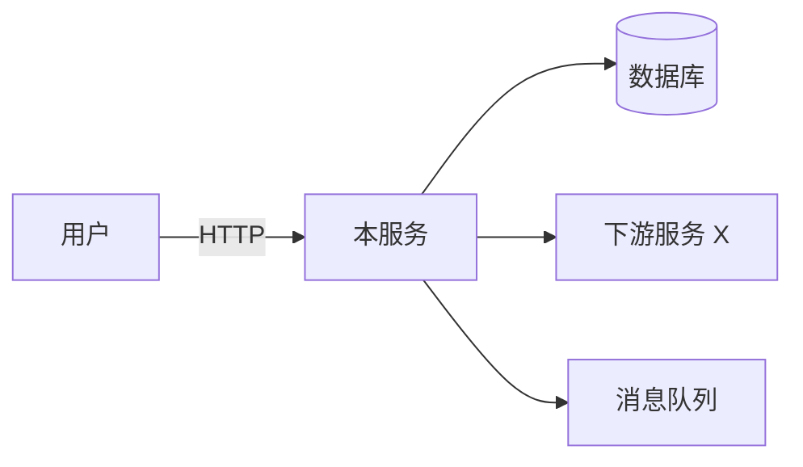
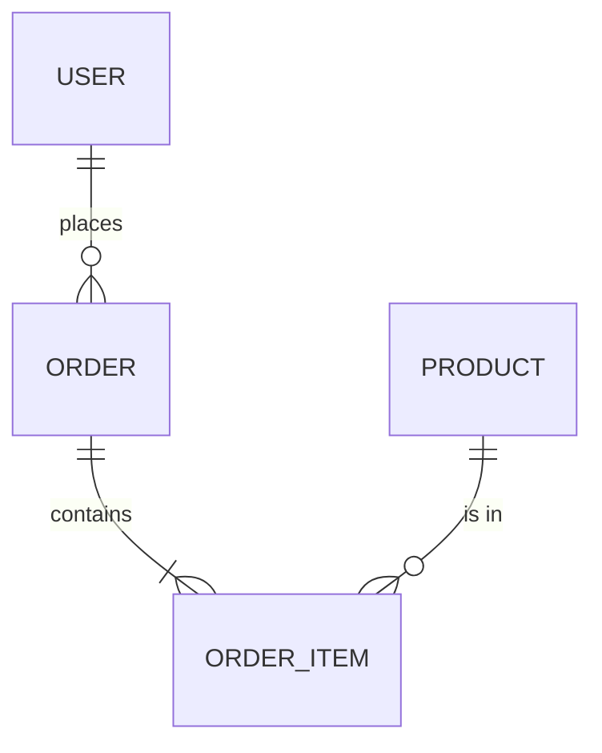
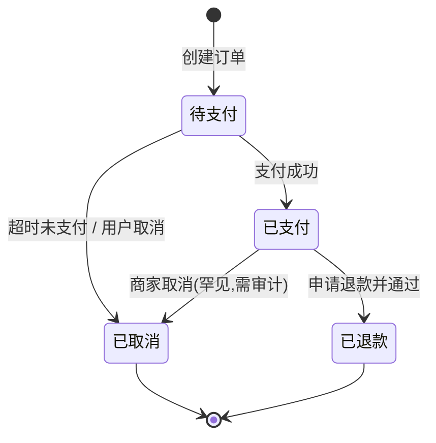
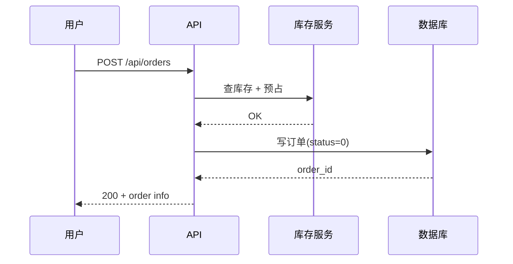

# 功能设计文档模板(Feature Design Doc Template)

> **使用说明**:本模板是骨架,所有章节都必须出现(允许写"本章不适用,理由 XXX"),但**不得整章删除**。每个章节的"内容指引"是该章节**至少**需要回答的问题,不是全部。
>
> 整篇文档的内部自洽比优雅更重要——宁可重复,也不要让读者去猜。

---

## 0. 文档元信息

```markdown
# <功能名> 功能设计文档

> 状态: Draft | In Review | Approved | Deprecated
> 作者: <开发架构师>
> 来源 PRD: <PRD 文件名,相对路径>
> 关联文档: <其他相关设计文档,逗号分隔>
> 版本: v0.1
> 最后更新: <YYYY-MM-DD>
> 目标读者: 开发者 / 评审者 / 测试者(隔离环境)
```

**要求**:目标读者要明确写出"测试者(隔离环境)"——这条声明提醒所有写作者:任何不能从文档读出的实现细节,都视为不存在。

---

## 1. 概述

### 1.1 一句话目标

> 为 <目标用户>,在 <触发场景> 下,实现 <核心能力>,通过 <关键行为路径> 完成 <用户价值>。

不超过两句话,只能写一个核心能力。

### 1.2 与 PRD 的对应关系

| PRD 章节/功能点 | 本设计文档对应章节 | 备注 |
|---|---|---|
|  |  |  |

**质检**:此表必须覆盖 PRD 中所有功能点。任何 PRD 提到的能力,本表必须能找到对应章节;反之亦然(本设计文档新增的能力必须有 PRD 来源,否则视为"超出范围")。

### 1.3 范围

**本设计文档覆盖**:
- 

**本设计文档不覆盖**:
- (后续版本再考虑)
- (本版本不做的,理由:XXX)

---

## 2. 背景与目标

### 2.1 业务背景

只写影响设计决策的事实,不写行业大盘。

### 2.2 设计目标

- 可被开发者直接实现,无歧义。
- 可被测试者直接推导测试用例,不需要看代码。
- 可被评审者直接判断设计合理性。

### 2.3 非功能目标(给出具体数值)

| 维度 | 目标 | 备注/口径 |
|---|---|---|
| 性能 | p99 接口响应 ≤ 200ms | 单次查询,数据量 10w 以内 |
| 可用性 | 月度 99.95% | 含计划内维护 |
| 一致性 | 读写强一致 | 写后立即可读 |
| 容量 | 支持 100w 用户,1000 QPS |  |
| 数据保留 | 订单数据保留 5 年 | 法规要求 |

**不能写**:"较快"、"比较稳定"、"高可用"——必须给数。

---

## 3. 名词约定

| 术语 | 定义 | 别名/易混淆 |
|---|---|---|
|  |  |  |

写这一章的目的:让 PRD 中的"业务术语"和设计中的"技术对象"对齐,避免开发者、测试者对同一名词有不同理解。

---

## 4. 系统上下文与架构

### 4.1 系统上下文图



**写明**:
- 本服务的边界(包含什么、不包含什么)。
- 上下游依赖、依赖方式(同步/异步、强一致/最终一致)。
- 第三方服务(SMS、支付、地图等)的调用契约要求。

### 4.2 关键架构决策(ADR)

> 每条决策都要给出"备选方案"和"为什么选 A 不选 B"。

| 决策 | 选择 | 备选 | 决策理由 | 代价 |
|---|---|---|---|---|
| 数据存储 | MySQL 8 | PostgreSQL / TiDB | 团队熟悉、运维成本可控 | 不支持分布式事务 |
| 鉴权方式 | JWT | Session | 无状态、便于横向扩展 | 撤销成本高 |
|  |  |  |  |  |

> 注:此处可以**建议**技术栈,但不能规定实现语言/框架/库的具体版本。

---

## 5. 数据模型

### 5.1 实体清单

| 实体名 | 中文 | 持久化 | 主键 | 主要来源 |
|---|---|---|---|---|
|  |  | 是/否 |  |  |

### 5.2 实体详细定义(每个实体一节)

#### 5.2.1 <实体名>

| 字段 | 类型 | 必填 | 默认 | 取值约束 | 说明 |
|---|---|---|---|---|---|
| id | BIGINT | 是 | 自增 | > 0 | 主键 |
| status | TINYINT | 是 | 0 | 0=待支付,1=已支付,2=已取消,详见状态机 | 见 §6 |
| created_at | DATETIME | 是 | CURRENT_TIMESTAMP | 不可修改 | 创建时间 |
|  |  |  |  |  |  |

**字段规则**:
- 每个字段必须有"说明",不能为空。
- 枚举类型必须列出所有取值。
- 字符串必须有最大长度。
- 数值必须有范围。

**关系**:



**生命周期**:
- 创建时机:何时生成记录。
- 更新规则:哪些字段可改、哪些只读、状态变更是否触发其他字段变化。
- 软删除:是否软删、删除后是否可恢复。
- 硬删除:何时物理删除、删除前是否需要归档。

**索引建议**(可选,但建议给):

| 索引 | 字段 | 类型 | 适用查询 |
|---|---|---|---|
|  |  | UNIQUE / NORMAL |  |

---

## 6. 状态机

> **每个有状态的实体都必须有这一章**,包括非法状态。

### 6.1 <实体名> 状态机

#### 状态列表

| 状态码 | 名称 | 含义 | 终态? |
|---|---|---|---|
| 0 | 待支付 | 订单创建后未支付 | 否 |
| 1 | 已支付 | 支付成功 | 否 |
| 2 | 已取消 | 主动或超时取消 | 是 |
| 3 | 已退款 | 全额退款完成 | 是 |

#### 状态转移图



**要求**:图上每条边都要在下面的转移表里;非法转移(如"已退款 → 待支付")也要列出,并说明系统行为(直接拒绝/静默忽略/抛错)。

#### 状态转移表

| 起始状态 | 事件 | 目标状态 | 前置条件 | 后置动作 | 触发方 |
|---|---|---|---|---|---|
| 待支付 | 支付成功 | 已支付 | 支付回调验签通过 | 发货、记账、通知 | 支付回调 |
| 待支付 | 用户取消 | 已取消 | 订单属于当前用户 | 释放库存、记录日志 | 用户 |
| 已支付 | 申请退款 | 已退款 | 退款审核通过 | 原路退款、记账 | 客服 |
| 已退款 | 任意 | (拒绝) | — | 返回错误码 4001 | 任何 |

#### 非法转移处理

| 起始状态 | 触发的事件 | 系统行为 | 用户提示 | 错误码 |
|---|---|---|---|---|
| 已取消 | 重复支付 | 拒绝,原路退款 | "该订单已取消" | 4001 |
| 已退款 | 申请退款 | 拒绝 | "该订单已退款" | 4002 |

---

## 7. 对外接口(API / 命令 / 事件)

> 完整接口规格参考 `api-spec-template.md`。

### 7.1 接口清单

| 接口 | 方法 | 路径 | 鉴权 | 限流 | 幂等 |
|---|---|---|---|---|---|
| 创建订单 | POST | /api/orders | 必须 | 100 QPS/用户 | 是(Idempotency-Key) |
| 查询订单 | GET | /api/orders/{id} | 必须 | 1000 QPS/用户 | 是(GET) |
| 取消订单 | POST | /api/orders/{id}/cancel | 必须 | 10 QPS/用户 | 否 |

### 7.2 接口详情(每个接口一节)

#### 7.2.1 创建订单

**鉴权**:Bearer Token,必须

**请求**:

```json
{
  "items": [{"product_id": 1001, "quantity": 2}],
  "address_id": 8888,
  "coupon_id": null
}
```

| 字段 | 类型 | 必填 | 约束 |
|---|---|---|---|
| items | array | 是 | 1 ≤ length ≤ 50 |
| items[].product_id | int | 是 | > 0,必须存在且上架 |
| items[].quantity | int | 是 | 1 ≤ quantity ≤ 999 |
| address_id | int | 是 | 属于当前用户 |
| coupon_id | int | 否 | 属于当前用户且未使用 |

**响应(200)**:

```json
{
  "order_id": 12345,
  "status": 0,
  "total_amount": 99.00,
  "created_at": "2026-06-17T10:00:00Z"
}
```

**错误码表**(本接口相关):

| 错误码 | 含义 | 触发条件 | 用户提示 |
|---|---|---|---|
| 4001 | 商品已下架 | items[].product_id 已下架 | "商品 XXX 已下架" |
| 4002 | 库存不足 | 任意 item 库存 < quantity | "商品 XXX 库存不足" |
| 4003 | 收货地址无效 | address_id 不属于当前用户或已删除 | "请重新选择收货地址" |
| 4004 | 优惠券无效 | coupon_id 已使用/过期 | "优惠券不可用" |
| 5001 | 系统错误 | 兜底 | "系统繁忙,请稍后重试" |

**幂等**:Header `Idempotency-Key`,同 key 24h 内返回首次结果。

**限流**:100 QPS/用户,超过返回 429。

**时序**(可选):



---

## 8. 业务规则与算法

### 8.1 规则清单

| 规则 ID | 规则描述 | 优先级 |
|---|---|---|
| R001 | 单个用户未支付订单最多 10 个 | P0 |
| R002 | 订单总价 = 商品金额 - 优惠金额 + 运费 | P0 |
|  |  |  |

### 8.2 关键算法

#### R002: 订单总价计算

| 输入 | 计算方式 |
|---|---|
| 商品小计 | Σ(单价 × 数量) |
| 优惠金额 | 优惠券规则(详见 §8.3) |
| 运费 | 满 99 免运费,否则 10 元 |
| 应付金额 | 商品小计 - 优惠金额 + 运费 |

**不变量**:应付金额 ≥ 0;如果计算结果 < 0,按 0 收取,但需要把差额记入"用户待领"账户(待确认,见 §15)。

#### 8.3 优惠券规则决策表

| 优惠券类型 | 适用范围 | 折扣方式 | 是否可叠加 |
|---|---|---|---|
| 满减券 | 全场 | 满 X 减 Y | 否 |
| 折扣券 | 指定类目 | 打 Z 折 | 否 |
|  |  |  |  |

**互斥规则**:满减券与折扣券不可叠加;用户选择最后一张作为有效券。

---

## 9. UI / 交互规格(如果是面向用户的功能)

> 测试者不一定要复现 UI,但要能验证状态变更。规格要能指导前端开发和测试,不能是线框图(那是设计稿)。

### 9.1 页面清单

| 页面 | 路径 | 主要功能 | 关键状态 |
|---|---|---|---|
| 订单详情 | /orders/{id} | 展示订单、允许取消/支付/退款 | 取决于订单状态 |

### 9.2 关键页面规格

#### 订单详情页

**展示字段**(按订单状态分组):

| 状态 | 展示字段 | 隐藏字段 | 可操作按钮 |
|---|---|---|---|
| 待支付 | 订单号、商品清单、总价、倒计时 | 物流单号 | 去支付 / 取消订单 |
| 已支付 | 全部 + 物流单号 | 倒计时 | 申请退款 / 查看物流 |
| 已取消 | 全部(灰色) | 全部可操作按钮 | 无 |
| 已退款 | 全部 + 退款金额 | 可操作按钮 | 无 |

**倒计时规则**:待支付状态显示 30 分钟倒计时,到 0 自动取消(触发 §6 的状态转移)。

**可点击元素**:
- "去支付" → 跳支付,只有 status=0 时可见可点。
- "取消订单" → 弹确认框,只有 status=0 时可见可点。
- "申请退款" → 跳退款申请,只有 status=1 时可见可点。

---

## 10. 权限矩阵

| 角色 \\ 资源 | 订单(自己) | 订单(他人) | 退款审核 | 系统配置 |
|---|---|---|---|---|
| 普通用户 | 读、改(取消) | 不可见 | 不可操作 | 不可见 |
| VIP 用户 | 读、改(取消) | 不可见 | 不可操作 | 不可可见 |
| 客服 | 读 | 读 | 操作 | 不可见 |
| 管理员 | 全部 | 全部 | 操作 | 读、改 |
| 系统 | 全部 | 全部 | — | — |

**每行每列必须有值**,不能写"看情况"。

---

## 11. 异常处理与边界条件

> 这一章是测试者推导"异常用例"的主入口,必须穷举。

### 11.1 输入异常

| 输入 | 系统行为 | 错误码 | 用户提示 |
|---|---|---|---|
| 必填字段缺失 | 拒绝请求 | 4000 | "缺少必填字段 XXX" |
| 字段类型错误 | 拒绝请求 | 4000 | "字段 XXX 类型错误" |
| 字段超长(>255) | 拒绝请求 | 4000 | "字段 XXX 超过最大长度" |
| 负数 quantity | 拒绝请求 | 4001 | "数量必须大于 0" |
|  |  |  |  |

### 11.2 业务异常

| 场景 | 系统行为 | 错误码 | 用户提示 |
|---|---|---|---|
| 商品已下架 | 拒绝下单 | 4001 | "商品 XXX 已下架" |
| 库存不足 | 拒绝下单 | 4002 | "商品 XXX 库存不足" |
| 用户无权限 | 拒绝请求 | 403 | "无权限" |
| 重复支付 | 静默成功,返回已存在订单 | — | 重复不报错 |
|  |  |  |  |

### 11.3 系统异常

| 场景 | 系统行为 | 兜底 |
|---|---|---|
| 数据库超时 | 重试 3 次后失败 | 返回 5001 + 补偿任务入队 |
| 库存服务不可用 | 拒绝下单 | 返回 5002 + 提示稍后重试 |
| 消息队列堆积 | 异步处理 | 监控告警,不阻塞主流程 |
|  |  |  |

### 11.4 并发与时序

| 场景 | 系统行为 |
|---|---|
| 同一用户双击"去支付" | 两次请求都创建支付单,以 Idempotency-Key 去重 |
| 支付回调先于订单创建完成(理论不应发生) | 兜底,丢弃回调,触发对账 |
| 用户在支付回调到达前取消订单 | 取消成功,支付回调到达时检测状态,已取消则原路退款 |
|  |  |

---

## 12. 性能与容量

### 12.1 性能指标

| 场景 | p50 | p99 | 超时阈值 |
|---|---|---|---|
| 创建订单 | 50ms | 200ms | 1s |
| 查询订单 | 20ms | 100ms | 500ms |
| 取消订单 | 30ms | 150ms | 1s |

### 12.2 容量

| 维度 | 目标 | 备注 |
|---|---|---|
| 日订单量 | 100w | 高峰 10w/小时 |
| 历史订单数 | 10 亿 | 需分库分表(详见 §13) |

### 13.4 分库分表策略

| 维度 | 策略 | 备注 |
|---|---|---|
| 库 | 按 user_id 哈希分 16 库 |  |
| 表 | 按 created_at 月份分表 | 保留 5 年 |
| 跨库查询 | 走 ES 检索 | 不允许 JOIN |

---

## 13. 安全与合规

### 13.1 鉴权与授权

- 所有写接口必须 JWT 鉴权。
- 资源级权限校验在服务层,不允许只靠前端隐藏按钮(测试者会绕过前端测试)。

### 13.2 数据保护

| 数据 | 加密方式 | 存储 |
|---|---|---|
| 用户身份证 | AES-256 | 加密字段 |
| 用户手机号 | AES-256 | 加密字段 |
| 支付卡号 | 不可存 | 仅存卡 BIN + 末四位 |

### 13.3 合规要求

- 个人信息收集前必须明示同意(参考隐私弹窗规格)。
- 订单数据保留 5 年后物理删除。
- 用户注销后 30 天内匿名化。

---

## 14. 可观测性

### 14.1 关键埋点

| 事件 | 触发时机 | 属性 | 用途 |
|---|---|---|---|
| order_create_success | 订单创建成功 | user_id, order_id, amount | 转化漏斗 |
| order_create_fail | 订单创建失败 | user_id, error_code, reason | 失败原因分析 |
| order_cancel | 订单取消 | user_id, order_id, source | 取消率分析 |
|  |  |  |  |

### 14.2 日志规范

- INFO:正常业务事件(订单创建、状态变更)。
- WARN:可恢复的异常(下游超时但已重试成功)。
- ERROR:需要人工介入的异常(数据库写入失败)。

每条 ERROR 日志必须包含:trace_id、user_id、order_id、error_code、堆栈。

### 14.3 监控指标

| 指标 | 阈值 | 告警级别 |
|---|---|---|
| 订单创建成功率 | < 99% | P2 |
| 订单创建 p99 | > 500ms | P2 |
| 库存预占失败率 | > 1% | P1 |
|  |  |  |

### 14.4 链路追踪

- 所有外部调用必须传 trace_id。
- 数据库/Redis/MQ 慢查询自动打点。

---

## 15. 待确认项与风险

> PRD 中没说清、或者设计过程中发现需要用户/业务方确认的点。

| ID | 待确认内容 | 影响的设计章节 | 默认假设 | 负责人 | 状态 |
|---|---|---|---|---|---|
| Q001 | 优惠券是否可叠加? | §8.3 | 不可叠加 | PM 张三 | 待确认 |
| Q002 | 退款是否要商家审核? | §6.1 | 必须审核 | 待定 | 待确认 |
|  |  |  |  |  |  |

**这一章不能为空**。如果没有任何待确认项,也要写"无"并标注"已与 PM/业务方对齐日期"。

---

## 16. 验收标准(测试矩阵)

> 完整测试矩阵参考 `test-matrix-template.md`。
> 这里给出"关键路径必须测"的核心用例,完整矩阵作为附件。

### 16.1 正常路径(必测)

| 用例 ID | 前置 | 操作 | 预期 |
|---|---|---|---|
| TC-001 | 已登录,购物车有 1 件商品 | POST /api/orders | 200,order.status=0,返回 order_id |
| TC-002 | TC-001 创建的订单 | POST /api/orders/{id}/pay (mock 支付) | 200,order.status=1,触发发货任务 |
|  |  |  |  |

### 16.2 异常路径(必测)

| 用例 ID | 前置 | 操作 | 预期 |
|---|---|---|---|
| TC-101 | 购物车有已下架商品 | POST /api/orders | 4001,"商品 XXX 已下架" |
| TC-102 | 库存仅 1 件,购买 2 件 | POST /api/orders | 4002,"商品 XXX 库存不足" |
| TC-103 | 未登录 | POST /api/orders | 401 |
|  |  |  |  |

### 16.3 状态机用例(必测)

| 用例 ID | 起始状态 | 触发事件 | 预期目标状态 | 备注 |
|---|---|---|---|---|
| TC-201 | 待支付 | 支付成功 | 已支付 |  |
| TC-202 | 已取消 | 重复支付 | (拒绝)4001 | 非法转移 |
| TC-203 | 已退款 | 申请退款 | (拒绝)4002 | 非法转移 |
|  |  |  |  |  |

### 16.4 权限用例(必测)

| 用例 ID | 角色 | 资源 | 操作 | 预期 |
|---|---|---|---|---|
| TC-301 | 普通用户 A | 用户 B 的订单 | GET | 403 / 404 |
| TC-302 | 客服 | 任意订单 | GET | 200,返回脱敏数据 |
|  |  |  |  |  |

### 16.5 性能与稳定性(必测)

| 用例 ID | 场景 | 预期 |
|---|---|---|
| TC-401 | 1000 并发创建订单 | p99 ≤ 200ms,错误率 < 0.1% |
| TC-402 | 库存服务宕机 30s | 订单创建返回 5002,不影响其他商品 |
|  |  |  |

---

## 附录 A:术语表

(如有,引用 §3)

## 附录 B:变更记录

| 版本 | 日期 | 作者 | 变更内容 |
|---|---|---|---|
| v0.1 | 2026-06-17 | 开发架构师 | 初稿 |
