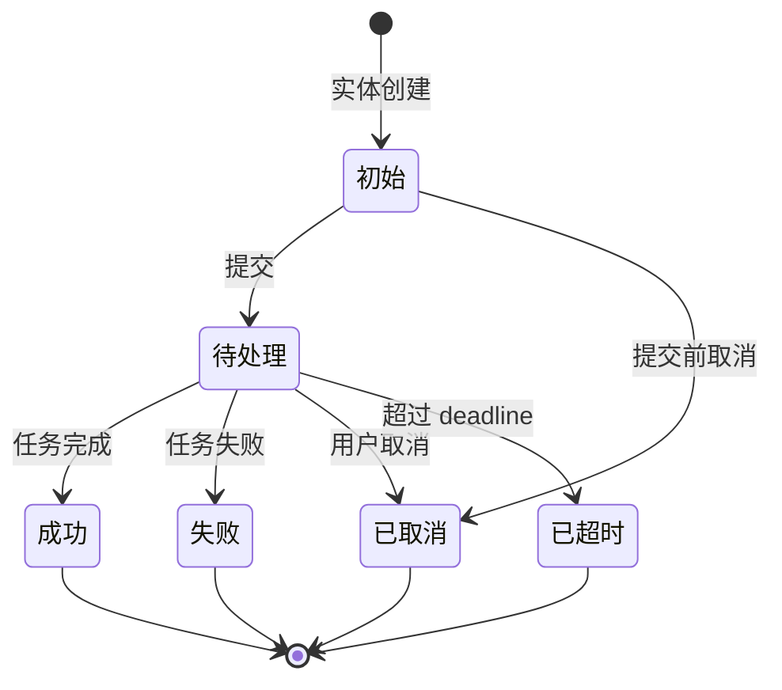

# 状态机子模板(State Machine Template)

> 用于功能设计文档的 §6。每个有状态的实体都必须有状态机。
> 测试者**看不到代码**,所以状态机必须完整覆盖合法/非法转移。

---

## 1. 实体与状态

| 字段 | 值 |
|---|---|
| 实体名 | <例:Order> |
| 状态字段 | <例:status> |
| 状态数量 | N |
| 是否有终态 | 是 / 否 |

---

## 2. 状态定义

每个状态单独一行,避免歧义。

| 状态码 | 名称 | 含义 | 终态? | 持久化? |
|---|---|---|---|---|
| 0 | <INIT> | 初始状态,实体创建后立刻进入 | 否 | 是 |
| 1 | <PENDING> | 待处理 | 否 | 是 |
| 2 | <SUCCESS> | 成功完成 | 是 | 是 |
| 3 | <FAILED> | 失败,不可恢复 | 是 | 是 |
| 4 | <CANCELLED> | 用户主动取消 | 是 | 是 |
| 5 | <EXPIRED> | 超时未完成 | 是 | 是 |

**要求**:
- 状态码一旦定义,不可修改(只能新增)。
- 终态 = 不可再变更的状态。
- 状态名称必须与错误码、日志、监控指标中的命名一致。

---

## 3. 状态转移图(Mermaid)

**画图要求**:
- 起点 `[*]` 和终点 `[*]` 必须明确。
- 每条边都有事件名(冒号后)。
- 终态用 `--> [*]` 表示。

---

## 4. 状态转移表(完整)

> 这是状态机的"白盒表",测试者按此表遍历用例。

| ID | 起始状态 | 事件 | 目标状态 | 前置条件 | 后置动作 | 触发方 | 是否可重入 |
|---|---|---|---|---|---|---|---|
| T01 | 初始 | 提交 | 待处理 | 实体已创建 | 记录 created_at、开始计时 | 用户/系统 | 否 |
| T02 | 待处理 | 任务完成 | 成功 | 业务校验通过 | 发货、记账、通知 | 系统/异步回调 | 否 |
| T03 | 待处理 | 任务失败 | 失败 | 重试次数耗尽 | 记录失败原因、告警 | 系统 | 否 |
| T04 | 待处理 | 用户取消 | 已取消 | 业务允许取消 | 释放资源、记录日志 | 用户 | 否 |
| T05 | 待处理 | 超时 | 已超时 | 超过 deadline | 触发超时补偿任务 | 定时任务 | 否 |
| T06 | 初始 | 提交前取消 | 已取消 | 实体未对外暴露 | 立即删除(软删) | 用户 | 否 |
|  |  |  |  |  |  |  |  |

**每行必须有**:起始、事件、目标、前置、后置、触发方。**测试者会用这张表覆盖所有合法路径**。

---

## 5. 非法转移表(显式列出)

> 列出"看似合理但实际不该发生"的转移,显式声明系统行为。**不列出来 = 测试者视为合法**。

| 起始状态 | 触发的事件 | 系统行为 | 用户提示 | 错误码 |
|---|---|---|---|---|
| 成功 | 重复任务完成 | 静默忽略,返回当前状态 | (无) | — |
| 成功 | 用户取消 | 拒绝 | "已完成,无法取消" | 4001 |
| 失败 | 重试 | 拒绝(终态) | "已失败,请重新创建" | 4002 |
| 已取消 | 任务完成 | 拒绝 | "已取消,无法完成" | 4003 |
| 已超时 | 任务完成 | 拒绝 | "已超时,无法完成" | 4004 |
| 任意 | 状态变更到不存在的状态码 | 拒绝(参数校验) | "系统错误" | 5000 |
|  |  |  |  |  |

---

## 6. 状态约束(不变量)

无论发生什么,系统都应保持的**恒成立**条件。

| ID | 不变量 | 监控方式 |
|---|---|---|
| I01 | 订单状态终态后,任何状态字段都不再变更 | 审计日志 |
| I02 | 用户余额永远 ≥ 0 | 实时校验 |
| I03 | 订单状态 = 已支付 时,必有支付记录 | 关联校验 |
|  |  |  |

**测试者会专门测试不变量的破坏场景**。

---

## 7. 状态变更的副作用

每个状态变更可能触发副作用,**显式列出**避免测试遗漏。

| 起始 → 目标 | 副作用 |
|---|---|
| 待支付 → 已支付 | ① 扣库存 ② 写支付流水 ③ 发通知 ④ 触发发货 |
| 任意 → 已取消 | ① 释放库存 ② 写日志 ③ 退款(若已支付) |
|  |  |

---

## 8. 并发与竞态

> 状态机最容易被并发打穿。

| 场景 | 系统行为 | 实现提示(给开发者) |
|---|---|---|
| 同一订单同时被两个支付回调命中 | 仅一个生效,另一个返回 409 | 分布式锁 / 数据库唯一约束 |
| 用户在支付完成前点取消,支付回调同时到达 | 取消优先,回调检测到已取消则原路退款 | 状态机 CAS |
| 状态机迁移超时(转移表执行到一半) | 走补偿任务,最终一致 | Saga / 幂等重试 |
|  |  |  |

---

## 9. 状态可观测性

| 信号 | 触发时机 | 用途 |
|---|---|---|
| state_change 事件 | 状态变更落库 | 审计 + 实时分析 |
| state_stuck_alert | 实体在某非终态停留超过 SLA | 卡单告警 |
| state_distribution 指标 | 定时统计各状态实体数 | 容量规划 |
|  |  |  |

---

## 10. 测试用例覆盖矩阵(给测试者)

> 测试者应至少覆盖以下用例,每格至少 1 条。

| 起始 \\ 事件 | 任务完成 | 任务失败 | 用户取消 | 超时 | 非法事件 |
|---|---|---|---|---|---|
| 初始 | (N/A 不存在) | (N/A) | T06 | (N/A) |  |
| 待处理 | T02 | T03 | T04 | T05 |  |
| 成功 | (拒绝) | (拒绝) | (拒绝) | (拒绝) |  |
| 失败 | (拒绝) | (拒绝) | (N/A) | (N/A) |  |
| 已取消 | (拒绝) | (拒绝) | (拒绝) | (N/A) |  |
| 已超时 | (拒绝) | (拒绝) | (N/A) | (N/A) |  |

**质检**:
- 每个"拒绝"格都要在 §5 非法转移表里能找到对应行。
- 每个"合法"格都要在 §4 转移表里能找到对应行。
- 不允许有空白格。
