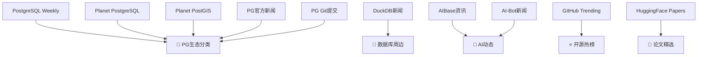
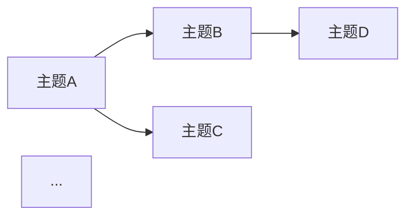

# DB × AI × GitHub × Paper — 技术周报 Skill

> **核心目标**：每次运行，抓取并整合 10 个权威数据源在最近 7 天内发布的内容，去重、分类、分析，产出一份对数据库工程师、AI 研究者、开源爱好者都有价值的技术周报。

---

## 一、数据源总览

| # | 分类 | 数据源 URL | 抓取策略 |
|---|------|-----------|---------|
| 1 | 🐘 PostgreSQL 周刊 | `https://postgresweekly.com/issues` | 先获取列表页，找最新期号，再抓具体期 |
| 2 | 🐘 Planet PostgreSQL | `https://planet.postgresql.org/` | 直接抓，过滤7天内文章 |
| 3 | 🗺️ Planet PostGIS | `https://planet.postgis.net/` | 直接抓，过滤7天内文章 |
| 4 | 📣 PostgreSQL 官方新闻 | `https://www.postgresql.org/about/newsarchive/` | 直接抓，过滤7天内条目 |
| 5 | 🔧 PostgreSQL Git 提交 | `https://git.postgresql.org/gitweb/?p=postgresql.git;a=shortlog` | 直接抓，过滤7天内提交 |
| 6 | 🦆 DuckDB 新闻 | `https://duckdb.org/news/` | 直接抓，过滤7天内文章 |
| 7 | 🤖 AI Base 每日资讯 | `https://www.aibase.com/zh` | 直接抓，若内容简单则钻取文章页 |
| 8 | 🤖 AI Bot 每日新闻 | `https://ai-bot.cn/daily-ai-news/` | 直接抓，若内容简单则钻取文章页 |
| 9 | ⭐ GitHub Trending 周榜 | `https://github.com/trending?since=weekly&spoken_language_code=` | 直接抓，提取排名前20 repo |
| 10 | 📄 HuggingFace 热门论文 | `https://huggingface.co/papers/trending` | 直接抓，若内容简单则钻取论文页 |

---

## 二、执行流程（严格按顺序）

### Step 0：准备工作

```bash
mkdir -p markdown
TODAY=$(date +%Y%m%d)
WEEK_START=$(date -d "7 days ago" +%Y-%m-%d 2>/dev/null || date -v-7d +%Y-%m-%d)
```

输出本次周报的时间范围：`{WEEK_START} ~ {TODAY}`。

---

### Step 1：逐源抓取（含特殊处理逻辑）

> ⚠️ 所有抓取使用 `web_fetch`。遇到需要真人验证（Cloudflare / reCAPTCHA）时，改用 `web_search` 搜索站点名+关键词，从搜索结果摘要中提取内容。

#### 1.1 PostgreSQL Weekly（需先找最新期号）

```
Step A: web_fetch("https://postgresweekly.com/issues")
Step B: 解析 HTML，找到最新期号 N（如 href="/issues/652" 中的 652）
Step C: web_fetch("https://postgresweekly.com/issues/{N}")
Step D: 提取本期所有文章标题、URL、摘要
```

若 Step A 被封锁：`web_search("site:postgresweekly.com issues 2025")` 推断最新期号。

#### 1.2 Planet PostgreSQL / Planet PostGIS

```
web_fetch(URL)
→ 提取 <article> / <item> / <entry> 等块
→ 检查日期字段（pubDate / updated / datetime），过滤7天内
→ 若内容只有标题+摘要，则 web_fetch 原文 URL 获取正文前500字
```

#### 1.3 PostgreSQL 官方新闻

```
web_fetch("https://www.postgresql.org/about/newsarchive/")
→ 找到 <li> 条目，提取标题+日期+链接
→ 过滤7天内
→ 钻取每条新闻的详情页（内容通常很短，必须钻取）
```

#### 1.4 PostgreSQL Git 提交记录

```
web_fetch("https://git.postgresql.org/gitweb/?p=postgresql.git;a=shortlog")
→ 提取 commit 列表（哈希、作者、日期、subject）
→ 过滤7天内提交
→ 按主题分组：性能、修复、新功能、文档、测试
→ 重要提交（非修复类）钻取 commit 详情页
```

#### 1.5 DuckDB 新闻

```
web_fetch("https://duckdb.org/news/")
→ 提取博客/新闻列表，过滤7天内
→ 若列表简短，钻取每篇文章首段
```

#### 1.6 AI Base + AI Bot（中文AI资讯）

```
web_fetch("https://www.aibase.com/zh")
→ 提取今日/本周推荐内容
→ 若内容过于简单（只有标题），钻取前5条详情

web_fetch("https://ai-bot.cn/daily-ai-news/")
→ 提取最新一期（或最近7天的条目）
→ 若内容过于简单，钻取文章页
```

若被封锁：`web_search("aibase.com AI新闻 本周 2025")` + `web_search("ai-bot.cn 每日AI新闻 2025")`。

#### 1.7 GitHub Trending 周榜

```
web_fetch("https://github.com/trending?since=weekly&spoken_language_code=")
→ 提取所有 repo（名称、描述、语言、本周 star 增量、总 star 数）
→ 按语言/主题归类
→ 重点 repo 访问 README 获取1句话描述（若描述不够清晰）
```

若被封锁：`web_search("github trending weekly 2025 AI database")` 辅助补充。

#### 1.8 HuggingFace 热门论文

```
web_fetch("https://huggingface.co/papers/trending")
→ 提取论文列表（标题、摘要、upvote数、发布日期）
→ 过滤7天内，按 upvote 排序取前10
→ 摘要不足100字的钻取论文详情页（或访问 arxiv 摘要）
```

---

### Step 2：内容分类与去重

将所有抓取内容按以下6个分类整理：

```
A. 🐘 PostgreSQL 生态     — PG Weekly + Planet PG + 官方新闻 + Git提交
B. 🦆 DuckDB & 数据库周边 — DuckDB + 其他DB动态（从AI资讯中筛选）
C. 🤖 AI 每日动态         — AIBase + AI-Bot（模型发布、产品更新、行业动态）
D. ⭐ GitHub 开源热榜     — GitHub Trending（AI/DB/工具/语言分类）
E. 📄 AI 论文精选         — HuggingFace Trending Papers
F. 🔧 工程与实践          — 从各源中提取实操、教程、最佳实践类内容
```

**去重规则**：同一事件在多个源出现时，合并为一条，标注"来源：A+B"。

---

### Step 3：重要性打分（仅用于排序）

对每条内容评分（1-5星），依据：
- ⭐⭐⭐⭐⭐：重大版本发布、突破性论文、高 star 增量 repo（>500/周）
- ⭐⭐⭐⭐：新特性、新工具、有深度的技术分析
- ⭐⭐⭐：常规更新、小工具、一般性内容
- ⭐⭐：修复类提交、例行通知
- ⭐：边缘内容（保留但置后）

每个分类按评分从高到低排列。

---

### Step 4：生成 Mermaid 图

**必须生成以下3张图，内嵌在 Markdown 中：**

#### 图1：周报数据源覆盖图（Mermaid flowchart）



#### 图2：本周技术热点关系图（Mermaid graph，动态生成）

根据抓取内容，找出本周最热的3-5个技术主题（如"AI Agent"、"PG 18 开发进展"、"向量数据库"等），画出主题之间的关联：



#### 图3：GitHub Trending 语言分布（Mermaid pie，动态生成）

统计本周 GitHub Trending 中各编程语言的占比：


> 以上数据根据实际抓取结果填写，不要使用占位数字。

---

### Step 5：撰写周报正文

按以下模板输出完整 Markdown，所有章节必须存在：

```markdown
# 🗞️ DB × AI × GitHub × Paper 技术周报
> 期号：第 {N} 期 | 时间范围：{WEEK_START} ～ {TODAY} | 生成时间：{DATETIME}

---

## 📋 本周摘要

> 用3-5句话，总结本周最值得关注的技术动态（跨领域综合）

**本周关键词**：`关键词1` · `关键词2` · `关键词3` · `关键词4` · `关键词5`

---

## 数据源覆盖总览

[图1：数据源覆盖 Mermaid 图]

---

## A. 🐘 PostgreSQL 生态

> 来源：PostgreSQL Weekly #{N}、Planet PostgreSQL、PG官方新闻、Git提交记录

### 🔥 重磅内容
[⭐⭐⭐⭐⭐ / ⭐⭐⭐⭐ 的内容，含标题、摘要、原文链接]

### 📌 Git 提交亮点（本周）

| 类别 | 提交主题 | 作者 | 日期 |
|------|---------|------|------|
| 新功能 | ... | ... | ... |
| 性能 | ... | ... | ... |
| 修复 | ... | ... | ... |

### 其他更新
[⭐⭐⭐ 及以下内容]

---

## B. 🦆 DuckDB & 数据库周边

> 来源：DuckDB News、AI资讯中的DB相关内容

[重磅内容 + 其他更新，同上格式]

---

## C. 🤖 AI 每日动态

> 来源：AIBase、AI-Bot每日AI新闻

### 🔥 本周AI大事

[⭐⭐⭐⭐⭐ 内容：模型发布、重大产品更新、行业动态]

### 📅 逐日速览

| 日期 | 事件 | 重要程度 |
|------|------|---------|
| {日期} | ... | ⭐⭐⭐⭐⭐ |
| ... | ... | ... |

---

## D. ⭐ GitHub 开源热榜（本周）

> 来源：GitHub Trending (since=weekly)

[图3：语言分布 Mermaid 饼图]

### 🏆 Top Repos（按周 Star 增量）

| 排名 | Repo | 语言 | 本周 ⭐ | 描述 |
|------|------|------|--------|------|
| 1 | [name](url) | Python | +2.3k | ... |
| ... | ... | ... | ... | ... |

### 按主题分类

**🤖 AI / LLM 相关**
- [repo-name](url)：...

**🗄️ 数据库 / 存储相关**
- [repo-name](url)：...

**🛠️ 开发工具 / 基础设施**
- [repo-name](url)：...

---

## E. 📄 AI 论文精选（HuggingFace Trending）

> 来源：HuggingFace Papers Trending，过滤近7天，按 upvote 排序

### Top 10 热门论文

| # | 标题 | upvote | 核心贡献（一句话） | arxiv |
|---|------|--------|-----------------|-------|
| 1 | ... | 🔺NNN | ... | [link] |
| ... | ... | ... | ... | ... |

### 深度解读（Top 3）

对 upvote 最高的3篇论文，各写100-200字解读：

#### 📄 [论文标题]
- **问题**：解决了什么问题
- **方法**：核心思路
- **结论**：主要结果
- **意义**：对业界的影响

---

## F. 🔧 工程实践精选

> 从各数据源中筛选出有实操价值的教程、最佳实践、工具推荐

[每条包含：标题、来源、一句话价值说明、原文链接]

---

## 🔗 本周技术热点关系图

[图2：热点关系 Mermaid 图]

---

## 📌 编辑推荐（TOP 5）

> 如果你只有5分钟，这周最值得读的5条内容：

1. 🥇 **[标题]** — [一句话理由] → [链接]
2. 🥈 **[标题]** — [一句话理由] → [链接]
3. 🥉 **[标题]** — [一句话理由] → [链接]
4. **[标题]** — [一句话理由] → [链接]
5. **[标题]** — [一句话理由] → [链接]

---

## 📊 本周数据汇总

| 分类 | 抓取条目数 | 7天内有效 | 精选入报 |
|------|----------|---------|---------|
| 🐘 PostgreSQL 生态 | N | N | N |
| 🦆 DuckDB & DB周边 | N | N | N |
| 🤖 AI 动态 | N | N | N |
| ⭐ GitHub Trending | N | N | N |
| 📄 AI 论文 | N | N | N |
| 🔧 工程实践 | N | N | N |
| **合计** | **N** | **N** | **N** |

---

*本报告由 Claude 自动抓取生成，内容来源均已标注。如有遗漏或错误，欢迎反馈。*
*下期预计发布：{下次周报日期}*
```

---

### Step 6：异常处理

| 场景 | 处理方式 |
|------|---------|
| URL 返回 403/429 | 改用 `web_search("site:xxx.com ...")` 补充 |
| Cloudflare 验证拦截 | 使用 `web_search` 搜索该站近期内容 |
| 内容为空/极少 | 标注"本周无新内容"，不强行填充 |
| 找不到最新期号 | 用 `web_search("postgresweekly latest issue 2025")` 辅助 |
| 日期无法解析 | 保守估计，宁可多保留（7+2天缓冲） |
| 论文无摘要 | 访问 `https://arxiv.org/abs/{id}` 获取 |
| GitHub 被封 | 使用 `web_search("github trending weekly AI 2025")` |

---

### Step 7：保存文件

```bash
# 文件命名：YYYYMMDD_db-ai-github-paper-weekly.md
# 保存路径：markdown/

mkdir -p markdown
# 文件内容见 Step 5 模板
```

保存完成后输出：
1. 文件绝对路径
2. 本期统计：总抓取条目 / 7天内有效 / 精选入报 / 含Mermaid图数量
3. 本期最值得关注的 TOP 1 内容（一句话）

---

## 三、质量自检清单

输出前逐项核对：

```
□ 所有10个数据源都尝试过抓取（即使部分为空）？
□ postgresweekly 已找到最新期号并钻取详情？
□ 内容均已过滤到7天内（或标注了日期缺失的情况）？
□ 3张 Mermaid 图均已生成且数据是真实的（非占位符）？
□ GitHub Trending 至少列出了15个 repo？
□ HuggingFace 论文有 Top 3 的深度解读？
□ 每条内容都有原文链接？
□ 去重已执行（同一事件不重复出现）？
□ "编辑推荐 TOP 5"跨越了至少3个不同分类？
□ markdown/ 目录存在且文件已保存？
□ 数据汇总表中的数字与正文一致？
```

---

## 四、并行抓取建议

为节省时间，以下数据源可同时发起请求（无依赖关系）：

```
并行组 A（无需预处理）：
  - Planet PostgreSQL
  - Planet PostGIS
  - PostgreSQL 官方新闻
  - PostgreSQL Git shortlog
  - DuckDB 新闻
  - GitHub Trending
  - HuggingFace Papers

串行组 B（需先获取列表页）：
  - PostgreSQL Weekly（先获取期号）
  - AIBase（先获取列表，再钻取详情）
  - AI-Bot（先获取列表，再钻取详情）
```

---

## 五、示例输出片段

```markdown
## A. 🐘 PostgreSQL 生态

### 🔥 重磅内容

#### PostgreSQL 18 Beta 2 发布 ⭐⭐⭐⭐⭐
> 来源：PostgreSQL 官方新闻 | 2025-06-12

PostgreSQL 18 Beta 2 已发布，包含以下重要改进：OAuth 2.0 设备授权流支持、
`MERGE` 语句增强（支持 `RETURNING`）、pg_basebackup 性能提升约 30%。
建议开发者在生产环境迁移前重点测试扩展兼容性。

🔗 [官方公告](https://www.postgresql.org/about/news/...)

---

## E. 📄 AI 论文精选

### Top 10 热门论文

| # | 标题 | upvote | 核心贡献（一句话） | arxiv |
|---|------|--------|-----------------|-------|
| 1 | FlashAttention-3 | 🔺2847 | H100 上注意力计算速度提升 2.6x | [2407.08608](https://arxiv.org/abs/2407.08608) |

### 深度解读：FlashAttention-3

- **问题**：H100 GPU 有 FP8 和异步特性，但 FA2 未充分利用
- **方法**：Warp 专业化 + 流水线异步化 + FP8 精度
- **结论**：在 H100 上达到 740 TFLOPS，接近硬件峰值的 75%
- **意义**：Transformer 训练和推理成本将进一步降低，直接惠及所有大模型训练场景
```

---

以上即为 `db-ai-github-paper-weekly-news` Skill 的完整指南。  
每次运行请严格遵循抓取 → 分类 → 评分 → 制图 → 撰写 → 自检 → 保存的顺序。
