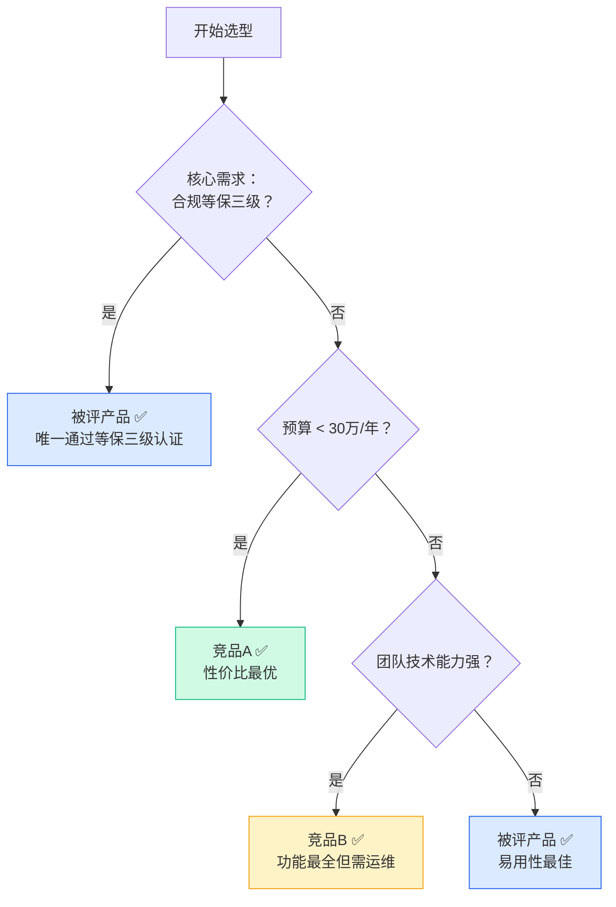

# 报告示例与图表模板

本文件包含可直接复用或改编的图表模板和报告片段。

---

## 雷达图 SVG 模板

以下是 8 维度雷达图的 SVG 基础模板，保存为 `markdown/assets/score-radar.svg`。

```svg
<svg viewBox="0 0 500 460" xmlns="http://www.w3.org/2000/svg"
     font-family="'PingFang SC', 'Helvetica Neue', Arial, sans-serif">

  <!-- 背景 -->
  <rect width="500" height="460" fill="#FAFAFA" rx="12"/>
  <text x="250" y="34" text-anchor="middle" font-size="16" font-weight="bold" fill="#1E293B">产品评分雷达图</text>
  <text x="250" y="54" text-anchor="middle" font-size="11" fill="#94A3B8">满分 5 分</text>

  <!-- 雷达中心 -->
  <!-- cx=250, cy=250, 半径=160 -->
  <!-- 8 个维度，每个夹角 45° -->
  <!-- 层级参考圆：r=32(1分), 64(2分), 96(3分), 128(4分), 160(5分) -->

  <!-- 参考圆（灰色） -->
  <circle cx="250" cy="250" r="160" fill="none" stroke="#E2E8F0" stroke-width="1"/>
  <circle cx="250" cy="250" r="128" fill="none" stroke="#E2E8F0" stroke-width="1"/>
  <circle cx="250" cy="250" r="96"  fill="none" stroke="#E2E8F0" stroke-width="1"/>
  <circle cx="250" cy="250" r="64"  fill="none" stroke="#E2E8F0" stroke-width="1"/>
  <circle cx="250" cy="250" r="32"  fill="none" stroke="#E2E8F0" stroke-width="1"/>

  <!-- 分值标注 -->
  <text x="254" y="93"  font-size="10" fill="#94A3B8">5</text>
  <text x="254" y="125" font-size="10" fill="#94A3B8">4</text>
  <text x="254" y="157" font-size="10" fill="#94A3B8">3</text>
  <text x="254" y="189" font-size="10" fill="#94A3B8">2</text>
  <text x="254" y="221" font-size="10" fill="#94A3B8">1</text>

  <!-- 轴线（8条，每45°一条） -->
  <!-- 0°:上 45°:右上 90°:右 135°:右下 180°:下 225°:左下 270°:左 315°:左上 -->
  <line x1="250" y1="250" x2="250" y2="90"  stroke="#CBD5E1" stroke-width="1"/>
  <line x1="250" y1="250" x2="363" y2="137" stroke="#CBD5E1" stroke-width="1"/>
  <line x1="250" y1="250" x2="410" y2="250" stroke="#CBD5E1" stroke-width="1"/>
  <line x1="250" y1="250" x2="363" y2="363" stroke="#CBD5E1" stroke-width="1"/>
  <line x1="250" y1="250" x2="250" y2="410" stroke="#CBD5E1" stroke-width="1"/>
  <line x1="250" y1="250" x2="137" y2="363" stroke="#CBD5E1" stroke-width="1"/>
  <line x1="250" y1="250" x2="90"  y2="250" stroke="#CBD5E1" stroke-width="1"/>
  <line x1="250" y1="250" x2="137" y2="137" stroke="#CBD5E1" stroke-width="1"/>

  <!--
    数据点计算公式（以中心250,250为原点，radius = score * 32）：
    维度N（角度θ）的坐标：
      x = 250 + r * sin(θ)
      y = 250 - r * cos(θ)

    θ 值（8维度均分360°，从正上方0°开始顺时针）：
      维度1(TCO):          0°   → x=250,        y=250-r
      维度2(ROI):         45°   → x=250+r*0.707, y=250-r*0.707
      维度3(厂商可靠性):   90°   → x=250+r,       y=250
      维度4(合规安全):    135°   → x=250+r*0.707, y=250+r*0.707
      维度5(易用性):      180°   → x=250,         y=250+r
      维度6(核心功能):    225°   → x=250-r*0.707, y=250+r*0.707
      维度7(性能稳定性):  270°   → x=250-r,       y=250
      维度8(集成扩展):    315°   → x=250-r*0.707, y=250-r*0.707

    示例：被评产品 [4,3,4,5,4,3,4,4]，竞品 [3,3,3,3,3,4,3,3]
  -->

  <!-- 被评产品数据面（蓝色，score=[4,3,4,5,4,3,4,4]） -->
  <polygon
    points="
      250,122
      350,172
      378,250
      350,328
      250,378
      169,328
      122,250
      169,172
    "
    fill="#2563EB" fill-opacity="0.15"
    stroke="#2563EB" stroke-width="2.5"/>

  <!-- 竞品数据面（绿色，score=[3,3,3,3,3,4,3,3]） -->
  <polygon
    points="
      250,154
      318,182
      346,250
      318,318
      250,346
      182,318
      154,250
      182,182
    "
    fill="#10B981" fill-opacity="0.12"
    stroke="#10B981" stroke-width="1.5" stroke-dasharray="4,3"/>

  <!-- 数据点（被评产品） -->
  <circle cx="250" cy="122" r="4" fill="#2563EB"/>
  <circle cx="350" cy="172" r="4" fill="#2563EB"/>
  <circle cx="378" cy="250" r="4" fill="#2563EB"/>
  <circle cx="350" cy="328" r="4" fill="#2563EB"/>
  <circle cx="250" cy="378" r="4" fill="#2563EB"/>
  <circle cx="169" cy="328" r="4" fill="#2563EB"/>
  <circle cx="122" cy="250" r="4" fill="#2563EB"/>
  <circle cx="169" cy="172" r="4" fill="#2563EB"/>

  <!-- 维度标签 -->
  <text x="250" y="80"  text-anchor="middle" font-size="12" fill="#1E293B" font-weight="500">TCO 成本</text>
  <text x="378" y="130" text-anchor="start"  font-size="12" fill="#1E293B" font-weight="500">ROI 预期</text>
  <text x="422" y="254" text-anchor="start"  font-size="12" fill="#1E293B" font-weight="500">厂商可靠性</text>
  <text x="370" y="390" text-anchor="start"  font-size="12" fill="#1E293B" font-weight="500">合规安全</text>
  <text x="250" y="432" text-anchor="middle" font-size="12" fill="#1E293B" font-weight="500">易用性</text>
  <text x="108" y="390" text-anchor="end"    font-size="12" fill="#1E293B" font-weight="500">核心功能</text>
  <text x="72"  y="254" text-anchor="end"    font-size="12" fill="#1E293B" font-weight="500">性能稳定</text>
  <text x="118" y="130" text-anchor="end"    font-size="12" fill="#1E293B" font-weight="500">集成扩展</text>

  <!-- 图例 -->
  <rect x="30" y="420" width="14" height="8" fill="#2563EB" fill-opacity="0.4" rx="2"/>
  <text x="50" y="429" font-size="11" fill="#475569">被评产品</text>
  <rect x="120" y="420" width="14" height="8" fill="#10B981" fill-opacity="0.4" rx="2"/>
  <text x="140" y="429" font-size="11" fill="#475569">竞品</text>
</svg>
```

**使用说明**：
1. 替换 `<polygon points="...">` 中的坐标（用上方公式根据实际评分计算）
2. 替换维度标签文字（根据实际评测维度）
3. 若只有被评产品无竞品，删除竞品相关元素
4. 替换图例文字为实际产品名称

---

## 功能矩阵 SVG 模板

适合展示被评产品与竞品的功能对比，保存为 `markdown/assets/feature-matrix.svg`。

```svg
<svg viewBox="0 0 600 320" xmlns="http://www.w3.org/2000/svg"
     font-family="'PingFang SC', 'Helvetica Neue', Arial, sans-serif">

  <rect width="600" height="320" fill="#FAFAFA" rx="12"/>
  <text x="300" y="30" text-anchor="middle" font-size="15" font-weight="bold" fill="#1E293B">功能对比矩阵</text>

  <!-- 表头 -->
  <rect x="0" y="42" width="600" height="36" fill="#1E293B" rx="4"/>
  <text x="130" y="64" text-anchor="middle" font-size="12" fill="white" font-weight="500">功能点</text>
  <text x="300" y="64" text-anchor="middle" font-size="12" fill="white" font-weight="500">被评产品名</text>
  <text x="430" y="64" text-anchor="middle" font-size="12" fill="white" font-weight="500">竞品A</text>
  <text x="540" y="64" text-anchor="middle" font-size="12" fill="white" font-weight="500">竞品B</text>

  <!-- 分隔线（纵向） -->
  <line x1="230" y1="42" x2="230" y2="320" stroke="#E2E8F0" stroke-width="1"/>
  <line x1="370" y1="42" x2="370" y2="320" stroke="#E2E8F0" stroke-width="1"/>
  <line x1="490" y1="42" x2="490" y2="320" stroke="#E2E8F0" stroke-width="1"/>

  <!-- 数据行（每行高度40px，从y=78开始） -->
  <!-- 行1 -->
  <rect x="0" y="78" width="600" height="40" fill="white"/>
  <text x="16" y="102"  font-size="12" fill="#374151">功能点1</text>
  <text x="300" y="102" text-anchor="middle" font-size="16" fill="#10B981">✓</text>
  <text x="430" y="102" text-anchor="middle" font-size="16" fill="#10B981">✓</text>
  <text x="540" y="102" text-anchor="middle" font-size="16" fill="#EF4444">✗</text>

  <!-- 行2 -->
  <rect x="0" y="118" width="600" height="40" fill="#F8FAFC"/>
  <text x="16" y="142" font-size="12" fill="#374151">功能点2</text>
  <text x="300" y="142" text-anchor="middle" font-size="12" fill="#F59E0B">部分支持</text>
  <text x="430" y="142" text-anchor="middle" font-size="16" fill="#10B981">✓</text>
  <text x="540" y="142" text-anchor="middle" font-size="16" fill="#10B981">✓</text>

  <!-- 行3 -->
  <rect x="0" y="158" width="600" height="40" fill="white"/>
  <text x="16" y="182" font-size="12" fill="#374151">功能点3</text>
  <text x="300" y="182" text-anchor="middle" font-size="16" fill="#10B981">✓</text>
  <text x="430" y="182" text-anchor="middle" font-size="16" fill="#EF4444">✗</text>
  <text x="540" y="182" text-anchor="middle" font-size="16" fill="#EF4444">✗</text>

  <!-- 行4 -->
  <rect x="0" y="198" width="600" height="40" fill="#F8FAFC"/>
  <text x="16" y="222" font-size="12" fill="#374151">功能点4</text>
  <text x="300" y="222" text-anchor="middle" font-size="16" fill="#10B981">✓</text>
  <text x="430" y="222" text-anchor="middle" font-size="16" fill="#10B981">✓</text>
  <text x="540" y="222" text-anchor="middle" font-size="12" fill="#F59E0B">路线图中</text>

  <!-- 行5 -->
  <rect x="0" y="238" width="600" height="40" fill="white"/>
  <text x="16" y="262" font-size="12" fill="#374151">功能点5</text>
  <text x="300" y="262" text-anchor="middle" font-size="16" fill="#EF4444">✗</text>
  <text x="430" y="262" text-anchor="middle" font-size="16" fill="#10B981">✓</text>
  <text x="540" y="262" text-anchor="middle" font-size="16" fill="#10B981">✓</text>

  <!-- 图例 -->
  <text x="20"  y="308" font-size="14" fill="#10B981">✓</text><text x="36"  y="308" font-size="11" fill="#475569">完全支持</text>
  <text x="130" y="308" font-size="14" fill="#EF4444">✗</text><text x="146" y="308" font-size="11" fill="#475569">不支持</text>
  <text x="240" y="308" font-size="12" fill="#F59E0B">▲</text><text x="256" y="308" font-size="11" fill="#475569">部分/计划支持</text>
</svg>
```

---

## TCO 对比条形图 SVG 模板

保存为 `markdown/assets/tco-comparison.svg`。

```svg
<svg viewBox="0 0 560 300" xmlns="http://www.w3.org/2000/svg"
     font-family="'PingFang SC', 'Helvetica Neue', Arial, sans-serif">

  <rect width="560" height="300" fill="#FAFAFA" rx="12"/>
  <text x="280" y="30" text-anchor="middle" font-size="15" font-weight="bold" fill="#1E293B">3 年 TCO 对比（万元）</text>

  <!-- 坐标轴 -->
  <line x1="80" y1="240" x2="530" y2="240" stroke="#94A3B8" stroke-width="1.5"/>
  <line x1="80" y1="60"  x2="80"  y2="240" stroke="#94A3B8" stroke-width="1.5"/>

  <!-- Y 轴刻度（根据实际数据调整） -->
  <text x="72" y="244" text-anchor="end" font-size="10" fill="#94A3B8">0</text>
  <text x="72" y="204" text-anchor="end" font-size="10" fill="#94A3B8">20</text>
  <text x="72" y="164" text-anchor="end" font-size="10" fill="#94A3B8">40</text>
  <text x="72" y="124" text-anchor="end" font-size="10" fill="#94A3B8">60</text>
  <text x="72" y="84"  text-anchor="end" font-size="10" fill="#94A3B8">80</text>
  <line x1="78" y1="200" x2="82" y2="200" stroke="#94A3B8" stroke-width="1"/>
  <line x1="78" y1="160" x2="82" y2="160" stroke="#94A3B8" stroke-width="1"/>
  <line x1="78" y1="120" x2="82" y2="120" stroke="#94A3B8" stroke-width="1"/>
  <line x1="78" y1="80"  x2="82" y2="80"  stroke="#94A3B8" stroke-width="1"/>

  <!-- 产品A的堆叠条形（蓝色系） -->
  <!-- 采购：30万=120px -->
  <rect x="120" y="120" width="80" height="120" fill="#2563EB" rx="2"/>
  <text x="160" y="116" text-anchor="middle" font-size="10" fill="#2563EB">30</text>
  <!-- 实施：10万=40px -->
  <rect x="120" y="80" width="80" height="40" fill="#60A5FA" rx="2"/>
  <!-- 维护：5万=20px -->
  <rect x="120" y="60" width="80" height="20" fill="#93C5FD" rx="2"/>
  <text x="160" y="56" text-anchor="middle" font-size="11" font-weight="bold" fill="#1E293B">45万</text>
  <text x="160" y="260" text-anchor="middle" font-size="12" fill="#374151">被评产品</text>

  <!-- 产品B的堆叠条形（绿色系） -->
  <rect x="260" y="80" width="80" height="160" fill="#10B981" rx="2"/>
  <rect x="260" y="60" width="80" height="20" fill="#34D399" rx="2"/>
  <rect x="260" y="48" width="80" height="12" fill="#6EE7B7" rx="2"/>
  <text x="300" y="44" text-anchor="middle" font-size="11" font-weight="bold" fill="#1E293B">55万</text>
  <text x="300" y="260" text-anchor="middle" font-size="12" fill="#374151">竞品A</text>

  <!-- 产品C的堆叠条形（橙色系） -->
  <rect x="400" y="100" width="80" height="140" fill="#F59E0B" rx="2"/>
  <rect x="400" y="76" width="80" height="24" fill="#FCD34D" rx="2"/>
  <rect x="400" y="60" width="80" height="16" fill="#FDE68A" rx="2"/>
  <text x="440" y="56" text-anchor="middle" font-size="11" font-weight="bold" fill="#1E293B">50万</text>
  <text x="440" y="260" text-anchor="middle" font-size="12" fill="#374151">竞品B</text>

  <!-- 图例 -->
  <rect x="90"  y="278" width="12" height="10" fill="#2563EB" rx="2"/>
  <text x="108" y="288" font-size="10" fill="#475569">采购/授权</text>
  <rect x="200" y="278" width="12" height="10" fill="#60A5FA" rx="2"/>
  <text x="218" y="288" font-size="10" fill="#475569">实施部署</text>
  <rect x="300" y="278" width="12" height="10" fill="#93C5FD" rx="2"/>
  <text x="318" y="288" font-size="10" fill="#475569">年维护费（3年）</text>
</svg>
```

---

## 评分汇总表 Markdown 模板

```markdown
| 评测维度 | 权重 | 被评产品 | 竞品A | 竞品B |
|---------|------|---------|-------|-------|
| **决策者视角** | | | | |
| TCO 成本合理性 | 15% | ⭐⭐⭐⭐ (4.0) | ⭐⭐⭐ (3.0) | ⭐⭐⭐ (3.5) |
| ROI 预期 | 10% | ⭐⭐⭐ (3.5) | ⭐⭐⭐⭐ (4.0) | ⭐⭐⭐ (3.0) |
| 厂商可靠性 | 15% | ⭐⭐⭐⭐ (4.0) | ⭐⭐⭐⭐ (4.0) | ⭐⭐⭐ (3.0) |
| 合规与安全 | 10% | ⭐⭐⭐⭐⭐ (5.0) | ⭐⭐⭐ (3.0) | ⭐⭐⭐ (3.0) |
| 战略契合度 | 10% | ⭐⭐⭐⭐ (4.0) | ⭐⭐⭐ (3.0) | ⭐⭐⭐⭐ (4.0) |
| **使用者视角** | | | | |
| 核心功能完整度 | 15% | ⭐⭐⭐ (3.0) | ⭐⭐⭐⭐ (4.0) | ⭐⭐⭐⭐ (4.0) |
| 易用性 | 10% | ⭐⭐⭐⭐ (4.0) | ⭐⭐⭐ (3.0) | ⭐⭐⭐ (3.0) |
| 性能与稳定性 | 10% | ⭐⭐⭐⭐ (4.0) | ⭐⭐⭐ (3.5) | ⭐⭐⭐ (3.0) |
| 集成与扩展性 | 5% | ⭐⭐⭐⭐ (4.0) | ⭐⭐⭐⭐ (4.0) | ⭐⭐⭐ (3.0) |
| **加权总分** | 100% | **3.87** | **3.55** | **3.30** |
```

---

## 决策树 Mermaid 模板



---

## 报告标题页 ASCII 示意（可选）

```
╔════════════════════════════════════════════════════════╗
║                                                        ║
║         【产品名称】 产品评测报告                         ║
║                                                        ║
║   评测日期：2025-XX-XX    评测版本：vX.X               ║
║   对比竞品：竞品A / 竞品B                              ║
║   评测场景：XXXX场景                                   ║
║                                                        ║
║   总评：⭐⭐⭐⭐  加权综合评分 3.87 / 5.0               ║
║   推荐等级：【条件推荐】                               ║
║                                                        ║
╚════════════════════════════════════════════════════════╝
```
