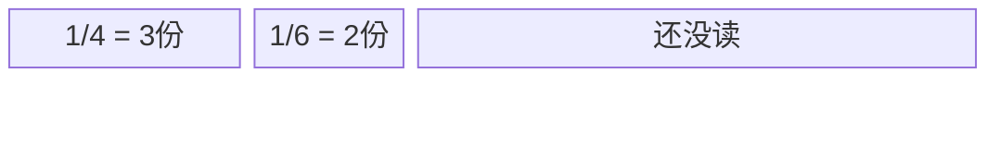

# 完整范例：输入 → 输出

展示一次典型调用的结构与详尽程度。**学习的是结构和讲法，不要照抄题目。**

---

## 输入

- 年级：五年级
- 题目：小明读一本书，第一天读了全书的 1/4，第二天读了全书的 1/6，两天一共读了全书的几分之几？

---

## 输出文件一：`markdown/fraction-addition-讲解.md`

````markdown
# 分数加法：两天一共读了多少？（五年级）

> 配套练习见 [fraction-addition-练习.md](fraction-addition-练习.md)

## 题目

小明读一本书，第一天读了全书的 1/4，第二天读了全书的 1/6，两天一共读了全书的几分之几？

## 先读懂题在问什么

把"一整本书"看成 1。第一天读掉其中的 1/4，第二天读掉其中的 1/6。
问的是：这两块加起来，占整本书的几分之几？也就是求 `1/4 + 1/6`。

## 解法一：画图看一看（推荐先理解这种）

先讲这种，是因为它能让你**亲眼看到**为什么要通分——不是老师规定的，是图逼着我们这么做。

把整本书画成一个长条，平均分成 12 份（因为 4 和 6 都能整除 12）：

- 1/4 就是 12 份里的 3 份；
- 1/6 就是 12 份里的 2 份。



数一数涂色的：3 份 + 2 份 = 5 份，整本是 12 份。
所以两天一共读了 **5/12**。

## 解法二：通分计算

图告诉我们要把两个分数变成"同样大小的份"。4 和 6 的最小公倍数是 12：

- 1/4 = 3/12
- 1/6 = 2/12

分母相同，分子相加：

$$\frac{3}{12} + \frac{2}{12} = \frac{5}{12}$$

## 答案

两天一共读了全书的 **5/12**。

## 容易错在哪

**最容易犯的错：把分子加、分母也加。**

1. **错法长什么样**：很多同学会写成
   $$\frac{1}{4} + \frac{1}{6} = \frac{1+1}{4+6} = \frac{2}{10}$$
2. **为什么会这么想**：因为整数加法是"对应位置直接加"，同学就想当然地以为分数也是"上面加上面、下面加下面"。
3. **为什么是错的**：用刚才的图检验——1/4 是 12 份里的 3 份，1/6 是 2 份，合起来明明是 5/12。可 2/10 = 1/5，只有 12 份里的 2.4 份，比 1/4 一个还小！两天读的反而比第一天少，这不可能，所以一定错了。
4. **怎么避免**：加分数前先问自己一句"**分母一样了吗？**"不一样就先通分，分母统一后**只加分子、分母不变**。

5. **（次要）通分只改分母忘了改分子**：把 1/4 写成 1/12。记住：分母放大几倍，分子也要放大同样的倍数（4→12 是 3 倍，分子 1 也要变 3）。

## 这道题考的知识点

异分母分数加法 —— 核心是"先通分，再相加"。练习题都围绕这一点。
````

---

## 输出文件二：`markdown/fraction-addition-练习.md`

````markdown
# 举一反三：异分母分数加法（五年级）

> 讲解见 [fraction-addition-讲解.md](fraction-addition-讲解.md)
> 先自己做一遍，再看下面的参考答案。

## 练习题

1. 计算：1/3 + 1/6
2. 计算：2/5 + 1/4
3. 一根绳子，先用去 1/2，又用去 1/3，一共用去了几分之几？
4. 计算：3/8 + 5/12（想一想最小公倍数是多少）

## 参考答案与详解

### 第 1 题
3 和 6 的最小公倍数是 6。1/3 = 2/6。
2/6 + 1/6 = **3/6 = 1/2**（结果能约分要约到最简）。

### 第 2 题
5 和 4 的最小公倍数是 20。2/5 = 8/20，1/4 = 5/20。
8/20 + 5/20 = **13/20**。

### 第 3 题
把整根绳子看成 1，求 1/2 + 1/3。最小公倍数 6：1/2 = 3/6，1/3 = 2/6。
3/6 + 2/6 = **5/6**，即一共用去 5/6。

### 第 4 题
8 和 12 的最小公倍数是 24。3/8 = 9/24，5/12 = 10/24。
9/24 + 10/24 = **19/24**。
````

---

## 范例要点回顾

- 解法一（画图）排在前，并明说"为什么先讲它"。
- **最典型的易错点（分子分母分开加）按四步详细讲解，并用图/反例验证给学生看**，不是一句话带过。
- 关键步骤用了**一张** mermaid 图，且只在"为什么要通分"这个最关键处。
- 练习只考同一知识点（异分母加法），难度递增，每题给完整过程，第 1 题还顺带强调约分。
- 两文件开头互相用相对链接引用。
